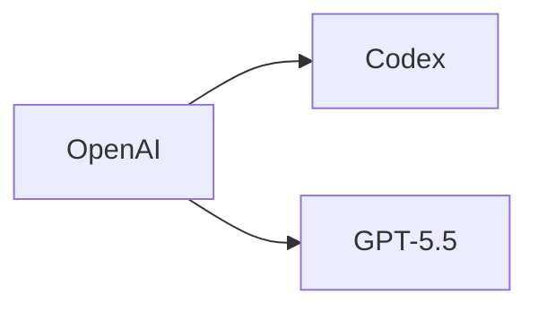

# ROUTINES · 每日創業情報產出腳本

本檔為 Claude Routines 的執行腳本。每日自動執行一次，產出一篇
`public/news/YYYY-MM-DD-daily-brief.md`，推送後 GitHub Actions 會
自動部署到 <https://54ted222.github.io/mynews/>。

> **主題內容定義在 `prompts/TOPIC.md` 的「## 日報主題 daily brief」**——
> 產品角色、目標讀者、四大主題結構、過濾標準、資料來源優先順序都在
> 那裡，本檔不重述。執行時**先 Read `prompts/TOPIC.md` 對齊主題定義**，
> 本檔只處理「怎麼把主題產出成一篇符合站點規格的 markdown 檔」。

---

## 執行情境

- 每日自動執行一次
- 日期以執行當日 **UTC+8** 為準，格式 `YYYY-MM-DD`
- 聚焦「過去 24–72 小時」的新資訊（見 `TOPIC.md` 的「取材時窗」）

### 🛑 日期取得：第 0 步、強制執行

**不要從 context、前一篇 brief、記憶中推測日期**——每次都要實際跑：

```bash
TZ=Asia/Taipei date +%Y-%m-%d
```

把這個值設為 `TODAY`，全篇檔名、frontmatter `date`、title、H1 **一律使用 `TODAY`**。

曾經發生過的錯誤：沿用前一天的日期產出，結果檔名變成 `YYYY-MM-DD-daily-brief-2.md`、`-3.md`、`-4.md`（因為 routine 看到「今天」的檔名已被佔用就加流水號）。這類文章會全部被列表頁歸到錯的日期，使用者以為「今天的文章沒被收錄」。**流水號 `-2`、`-3` 只該在同一天多刊才出現；若你正準備寫 `-2` 以上，先停下來檢查 `TODAY` 是不是真的等於既有檔名的日期。**

---

## 站點檔案規格（重要）

本站從 `public/news/*.md` 讀取文章，必須完全符合以下格式才能正確顯示：

### 檔名

```
public/news/YYYY-MM-DD-daily-brief.md
```

- 日期前綴必填（供站點排序並作為 fallback 日期）
- slug 固定使用 `daily-brief`

### Frontmatter（必填，順序固定）

```md
---
title: 每日創業情報 — YYYY-MM-DD
date: YYYY-MM-DD
tags: 創業情報, AI 產業, SaaS
summary: 一句話摘要，約 40–60 字，用於首頁列表。
keywords: 搜尋字串1, 搜尋字串2, ...
---
```

解析規則（見 `src/lib/news.ts`，runtime fetch，見 CLAUDE.md）：

- `tags` 以逗號分隔，自動切成陣列
- `summary` 顯示在列表頁的 `CardDescription`
- `keywords`：今天實際做 WebSearch 時用過的查詢字串（5–10 組、逗號分隔）。
  前端會渲染成可點的 chip，點了直接跳 Google——讓讀者順著你的研究路徑
  自己再查。關鍵字要具體（例如「Replit Agent 3 pricing Reddit 2026」，
  而不是「AI 編碼工具」）。中英皆可，以實際查得出新結果為準
- 不支援多行值、YAML 陣列語法；維持單行 `key: value`

### 正文

Frontmatter 之後空一行，第一個元素為 `# 每日創業情報 — YYYY-MM-DD` H1。
之後接下方「輸出格式」章節的內容。

---

## 連續性檢查（第一步必做）

1. 列出 `public/news/` 資料夾，找出最近 3 篇檔名包含 `daily-brief` 的文章
2. 讀取這些檔案，將其中提及的工具、點子、事件列為「已涵蓋清單」
3. 本次產出時，若遇到相同主題，僅在「有新進展」時才納入，並於項目前標註
   - 🔄 追蹤更新
   - 🆕 全新資訊
4. 若昨日 brief 的「待觀察」區有項目，檢查是否有新進展；有則移入正文主段，
   無則保留或移除

---

## 取材要求

依 `prompts/TOPIC.md` 的「## 日報主題 daily brief」定義的四大主題、
過濾標準、資料來源優先順序，用 **WebSearch / WebFetch** 蒐集過去
24–72 小時的動態。

- **研究時請把查詢字串記下來**——每次 WebSearch 用過的 query 都值得
  留存。最後寫進 frontmatter 的 `keywords` 欄位（5–10 組、逗號分隔），
  讀者看文章時可以直接點關鍵字跳 Google 再查。挑「具體、會查出新結
  果」的 query，不要塞通用詞
- 某主題當日無值得報導內容時，直接寫「今日無新訊號」，**不湊數**
- 不確定的數據標註「估算」；虛構公司／產品／人名一律先搜尋確認

---

## 輸出格式（嚴格遵守）

產出單一 Markdown 檔案，路徑為 `public/news/YYYY-MM-DD-daily-brief.md`。
如檔案已存在就加上流水號 `public/news/YYYY-MM-DD-daily-brief-2.md`。

完整範本：

```md
---
title: 每日創業情報 — YYYY-MM-DD
date: YYYY-MM-DD
tags: 創業情報, AI 產業, SaaS
summary: 一句話摘要。
keywords: 搜尋字串1, 搜尋字串2, 搜尋字串3, ...
---

# 每日創業情報 — YYYY-MM-DD

## 🎯 今日 TL;DR

- 重點 1（一句話）
- 重點 2
- 重點 3

## 🔄 昨日追蹤

（若無則寫「無追蹤項目」）

## 📰 AI 產業動態

| 事件 | 影響 | 機會/威脅 | 來源 |
| ---- | ---- | --------- | ---- |
|      |      |           |      |

## 🛠 新興 AI 工具

| 工具 | 類別 | 用途 | 定價 | 差異點 | 採用建議 |
| ---- | ---- | ---- | ---- | ------ | -------- |
|      |      |      |      |        |          |

## 💡 SaaS 點子

### 點子 1：<名稱> 🆕/🔄

- 痛點來源：
- 目標客群：
- 技術複雜度：X/5
- 預估 MRR：
- 競品弱點：
- 切入建議：

## 🧰 工具堆疊更新

（無顯著更新則寫「今日無」）

## ⚡ 今日行動建議

- [ ] 行動 1（預期成本／產出）
- [ ] 行動 2
- [ ] 行動 3

## ⏳ 待觀察

（值得追蹤但尚未成熟的訊號，供明日檢查）

## 📚 引用來源

1. [標題](URL) — YYYY-MM-DD
```

---

## 交付步驟

1. **先 Read `prompts/TOPIC.md`** 的「## 日報主題 daily brief」對齊主題定義
2. 產出 Markdown 內容（嚴守上方格式）
3. 以 `Write` 工具寫入 `public/news/YYYY-MM-DD-daily-brief.md`
4. **派 subagent 做「註解 + 逐字稿」**（見下節）
5. **重新產生 manifest**（讓站點能抓到新文章與新 transcript）：
   ```bash
   npm run manifest
   ```
   產生後打開 `public/news/manifest.json`，確認 `articles` 含新 slug、`transcripts` 含對應 slug。漏收代表檔名或副檔名不對，先修好再往下走。
6. **最後一步：直接 push 到 `main`**（不需等 review，推上去就會自動部署）——**務必把 `manifest.json` 一起 add**，否則 GitHub Pages 拿到的 manifest 仍是舊版、新文章會「看起來沒收錄」：
   ```bash
   git add public/news/YYYY-MM-DD-daily-brief.md \
           public/news/YYYY-MM-DD-daily-brief.transcript.md \
           public/news/manifest.json
   git commit -m "news: daily brief YYYY-MM-DD"
   git push origin main
   ```

---

## 註解 + 逐字稿（正文寫完後必做）

正文寫完後，**開一個 subagent**（`subagent_type: general-purpose`）做：

1. 在原檔裡挑 **3–6 個**讀者可能不熟的**產品／公司／縮寫**加 GFM
   footnote 註解。寫法：原文用 `術語[^slug]`、文末用 `[^slug]: 定義
（40–120 字）`；定義放在「📚 引用來源」段之前、用空白行分隔
2. 另寫一份 `public/news/YYYY-MM-DD-daily-brief.transcript.md`：**純
   文字**、沒有 frontmatter、**假設聽眾看不到畫面**，把表格與 bullet
   口語化。長度約 1000–1800 字（約 5–8 分鐘），開場一句「今天想聊
   …」、結尾一句「所以重點是…」

Subagent 提示詞模板（自足）：

```
## 你的任務
為一篇已經寫好的「每日創業情報」補兩件事：
1. 在原檔內加 GFM footnote 註解（3–6 個專有名詞／公司／縮寫）
2. 另寫一份 `<原檔>.transcript.md` 純文字逐字稿

寫完即結束，不要動正文既有論點、數字、來源。

## 原檔路徑
public/news/YYYY-MM-DD-daily-brief.md

## 原檔完整內容（貼入）
---
<daily-brief.md 全文>
---

### 工作 A：加 footnote 註解
- 挑讀者可能不熟的術語／公司／產品／縮寫 3–6 個；常識詞（API、SaaS）
  略過
- 寫法：`術語[^slug]` + 文末 `[^slug]: 定義`（40–120 字、中性、獨立
  可讀、不重述正文）
- 定義擺在「📚 引用來源」段**之前**，與正文空白行分隔
- 同一術語只在第一次出現時標註

### 工作 B：寫逐字稿 sidecar
- 路徑：public/news/YYYY-MM-DD-daily-brief.transcript.md
- 純文字 md、**無 frontmatter、無 heading、無 `|` 表格**
- 假設聽眾看不到畫面：把表格、bullet、程式碼用口語描述
- 口語化：連接詞（所以、不過、簡單說）補好；標題編號省略或改成
  「再來…」
- 長度 1000–1800 字、約 5–8 分鐘；開場「今天想聊…」、收尾「重點是
  …」

## 交付
- Edit 原檔加 footnote
- Write 產出 sidecar
- 回報 100 字內：加了哪些 footnote、逐字稿抓了哪條主線
- **嚴格只改 `public/news/` 底下的 `.md` 檔**——不要動 `src/`、
  TypeScript / tsx / 設定檔、`package.json`，不要跑 `npm` 指令
- 不 git、不改其他檔案、不 WebSearch
```

---

## 語氣要求

- 繁體中文（zh-TW）
- 直接、重數據、避免行銷語言
- 不確定的數據標註「估算」
- 某主題當日無值得報導內容時，直接寫「今日無新訊號」，**不湊數**

---

## mermaid 圖表（可選、謹慎用）

站點支援 mermaid fenced code block（` ```mermaid `），但**每篇最多 1
張**，只在圖解能比文字更快講清楚時才畫——例如產品關係、資金流、
時序事件。一般表格／bullet 能交代的事就不要硬畫流程圖。語法範例：

````md

````

---

## 驗收檢查（產出前自審）

- [ ] 已 Read `prompts/TOPIC.md` 的「## 日報主題 daily brief」對齊主題結構、過濾標準、資料來源優先順序
- [ ] 已實際跑過 `TZ=Asia/Taipei date +%Y-%m-%d` 取得 `TODAY`
- [ ] 檔名、frontmatter `date`、title、H1 的日期 **全部等於** `TODAY`
- [ ] 若檔名含流水號（`-2`、`-3`…），確認同一天內確實已有先前刊次；否則代表日期沿用了前一天，必須重改
- [ ] 檔名為 `public/news/YYYY-MM-DD-daily-brief.md`，日期正確
- [ ] Frontmatter 4 個欄位齊全且格式正確（單行 `key: value`）
- [ ] `summary` 約 40–60 字，能一句說清今日重點
- [ ] 正文首元素為 `# 每日創業情報 — YYYY-MM-DD` H1
- [ ] 所有表格結構完整（分隔線、欄數一致）
- [ ] 每則資訊都有可追溯的來源連結
- [ ] 未與過去 3 天重複（或有標註 🔄）
- [ ] 已派 subagent 加 GFM footnote 註解（3–6 個）
- [ ] `public/news/YYYY-MM-DD-daily-brief.transcript.md` 存在、無 frontmatter、口語化、1000–1800 字
- [ ] 已跑 `npm run manifest`，且 `public/news/manifest.json` 的 `articles` 含新 slug、`transcripts` 含對應 slug
- [ ] `git add` 時有納入 `public/news/manifest.json`（漏加會導致部署後仍看不到新文章）
