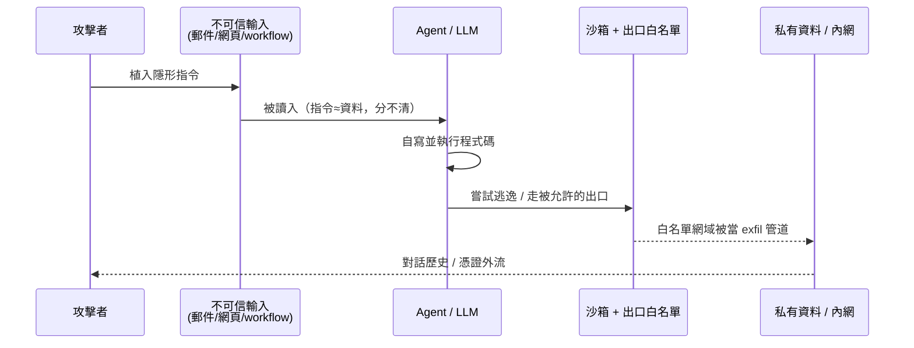

# 為什麼 agent 非要沙箱不可：2026 的威脅地景

## TL;DR

- **威脅不是「模型亂講話」，是「模型寫的程式碼會在你的網路裡跑」。** agent 把三件危險的事疊在一起——讀不可信內容、執行自寫程式碼、能對外連網——任何一個輸入面被汙染，整條鏈就被接管。
- **2026 上半年已經有一連串「真的被打穿」的案例**：EchoLeak（CVE-2025-32711，CVSS 9.3）是第一個在正式 AI 系統零點擊外洩資料的 prompt injection；n8n（CVE-2026-25049）讓自動化中樞變 RCE 跳板；Oasis Security 的「Claudy Day」直接把 claude.ai 的 egress 白名單變成資料外洩管道。
- **「容器不是沙箱」在 2026 已是共識，但這不是說換 microVM 就沒事。** 真正的教訓是：prompt injection 大概率防不死，所以唯一務實的設計假設是「agent 一定會被接管」，沙箱與分層防禦的責任就是讓「被接管之後」損失有界。隔離原語怎麼選見本期第 2 篇。

## 危險的不是模型，是「自寫自跑自連網」這個組合

把 chatbot 和 agent 分開看，威脅模型完全不同。chatbot 最壞情況是輸出一段有害文字；agent 的最壞情況是「它寫了一段你沒看過的程式碼，然後在一個能讀你檔案、能連你內網、能呼叫你 API 的環境裡把它執行掉」。差別不是程度，是性質。

Simon Willison 把這個結構叫「致命三重奏」（lethal trifecta[^lethal-trifecta]）：當一個系統同時具備**存取私有資料**、**接觸不可信內容**、以及**對外傳輸的管道**三件事，攻擊者只要能寫進 agent 會讀到的任何一個介面——一封郵件、一個網頁、一份被檢索的文件、一個 issue 留言——就能改寫它的行為。這裡的關鍵痛點是：大型語言模型在本質上分不清「指令」和「資料」。對人類來說，郵件正文顯然是資料；對 LLM 來說，那段文字和系統提示一樣，都只是 token。截至 2026-06，沒有任何過濾器能把這條界線守死——它只能擋住已知的攻擊樣式，擋不住攻擊者無限多種重新措辭的方式。

這就是為什麼「再訓練一個更聽話的模型」解決不了問題。威脅的根源在系統架構，不在模型對齊。只要 agent 既讀得到不可信輸入、又能執行程式碼、又有出口，它就是一台等著被別人遠端編程的機器。沙箱的角色不是「讓 agent 變乖」，而是承認它遲早不乖，並且替「不乖之後」設一道有界的損失上限。

## 2026 的真實案例：從零點擊外洩到滿分 RCE

抽象論點需要血淋淋的案例佐證，而 2026 上半年不缺。

**EchoLeak（CVE-2025-32711）**[^echoleak] 是分水嶺。Aim Security 在 2025 年 6 月揭露這個 Microsoft 365 Copilot 的零點擊漏洞，CVSS 9.3：攻擊者只要寄一封郵件，不需要受害者點任何東西，Copilot 在背景處理收件匣時就會被郵件裡的隱藏指令接管，然後把使用者能存取的 OneDrive、SharePoint、Teams 內容外洩出去。技術上它串了好幾層繞過——閃過微軟的 XPIA（跨提示注入）分類器、用 reference-style Markdown 繞過連結遮蔽、靠自動抓取的圖片觸發外連、再濫用 CSP[^csp] 白名單裡的 Microsoft Teams proxy 當出口。後來收錄成 arXiv 論文的標題講得很白：這是**第一個在正式 LLM 系統裡被武器化、造成具體資料外洩**的 prompt injection。它證明了「致命三重奏」不是黑板上的威脅模型，是能打穿企業級產品的真實攻擊鏈。

**n8n（CVE-2026-25049）** 則展示了另一個維度的危險：當 agent / 自動化平台佔據基礎設施的樞紐位置時，一次沙箱逃逸的爆炸半徑有多大。這個 2026 年 2 月 4 日揭露的漏洞，CVSS 高達 9.9（部分來源報為 9.3–9.4），核心是 n8n 對 workflow expression 的清理機制有型別混淆：它的 sanitization 在 TypeScript 型別標註上假設屬性鍵是字串，但執行期沒做型別檢查，攻擊者用箭頭函式搭配解構賦值就能拿到 Function constructor，逃出 expression 沙箱拿到主機 RCE[^rce]。麻煩在於 n8n 通常握著通往內部 API、資料庫、第三方服務的憑證金庫——一旦逃逸，攻擊者能解密所有憑證、執行系統指令、把這台機器當成打進整個內網的跳板。一個只能編輯 workflow 的內部帳號（或被竊取的帳號），就足以引爆。

**Oasis Security 的「Claudy Day」（2026 年 3 月）**[^claudy-day] 最直指本期主題。研究者在 claude.ai 上串了三個漏洞：透過 URL 參數塞入對使用者隱形、但會完整送進模型的 prompt injection；一個開放轉址（open redirect）；以及最關鍵的——**濫用沙箱的出口白名單**。Claude 的程式碼執行沙箱本來就限制對外連線，但允許連 `api.anthropic.com`。攻擊者把自己控制的 API key 藏進隱形提示，叫 Claude 把使用者對話歷史裡的敏感資料寫成檔案，再透過 Files API 上傳到攻擊者的 Anthropic 帳號。換句話說，**egress[^egress] 允許清單上那唯一一個「合法」的網域，就成了資料外洩的管道**。這個案例的價值在於它打臉一種常見的安心感：「我有沙箱、我有限制出口」並不等於安全——出口只要不是零，被允許的那條路就可能被當成 exfil 通道。Anthropic 已修復 prompt injection 部分，其餘問題截至揭露時仍在處理中。

把三個案例放在一起看，攻擊鏈的形狀就清楚了：**汙染輸入（injection）→ 取得執行（RCE / 沙箱逃逸）→ 沿著被允許的出口外洩或橫向移動**。每一個案例都在這條鏈的不同環節被打穿，而沙箱要守的，正是中段到尾段。

## 「容器不是沙箱」是怎麼在 2026 變成共識的

到 2026 年初，從業者對一件事已經有了相當一致的看法：用 Docker / runc 這類共享核心的容器，去跑「AI 生成的、不可信的程式碼」，是不夠的。原因不複雜——Linux 容器本質上是打包與資源控制機制，namespace 和 cgroup 只是限制一個 process 看得到什麼、用得到多少 CPU 記憶體，但同一台主機上所有容器共用同一個核心。當 agent 能自己寫 Python、裝套件、操作 file descriptor 時，它離「一次 syscall 打穿主機核心」其實只有一步之遙。共享核心的攻擊面，對人類開發者是可接受風險，對一台會被 prompt injection 遠端編程的機器則不是。

這個共識不只是直覺，2026 年也開始有量化證據。一篇 2026 年 3 月的 arXiv 論文（2603.02277）提出 SandboxEscapeBench，用巢狀沙箱的 CTF[^ctf] 設計、橫跨 18 個取材自真實世界的漏洞情境，去測前沿 LLM agent 能不能逃出容器。結論直白：在「真實系統裡合理會出現」的漏洞條件下，前沿 agent 經常能識別並利用漏洞逃出容器，而**嘗試一次逃逸的成本大約只要一美元**。當逃逸的邊際成本是一杯咖啡的零頭、而模型能力還在往上走，「把不可信程式碼丟進共享核心容器」就不再是一個能長期成立的賭注。

vm2 在 2026 年的 CVE 海嘯是同一個故事的應用層版本。許多 agent 框架用 vm2 當 JS 執行的隔離層，而 2026 年連續爆出十多個 vm2 沙箱逃逸漏洞（CVE-2026-26956、CVE-2026-45411 等），透過原型污染、proxy unwrap 等手法從沙箱內取得 Node.js 主機能力。Kodem 的分析點破了結構性問題：在 agent 框架裡，一個沙箱逃逸漏洞會**直接把 prompt injection 升級成主機級 RCE**——隔離層不是周邊相依套件，而是 agent 安全的結構性元件。隔離選錯，前面的注入防護全都白做。

需要講清楚的反方觀點是：**「容器不是沙箱」不等於「換 microVM 就高枕無憂」**。一來，硬體虛擬化隔離（如 Firecracker）也有自己的攻擊面，只是小得多；二來，更根本的是 prompt injection 這個源頭防不死——你換再強的隔離原語，也擋不住 Claudy Day 那種「沿著合法出口外洩」的攻擊，因為那根本沒逃逸，是走正門。所以真正成熟的設計假設不是「找一個完美沙箱」，而是「假設 agent 一定會被接管」，再用分層防禦把損失上限壓到可接受。市面上的緩解指引（如 Microsoft、NVIDIA 的方向）大致收斂到四層要管：network egress、filesystem、secrets、config。各隔離原語的機制取捨見本期第 2 篇，分層防禦的工程細節見第 5 篇。

沙箱之所以在 2026 變成「agent 堆疊裡最貴的一層」，不是因為它技術上最難，而是因為它承擔了最重的責任：它是那道在「模型一定會犯錯、一定會被注入」的前提下，唯一能把企業損失劃出邊界的牆。

[^lethal-trifecta]: 安全研究者 Simon Willison 提出的概念，指一個 AI 系統若同時具備「存取私有資料」「接觸不可信內容」「能對外傳輸」三項能力，就構成可被攻擊者遠端操控的高危組合。本期反覆引用它當作判斷 agent 風險的基本框架。
[^echoleak]: 2025 年由 Aim Security 揭露的 Microsoft 365 Copilot 漏洞，編號 CVE-2025-32711、CVSS 9.3。它被視為第一個在正式 LLM 產品裡被武器化、能零點擊（受害者不需點任何東西）外洩企業資料的提示注入攻擊，是「致命三重奏」從理論變實戰的標誌性案例。
[^csp]: Content Security Policy，內容安全政策。瀏覽器層的白名單機制，限制網頁只能向特定來源載入資源或發出連線，本意是防 XSS 等攻擊；EchoLeak 的巧妙處在於它不打破 CSP，而是借用白名單裡「合法」的 Microsoft 網域當外洩出口。
[^rce]: Remote Code Execution，遠端程式碼執行。指攻擊者能讓目標主機執行自己指定的任意指令，是危害最高的漏洞類型之一。沙箱逃逸的最終目的通常就是取得 RCE，因為一旦拿到它，攻擊者實質上就控制了那台機器。
[^claudy-day]: 資安公司 Oasis Security 於 2026 年 3 月公布的 claude.ai 攻擊鏈代號。它串接隱形提示注入、開放轉址與沙箱出口白名單濫用，把對話歷史外洩到攻擊者帳號，凸顯「有沙箱、有限制出口」不等於安全。Oasis Security 是一家專注於非人類身分（機器憑證）治理的資安廠商。
[^egress]: 出向流量，即從沙箱或主機「對外發出」的網路連線。相對於 ingress（入向）。在 agent 安全裡 egress 是最後一道防線，因為資料外洩、命令回傳幾乎都要靠對外連線完成；控制 egress 通常用「預設拒絕、只開白名單」的方式。
[^ctf]: Capture The Flag，奪旗賽。資安領域常見的競技與評測形式，把漏洞利用設計成「拿到藏在系統深處的旗標字串就算過關」。SandboxEscapeBench 借用這種設計，讓 LLM agent 嘗試逐層逃出巢狀沙箱，以量化前沿模型的逃逸能力。

---

**來源**

1. [EchoLeak: The First Real-World Zero-Click Prompt Injection Exploit in a Production LLM System](https://arxiv.org/abs/2509.10540) — arXiv 2509.10540，2025-09
2. [CVE-2026-25049: n8n Remote Code Execution via Expression Escape](https://www.endorlabs.com/learn/cve-2026-25049-n8n-rce) — Endor Labs，2026-02
3. [Claude.ai Prompt Injection & Data Exfiltration Vulnerability（Claudy Day）](https://www.oasis.security/blog/claude-ai-prompt-injection-data-exfiltration-vulnerability) — Oasis Security，2026-03
4. [Quantifying Frontier LLM Capabilities for Container Sandbox Escape](https://arxiv.org/abs/2603.02277) — arXiv 2603.02277，2026-03
