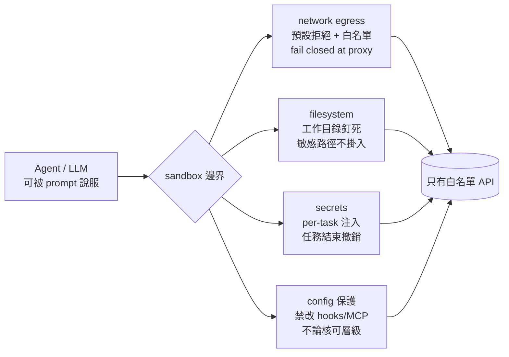

# 快照、分叉與分層防禦：把沙箱當基礎設施來設計

前四篇講完了「為什麼要沙箱」「拿什麼隔離」「向誰租」「在筆電上怎麼跑」。但真正把沙箱推上產線後，你會發現它不是一個一次性 spin-up 的執行容器，而是一**層需要被經營的基礎設施**：它有狀態要管理、有生命週期要排程、有四個方向的逃逸要堵、還要在延遲與成本之間做日常取捨。本篇站在「我要為產品建一層沙箱」的視角，談這層基礎設施該怎麼設計。

兩個核心心智模型先擺出來。第一，沙箱的狀態（記憶體、檔案系統、執行中 process）是**資產**，snapshot / fork / pause-resume 是你操作這份資產的原語，用好了能把 agent 工作流的成本砍掉一個量級。第二，沙箱的對外介面是**威脅面**，而 2026 的共識是：別指望 prompt 能擋住資料外洩，唯一可靠的防線在你自己控制的基礎設施層——network egress、filesystem、secrets、config 這四道。

## TL;DR

- 把沙箱狀態當資產：snapshot/restore（Firecracker 約 3–8ms、E2B resume 約 1 秒）讓你跳過冷啟動與環境重建；fork 複製完整執行狀態做平行分支，是 agent 樹狀探索的關鍵原語（截至 2026-06）。
- 分層防禦收斂成四道 mandatory 邊界——network egress / filesystem boundaries / secrets scoping / config file protection——Microsoft Agent Governance Toolkit 與 NVIDIA 指引在這四層上重疊。
- egress 是最後一道線、必須預設拒絕只開白名單；但白名單不是寫下來就生效，DNS rebinding、parser differential、metadata endpoint 都得當成邊界的一部分逐項測過，否則它只是看起來安全。

## 把沙箱狀態當資產：snapshot、fork 與 pause/resume

agent 工作流跟傳統 request/response 最大的不同，是它**狀態很重、又很想試錯**。一個 coding agent 可能花 30 秒裝完依賴、載入一份大型 codebase、跑起 language server，這份「熱」起來的記憶體狀態如果每次都從零重建，光環境準備就吃掉大半 wall-clock。snapshot 就是用來保住這份投資。

關鍵分水嶺在「snapshot 到底存了什麼」。最弱的一檔只存檔案系統與套件——Vercel Sandbox 的快照屬於這一類，恢復後你拿回的是檔案，但記憶體裡那份載好的 ML 模型、parse 完的資料集全部蒸發，得重跑 setup。較強的一檔連**完整記憶體與執行中 process** 一起存：E2B 的 pause/resume 會把檔案系統加上整個記憶體狀態（含執行中的 process、載入的變數）一起捕捉，resume 後回到暫停前一模一樣的狀態，pause 約每 1 GiB RAM 花 4 秒、resume 約 1 秒，狀態最長保留 30 天（截至 2026-06，依官方文件）。對「累積了昂貴 in-memory 狀態」的 workload，這個差別不是優化而是質變：filesystem-only 快照恢復後重建記憶體可能要幾分鐘，記憶體級快照直接省掉。

更底層的 microVM 把這件事做到毫秒級。Firecracker 的 snapshot 捕捉 guest 記憶體、KVM 與模擬裝置狀態，restore 時用 `MAP_PRIVATE` 把記憶體檔案 mmap 進來、按需 page-in，寫入走 copy-on-write，因此 restore 落在約 3–8ms 的級距。這把「強隔離一定慢」的老論點打掉了——你可以對每個 session 起一顆專屬 kernel，又不付冷啟動的代價。

但 snapshot 的真正威力是 **fork**：複製一份完整執行狀態，從同一個熱起點分叉出多條平行分支。為什麼 agent 特別需要這個？因為 agentic 探索本質是樹狀的——Tree-of-Thoughts[^tot]、MCTS[^mcts] 式的 agent tree search、Reflexion 的失敗回退，全都需要「從同一個中間狀態出發，試 N 條不同路徑，挑最好的留下」。把這件事映射到有狀態的 OS 環境，就需要 fork 與 rollback 是真正毫秒級的 OS 級 checkpoint/restore[^checkpoint-restore] 操作（這正是 DeltaBox 這類研究在攻的問題，截至 2026-06）。實務上有兩種規模壓力同時存在：水平方向要把一個熱狀態快速 clone 成很多條平行 trajectory，垂直方向要在每條 trajectory 內部反覆 checkpoint/restore 試探。沒有 fork，你只能對每條分支重跑一次完整 setup；有了 fork，分叉成本趨近一次記憶體複製。Daytona 之類的平台就把「sub-90ms 起一個 sandbox、fork 成平行分支、執行中 snapshot」當成賣點（截至 2026-06）。

把這串原語串起來，你的沙箱基礎設施應該長這樣：base image 起一次、做成 golden snapshot；每個任務從 snapshot restore（跳過冷啟動）；探索分支用 fork（跳過環境重建）；agent 在等人類審核或外部 I/O 時 pause（不燒算力）；任務結束 snapshot 落盤做持久化或審計。狀態管理不是附加功能，它直接決定這層基礎設施的單位成本。

但 fork 有個常被忽略的安全陷阱。Firecracker 官方文件明確警告：同一份 snapshot 被多次 resume，會讓 guest OS 的 entropy pool、隨機數種子、唯一識別碼、甚至**快取在記憶體裡的密碼學 token** 全部被複製——你以為在做無害的平行 clone，實際上把一份本該唯一的密碼學狀態散播到多個 VM。Linux 5.18+ 的 VMGenID 能讓 guest 偵測到自己是從 snapshot 恢復、進而 reseed kernel PRNG，但它救不了已經 cache 的隨機數與 token。所以 fork 不能無腦用：凡是 snapshot 裡可能含有效憑證或密碼學狀態的場景，restore 後都得有 de-dup 機制（重新注入 secrets、reseed、輪換 token），否則你的狀態管理會反過來變成攻擊面。

## 分層防禦：四道 mandatory 邊界怎麼落地

跑模型寫的程式碼，逃逸不是「會不會」而是「往哪逃」。2026 的緩解共識——Microsoft Agent Governance Toolkit[^agt] 與 NVIDIA 的 agent 沙箱指引在這點上收斂——是把防禦切成四道必設的邊界：network egress、filesystem boundaries、secrets scoping[^secrets-scoping]、config file protection。這四道不是備選項，而是「少一道就有對應的逃逸路徑」。

network egress 是對外的線，預設拒絕、只白名單必要 endpoint，下一節單獨講。filesystem boundaries 管的是 agent 能讀寫的範圍：把工作目錄釘死在沙箱內，host 的敏感路徑（憑證、其他租戶資料、build 快取）不掛進來，能唯讀就唯讀。secrets scoping 是個常被做錯的地方——很多實作直接把整份 host 環境變數倒進沙箱，等於把所有憑證交給一段不可信程式碼。正確做法是 NVIDIA 講的「per-task secret injection」：sandbox 只在 runtime 拿到這個任務真正需要的那把憑證，任務結束就撤銷，而不是繼承整個 host environment。config file protection 則是堵「改規則來解除限制」這條路——封掉對 hooks、MCP server 設定、IDE extension 設定的修改，**不論使用者核可層級為何**；因為一旦 agent 能改自己的 config，前面三道邊界都可能被它自己拆掉。

落地時有個架構層級的取捨要先想清楚：這四道在哪一層 enforce。Agent Governance Toolkit 是在 application middleware 層做 policy 強制，policy engine 與 agent 共用同一個 process 邊界——這代表強制邏輯本身跑在跟不可信程式碼同一個信任域裡。所以它的生產建議是：把每個 agent 跑在**獨立 container** 裡拿到 OS 級隔離，middleware policy 與 OS/網路層隔離疊起來用。這給我們一個明確原則：policy 層好用、好稽核、好除錯，但它不是隔離邊界；真正的邊界必須落在 OS、hypervisor 與網路這些 agent 無法用 prompt 影響的層級。把可被說服的東西（LLM）和不可被說服的東西（封包路由、檔案掛載）分開，是這整套架構的核心。

## 為什麼 egress 是最後一道線——也最容易做成空殼

前面三道邊界做好，攻擊者拿到的東西就被困在沙箱裡；但只要 agent 還能對外發任何封包，被竊取的資料、被誘導執行的指令就有出口。這就是為什麼 egress 是最後一道、也是最不能省的線。威脅鏈第 1 篇已經詳述：prompt injection 讓模型被惡意內容說服 → 在沙箱內做壞事 → 透過對外連線把資料送出去。egress 控制要堵的就是最後這一跳。

設計原則只有一句：**預設封鎖所有對外連線，只白名單真正需要的 endpoint**，而且強制點要 fail closed——在 proxy 層攔截，非白名單的目標直接連不出去，而不是「先連再記 log」。要特別點名兩類目的地必須明確封死：cloud metadata endpoint[^metadata-endpoint]（169.254.169.254，能拿到 host instance 憑證做橫向移動）與 RFC 1918 內網段。這裡有個關鍵的設計哲學——不要相信 prompt 能擋外洩。安全圈反覆強調：假設惡意內容一定會到達模型，要把系統設計成「模型再怎麼被說服，也無法把說服變成資料外洩」。換句話說，agent **永遠不該有權決定一個封包送去哪裡**，這個決定權要收回到 egress 層。

但這也是反方觀點最該被聽見的地方：egress 白名單寫下來不等於生效。它的維運負擔真實存在，而且繞過向量多到容易讓人把它做成空殼。實務上揭露過好幾種繞過：allowlist 用 suffix 比對時，一個 SOCKS5 的 `evil.com\x00.allowed.com` 能通過 suffix 檢查、卻在 DNS 解析時被 null 截斷而連到被封的主機（parser differential）；DNS rebinding[^dns-rebinding] 在「檢查時」解析到白名單 IP、「連線時」已 rebind 到內網，要徹底擋住得在傳輸層 pin 住解析出來的 IP；還有空白名單、wildcard 後綴、IP literal、canonicalization、raw protocol path——這些全都得當成邊界的一部分逐項測過。換句話說，allowlist 在你用這些 case 證明它擋得住之前，都還不算一條 policy。再加上 agent 本來就常需要呼叫外部工具與第三方 API，把白名單收得太緊會擋到正常運作、收得太鬆又失去意義，這個拉扯是長期維運成本。我的建議：把 egress 當成跟程式碼一樣要寫測試的東西——對每一條 allow 規則寫一組「應該被擋下」的負向測試進 CI，並用 mediator 在 proxy 側留下可稽核的 action receipt，讓「誰連了哪裡」變成從沙箱外部可驗證的證據，而不是信任沙箱內的 log。

## 延遲、成本與安全的工程取捨

把上面所有東西疊起來，你會立刻撞到三角取捨：每多一層隔離與檢查，就多一點延遲與成本。誠實面對這件事，比假裝沒有 overhead 重要。

延遲面，好消息是強隔離不再等於慢：microVM snapshot restore 已進到約 3–8ms、Daytona 級的 sandbox 起手 sub-90ms（截至 2026-06），所以「為了安全要忍受很差的啟動體驗」這個論點在 2026 大致站不住了——前提是你善用 snapshot/fork 把冷啟動攤掉。真正的延遲來源反而常在 egress proxy 的每跳檢查與 DNS pin，這是為安全付的固定稅，通常可接受但要量測、別假設為零。

成本面，最值得投資的是狀態管理。pause/resume 讓 agent 在等審核或等外部 I/O 時不燒算力；fork 讓平行探索的成本從「N 次完整環境」降到「一次基底加 N 份 COW 差異」。對跑大量平行 trajectory 的 agent 系統，這兩個原語常常是單位成本能不能打平的關鍵，而不是錦上添花。

監控面，這層基礎設施要當 production service 來經營，三類訊號最該上儀表板：每個 sandbox 的生命週期事件（create / restore / fork / pause / destroy）連到成本歸因；egress 的 deny 事件（持續為零反而可疑，可能是規則根本沒生效）；以及 snapshot/fork 的 de-dup 健康度（有沒有同一份含憑證的 snapshot 被重複 resume）。最後一個務實原則：把「可被說服的」與「不可被說服的」徹底分層——LLM 與它的推理迴圈放一邊，封包路由、檔案掛載、憑證注入這些 enforcement 放另一邊、用 agent 碰不到的機制實作。沙箱會是 agent 堆疊裡最貴的一層，但只要狀態原語用好、四道邊界落在對的層級，這層投資買到的是「能放心讓模型寫的程式碼上線」——這在 2026 已經不是 nice-to-have。

[^tot]: Tree-of-Thoughts，思維樹。一種 LLM 推理框架，讓模型把問題拆成多個中間「想法」並像樹一樣分岔探索、評估後再決定走哪條，而非一條線直接出答案。它解釋了為什麼 agent 特別需要「從同一個中間狀態分叉多條路徑」的 fork 能力。
[^mcts]: Monte Carlo Tree Search，蒙地卡羅樹搜尋。一種在巨大決策空間裡用隨機取樣逐步逼近好選擇的搜尋演算法，曾是 AlphaGo 的核心之一。用在 agent 上時，它需要反覆「從某個狀態出發試探、回退、再試」，因此對毫秒級的狀態複製與還原有強烈需求。
[^checkpoint-restore]: 檢查點/還原。把一個執行中行程或系統在某一刻的完整狀態（記憶體、開啟的檔案、執行進度）存下來，之後能還原到那一刻繼續跑的技術。agent 的樹狀探索要做到平行分叉與失敗回退，本質上就是把它變成毫秒級、OS 級的 checkpoint/restore 操作。
[^secrets-scoping]: 憑證範圍控管。指不要把整份主機環境變數與所有金鑰一股腦倒進沙箱，而是只在執行當下、把這個任務真正需要的那一把憑證注入，任務一結束就撤銷。它把「一段不可信程式碼能碰到的機密」壓到最小，是常被做錯的一道邊界。
[^agt]: Microsoft Agent Governance Toolkit，微軟 2026 年 4 月開源的 AI agent 執行期安全工具組。它在應用中介層（middleware）對 agent 行為做政策強制，並明確建議把每個 agent 跑在獨立容器拿 OS 級隔離；本期把它與 NVIDIA 指引並列為「四道邊界」共識的主要來源。
[^metadata-endpoint]: 雲端執行個體的中繼資料端點，固定位於 169.254.169.254 這個連結本地位址。同主機上的程式向它發請求就能取得執行個體的設定與臨時憑證，因此一旦 agent 能連到它，攻擊者就可能拿到雲端權杖做橫向移動，必須在 egress 層明確封死。
[^dns-rebinding]: DNS 重綁定攻擊。攻擊者控制的網域在「白名單檢查」時解析到一個合法 IP，騙過檢查後，於「實際連線」時又把同一網域重新解析到內網位址。它利用「檢查時間」與「使用時間」之間 DNS 可變這個縫隙，要徹底擋住得在傳輸層釘死已解析出的 IP。

---

**來源**

1. [Firecracker snapshotting — snapshot support (官方文件)](https://github.com/firecracker-microvm/firecracker/blob/main/docs/snapshotting/snapshot-support.md) — firecracker-microvm/firecracker, 2026-06（snapshot 捕捉內容、mmap/COW restore、多次 resume 的 entropy/crypto token 重複風險與 VMGenID）
2. [Sandbox persistence — pause/resume documentation](https://e2b.dev/docs/sandbox/persistence) — E2B, 2026-06（pause/resume 捕捉檔案系統+完整記憶體+process，pause 約 4 秒/GiB、resume 約 1 秒、保留 30 天）
3. [Introducing the Agent Governance Toolkit: Open-source runtime security for AI agents](https://opensource.microsoft.com/blog/2026/04/02/introducing-the-agent-governance-toolkit-open-source-runtime-security-for-ai-agents/) — Microsoft Open Source Blog, 2026-04-02（四層 mandatory 邊界、egress fail-closed at proxy、per-task secret、config 保護、middleware vs OS 隔離）
4. [Claude Code Sandbox Bypass — When Agent Egress Becomes the Exfil Path](https://www.penligent.ai/hackinglabs/claude-code-sandbox-bypass/) — Penligent, 2026（egress allowlist 的 parser differential / DNS rebinding / metadata endpoint 等繞過向量與維運負擔）
