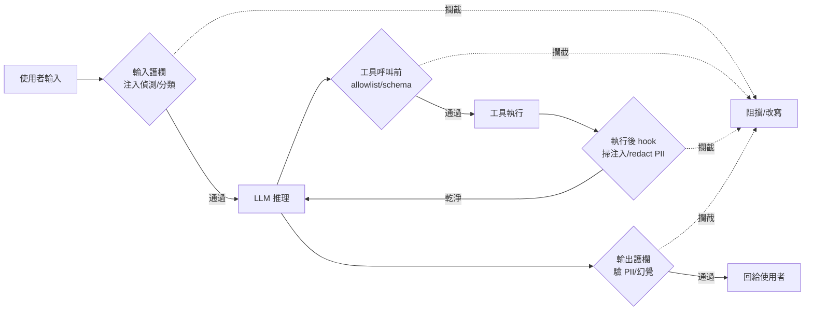

# 縱深防禦：護欄該擺在架構的哪一層

## TL;DR

- 護欄不是「輸出前掛一個過濾器」，而是沿著 agent 的資料流佈下四個攔截點：輸入（pre-LLM）、推理／工具呼叫前、輸出（post-LLM）、工具執行後（post-execution hook）。每一層擋不同威脅、付不同延遲代價，少一層就漏一類攻擊。
- 同一層內也要分工：先跑 1ms 級的 regex／heuristic 快篩，再跑 10–30ms 的 BERT 級分類器，只有高風險才升級到 800ms+ 的 LLM-as-judge。重檢留給值得重檢的，否則延遲與成本會壓垮可用性。
- 兩個取捨決定架構長相：互動式 agent 想串流回應就得用「邊串流邊背景驗證、違規再 recall」的非同步模式；而每個攔截點都要明確選 fail-open（漏過但不卡使用者）或 fail-closed（卡住但可能誤殺），且護欄本身會變成 DoS 攻擊面。

## 為什麼「一個過濾器」不夠：四個攔截點

最常見的誤解是把護欄理解成接在模型輸出後面的一個內容過濾器。問題在於，這個位置只能看到「模型說了什麼」，看不到「使用者餵了什麼」「模型打算呼叫哪個工具」「工具回傳了什麼」。而 agent 出事的環節恰恰散落在這整條鏈上。

縱深防禦的核心主張就是：沒有單一護欄技術足以涵蓋全部威脅，要在資料流的不同階段佈下相互獨立的攔截層。OWASP 的 AI 安全指引明確建議至少三層相互獨立的控制，2026 年業界普遍把它細化成四個攔截點，對應 agent loop 的四個位置：

1. **輸入端（pre-LLM）**：在模型看到任何東西之前做輸入分類、注入偵測、把來自 retrieval 的內容標上來源（content provenance），讓系統知道哪些字串是「不可信資料」而非「指令」。
2. **推理／工具呼叫前**：模型決定要動手時，先過 tool allowlist、schema 驗證、invariant 檢查——「這個工具現在能不能用、參數合不合法、這個動作有沒有越界」。（權限模型與工具白名單的細節是第三篇的主題，這裡只標明：推理端必須有一道 tool 控制。）
3. **輸出端（post-LLM）**：模型生成後、回給使用者或寫進系統之前，驗證內容是否含 PII、機密、幻覺或不該外洩的資料。
4. **工具執行後（post-execution hook）**：工具回傳結果、但**還沒進到 LLM 的 context 之前**，掃描其中是否藏有注入指令、redact 掉 PII、偵測 exfiltration 跡象。

第四個攔截點最容易被忽略，卻是間接注入（indirect injection）的主防線。AWS Prescriptive Guidance[^aws-pg] 在《Input validation and guardrails for agentic AI systems》中強調，在把工具輸出傳給下一輪迭代之前就要驗證它，並指出「多層驗證分佈在 agent 呼叫鏈的不同階段，能降低單一控制失效就導致邊界被突破的機率」（截至 2026-06）。Snowflake 的 Cortex AI Guardrails[^cortex] 把這層做在 orchestration 層，攔截工具回應、在它觸及底層模型前用一個專門針對對抗式注入後訓練的 LLM 判斷是否含惡意指令（Snowflake 工程部落格，截至 2026）。

為什麼非得擋在「進 context 之前」？因為 LLM 在架構上無法區分指令與資料——兩者都在同一個 context window 裡。CodeIntegrity 與多位研究者指出，這是 prompt injection 之所以「難解」的根本原因：當不可信資料可以被解讀成指令，注入就是「by design」存在的。OpenAI 在 2025 年 12 月針對 ChatGPT Atlas 瀏覽器公開承認，prompt injection「不太可能被完全解決」，把它定位成長期安全挑戰（Fortune／CyberScoop，2025-12-23）。這正是縱深防禦的存在理由：既然單點偵測必然會被繞過（EchoLeak 就繞過了 Microsoft 的 XPIA 分類器），就只能靠多層、各自獨立的控制把漏網的攻擊一層層削掉。

下圖把這四個攔截點放回資料流：

## 同一層內也要分工：rule-based 快篩 vs LLM judge

把護欄鋪成四層，第一個反作用力就是延遲。如果每一層都用一個 LLM 來判斷，互動式 agent 的回應會慢到不能用。所以真正的工程重點不只是「鋪幾層」，而是「每一層用多重的手段」。

業界 2026 年的共識做法是在單一攔截點內部再做成本梯度（cost cascade），由便宜往貴升級：

- **regex／heuristic 快篩**：用模式比對抓常見注入片語，延遲在 1ms 以下。便宜、可解釋，但只擋得住已知字串，換句話換種寫法就漏。
- **微調分類器（BERT[^bert] 級）**：針對注入資料集 fine-tune 的編碼器模型，能抓改寫過的攻擊，延遲約 10–30ms。研究中 BERT 分類器在 in-distribution 可達 F1[^f1] 0.91，但對全新攻擊型態會明顯退化（arXiv 2410.21337，2024）。
- **LLM-as-judge[^llm-judge]**：用一個獨立的模型呼叫判斷輸入是否企圖覆蓋系統指令。最強、也最貴——延遲 800ms 以上、成本是分類器的 10–100 倍，不適合高吞吐的逐請求全量檢查（業界基準，截至 2026）。

合理的架構是：便宜的快檢全量跑，必要時才升級到重檢。把 LLM judge 留給「快篩已經覺得可疑」或「即將執行高風險動作」的少數案例。modelmetry 等來源給的量級參考是：LLM-based 輸入分類器（Haiku 級小模型）約 150–250ms，輸出驗證再加 150–200ms——這已經是把延遲做進產品體驗紅線（互動式 agent 普遍以 ~300ms 為可接受上限，因為人類反應時間約 250ms）的數字。商用 runtime 如 Straiker Defend AI 宣稱在 <300ms 內達 98%+ 偵測準確率、誤報率比 frontier 模型 judge 低 6–21 倍（廠商自報，straiker.ai，截至 2026）——廠商數字要當行銷起點而非驗收標準看待。

這套分工也解釋了為什麼 rule-based 與 LLM judge 不是二選一：rule-based 負責「快、可稽核、擋已知」，LLM judge 負責「準、抓語意、擋未知」，兩者疊在同一個攔截點上，分別補對方的盲區。

## 非同步驗證：串流時護欄擺哪裡

四層攔截點裡，輸出護欄跟「串流回應」天生衝突。互動式 agent 為了體驗會逐字 streaming 給使用者，但傳統的輸出護欄要等整段生成完才能驗——這代表內容已經串出去了，護欄才跑完。OpenAI Agents SDK 的 issue tracker 上就有大量回報指出，串流情境下輸出護欄是在串流之後才觸發；litellm 的文件也直言：串流的 post-call guardrail 是在所有 chunk 都送達 client 後才對組裝好的完整回應跑，本質上只能做 audit，無法阻擋已送出的內容。

解法是把驗證改成非同步、與生成並行：agent 一邊串流給使用者，護欄在背景並行跑，一旦事後偵測到違規就 recall／修正已經顯示的內容（authoritypartners 2026 guide；litellm 的 `async_post_call_streaming_iterator_hook` 即是逐 chunk 驗證的實作）。Snowflake 也宣稱 Cortex AI Guardrails 與 agent loop 並行執行、「不增加延遲」（廠商自報，snowflake.com，截至 2026）。

但非同步不是免費的。它換來的是「使用者可能短暫看到違規內容、再被收回」的視窗期。所以非同步適合用在「先看到沒有立即危害、事後修正可接受」的輸出（例如文字回覆），而**不適合**用在「動作一旦發出就不可逆」的環節——轉帳、刪檔、寄信這類執行層，必須是同步、阻塞式的核可，寧可讓使用者多等。換句話說，攔截點的同步／非同步選擇，要看那一層的失敗是否可回收。

## fail-open vs fail-closed：護欄壞掉的時候

最後一個架構決策，是每個攔截點都要明確回答：當護欄本身超時、出錯或被打爆時，要放行還是攔下？

- **fail-open[^fail-open]**（壞了就放行）：保護可用性，但護欄失效時等於沒有護欄。研究指出多數實作預設 fail-open——這其實違背了護欄的初衷。從安全角度看，目前多數 alignment 機制都是 fail-open：部分失效會退化成「不安全地照做」（arXiv 2602.16977，2026）。
- **fail-closed**（壞了就攔下）：保護安全，但合法動作會被卡住，人工核可路徑就成了瓶頸，且容易把護欄變成可用性的單點故障。

沒有普世正確答案，取捨要看那一層擋的是什麼。低風險的輸出過濾可以 fail-open（漏一句總比卡住整個產品好），高風險的執行層應該 fail-closed 並配明確的人工 override 路徑。

而 fail-closed 本身會打開新的攻擊面：既然護欄壞了就攔，攻擊者就可以**故意餵會打爆護欄的輸入**。CSO Online 報導，研究者展示了攻擊者能把 AI agent 的護欄變成 DoS[^dos] 武器——單一份被投毒的文件就可能塞爆共用的護欄基礎設施，餓死同處一台的其他 agent，讓整個系統癱瘓（csoonline.com，截至 2026）。這呼應了一個更廣的取捨：分層越多、檢查越重，延遲與成本越高，越容易被攻擊者反過來當成資源耗盡的槓桿。縮減推理預算能降延遲，卻同時弱化安全判斷——你只是在 fail-open 與 fail-closed 之間挪動部署位置而已（arXiv 控制理論 guardrails 研究，2026）。

所以分層架構的真正紀律不是「鋪愈多層愈安全」，而是：每一層想清楚擋什麼、付多少延遲、壞掉時往哪倒，並且把不可逆的動作留在最嚴格、同步、fail-closed 的那一層。

[^aws-pg]: AWS Prescriptive Guidance，Amazon 雲端官方出版的實作指引系列，針對特定架構主題給出可照做的最佳實踐。此處引用的是它對 agent 系統輸入驗證與護欄的建議文件。
[^cortex]: Snowflake Cortex AI Guardrails，資料雲廠商 Snowflake 內建於其 AI 平台的護欄功能，特色是做在編排層、攔截工具回應，並宣稱與 agent 主迴圈並行執行以不增加額外延遲。
[^bert]: BERT，Google 於 2018 年推出的編碼器型語言模型。相對於生成式大模型，它體積小、推論快，常被 fine-tune 成單一用途的分類器（如偵測注入），是護欄裡「中等成本」那一檔的代表。
[^f1]: F1 分數，分類模型常用的綜合評分，把「抓得準（precision）」與「抓得全（recall）」調和成單一數字，介於 0 到 1。0.91 代表整體偵測表現相當好，但僅限於與訓練資料相似的攻擊。
[^llm-judge]: LLM-as-judge，用一個獨立的語言模型去評判另一個模型的輸入或輸出是否合格的做法。優點是能讀懂語意、抓到規則寫不出的新型攻擊，缺點是每次判斷都要多跑一輪推理，慢且貴。
[^fail-open]: fail-open 與 fail-closed 是資安的一組對照設計選擇：保護機制本身故障時，fail-open 選擇放行（保可用性）、fail-closed 選擇攔下（保安全性）。哪個對沒有標準答案，取決於那一關擋的後果有多嚴重。
[^dos]: DoS（Denial of Service，阻斷服務），一種讓系統因資源被耗盡而無法正常服務的攻擊。此處指攻擊者餵入會拖垮護欄運算的輸入，反過來把防護機制變成癱瘓整個系統的槓桿。

---

## 來源

1. [Input validation and guardrails for agentic AI systems on AWS](https://docs.aws.amazon.com/prescriptive-guidance/latest/agentic-ai-security/best-practices-input-validation.html) — AWS Prescriptive Guidance，截至 2026-06
2. [Cortex AI Guardrails: Prompt Injection & Jailbreak Prevention](https://www.snowflake.com/en/blog/engineering/cortex-ai-guardrails-prompt-injection-prevention/) — Snowflake Engineering Blog，2026
3. [Prompt Injection Classifier Limits for AI Agents](https://www.codeintegrity.ai/blog/prompt-injection-limits) — CodeIntegrity，2026；OpenAI「unlikely to ever be fully solved」見 [Fortune](https://fortune.com/2025/12/23/openai-ai-browser-prompt-injections-cybersecurity-hackers/)，2025-12-23
4. [Attackers can turn AI agent guardrails into denial-of-service weapons](https://www.csoonline.com/article/4185051/attackers-can-turn-ai-agent-guardrails-into-denial-of-service-weapons.html) — CSO Online，2026
