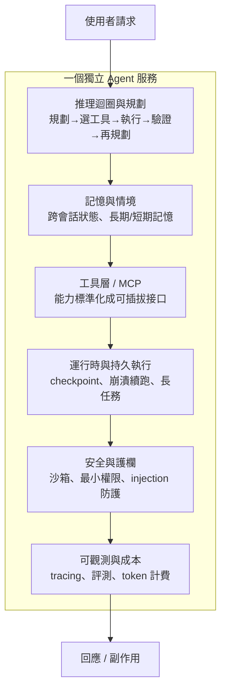

# Agent 不是 prompt：獨立 Agent 服務的系統解剖

把一個聊天框接上 LLM API，不叫做一個 Agent 服務。這聽起來像廢話，但 2026 年踩進這個坑的團隊比例高得驚人——把一段寫得很長的 system prompt、幾個 function calling 定義、一個 while 迴圈拼在一起，跑通了 demo，然後在正式環境裡發現它會失憶、會在第三步崩潰後從頭再來、會被一封郵件裡的惡意指令騙去刪檔、而且帳單一個月燒掉五位數卻沒人說得清錢花在哪。

這一期想先建立一個世界觀：**在正式環境裡，Agent 不是一段提示詞，而是一套分散式系統，只是剛好由 LLM 擔任規劃者與執行者。**這句話這一年被反覆引用不是因為它好聽，而是因為它把工程責任講清楚了——一旦你的 Agent 要對外提供服務、要持續運行、要碰真實資料與真實權限，prompt 品質就只是冰山一角，水面下是狀態管理、可靠性、權限隔離、計費與可觀測性。這篇是本期的總覽地圖，只畫骨架不挖細節；每一層該長什麼樣、提供什麼功能，留給第 02 到 07 篇逐層展開。

## TL;DR

- demo 與服務的差距不在模型，在工程：一段 prompt 缺的是**狀態、可靠性、權限、計費、可觀測**這五樣東西，而這五樣全是分散式系統的老問題。
- 獨立 Agent 服務可拆成六層子系統——推理迴圈、記憶與情境、工具層、運行時與持久執行、安全護欄、可觀測與成本；每層都對應一個你不做就會在正式環境出事的失敗模式。
- Agent 的 LLM 呼叫次數是純聊天的 3–10 倍，一個不設限的軟體工程任務能燒掉 5–8 美元（截至 2026-06）；成本不是優化的後話，而是架構的第一層約束。

## 為什麼一段 prompt 撐不起一個服務

先看數字。Agent 把單次使用者請求拆成「規劃 → 選工具 → 執行 → 驗證 → 再規劃」的迴圈，每一輪都要把累積的情境重新送進模型，所以它的 LLM 呼叫次數是純聊天機器人的 3–10 倍。在軟體工程這類重任務上，一個不設限的 Agent 解一個 issue 的成本落在 5–8 美元，SWE-bench 風格的任務含重試與自我修正動輒吃掉 1–3.5M tokens（截至 2026-06）。這意味著「成本」根本不是上線後再談的優化項目，而是你設計迴圈深度、情境長度、模型選擇時就被綁死的第一層約束。

再看能力的天花板。單次 LLM 呼叫在複雜任務上的準確率會在某個高原停住，靠的是把任務拆成多輪推理加工具呼叫，才有機會把可靠度往上推。但每多一輪迴圈、每多一個工具、每多一個子 Agent，你就多了一個會失敗、會逾時、會回傳髒資料的環節。換句話說，**Agent 用「更多次模型呼叫」換「更高的任務完成率」，而代價是把一個原本確定性的 API 呼叫，變成一個有狀態、會出錯、要協調的分散式工作流。**

一段 demo prompt 不處理這些。它假設使用者在場、任務一次跑完、沒有惡意輸入、出錯就重來、沒人在乎花多少錢。一個對外服務全都反過來：使用者可能離線、任務可能跑幾小時、輸入可能挾帶攻擊、崩潰必須能續跑、每一筆 token 都要能歸帳。這就是 demo 與服務之間那道工程鴻溝。

## 把獨立 Agent 服務拆成六層

下面這張全景圖把一個對外服務拆成可分層交付的六個子系統。讀法是：左邊是「這層在做什麼」，右邊是「不做會出什麼事」。

**第一層 · 推理迴圈與規劃（見本期第 02 篇）。** 這是 Agent 的心臟：一個「讀目標 → 決定下一步 → 行動 → 觀察結果 → 再決定」的迴圈，跑到任務完成或撞到上限為止。這層要回答的取捨包括規劃模式（先規劃再執行 vs 邊走邊修）、迴圈的終止條件，以及最關鍵的單體 vs 多體之爭——2025 年 Cognition[^cognition] 喊「別建多 Agent」、Anthropic 同期發文示範自家多 Agent 研究系統勝過單體約九成，兩家公開對撞。2026 年實務上沉澱出的折衷是：一個握有完整對話情境的 orchestrator[^orchestrator]，按需派出各自開新情境窗、跑完只回傳一段摘要字串的臨時性 subagent。

**第二層 · 記憶與情境（見本期第 03 篇）。** LLM 本身無狀態，跨會話的連續性得靠你外接記憶。這層處理短期工作記憶、長期事實、以及最難的一題——當情境塞不下時，Agent 該丟掉什麼。情境工程做不好，Agent 就會在長對話裡失憶、自相矛盾、或把情境塞爆讓成本失控。

**第三層 · 工具層與 MCP（見本期第 04 篇）。** Agent 的手腳。2024 年底 Anthropic 提出的 Model Context Protocol[^mcp]，到 2026 年 3 月已是業界事實標準——每月 SDK 下載破 9700 萬、超過一萬個公開 MCP server、Anthropic / OpenAI / Google / Microsoft / AWS 全部支援，並在 2025 年 12 月捐給 Linux 基金會旗下的 Agentic AI Foundation 共管。這層的價值是把「能力」標準化成可插拔接口，但也帶來新問題：MCP server 現在多半要維持 session 狀態，2026 路線圖的重點正是改成 stateless 以便水平擴展。

**第四層 · 運行時與持久執行（見本期第 05 篇）。** 這是讓 Agent「像可靠軟體」而非「跑一次的腳本」的關鍵層。長任務跑到第 23 步崩潰，不該從第 1 步重來——durable execution[^durable] 靠重放事件歷史把記憶體狀態重建到第 23 步再續跑。checkpoint 已是 LangGraph、Temporal[^temporal]、Dagster 等框架的一級原語；Temporal 在 2026 年 2 月以 50 億美元估值募了 3 億美元、年增 380%，側面說明這層需求有多真實。

**第五層 · 安全與護欄（見本期第 06 篇）。** 一旦 Agent 有真實權限，它就是攻擊面。Simon Willison[^willison] 的「致命三重奏」[^lethal-trifecta]講得最清楚：當一個 Agent 同時具備「存取私有資料」「接觸不可信內容」「能對外通訊」三項能力，一句注入的提示詞就能讓它外洩機密。問題是架構性的——LLM 沒有內建機制把可信指令和不可信資料分開，因為兩者都以同一串 token 進來。沙箱、最小權限、確定性策略閘是現在的主要防線，但 2026 年有研究指出高達 78% 的 Agent 部署在執行高風險工具呼叫時，根本沒有確定性策略把關。

**第六層 · 可觀測性與成本（見本期第 07 篇）。** 把一個機率系統工程化，靠的是把每一次模型呼叫、工具執行、推理步驟都記成結構化 span。2026 年 Agent 可觀測性已自成一門學科，OpenTelemetry 的 GenAI 語意規範提供了通用詞彙。難點在於非確定性：傳統除錯假設「同輸入同輸出同路徑」，但 Agent 即使 temperature=0 也未必能重現失敗——重放一次請求，那個刪錯檔的 bug 可能就是不再出現。所以這層要同時做線上 tracing（接住正式環境丟來的意外）與離線評測（在部署前擋住回歸），外加 token 層級的計費歸因。

## 分層交付的好處與該避免的取捨

把服務拆成六層不是為了好看，是為了**分層交付**：你可以先用一個簡單迴圈加最小工具集上線，再逐層補記憶、補持久執行、補護欄。每一層都對應一個明確的失敗模式，這讓「我們的 Agent 還缺什麼」變成一個可勾選的清單，而不是一團模糊的焦慮。

但要避免兩個常見錯誤。其一是**過度工程**：不是每個 Agent 都需要多體協調或 Temporal 等級的持久執行——Cognition 的論點有其道理，多數團隊缺的不是多 Agent，而是把單 Agent 做對的紀律；對短任務、使用者在場的場景，硬上分散式工作流只是徒增脆弱。其二是**忽略下層只堆上層**：拚命調 prompt、加工具，卻沒有 checkpoint、沒有沙箱、沒有 tracing——這種 Agent 在 demo 裡很亮眼，一上正式環境就會以你無法除錯的方式爛掉。

這六層的順序本身就是一種建議的優先級：先把迴圈與記憶做穩，再讓工具標準化，接著保證它崩得掉也續得回，然後關上安全的門，最後把整個機率系統接上儀表板。接下來六篇，會逐層把「該長什麼樣、提供哪些功能、2026 年的工程共識在哪」講清楚。

[^cognition]: Cognition 是打造 AI 軟體工程師 Devin 的新創公司。2025 年它發表〈別建多 Agent〉一文、力主單線程架構，是業界「單體 vs 多體」辯論裡最鮮明的一方代表。
[^orchestrator]: orchestrator（協調者）指一個握有完整任務脈絡的主 Agent，負責拆解工作、調度子 Agent；subagent（子 Agent）則是它臨時派出、各自隔離、做完只回傳摘要的工人。這組「協調者—子 Agent」拓撲是 2026 年多 Agent 的主流長相。
[^mcp]: Model Context Protocol（MCP，模型情境協定）是 Anthropic 在 2024 年底提出的開放協定，用一套標準介面讓 AI 模型連接外部工具與資料源，被類比為「AI 界的 USB-C」。本期第 04 篇專門拆解它。
[^durable]: durable execution（持久執行）是一種讓程式即使中途崩潰也能從斷點續跑、而非從頭重來的執行模型。它把每一步記成可重放的事件日誌，崩潰後回放即可還原進度，本期第 05 篇詳述。
[^temporal]: Temporal 是專做持久執行的開源框架與雲端服務公司，原為解決微服務工作流可靠性而生，2026 年因 AI Agent 的長任務需求爆紅，OpenAI、Replit 等都把 Agent 建在其上。
[^willison]: Simon Willison 是知名獨立開發者與技術部落客（Django 共同創造者之一），長期追蹤並科普 LLM 安全議題，「致命三重奏」一詞即出自他對 prompt injection 風險的整理。
[^lethal-trifecta]: 致命三重奏（lethal trifecta）指一個 Agent 同時具備「存取私有資料」「接觸不可信內容」「能對外通訊」三項能力時，就足以被一句注入指令誘導去外洩機密，是描述 prompt injection 危害的經典框架。

---

## 來源

1. [AI Agent Architecture: Build Systems That Work in 2026](https://redis.io/blog/ai-agent-architecture/) — Redis Blog，2026
2. [The Hidden Economics of AI Agents: Managing Token Costs and Latency Trade-offs](https://online.stevens.edu/blog/hidden-economics-ai-agents-token-costs-latency/) — Stevens Institute of Technology，2026
3. [Donating the Model Context Protocol and establishing the Agentic AI Foundation](https://www.anthropic.com/news/donating-the-model-context-protocol-and-establishing-of-the-agentic-ai-foundation) — Anthropic，2025-12
4. [Cognition vs Anthropic: Don't Build Multi-Agents / How to Build Multi-Agents](https://news.smol.ai/issues/25-06-13-cognition-vs-anthropic) — AINews (smol.ai)，2025-06-13
5. [Temporal for AI Agents: Durable Execution Guide 2026](https://effloow.com/articles/temporal-ai-agents-durable-execution-guide-2026) — Effloow，2026
6. [Simon Willison on prompt-injection（致命三重奏）](https://simonwillison.net/tags/prompt-injection/) — Simon Willison，2026
