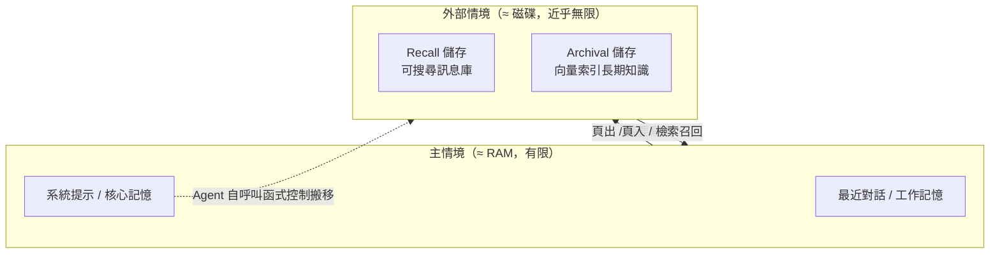

# 記憶與情境工程：讓 Agent 跨會話不失憶

## TL;DR

- 把 Agent 做爛的，多半不是模型不夠聰明，而是**情境管理**：一份對企業部署的分析把近 65% 的 Agent 失敗歸因於多步推理時的情境漂移（context drift），而且漂移會以每步約 2% 的速度複利累積——五輪之後可靠可取用的原始情境不到 60%。解法不是更大的視窗，是有結構的記憶層。
- 記憶要分層：短期（context window 內的工作記憶）、中期（會話 / recall 儲存）、長期（向量庫、知識圖、結構化日誌的事實與經驗）。框架地景已經分裂成兩種打法——Mem0 是你「外掛」到既有 Agent 上的記憶層，Letta／MemGPT 則把 Agent 本身做成有記憶的 runtime。
- 記憶是有成本與風險的工程，不是免費的「越記越好」。知識圖維護貴、過期事實會製造「對過去的幻覺」，而且記憶一旦能被寫入就能被污染——MINJA 類攻擊在理想條件下注入成功率超過 95%。記憶層必須附帶生命週期管理與治理。

## 為什麼「context 越大越好」是個陷阱

過去兩年最大的認知更新，是業界終於承認**情境視窗不是記憶**。把整段歷史、整批文件、整份工具輸出一股腦塞進視窗，短期看似省事，長期會壞在三件事上：成本、延遲、品質。

品質這件事最反直覺。一份 2026 年的分析把 65% 的企業 Agent 失敗歸到情境漂移，而非模型能力——Agent 在一份已經過時或被無關內容稀釋的情境上「正確地」推理，產出自信但錯誤的答案，而且是**靜默失敗**：沒有報錯，只有越走越歪。更糟的是它會複利：每一步約 2% 的錯位，早期引入到鏈尾可放大成約 40% 的失敗率。這就是常被稱作 context rot[^context-rot]（情境腐爛）的現象——視窗裡的雜訊越多，模型對關鍵指令的注意力越被稀釋。

數字也站在「少而精」這一邊。以 LOCOMO[^locomo] 這類長對話記憶基準為例，把全部歷史塞進視窗的 full-context 作法 p95 延遲約 17 秒、每次查詢吃掉 2 萬 6 千個 token；而一個有檢索的記憶層（Mem0）p95 搜尋延遲約 0.2 秒、每查詢約 1.8K token，等於延遲砍掉約九成、token 省下約九成，準確率只掉個位數百分點（截至 2026-06，Mem0 更新後的 token-efficient 版本宣稱在 LOCOMO 上同時拿回準確率與效率）。換句話說，**情境管理的好壞，比視窗大小重要得多**。Anthropic 在 2025 年把這件事正式命名為「context engineering」，核心問題從「該寫什麼 prompt」變成「什麼樣的情境配置，最可能讓模型產出我們要的行為」。

## 記憶分層：短、中、長期各記什麼、存哪裡

實務上把 Agent 記憶分成三層最好懂。**短期記憶**就是當前 context window 裡的工作記憶——系統提示、最近幾輪對話、當下正在處理的工具輸出。它快、但容量有限且一過就忘。**中期記憶**是單一會話或近期會話的可檢索歷史（MemGPT 稱之為 recall storage，一個可搜尋的訊息資料庫）。**長期記憶**才是跨會話、跨任務沉澱下來的東西，底層通常落在三種儲存：向量庫（語意相似度檢索）、知識圖（實體與關係、時序事實）、結構化日誌（可稽核的事件流與偏好設定）。

學界對這套分類也在升級。2025 年底的綜述《Memory in the Age of AI Agents》（arXiv:2512.13564）刻意跳脫傳統「短期 / 長期」二分，改用三個維度交叉描述：**形式**（token 級、參數級、潛在表示）、**功能**（事實記憶、經驗記憶、工作記憶）、**動態**（形成、演化、檢索）。對工程師的啟示是：別只想「存哪裡」，要想「這條記憶屬於哪一類、要不要演化、過期怎麼辦」——記憶是一個有生命週期的物件，不是一筆寫進去就不動的資料。

下面這張圖是 MemGPT[^memgpt] 把「作業系統分頁」搬到 LLM 上的心智模型：

## 情境工程的具體手法

把上面那張圖落到工程上，常用手法有幾類。**壓縮與摘要**：當視窗接近上限，就把舊內容換成摘要——Anthropic 在 2026 年初推出 compaction API（`compact-2026-01-12`），讓模型自動把情境窗存成摘要再續跑；研究框架 ACON（2025-10）把壓縮當最佳化問題，記憶用量降 26–54% 而任務準確率仍保 95% 以上。**Sliding window**：只保留最近 N 輪，配合**階層式摘要**把更早的內容逐層濃縮。**Memory offloading**：長流程裡把不立刻用到的東西卸載到外部檔案／儲存——Anthropic 的 memory tool 讓模型用增刪改查把情境寫進檔案，跨會話學習，等於把記憶外包給檔案系統。

檢索端則是 RAG[^rag] 家族的進化。樸素 RAG 是平面切塊 + 相似度檢索；**RAPTOR**[^raptor] 把文件遞迴聚類、逐層摘要成一棵樹，支援由粗到細的多粒度檢索；**GraphRAG**[^graphrag]（Microsoft，2024）從語料抽出實體—關係圖、做社群偵測得到多層摘要，查詢時 map-reduce 聚合，擅長「整體性、跨文件」的問題；**Self-RAG** 則讓模型自我判斷該不該檢索、檢索回來該不該採信。值得提醒的是，這些技巧並非越複雜越好：有評測指出高度結構化的系統索引建構與查詢延遲是輕量儲存的數量級之多，準確率卻不見得成比例提升——選型要看問題形狀，別為了用圖而用圖。

## 框架地景：Mem0、Letta／MemGPT、Cognee 各打什麼

地景已經分裂成兩種根本不同的哲學。**Mem0**[^mem0] 是你「外掛」上去的記憶層——五行 Python、SDK 乾淨、託管或自架皆可，骨子裡是向量 + 抽取，回答「這個使用者偏好什麼」這類問題最快，幾乎不改你既有的 Agent 結構。**Letta**[^letta]（MemGPT 的商業化延續）走的是另一條路：**記憶即架構**——把 Agent 做成你可以像服務一樣定址的有狀態實體，每個 Agent 有自編輯的核心記憶（core scratchpad）加上一個巨大的 archival 儲存，靠模型自呼叫函式在 RAM 與磁碟間搬資料。這正是 MemGPT 論文的原始貢獻：用 OS 的虛擬記憶分頁，給 LLM「無限情境」的錯覺。

圖派裡也有分工。**Zep**[^zep] 從對話建**時序知識圖**，擅長「在時間 T、給定一段會持續變動的對話，當時什麼是真的」——它在 LongMemEval（GPT-4o）上拿 63.8%，比 Mem0 的 49.0% 高出約 15 個百分點，差距主要來自時序檢索。**Cognee** 則從「對話以外的所有東西」建知識圖，回答「我的語料裡實體怎麼連」。一個務實的選型口訣：要使用者偏好，選向量 + 抽取（Mem0）；要時間正確性，選時序圖（Zep）；要語料內的關聯結構，選全圖（Cognee）；要 Agent 本身「感覺起來像個持久的服務」，選分層 runtime（Letta）。順帶一提，Cognee 截至 2026 年中尚未標榜 SOC 2／HIPAA，對受法規約束的採購是硬傷。

## RAG 與「記憶」的界線，以及記憶的代價

最後釐清兩個常被混為一談的東西。**RAG 是無狀態檢索**：查詢時從外部索引抓相關片段，會話結束就忘光，它給 Agent 的是「知識的取用」。**記憶是有狀態的持久化**：跨會話存下情境、按需召回，它給 Agent 的是「連續性」。2026 年的辯論早已不是「RAG 死了」，而是「對哪些問題，這條會被 Agent 寫入、修訂、跨時間治理的記憶寫路徑（write path），值得它額外的複雜度」。順帶劃清與本期第 5 篇的分界：那篇談的 durable execution 是「程序崩潰後從哪一步續跑」的**執行狀態**，跟這裡談的「Agent 記得什麼」的**語意記憶**是兩回事，別混。

而那條 write path 正是代價所在。能寫，就能被污染——一旦攻擊者能影響長期記憶的內容，之後所有以該記憶為條件的互動都被攻陷，而且這種污染能熬過登出、換裝置、會話結束（MINJA[^minja] 類攻擊在理想條件下注入成功率超過 95%、攻擊成功率約 70%）。沒有生命週期管理的儲存會回傳過期事實，製造「對過去的幻覺」；標準的語意合併還常常把關鍵的時間順序線索抹掉。結論很清楚：**記憶層不是把資料倒進向量庫就完事**，它需要遺忘策略、衝突解析、時間戳治理與寫入防護，這些跟檢索一樣是一等公民。把記憶當成會腐爛、會被攻擊的活物來工程，才是讓 Agent 跨會話不失憶、又不至於記錯、記髒的關鍵。

[^context-rot]: context rot（情境腐爛）指當情境視窗塞進越多無關或過時內容，模型對關鍵指令的注意力被稀釋、表現反而下滑的現象。它說明「視窗越大越好」是錯覺，情境的品質比長度更重要。
[^locomo]: LOCOMO 是一套評估「長對話記憶」的基準測試，模擬橫跨多次會話的長期對話，用來比較不同記憶方案在召回正確事實、控制延遲與成本上的優劣。
[^memgpt]: MemGPT 是 2023 年的研究，把作業系統「虛擬記憶分頁」的概念搬到 LLM 上：把有限的情境視窗當 RAM、外部儲存當磁碟，讓模型自己呼叫函式在兩者間搬資料，藉此造出「近乎無限情境」的錯覺。後續商業化為 Letta。
[^rag]: RAG（Retrieval-Augmented Generation，檢索增強生成）指在模型回答前，先從外部知識庫檢索相關片段塞進情境，讓模型「帶資料作答」。它是無狀態的——查完即忘，給的是知識取用，而非跨會話的連續記憶。
[^raptor]: RAPTOR 是一種階層式檢索技術，把文件遞迴分群、逐層摘要成一棵樹，於是查詢時既能抓到細節段落、也能抓到高層摘要，適合需要由粗到細多種粒度的問題。
[^graphrag]: GraphRAG 是微軟 2024 年提出的檢索方法，先從語料抽出「實體—關係」知識圖並做分群摘要，查詢時聚合多層摘要作答。它擅長回答「整體性、跨文件」的大局問題，而非單點事實查詢。
[^mem0]: Mem0 是一套開源／託管的 Agent 記憶層，主打「外掛」式——幾行程式就能加到既有 Agent 上，底層是向量檢索加事實抽取，最擅長記住「使用者偏好」這類問題，幾乎不改動原本架構。
[^letta]: Letta 是 MemGPT 論文團隊的商業化產品，走「記憶即架構」路線：把 Agent 做成可像服務一樣定址的有狀態實體，內建自我編輯的核心記憶與龐大的長期儲存，讓 Agent 本身「感覺像個持久的服務」。
[^zep]: Zep 是一套 Agent 記憶服務，特色是從對話建構「時序知識圖」，能回答「在某個時間點、當時什麼是真的」這類隨時間變動的問題，在長期記憶基準上的時序檢索表現突出。
[^minja]: MINJA 是一類針對 Agent 記憶的「記憶注入」攻擊：攻擊者設法把惡意內容寫進 Agent 的長期記憶，之後所有以該記憶為條件的互動都被污染，且能熬過登出與換裝置，理想條件下注入成功率超過 95%。

---

來源：

1. [Context Drift Causes 65% of Enterprise AI Agent Failures — The Fix Isn't Bigger Windows, It's Persistent Memory](https://memu.pro/blog/ai-context-drift-enterprise-agent-memory) — MemU Blog，2026
2. [Best AI Agent Memory 2026: Mem0 vs Letta vs Zep vs Cognee](https://mcp.directory/blog/mem0-vs-letta-vs-zep-vs-cognee-2026) — MCP.Directory，2026
3. [MemGPT: Towards LLMs as Operating Systems](https://ar5iv.labs.arxiv.org/html/2310.08560) — Packer et al.（arXiv:2310.08560），2023
4. [Memory in the Age of AI Agents: A Survey](https://arxiv.org/abs/2512.13564) — Hu, Liu et al.（arXiv:2512.13564），2025-12
</content>
</invoke>
