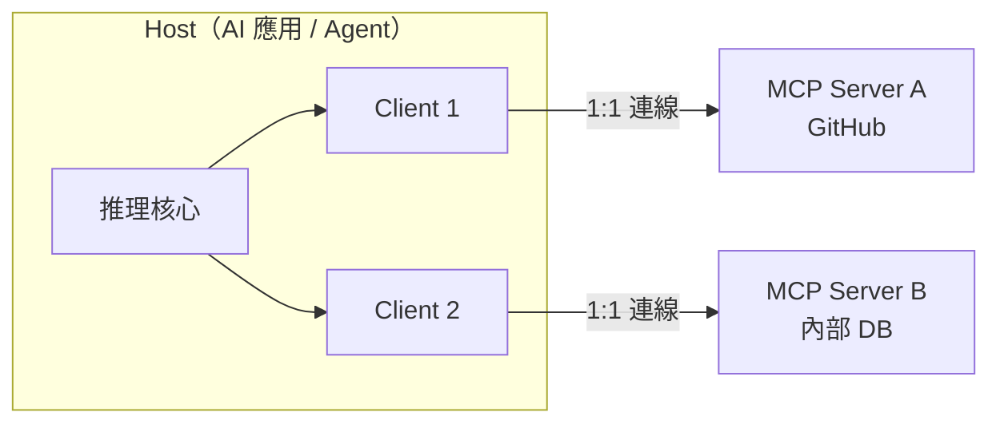

# 工具層與 MCP：把能力標準化成可插拔接口

一個 Agent 的推理核心再強，沒有「手」就只是個會聊天的盒子。工具層（tool layer）是 Agent 對外界做事的接口——查資料庫、開工單、發郵件、呼叫內部 API。把這層做好，Agent 才從 demo 變成能上線的服務。而 2026 年談工具層，繞不開 Model Context Protocol（MCP）：它在十八個月內從 Anthropic 的一份 spec，變成 OpenAI、Google、Microsoft、AWS 全數採用的事實標準，並在 2025 年底交給了 Linux Foundation。本篇只談「行動接口」——Agent 怎麼把能力標準化成可插拔接口；推理迴圈見第 2 篇、記憶見第 3 篇、持久執行見第 5 篇。

## TL;DR

- 原生 function calling 把工具綁死在單一模型/應用裡，造成 N×M 整合爆炸；MCP 用一層標準協定把它收斂成 N+M，是工具層該不該自己造輪子的分水嶺。
- MCP 是 host / client / server 三層架構，server 對外暴露三種原語：tools（可呼叫的動作）、resources（可讀的資料）、prompts（可重用的模板）。截至 2026-03，月下載破 9,700 萬、公開 server 逾 1 萬個。
- 2026-07-28 的 release candidate 把協定核心改成「無狀態」——拿掉 session 與 handshake，任何請求可落在任一 server 實例。這對「把 Agent 做成可水平擴展的獨立服務」是關鍵解鎖。

## 為什麼需要一個標準：從 function calling 到 N×M 爆炸

工具層的起點是 function calling[^function-calling] / tool use：你用 JSON Schema[^json-schema] 描述一個函式，模型在推理時決定要不要呼叫、填什麼參數，你的程式碼接住結果再餵回去。OpenAI 2023 年的 function-calling API 與 ChatGPT 外掛框架都是這條路。問題不在於它不好用，而在於它「不可移植」。每個工具的接法都綁死在特定供應商的格式裡，換一個模型就要重寫一遍 glue code。

Anthropic 把這形容為 N×M 整合問題[^nxm]：N 個 AI 應用要接 M 個資料源/工具，就得寫 N×M 份各自維護的整合。三個模型接十個內部系統，就是三十條客製連線，每條都要單獨升級與除錯。這正是微服務時代早就解決過的老問題——當接口沒有標準，連線數量隨參與方相乘膨脹。

MCP 的核心主張很簡單：在中間插一層標準協定，把 N×M 變成 N+M。每個模型只要會講 MCP，每個工具只要實作一個 MCP server，雙邊各自實作一次就能互通。業界普遍用「AI 界的 USB-C」[^usb-c]來類比——一條協定取代各家專屬連接線。對「打造獨立服務的 Agent」而言，這不只是少寫程式：它意味著你的工具能力可以獨立部署、獨立版本、被任何合規的 Agent 重用，工具層終於變成一個可以單獨演進的元件，而不是塞在主程式裡的一坨 if-else。

## host / client / server：MCP 怎麼運作

MCP 採三層架構，刻意把職責與信任邊界切開：

Host 是 AI 應用本身——Claude Desktop、Cursor、或你自建的 Agent 服務，負責協調模型、管理使用者體驗、執行安全策略。Host 為每一個要連的 server 開一個專屬 client，每個 client 維持一條到單一 server 的連線，負責協定協商與雙向訊息路由，並讓各 server 彼此隔離。Server 則是輕量、聚焦的程序，對外暴露能力。這個 1:1 的 client–server 對應不是冗餘，而是隔離設計：一個惡意或故障的 server 不該污染到另一個。

Server 暴露三種原語，分工明確。Tools 是模型可呼叫的動作（跑查詢、寫紀錄、呼叫 API），由模型決定何時呼叫——這是「做事」。Resources 是唯讀資料源（檔案、資料庫紀錄、知識庫），給模型補上下文——這是「讀」。Prompts 是預先寫好的模板，把工具與資源用在最佳路徑上——這是「最佳實務的封裝」。

關鍵差異在於「自動發現」。傳統 API 你得事先知道有哪些端點、怎麼呼叫；MCP client 連上任一 server 後，可以動態問它「你有哪些 tools/resources/prompts」，拿回帶 schema 的清單，模型再根據描述自行推理該用哪個。一次連線的生命週期大致是：初始化（交換協定版本與能力）、發現（拉取能力清單）、提供上下文、呼叫、執行回傳。對 Agent 服務來說，這意味著工具集可以在運行時擴充，而不必重新編譯或硬編碼端點。

## 為什麼它贏了：採用脈絡與治理

MCP 由 Anthropic 於 2024-11 推出。真正讓它從「又一個 spec」變成標準的，是競爭對手的背書：OpenAI 於 2025-03 正式採用 MCP（含 ChatGPT desktop），Google、Microsoft、AWS 隨後跟進。當買賣雙方都同意用同一條協定，網路效應就鎖死了——工具作者只要寫一次 server，就能被 ChatGPT、Claude、Cursor、Gemini、Copilot、VS Code 同時取用。

數字佐證了這個拐點。截至 2026-03，MCP 官方 TypeScript / Python SDK 月下載破 9,700 萬，官方 registry 收錄逾 9,600 個 server，Anthropic 另稱生態中有逾 1 萬個活躍的公開 server。落地端，Stacklok 的 2026 軟體報告顯示約 41% 受訪軟體組織已在有限或大規模生產中使用 MCP server，並有資料指出約 28% 的 Fortune 500 已部署 MCP 於生產 AI 流程（research notes 裡「約 80% 生產部署採 MCP」一說我未在一手來源驗證到，傾向以前述較保守的數字為準）。

治理上的轉折同樣重要。2025-12-09，Anthropic 把 MCP 捐給 Agentic AI Foundation（AAIF）[^aaif]——Linux Foundation[^linux-foundation] 旗下的 directed fund，由 Anthropic、Block、OpenAI 共同創立，Google、Microsoft、AWS、Cloudflare、Bloomberg 為白金成員。MCP 與 Block 的 goose、OpenAI 的 AGENTS.md 並列為創始專案。把一個由單一公司主導的協定交給中立基金會，是它能被當成長期基礎設施押注的前提——對企業而言，這降低了「供應商哪天改規格」的政治風險。

## 2026 路線圖：無狀態化對「Agent 即服務」的意義

對本期主軸——把 Agent 做成獨立、可擴展的服務——2026 路線圖裡最有份量的是無狀態化（stateless）。舊版 MCP server 必須維持 session 狀態，這在負載平衡器後面就是水平擴展的死穴：請求必須黏在同一個實例上。截至 2026-06，已鎖定的 2026-07-28 release candidate 直接把協定核心改成無狀態——拿掉 initialize/initialized handshake，移除 `Mcp-Session-Id` 與協定層 session，原本只在連線時交換一次的協定版本與能力，現在用 `_meta` 跟著每個請求走，並新增 `server/discover` 讓 client 需要時主動拉能力。結果是：任何 MCP 請求可以落在任一 server 實例，sticky routing 與共享 session store 不再是必需。新增的 `Mcp-Method` / `Mcp-Name` header 還讓 gateway 不必拆 body 就能依操作路由。

換句話說，MCP server 開始長得像一個正規的無狀態微服務，可以直接擺進你既有的 K8s / 負載平衡基礎設施裡。同一份 release candidate 還帶進 Extensions 框架、Tasks（非同步任務，呼應 agent 委派長任務的需求）、MCP Apps、授權強化（針對 OAuth issuer mix-up）以及一份正式的 deprecation 政策——任何功能下架要走 Active → Deprecated → Removed 至少 12 個月。另兩條值得追的方向是 Server Cards（放在 `.well-known` 端點的標準化 metadata，讓 registry 與爬蟲不必連線就能發現 server）與 A2A[^a2a]：MCP 管「Agent 對工具」的這一層，Google 的 A2A 管「Agent 對 Agent」的協調，兩者在 2026 被視為互補而非競爭。

代價也要誠實講：MCP 把工具標準化成可插拔接口的同時，也把攻擊面標準化了。tool poisoning[^tool-poisoning]（污染 server 端的能力 metadata，誘導 Agent 呼叫惡意工具）本質是供應鏈問題，2026 已有具編號的 CVE[^cve] 與真實事件；prompt injection 則是另一類輸入驗證問題。當 Agent 能自動發現並信任任意 server，「它連的到底是誰寫的」就成了核心風險。這部分點到為止，工具濫權、護欄與供應鏈防禦的完整處理見本期第 6 篇。

[^function-calling]: function calling（函式呼叫，又稱 tool use）是讓 LLM 不只生成文字、還能「決定呼叫某個函式並填好參數」的能力。你用結構化格式描述可用工具，模型推理後輸出要呼叫哪個、傳什麼，再由你的程式碼實際執行。
[^json-schema]: JSON Schema 是一種用 JSON 描述「另一份 JSON 該長什麼樣」的標準格式，定義欄位、型別與必填項。在工具呼叫裡，它被用來告訴模型每個工具接受哪些參數、格式為何。
[^nxm]: N×M 整合問題指 N 個應用各自要接 M 個工具時，得寫 N 乘以 M 份彼此獨立的整合程式，數量隨雙方相乘爆炸。MCP 的核心價值就是插一層標準協定，把它收斂成 N 加 M。
[^usb-c]: 「AI 界的 USB-C」是 MCP 最常見的類比：就像 USB-C 用一種接口取代各家專屬充電線，MCP 用一套協定取代「每個模型接每個工具都要重寫」的客製連線，達到一次實作、處處可接。
[^aaif]: Agentic AI Foundation（AAIF，代理式 AI 基金會）是 2025 年底成立的中立組織，由 Anthropic、Block、OpenAI 共同發起，接手代管 MCP 等開放專案，目的是讓這些協定不再由單一公司主導，企業才敢長期押注。
[^linux-foundation]: Linux Foundation（Linux 基金會）是全球最具規模的開源中立託管機構，旗下代管 Linux、Kubernetes 等關鍵專案。把協定交給它代管，等於替該協定背書「不會被某家廠商片面改規格」。
[^a2a]: A2A（Agent-to-Agent）是 Google 主導的協定，處理「Agent 之間如何互相溝通與協調」這一層，與處理「Agent 如何呼叫工具」的 MCP 分工互補——一個管 Agent 對工具，一個管 Agent 對 Agent。
[^tool-poisoning]: tool poisoning（工具中毒）是針對 MCP 的攻擊：攻擊者把惡意指令藏進工具的描述或 metadata 裡，當 Agent 讀取工具清單時就被誤導去呼叫惡意工具或洩漏資料。它本質是供應鏈問題——你信任的工具未必安全。
[^cve]: CVE（Common Vulnerabilities and Exposures）是業界公開的資安漏洞編號系統，每個已知漏洞會分到一個唯一 ID。一個風險「有了 CVE 編號」意味它已被正式登錄、追蹤與修補，不再只是理論隱憂。

---

## 來源

1. [MCP Adoption Statistics 2026: Model Context Protocol](https://www.digitalapplied.com/blog/mcp-adoption-statistics-2026-model-context-protocol) — Digital Applied, 2026
2. [Donating the Model Context Protocol and establishing the Agentic AI Foundation](https://www.anthropic.com/news/donating-the-model-context-protocol-and-establishing-of-the-agentic-ai-foundation) — Anthropic, 2025-12-09
3. [The 2026-07-28 MCP Specification Release Candidate](https://blog.modelcontextprotocol.io/posts/2026-07-28-release-candidate/) — Model Context Protocol Blog, 2026
4. [Architecture overview](https://modelcontextprotocol.io/docs/learn/architecture) — Model Context Protocol 官方文件，截至 2026-06
