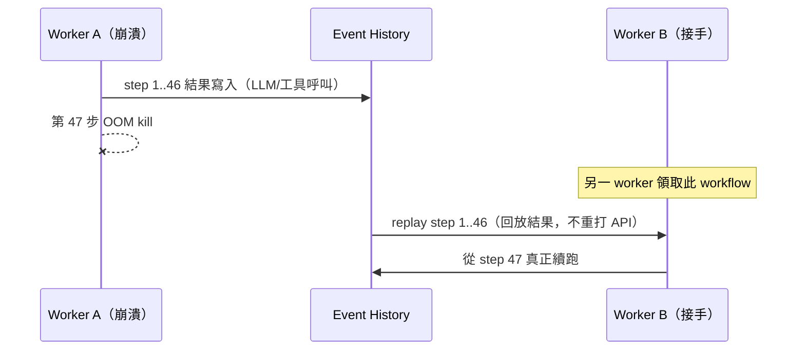

# 運行時與持久執行：長任務不中斷、崩潰能續跑

前面四篇把 Agent 拆成迴圈、記憶、工具、MCP。但這些都假設一件事：程式會一直跑到結束。生產環境裡這個假設不成立。一個跑 30 分鐘、要呼叫 80 次 LLM 與 12 個工具的研究型 Agent，中途遇到 worker 被 OOM kill[^oom]、部署滾動更新、雲端搶占式實例被回收——只要任何一步沒寫進持久層，整條流程就煙消雲散，使用者看到的是一個轉了半小時然後消失的 spinner。運行時這一層要回答的問題只有一個：怎麼讓 Agent 跑得久、也活得下來。這是「獨立 Agent 服務」和「把聊天框接上 API」最赤裸的分界線。

## TL;DR

- 長流程 Agent 在生產常崩，根因是每個 LLM 呼叫被當 fire-and-forget[^fire-and-forget]：崩了就全丟、重跑從第一步開始，浪費的不只是時間，還有已經花掉的 token 與已產生副作用的工具呼叫。
- Durable execution 把每一步寫成不可變的 event history；崩潰後 replay 事件日誌、從中斷處 resume，已完成的 LLM/工具呼叫直接回放結果不重打。Temporal 在 2026-02 以 50 億美元估值募得 3 億美元（a16z 領投），OpenAI、Replit、Lovable、Snap、Netflix 都在上面跑。
- 但 durable execution 不是免費午餐，也不是每個 Agent 都需要：它有 determinism 限制與心智負擔，短流程用 LangGraph checkpoint 或乾脆不用都行。先問流程會不會超過一次 LLM 呼叫的「複雜度懸崖」，再決定要不要付這個稅。

## 為什麼長流程 Agent 在生產常崩

問題的核心是「狀態存在哪裡」。多數 demo 把 Agent 寫成一個 Python `for` 迴圈，迴圈變數（跑到第幾步、上一步工具回什麼、累積的中間結果）全都活在進程記憶體裡。記憶體不持久。進程一死，這些狀態歸零，沒有任何外部系統知道這個 Agent 曾經跑到第 47 步。

更糟的是重試語意。當你天真地「重跑」一個失敗的 Agent，它會從第一步開始：重新呼叫所有 LLM（重新計費）、重新執行所有工具——包括那些有副作用的，例如已經寄出的郵件、已經扣款的訂單、已經建好的雲端資源。fire-and-forget 的迴圈沒有「我做到哪了」的概念，所以要嘛全丟重來（浪費 token、製造重複副作用），要嘛你自己手刻 checkpoint 與冪等鍵[^idempotent]——而那正是 durable execution 平台在替你解決的事。

需要先劃清一條界線：這裡講的「狀態」是**執行狀態**（跑到第幾步、event log、retry 計數），不是第 03 篇的**語意記憶**（使用者偏好、跨 session 的長期知識）。兩者經常被混為一談，但解法完全不同——前者要的是 workflow 引擎，後者要的是向量庫與記憶體管理。本篇只談前者。

## Durable execution：event history、replay 與 resume

Durable execution 的機制可以一句話講完：把工作流程的每一步當成一筆不可變事件，依序追加到 event history（事件日誌）[^event-history]裡；崩潰後不是重跑，而是 replay[^replay] 這份日誌把工作流程的協調狀態還原，再從中斷處 resume。關鍵在於 replay 時**不重新執行 activity**——它只重跑工作流程的協調程式碼，已完成的 LLM 呼叫、資料庫寫入、工具呼叫的結果直接從 history 取回。所以如果流程在第 47/100 步掛掉，replay 會瞬間把前 46 步的結果灌回去，從第 48 步真正繼續，前面花的 token 一塊都不會重花。

這套機制不是新東西——Temporal 從 Cadence[^cadence] 演化而來、AWS Step Functions 也是同類——但 2026 年它因為 Agent 而爆紅。Temporal 在 2026-02-17 宣布 3 億美元 D 輪、估值 50 億美元，a16z 領投，Lightspeed 與 Sapphire 加入。官方數字是過去一年營收成長 380%、週活躍使用成長 350%，雲端累計 9.1 兆次 action 執行、其中 1.86 兆來自 AI-native 公司（截至 2026-02）。背書名單很硬：OpenAI、Replit、Lovable 把 Agent 建在 Temporal 上，ADP 用於 human-in-the-loop 的 agentic 流程，Abridge 用它在 200+ 醫療系統提供 ambient AI。同月 Temporal 還推出 Replay 2026，加上 Serverless Workers 與 Workflow Streams，等於把這套基礎設施往「不必自管 worker pool」推。

## Stateful agent 配 stateless API：2026 的拼法

運行時的另一半是 serving 拓撲。2026 的共識是「stateful agent + stateless API」：Agent 本身是有狀態的長命實體（它要記得試過什麼、什麼失敗了、改過哪些檔案），但它對外打的每一個 API/工具呼叫幾乎都無狀態——身分與情境隨每次呼叫帶過去，而不是靠伺服器端的 session。實作上通常是 client 持有一個含使用者 identity 的 JWT[^jwt] 或簽章 token，每次請求都帶上，伺服器用密碼學驗證而不查 session 表，於是 API 層可以水平擴展，狀態的重擔集中在 workflow 引擎與記憶層。

平台地景也在往「託管 stateful runtime」收斂。2026-02-26，OpenAI 與 AWS 共同宣布在 Amazon Bedrock 上的 Stateful Runtime Environment（SRE）：替 OpenAI 模型驅動的多步 Agent 提供持久的 working context——跨 session 的記憶與歷史、工具與工作流程狀態、以及尊重 AWS identity primitive 的身分與權限邊界，主打讓開發者不必自己刻 orchestration 基礎設施，鎖定客服、銷售營運、IT 自動化、需要審批與稽核的財務流程等場景（截至 2026-06 為一般可用前的早期接觸階段）。換句話說，雲廠商正把「持久執行 + 身分傳遞」當成新的控制平面在賣。

## 反方：不是每個 Agent 都需要 Temporal

該潑的冷水也要潑。Durable execution 有真實的稅。Temporal 的 replay 模型要求 workflow 程式碼**確定性（deterministic）**[^determinism]：不能直接用 `time.Now()`、`rand()`、不能在 workflow 裡直接打 API——這些都得塞進 activity，否則 replay 會走出不同程式路徑、丟出 non-determinism 例外。改 workflow 程式碼還得處理版本化（worker versioning 或 patching API），不然舊 workflow 重放新程式碼會炸。這套心智模型對團隊是有門檻的，硬上小專案就是 overkill。Temporal 自己的講法是「複雜度懸崖」——當流程長到一定程度框架會崩，這時 durable execution 才變成必需；反過來說，懸崖之前它不是必需。

替代方案也不只一種，取捨各異（截至 2026-06）。LangGraph、DBOS[^dbos] 走 checkpoint 路線：每個節點完成後把狀態寫進資料庫（DBOS 只要 Postgres、零新基礎設施），適合天生是 graph 形狀、單體部署的工作流程。Restate、Inngest 更輕、更貼 serverless/edge[^serverless-edge]。但要小心一個常見誤解：Diagrid 那篇被廣傳的文章直言「checkpoint 不等於 durable execution」——checkpoint 只給你一個存檔點，誰來偵測失敗、誰來觸發 resume、怎麼防兩個進程同時 resume 同一個 thread 造成重複執行，全都甩回給你；開源版 LangGraph 跑在單一進程裡，沒有分散式執行、沒有 watchdog，進程一死全死。所以選型的真正問題不是「要不要持久化狀態」，而是「我要不要連失敗偵測、分散式協調、worker 接管也一起買」。短流程、單機、能接受偶爾重跑的 Agent，自建一個冪等 + 資料庫 checkpoint 往往就夠，沒必要扛 Temporal 全家桶；跨服務、長命、副作用昂貴、合規要稽核的 Agent，自建這套的成本通常遠超託管平台的學習曲線。

底線：運行時這層決定的不是 Agent 聰不聰明，而是它是不是一個能在生產活下來的服務。先量你的流程會不會跨越那道複雜度懸崖，再決定付不付這個稅——而不是反過來，先選了 Temporal 再找需要它的理由。

[^oom]: OOM kill（Out Of Memory kill）指程序吃光分配到的記憶體時，被作業系統強制終止。對長流程 Agent 來說，這是進程憑空消失、半小時進度蒸發的典型死法之一。
[^fire-and-forget]: fire-and-forget（射後不理）指發出一個操作後就不再追蹤它的狀態或結果。把每個 LLM 呼叫當 fire-and-forget，意味著系統不記得「做到哪一步」，崩潰後只能整段重來。
[^idempotent]: 冪等（idempotent）指同一個操作執行一次或多次，結果都相同。給有副作用的步驟（如扣款、寄信）配一個「冪等鍵」，重試時就能識別「這件事已經做過」而不重複執行。
[^event-history]: event history（事件日誌）是把工作流程每一步都記成一筆不可變、可依序重放的事件，存進持久層。它是 durable execution 的核心資料結構——崩潰後靠重放它就能還原進度。
[^replay]: replay（重放）指崩潰後不重新執行各步驟，而是依序「回放」事件日誌，把工作流程的協調狀態還原到中斷點。關鍵是已完成的 API 呼叫直接回傳舊結果、不重打，所以花過的 token 不會再花一次。
[^cadence]: Cadence 是 Uber 開發的開源持久執行引擎，Temporal 即由其原班團隊分支演化而來。提它是為了說明「持久執行」不是 AI 時代才有的新發明，而是早被微服務領域驗證過的成熟技術。
[^jwt]: JWT（JSON Web Token）是一種把使用者身分與權限資訊「簽章」打包成一串 token 的標準。伺服器靠密碼學驗證簽章即可確認身分，不必查詢伺服器端的 session 表，因此特別利於水平擴展。
[^determinism]: 確定性（deterministic）指同樣的輸入永遠走出同樣的程式路徑、得到同樣結果。持久執行的重放機制要求工作流程程式碼確定性，否則回放時走岔路就會出錯——所以取時間、隨機數、打 API 這類「不確定」操作都得隔離出去。
[^dbos]: DBOS 是一套持久執行框架，特色是只需一個 Postgres 資料庫、不必額外架設基礎設施，把工作流程狀態直接存進資料庫，適合想要持久化又不想扛重型平台的單體部署。
[^serverless-edge]: serverless（無伺服器）指開發者不管理伺服器、由雲端按需執行程式並計費；edge（邊緣）指把運算放到離使用者更近的節點。Restate、Inngest 這類輕量方案就主打貼近這兩種部署形態。

---

## 來源

1. [Temporal for AI Agents: Durable Execution Guide 2026](https://effloow.com/articles/temporal-ai-agents-durable-execution-guide-2026) — Effloow，2026
2. [Temporal raises $300M to make agentic AI real for companies](https://temporal.io/news/temporal-raises-300M-to-make-agentic-ai-real-for-companies) — Temporal，2026-02-17
3. [Introducing the Stateful Runtime Environment for Agents in Amazon Bedrock](https://openai.com/index/introducing-the-stateful-runtime-environment-for-agents-in-amazon-bedrock/) — OpenAI，2026-02
4. [Why Checkpoints Aren't Durable Execution: LangGraph, CrewAI, Google ADK and others fall short for production agent workflows](https://www.diagrid.io/blog/checkpoints-are-not-durable-execution-why-langgraph-crewai-google-adk-and-others-fall-short-for-production-agent-workflows) — Diagrid，2026
