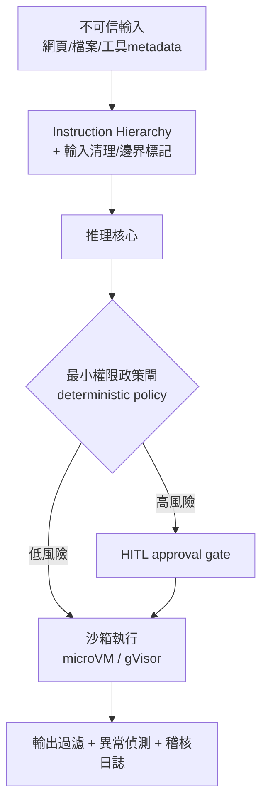

# 安全與護欄：prompt injection、沙箱與最小權限

## TL;DR

- 提示注入（prompt injection）[^prompt-injection]在 2026 仍是 OWASP[^owasp] Agentic 應用首位風險，而且越來越被視為「結構性缺陷、不是可修補的 bug」。最現實的證據是 2026 年初 Pillar Security 在 Google Antigravity[^antigravity] 上的 CVSS-10[^cvss] 漏洞：注入在原生 `find_by_name` 工具的 Secure Mode 守門之前就執行，把一次檔案搜尋變成沙箱逃逸與遠端程式碼執行（RCE）[^rce]。教訓是：把所有檔案內容、工具輸出、第三方 metadata 一律當成不可信輸入。
- 單一最重要的控制不是更聰明的注入過濾器，而是把最小權限（least privilege）[^least-privilege]套在 agent identity 與每個工具上。SupraWall Research 2026 量到 78% 的 agent 部署在沒有確定性政策強制（deterministic policy enforcement）下執行高風險工具呼叫；過度授權的系統事故率約為落實最小權限者的 4.5×。注入無法根除，但你可以讓「被注入成功後能造成的傷害」趨近於零。
- 防禦是多層的，不是一道牆：instruction hierarchy + 輸入/輸出檢核 + 最小權限 + 沙箱（microVM/gVisor）+ 高風險動作的 HITL approval gate。但現況差距很大——2025 AI Agent Index 顯示 30 個消費級 agent 只有 9 個有記載沙箱/VM 隔離；超過三分之一的組織坦言無法關掉一個失控的 agent（截至 2026-06）。

## 威脅模型：你在防的到底是什麼

把獨立 Agent 接上工具的那一刻，攻擊面就從「模型會不會說錯話」變成「模型會不會幫攻擊者做事」。2026 年的威脅模型有四個必記的形狀。

第一是**提示注入**，且重點早已從直接注入（使用者自己貼惡意指令）移到**間接注入**[^indirect-injection]：惡意指令藏在 agent 會讀進 context 的任何資料裡——網頁、issue、PDF、程式碼註解、甚至 npm 套件的 docstring。Pillar Security 揭露的 Antigravity 案例就是教科書級示範：攻擊者把指令埋進公開 repo 的原始碼註解，開發者把檔案拉進來，agent 把攻擊者的註解當成指令、staging payload、觸發執行——攻擊者全程沒碰過使用者帳號。更致命的是它**繞過 Secure Mode**：漏洞利用 `find_by_name` 工具 `Pattern` 參數的清理不足，注入命令列旗標到底層 `fd` 工具，而這個工具呼叫在網路限制、工作目錄外寫入限制等保護評估「之前」就開火。該漏洞 2026 年初回報、約二月底修補並獲 Google bug bounty。OWASP 2026 Agentic Top 10 把這類 coding agent 列為新攻擊資料的最大來源，安全稽核更指出注入漏洞出現在約 73% 的生產 AI 部署中。

第二是**過度代理（excessive agency）**[^excessive-agency]——OWASP LLM Top 10 的固定項目。當 agent 拿到超出任務所需的權限、工具或自主性，一次成功的注入就能放大成刪資料、發郵件、轉帳。這不是假設，而是今天生產環境裡正被紅隊與真實攻擊利用的架構模式。

第三是**工具與 MCP 濫權**。MCP 在 2026 已是連接 agent 與外部工具的事實標準，也因此把攻擊面搬到了「工具描述」這一層。**工具中毒（tool poisoning）**——把惡意指令埋進工具的 metadata/description——被研究列為 MCP 最普遍且影響最大的客戶端漏洞（arXiv 2603.22489）。供應鏈同樣致命：2026 年 3 月一個後門在 PyPI 上掛了約三小時、被下載近 47,000 次，受影響的 LiteLLM 正是 CrewAI、DSPy、Microsoft GraphRAG 等框架的 LLM gateway。第四是**資料外洩**：被注入的 agent 把 context 裡的密鑰、環境變數、私有資料透過工具呼叫送出去，往往偽裝成正常開發動作。

## 多層防禦清單：沒有任何一層能單獨成立

OpenAI 在 2026 年 4 月發布的官方注入防禦指南把話講白了：沒有任何模型層方案能完全擋住注入，要靠多道彼此獨立的防線疊起來，讓繞過其中一道不等於攻破整個系統。實務上的十層清單值得貼在牆上：輸入驗證與清理、輸出過濾、權限分離、沙箱、內容邊界標記、instruction hierarchy[^instruction-hierarchy]、canary token[^canary]、速率限制、異常偵測、高風險動作的 human-in-the-loop[^hitl] approval。

其中 **instruction hierarchy** 是地基：system prompt 的指令絕對優先於 user message，user message 又優先於 tool 輸出；模型永遠不該因為 user 或 tool 內容就推翻 system 層的約束。配套做法是**結構化輸出驗證**——強制 agent 的輸出走 JSON schema 驗證後才執行，不符合預期結構就直接拒絕，不要讓自由文字直接驅動工具。但要清醒：這些都是降低機率的「軟」控制。注入這件事在 2026 被越來越多研究者定性為**結構性、可能永遠無法根除**的缺陷，因為 LLM 在架構上分不開「資料」與「指令」。所以真正撐住信任邊界的，是接下來兩層硬控制。

## 最重要的單一控制：最小權限套在 identity 與工具上

如果你只能做一件事，做這件。注入過濾器是機率遊戲、永遠有繞過；但**權限是確定性的**——agent 沒有的工具，被注入也用不出來。最小權限的正確顆粒度不是「給 agent 一個大服務帳號」，而是 per tool、per dataset、per action 地授權，每個 agent 只拿到完成任務所需的最小工具集。這就是為什麼這層是地基：它把「注入成功率」這個你控制不了的變數，和「注入成功後的爆炸半徑」這個你完全控制得了的變數**解耦**。

數字會說服你。SupraWall Research 2026 量到 78% 的 agent 部署在沒有確定性政策強制下執行高風險工具呼叫——意思是大多數企業 agent 沒有任何 runtime guardrail，能阻止一個由惡意 prompt 觸發的刪除操作。同一份研究指出，過度授權的系統事故率約為落實最小權限控制者的 4.5×；而 88% 的組織在過去一年回報了確認或疑似的 agent 安全事故。把這三個數字放在一起，結論很硬：**確定性政策閘（policy gate）才是你錢花得最值的地方**，它不依賴模型「這次有沒有被騙」，而是無論模型決定做什麼，高風險動作都得先過一道與模型無關的規則檢查。這也是 04 篇談的工具層與 MCP 在安全上的歸宿——工具描述要對已知良好基線做驗證、偵測 session 間的描述變更、對工具呼叫做白名單與參數清理（Antigravity 的 `Pattern` 參數正是死在這裡）。

## 沙箱與 HITL：把爆炸半徑關進籠子

最小權限決定 agent「能呼叫什麼」，沙箱決定它「呼叫成功後能碰到什麼」，兩者互補。2026 的沙箱生態已收斂到三種隔離原語：**microVM**[^microvm]（Firecracker、Kata Containers，各 workload 一個專屬 kernel，隔離最強）、**gVisor**[^gvisor]（user-space kernel，攔截 syscall，不用整台 VM）、以及硬化容器（只適合受信任程式碼）。共識很直接：純 Docker 不夠，因為共用 host kernel；要 microVM 或 gVisor 才談得上對抗會主動嘗試逃逸的程式碼。代價是啟動延遲與運維成本的取捨，但 2026 基礎設施研究指出，沙箱化的 agent 相較於有完整 host 存取的 agent，安全事故約少 90%。

防線的最後一道是 **human-in-the-loop approval gate**：高風險、不可逆、涉及金錢或敏感資料的動作，必須有人按下確認才放行。這在認知上人人都同意——某 2026 調查中 68% 把 HITL 評為「必要」或「非常重要」，並要求人類在 agent 存取敏感資料（69%）、變更系統（68%）、核准金流（62%）前驗證。但認知和落地之間是個鴻溝。

而現況差距正是這篇要收的尾。2025 AI Agent Index（arXiv 2602.17753）盤點 30 個消費級 agent，只有 9 個有記載沙箱/VM 隔離，且多半是 dev/CLI/browser 類。治理面更糟：74% 組織計畫兩年內導入 agentic AI，但只有 21% 有成熟治理模型，53 個百分點的落差；35% 的組織坦言**無法關掉**一個失控的 agent，36% 對監督 agent 沒有任何正式計畫（截至 2026-06）。把這些拼起來，2026 的真相不是「我們不知道怎麼防」，而是「我們知道清單卻沒裝上去」。沙箱、最小權限政策閘、HITL approval——這三件 Agent 從原型走向生產時最常被跳過的事，恰好就是信任層的全部重量。先裝 policy gate，再裝沙箱，最後補 HITL；別等到你的 `find_by_name` 變成別人的 RCE。

[^prompt-injection]: 提示注入（prompt injection）指攻擊者把惡意指令混進 Agent 會讀到的內容裡，誘導模型把它當成正當指令執行。由於 LLM 在架構上分不開「指令」與「資料」，這被視為難以根除的結構性缺陷。
[^owasp]: OWASP（Open Worldwide Application Security Project）是知名的開放網路安全社群，以「Top 10 風險清單」聞名。它近年推出針對 LLM 與代理式應用的專屬風險榜，提示注入長年居首。
[^antigravity]: Antigravity 是 Google 推出的 AI 編碼工具／Agent。本文引用的案例是 2026 年初它被發現一個嚴重漏洞，成為「提示注入可演變成遠端程式碼執行」的教科書級實證。
[^cvss]: CVSS（Common Vulnerability Scoring System）是評估資安漏洞嚴重度的標準評分，0 到 10 分。CVSS-10 是滿分、最高危等級，代表該漏洞極易被利用且後果嚴重。
[^rce]: RCE（Remote Code Execution，遠端程式碼執行）指攻擊者能在目標機器上執行任意程式碼，是最嚴重的漏洞類型之一，等於攻擊者實質取得了對該系統的控制權。
[^least-privilege]: 最小權限（least privilege）是資安基本原則：每個身分只給「完成任務所需的最小權限」。套在 Agent 上，意味著它沒有的工具，就算被注入成功也用不出來——把爆炸半徑從源頭限死。
[^indirect-injection]: 間接注入（indirect injection）是提示注入的進階形態：惡意指令不由使用者直接輸入，而是預先埋在 Agent 會讀進情境的外部資料裡（網頁、issue、PDF、程式碼註解），攻擊者全程不必碰使用者帳號。
[^excessive-agency]: 過度代理（excessive agency）指 Agent 被賦予超出任務所需的權限、工具或自主性。一旦發生注入，多餘的權限會把傷害放大成刪資料、發信、轉帳，是 OWASP 清單上的固定風險項。
[^instruction-hierarchy]: instruction hierarchy（指令層級）是一種防禦設計：明訂 system prompt 的指令優先於使用者訊息、使用者訊息又優先於工具回傳內容，模型不該因為下層內容就推翻上層約束，用以抵抗注入。
[^canary]: canary token（金絲雀標記）是埋在資料或系統裡的誘餌——一個看似機密、實則被監控的值。一旦它被存取或外傳，就觸發警報，等於替「有東西被偷看了」裝上偵測器。
[^hitl]: human-in-the-loop（HITL，人在迴路）指在 Agent 的關鍵步驟插入人工審核：高風險、不可逆、涉及金錢或敏感資料的動作，必須有人按下確認才放行，是自動化系統的最後一道剎車。
[^microvm]: microVM（微虛擬機）是輕量化的虛擬機，給每個工作負載一個專屬的作業系統核心（如 Firecracker、Kata Containers），隔離性極強——即使裡面的程式被攻陷，也很難逃到主機。代價是啟動稍慢、運維較重。
[^gvisor]: gVisor 是 Google 開源的沙箱技術，在使用者空間實作一個「攔截層」，把程式發出的系統呼叫接住再轉譯，不必整台虛擬機就能達到接近 VM 的隔離，是 microVM 之外的折衷選擇。

---

1. [Prompt Injection leads to RCE and Sandbox Escape in Antigravity](https://www.pillar.security/blog/prompt-injection-leads-to-rce-and-sandbox-escape-in-antigravity) — Pillar Security, 2026
2. [Understanding prompt injections: a frontier security challenge](https://openai.com/index/prompt-injections/) — OpenAI, 2026-04
3. [Prompt injection still drives most agentic AI security failures in production](https://www.helpnetsecurity.com/2026/06/11/owasp-prompt-injection-ai-security-failures/) — Help Net Security, 2026-06-11
4. [How to sandbox AI agents in 2026: MicroVMs, gVisor & isolation strategies](https://northflank.com/blog/how-to-sandbox-ai-agents) — Northflank, 2026
</content>
</invoke>
