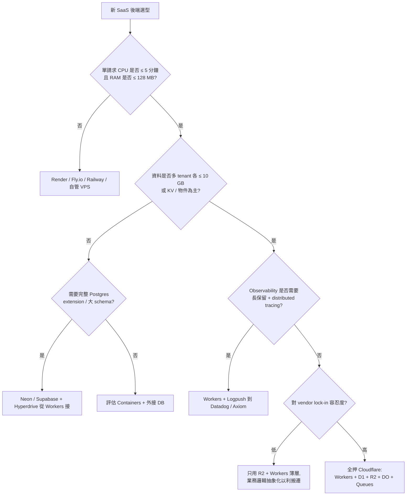

# 為什麼 Cloudflare 成了 indie SaaS 的預設後端

## TL;DR

- 2026 年 indie SaaS[^indie-saas] 之所以越來越預設選 Cloudflare[^cloudflare]，是「邊緣零冷啟[^cold-start] × 零 egress[^egress] × 一站式」三件事相乘的結果——任何單一賣點都能在別處找到平替，但三者疊加之後的價格曲線與部署心智成本，目前沒有對手追得上。
- Cloudflare 的真正優勢不是便宜，是「可預測的便宜」：bandwidth 永遠免費、Workers $5/月固定底、R2 永遠零 egress；對比 Vercel 每多 100GB 多 $40、AWS 每 GB $0.09，這條曲線到 1,000 用戶之前都不會炸成意外。
- 但要先承認三件事：你正在押注一家 2025 年 11 月與 2026 年 2 月各 down 過一次的 vendor、你的核心程式碼會逐漸長進 Workers Runtime 的 V8 假設裡、且你交換的代價是 D1 10GB / Workers 5 分鐘 CPU / 128MB 記憶體這幾條硬牆。本期接下來五篇就在處理這些代價。

## 三件事相乘，不是任何單一賣點

Indie SaaS 圈過去三年很容易把 Cloudflare 講得太行銷——「邊緣！零冷啟！全球 330 個城市！」這種話不會幫你做決定，因為 Vercel 也說邊緣、Fly.io 也說全球、Lambda@Edge 也喊低延遲。Cloudflare 的真正獨特之處不在任何一個單點，而在三件事**乘起來**的位置：邊緣執行架構讓你不用煩 cold start、零 egress 政策讓你不用煩流量帳單、Workers + R2 + D1 + Durable Objects + Workers AI + Containers 一站式讓你不用煩 glue code。任何兩件事其他平台都湊得齊；但三件事疊在一起、且**價格曲線在前 1,000 用戶都不會嚇到你**——這目前只有 Cloudflare 一家。

先把第一件事的數字釘死。Cloudflare Workers[^workers] 跑在 V8 isolate[^v8-isolate] 上、不是容器，p99 cold start overhead 落在 2–5 ms，比 Lambda[^lambda] 快約 4 倍，且全球 330+ PoP[^pop] 行為一致——也就是說，你不用煩「哪個 region 比較熱」「要不要 provisioned concurrency」這類 AWS 才需要的問題。2026 年 4 月 Agents Week 又把這個架構推進一層：Sandboxes[^sandboxes] 與 Dynamic Workers GA，前者給 agent 一個完整可重啟的 Linux 容器（snapshot restore 約 2 秒、相對於 cold boot 30 秒）、後者讓你能「為每個請求啟一個 isolate、跑完就丟」。對 indie 來說，重點不是這些 buzzword，而是：你寫一個 Workers 進入點、就能同時拿到 API runtime、長任務 sandbox、以及未來跑客戶上傳代碼的執行環境，全部在同一個 wrangler[^wrangler] 設定檔裡。

第二件事是錢。Cloudflare bandwidth **不論 free 還是 paid 永遠不收**——這在 2026 仍是業界最激進的策略。對比 Vercel Hobby 100 GB/月封頂、Pro 每 GB $0.15 overage；R2 零 egress vs S3 每 GB $0.09——同樣 10 TB 月出站，R2 約 $15、S3 約 $891。對 indie 而言這還不只是錢的事：而是「我做一個會被分享的工具，會不會在 HN 首頁的那天破產」這個焦慮**不見了**。Vercel 確實有給 indie 的甜蜜點，但你要為一次小爆紅準備一張不可預測的帳單；Cloudflare 不會，這是心理價格、不是帳面價格。

第三件事是 surface area。Cloudflare 自己在 blog 講過產品數已超過 70 個，這聽起來像 AWS 的詛咒，但 indie 真正會碰的子集很小：Workers + Pages[^pages] 做 compute、R2[^r2] 做物件儲存、D1[^d1] 做 relational、KV[^kv] 做 hot config、Durable Objects[^durable-objects] 做 stateful per-tenant、Workers AI[^workers-ai] 做邊緣推理、Queues[^queues] 做 async job、Containers[^containers] 做長任務。八件、一個 wrangler 配置、一個帳單。這個「不用 glue 不同 vendor」的省力感，是讓 Cloudflare 變成 indie**預設選項**而非「眾多選項之一」的關鍵。

## 為什麼這個組合對 indie 特別友善（其他人不見得）

要小心的是：Cloudflare 是 indie SaaS 的預設後端，不代表它是**所有人**的預設後端。Cloudflare 的設計取捨明顯偏向「請求驅動、stateless、扇出全球」這種應用——也就是 2026 年絕大多數 indie 在做的東西：AI wrapper、生產力小工具、Chrome 擴充功能、SaaS dashboard、API 服務、靜態前端 + 一層薄 API。這類產品的特徵是：流量 spiky、單請求小、需要全球低延遲、後端邏輯薄、資料量在 GB 不是 TB。Cloudflare 整套堆疊就是為這種形狀設計的。

反過來，如果你的 SaaS 是：跑長任務的 ETL pipeline（一個 job 跑半小時）、需要 256 GB 記憶體載大 model、要 Postgres 全套 extension（pgvector、PostGIS、stored procedure）、要重 observability（distributed tracing、long retention metrics）、或你已經對 vendor lock-in 過敏到不能接受重寫——那 Cloudflare 不是你的預設選項。第六篇會把這幾條退場路徑攤開講。

對 indie 友善的另一個常被忽略的點是**$0 → $5 → $20 的升級曲線**。Workers Free 是 100K 請求/天、每次調用 10 ms CPU——demo 階段用不完。Workers Paid $5/月給你 10M 請求/月 + 30M CPU-ms/月，超出後 $0.30/M 請求、$0.02/M CPU-ms。實際算給 indie 的場景：50M 請求/月 + 500GB 出站，在 Cloudflare Workers 約 $17（$5 base + 40M overage × $0.30）、Vercel Pro 約 $20 base + 函式 overage + **$160 的 bandwidth overage**——後者光 bandwidth 一項就超過你前三個付費用戶帶來的營收。這條曲線的形狀，決定了你能不能在沒有 PMF 之前活著。

> 一個容易被忽略的細節：Cloudflare 在 2026 年 2 月把 Workers 的 subrequest 限制（原本 1,000 次/請求）整個拿掉了。對需要 fan-out 呼叫多個 LLM provider、或在 Workers 裡組合多個內部 API 的 indie，這是個從「卡死」變「順暢」的轉折，但因為它太低調幾乎沒人講。

## 選型決策框架：四題自測

要判斷自己該不該全押 Cloudflare，比起讀產品介紹，更有用的是回答四個問題。

**第一題：你的請求形狀是什麼？** 如果單請求 CPU 時間預期落在 100 ms 以內、回傳資料量小（< 10 MB）、且偏 stateless——Cloudflare 一拳打死所有對手。如果你的請求單次要算 30 秒以上、或處理檔案大過幾百 MB——你需要 Containers 或乾脆用別的平台跑這層，Workers 只當入口。

**第二題：你的資料形狀是什麼？** 如果你的資料是「很多獨立 tenant、各自 < 1 GB」、或「物件多、關聯少」、或「鍵值查詢為主」——D1（多租戶 SQLite[^sqlite]，可開到 50,000 個 database 各 10 GB）、R2、KV、Durable Objects 拼一拼足夠。如果你的資料是「一個大型 normalized schema、跨表 join 很多、要 pgvector[^pgvector] / PostGIS[^postgis] / stored procedure」——你要 Postgres，把 Neon[^neon] 透過 Hyperdrive[^hyperdrive] 接到 Workers，而不是硬塞 D1。

**第三題：你的 observability[^observability] 需求多重？** 如果你只需要 log + 基本 metrics、出事去 dashboard 看 tail——Workers Logs / Logpush / Tail Workers 夠用。如果你需要完整 distributed tracing、長保留期、複雜 alerting——Cloudflare 的這塊比 Datadog / New Relic 弱一截，建議 Logpush 出去到第三方。

**第四題：你對 vendor lock-in 的容忍度？** 全押 Cloudflare 意味著你的 D1 schema、Durable Objects 設計、Workers Runtime 假設都會慢慢長進 Cloudflare 的形狀裡。R2 是 S3 相容（這層好搬），Workers 走 Web Standards API（理論上可移到 Deno Deploy / Bun），但 D1 + DO + Queues + Workers AI 就比較難搬。把這當成你交換速度的代價、而不是隱藏成本。

下面這張決策樹把這四題壓成一張圖，可以當你跟 cofounder 吵架時的共同語言：

四題裡有一題回答「不適合」，不代表你要放棄 Cloudflare——通常意思是：那一層丟回給別人做（Postgres 給 Neon、observability 給 Axiom、長任務給 Containers），其他層仍然全用 Cloudflare。**Indie SaaS 的 Cloudflare 化不是 all-or-nothing，是 default-but-escapable**。

## 該被認真想過再買單的兩個風險

最後要把行銷話切掉、把兩個被低估的風險擺出來。

**風險一：concentration。** Cloudflare 處理全球約 28% 的 HTTP/HTTPS 流量。2025 年 11 月 18 日的一次 outage——根因是 Bot Management 的 ClickHouse[^clickhouse] 資料庫權限變更、導致一個 feature file 大小翻倍——把 X、ChatGPT、Anthropic 等一連串站點同時打掉，業界估算成本 $250M–$300M；2026 年 2 月又 down 過一次。當你把 compute、儲存、CDN[^cdn]、DNS、auth 全押在 Cloudflare 上，Cloudflare 一掛你就是**全黑**——不是降級、不是慢，是 502。這個風險的應對不是「不要用 Cloudflare」，而是：把 R2 設一個 S3 的 cross-region replica、把 D1 schema 設計成可以 export 到 Postgres、把 DNS 不要也託在 Cloudflare。**Cloudflare 是預設選項，但不該是單點**。

**風險二：產品越多、心智越散。** Cloudflare 70+ 產品的另一面是：你要花心力判斷「這個 use case 到底用 KV 還是 D1 還是 DO」「這個任務到底用 Queues 還是 Workflows[^workflows] 還是 Cron Trigger[^cron-triggers]」。indie 沒這個時間成本，所以一個經驗法則是：**在 indie 階段只用 8 個產品**——Workers、Pages、R2、D1、KV、Durable Objects、Queues、Workers AI——把 Vectorize[^vectorize]、AI Gateway[^ai-gateway]、Hyperdrive、Containers、Sandboxes 等列為「下一階段才碰」。本期第二、三、四篇會把這 8 件再壓縮成更小的子集；本期第六篇會講什麼時候該打開「下一階段才碰」那層。

回到本期問題：把 SaaS 蓋在 Cloudflare 上，前 12 個月的賬單會長成什麼樣？答案的骨架已經在這裡了——Workers $5、R2 幾分錢、D1 免費額度、bandwidth 永遠 $0，前 100 個付費用戶以內你不會超過 $20/月。當哪一個維度撞到天花板時，該往哪裡拆？答案是 D1（10 GB cap）、Workers（5 分鐘 CPU、128 MB RAM）、observability（弱於 Datadog）這三條最先撞到。本期接下來五篇就把這條從 default 走到 escape 的路畫完。

---

[^indie-saas]: indie SaaS 指由個人或小團隊獨立開發、訂閱制收費的軟體服務。沒有 VC、沒有後援團隊，預算通常以月費計，前期目標是用最低成本撐到 PMF。
[^cloudflare]: Cloudflare 起家於 CDN 與 DDoS 防護，2017 年起逐步堆疊整套開發者平台，2026 年產品數已超過 70 個，從 compute、儲存到 AI 一站收齊。
[^cold-start]: Cold start 指無伺服器函式在沒有實例可用時，必須臨時建立執行環境的延遲。AWS Lambda 通常需要數百毫秒到秒級，Cloudflare Workers 因為跑在 V8 isolate 上，這個成本被壓到 2–5 毫秒，幾乎可以忽略。
[^egress]: Egress 指資料從雲端服務出站到外部網路的流量。傳統雲端供應商按 GB 收費（AWS S3 約 $0.09/GB），對流量大的應用是最不可預測的成本來源；Cloudflare 整套服務都不收 egress。
[^workers]: Cloudflare Workers 是 Cloudflare 的無伺服器運算產品，跑在全球 330+ 邊緣節點、由 V8 isolate 提供毫秒級啟動。寫一個 fetch handler 就能部署，是整個 Cloudflare 開發者平台的入口。
[^v8-isolate]: V8 是 Chrome 與 Node.js 的 JavaScript 引擎，isolate 是它提供的輕量沙箱——一個 Node 程序能容納上千個 isolate，啟動只要幾毫秒。Cloudflare 用它取代容器，這是「零冷啟」的物理基礎。
[^lambda]: AWS Lambda 是 Amazon Web Services 的無伺服器運算服務，2014 年發表，是無伺服器運算的鼻祖。基於容器架構，冷啟動延遲在 200–500 ms 量級，這是 Workers 與它最常被拿來對比的維度。
[^pop]: PoP（Point of Presence）是 CDN 與邊緣運算的「節點」概念——一個城市內的一座資料中心、放著一批 server 接住該地理區的請求。Cloudflare 號稱有 330+ 個 PoP，是目前全球分布最廣的之一。
[^sandboxes]: Cloudflare Sandboxes 是建在 Containers 之上的 SDK，給 AI agent 一個可重啟的 Linux 容器，安全執行使用者上傳或 AI 自寫的程式，2026-04 GA。
[^wrangler]: Wrangler 是 Cloudflare 官方 CLI 工具，用來開發、部署、管理 Workers 與其周邊資源。一個 `wrangler.jsonc` 檔案描述整個專案——bindings、routes、env vars——是 indie 跟 Cloudflare 互動的主入口。
[^pages]: Cloudflare Pages 是 Cloudflare 的靜態站與前端部署產品，2021 年推出。2025 年起 Cloudflare 已宣布所有新功能投入 Workers，Pages 進入維持現狀階段，新專案建議直接用 Workers + Static Assets。
[^r2]: Cloudflare R2 是與 Amazon S3 API 相容的物件儲存服務，最大特色是 egress 永久免費。儲存價格約 $0.015/GB-月，對影片、圖庫、下載類應用是壓倒性的成本優勢。
[^d1]: Cloudflare D1 是把 SQLite 包成託管服務的關聯式資料庫，跑在 Durable Objects 之上、跟 Worker 同網路。Free tier 5GB、Workers Paid 含 25B reads + 50M writes/月。
[^kv]: Workers KV 是 Cloudflare 的全球分散式鍵值儲存，特性是讀超便宜、寫昂貴、最終一致性（寫入要 60 秒才全球可見）。適合做 feature flag、session token 查找、CDN 級的設定快取。
[^durable-objects]: Cloudflare Durable Objects（DO）是「全球可定址的單執行緒 stateful 物件」，每顆都有自己的記憶體與 SQLite，且全球只會有一份在跑——避免多寫衝突的同時提供 strong consistency，是 Cloudflare 最獨特的 primitive。
[^workers-ai]: Cloudflare Workers AI 是在 Cloudflare 邊緣 GPU 上跑開源模型（Llama、Mistral、BGE、FLUX 等）的推理服務。零 API key、和 Worker 同網路，10,000 Neurons/day 免費。
[^queues]: Cloudflare Queues 是 Cloudflare 的訊息佇列服務，提供 at-least-once delivery 與 batching，給 Worker 用來解耦長任務、做重試、削峰。對應 AWS 的 SQS、GCP 的 Pub/Sub。
[^containers]: Cloudflare Containers 在 2026 年 4 月 Agents Week 進入 GA，讓任意 Docker image 部署到 Cloudflare 邊緣，由 Worker 路由、由 Durable Objects 管生命週期。補上了 Workers 跑不了 ffmpeg、Chromium、native binding 套件的缺口。
[^sqlite]: SQLite 是嵌入式關聯式資料庫，一個檔案就是一座資料庫、不用獨立 server。輕量、可靠、SQL 支援度高，全球部署量比 PostgreSQL 加 MySQL 還多——D1 與 Durable Objects 把它推到了邊緣 server 端。
[^pgvector]: pgvector 是 PostgreSQL 的向量搜尋擴充套件，把高維 embedding 存進 Postgres 並支援近似最近鄰查詢，是「不另外裝 Pinecone 也能做 RAG」的常見路徑。
[^postgis]: PostGIS 是 PostgreSQL 的地理空間擴充套件，提供地圖、座標、地理查詢能力。地圖類產品（外送、共享單車、不動產）幾乎都要 PostGIS，這也是 D1 / SQLite 還補不齊的領域之一。
[^neon]: Neon 是 serverless Postgres 服務商，2022 年成立，特色是儲存運算分離、可分支（branch）、按用量計費，被 Cloudflare 在 2024 年起列為 Hyperdrive 的官方推薦 Postgres 後端。
[^hyperdrive]: Cloudflare Hyperdrive 是「給 Worker 用的 Postgres 連線池與快取」，把外接 Neon、Supabase、RDS 等 Postgres 連線變得低延遲、可長連線。等於是 Cloudflare 自己不做 Postgres，但把外接這條路鋪平。
[^observability]: Observability 指系統在 production 出狀況時，工程師能透過 log、metrics、distributed trace 看穿內部發生什麼事的能力。Datadog、Honeycomb、New Relic 是這個領域的成熟工具，Cloudflare 自家在這塊仍在追趕。
[^clickhouse]: ClickHouse 是俄羅斯 Yandex 開發的開源欄式資料庫，擅長 OLAP（分析型查詢），常被用來放大量 log、event、metric。Cloudflare 內部用它支撐 Bot Management 等服務的特徵儲存，2025-11-18 outage 的根因就出在這層。
[^cdn]: CDN（Content Delivery Network）是把網站內容快取到全球節點、讓使用者就近取得的服務。Cloudflare 起家就是 CDN，現在的 Workers / R2 都長在這個全球節點網路之上。
[^workflows]: Cloudflare Workflows 是 2025 年推出的長任務編排服務，把多步驟、可重試、可暫停的工作流程包成 Worker 友善的 SDK，補上 Workers 30 秒到 5 分鐘 CPU 上限以外的「分散式長任務」場景。
[^cron-triggers]: Cron Triggers 是 Cloudflare Workers 提供的排程功能，用 cron 表達式設定 Worker 在特定時間自動執行。最細粒度是 1 分鐘，適合每日報表、定時清理、定期同步等任務。
[^vectorize]: Cloudflare Vectorize 是 Cloudflare 的向量資料庫，跟 Worker 同網路，2026-04 Free 額度為 5M stored / 30M queried 維度。對比 Pinecone Standard $50/月起跳，indie 階段是接近免費的選項。
[^ai-gateway]: AI Gateway 是 Cloudflare 在 LLM 流量前面加一層的代理服務——支援 14+ provider（OpenAI、Anthropic、Gemini、Workers AI 等），提供 caching、rate limiting、retry、fallback、log 觀測，這層本身在量級內幾乎免費。

**來源**

1. [Pricing · Cloudflare Workers docs](https://developers.cloudflare.com/workers/platform/pricing/) — Cloudflare，2026-04（Workers Paid $5/月、10M 請求、30M CPU-ms、$0.30/M 與 $0.02/M overage、5 分鐘 CPU 上限）
2. [Cloudflare outage on November 18, 2025](https://blog.cloudflare.com/18-november-2025-outage/) — Cloudflare，2025-11-18（Bot Management ClickHouse 權限變更導致 feature file 翻倍、全球 outage 根因分析）
3. [Cloudflare Workers vs Vercel 2026: Edge Compute Compared](https://www.morphllm.com/comparisons/cloudflare-workers-vs-vercel) — Morph，2026（50M 請求 + 500GB 出站在 Workers ≈ $17 vs Vercel Pro ≈ $180+ 的具體算法）
4. [Cloudflare Sandboxes Reach General Availability](https://www.infoq.com/news/2026/04/cloudflare-sandboxes-ga/) — InfoQ，2026-04（Sandboxes / Dynamic Workers GA、snapshot restore 2 秒 vs cold boot 30 秒）
5. [Subrequest limit removed · Changelog](https://developers.cloudflare.com/changelog/post/2026-02-11-subrequests-limit/) — Cloudflare，2026-02-11（subrequest 1,000 次/請求限制全面移除）
