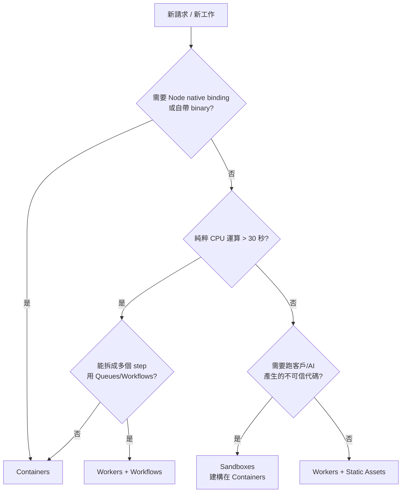

# Workers、Pages 與 Containers：三層 compute 怎麼選

Cloudflare 的 compute 從 2024 年那種「Workers[^workers] 跑 API、Pages[^pages] 跑前端」的乾淨二分法，到 2026 年 4 月已經完全變形。Workers 自己長出了靜態資產與全棧能力，Pages 進入「維持現狀、不再投資」的尾聲，而 2026-04-13 GA 的 Containers[^containers] 把「我就是要跑一個完整 Node / Python 程序」這條路補了起來。對 indie SaaS 來說，問題不再是「我要用哪個產品」，而是「同一個應用裡，哪一段該丟到哪一層」。

## TL;DR

- 新專案預設用 **Workers + Static Assets**（不要再開 Pages）：靜態檔零成本、SSR[^ssr] 與 API 同一份 worker，Durable Objects[^durable-objects]、Cron、Queues[^queues] 等 binding[^binding] 都齊；Pages 在 2025 年起就是「Workers 收編 Pages 功能」而不是反過來。
- Workers 限制要分清楚：**128 MB 記憶體**、**Free 10ms / Paid 預設 30s、最多 5 分鐘 CPU**，但 **wall-clock time 沒有硬上限**（只要 client 還在連著）。撞到天花板的通常是「CPU 重活」與「Node native 模組[^native-binding]」，不是「請求太久」。
- 2026-04 GA 的 **Containers** 解決三件事：跑任何 Docker[^docker] image、用整個 Node/Python 生態、執行客戶上傳的不可信代碼。代價是必須 Workers Paid（$5/月含 25 GiB-h 記憶體 + 375 vCPU-min），每個 container 綁一個 Durable Object，閒置 `sleepAfter` 預設 10 分鐘後睡掉。

## 三層各自的物理事實

Workers 跑在 V8 isolate[^v8-isolate] 裡，這不是「快一點的容器」，是另一個物種。沒有 VM 開機、沒有 OS 載入、沒有 runtime 初始化，新 isolate 在已經跑著的 Node 進程裡建出來，p99 冷啟在 2–5 ms 量級——對比 AWS Lambda[^lambda] 在 us-east-1 量到的 280 ms 平均、安靜段後可飆到 500 ms+，是兩個不同數量級。代價是你拿到的不是一台機器：128 MB 記憶體、單執行緒、不能開 socket、不能跑 fork、不能 require 任何依賴 Node native binding 的 npm 套件，除非走 `nodejs_compat` flag[^nodejs-compat] 而且該模組在 workerd[^workerd] 已實作的子集內。

Pages 在 2026 年的物理事實是：底層其實就是 Workers，加上 Git 連動、自動 framework 偵測、Pages Functions（本質是路由到 worker）。Cloudflare 自己的話是「going forward, all of our investment, optimizations, and feature work will be dedicated to improving Workers」——Pages 不會被砍，但 Secrets Store、Workflows、Containers 等新功能直接跳過 Pages 只在 Workers 出。對 2026 年新開的專案，這是個明確訊號。

Containers 是把一個 Docker image 部署到 Cloudflare 邊緣，每個 container 實例由一個 Durable Object 路由與管理，請求路徑是「User → Worker → Durable Object → Container」。配置上有六個固定 instance type 從 lite（1/16 vCPU、256 MiB 記憶體、2 GB 磁碟）一路到 standard-4（4 vCPU、12 GiB、20 GB），按 active CPU 每 10 ms 計費，閒置 `sleepAfter`（預設 10 分鐘）之後 SIGTERM、再 15 分鐘 SIGKILL。下次起來磁碟是乾淨的——不要把它當持久化儲存用，那是 R2 / D1 的工作。

## Workers 自己能撐到哪裡

Workers 撐得住的範圍比 indie 直覺以為的大很多。`nodejs_compat` 在 2025–2026 年補上了 Buffer、EventEmitter、stream、node:crypto 等大宗模組，Hono[^hono]、Drizzle、Postgres.js（搭 Hyperdrive[^hyperdrive]）、@auth/core、Stripe SDK 都跑得起來。React Router v7（前 Remix）、Astro、Vue、Nuxt、SvelteKit 已 GA 在 Workers 上跑全棧，Cloudflare Vite plugin v1.0 是現在推薦的開發路徑。Static assets 走 Worker 的請求是免費的，只有 worker 程式碼真正執行才計費——這把「shadcn/ui + API + 邊緣 KV[^kv]」這種典型 indie 配置的成本壓到趨近於 $5 月費的固定成本。

撞牆的位置很具體。**重 CPU 任務**（圖像處理、PDF 生成、ffmpeg[^ffmpeg]、puppeteer headless browser[^headless-browser]、Sharp 的某些路徑）會吃掉 30 秒預設 CPU 上限——可以調到 5 分鐘但這是 2025-03 才推出的，免費版仍是 10 ms。**128 MB 記憶體**對 LLM 推理 batch、大型 JSON 處理會卡。**沒有 raw TCP socket**意味著沒辦法跑某些自架的東西（雖然 2024 起有 `connect()` API 在解這題）。**Node native binding**——any package with `.node` files——直接陣亡。我看到 indie 在 Workers 上最常踩到的是「想跑 Playwright[^playwright]」「想跑 LibreOffice 轉檔」「想跑某個只發 Node 套件的舊版 SDK」這三類；前兩個現在的乾淨答案就是 Containers，第三個通常 `nodejs_compat` 能救但要試。

另一個容易混淆的點：wall-clock time 沒有硬上限。一個 Worker 可以慢慢拉一個 30 秒才回完的 SSE，只要 client 還在、I/O 等待不算 CPU，這條完全合法且不額外計費——Cloudflare 2023 年改的計費模式就是「never pay to wait on I/O」。所以「我有個 LLM streaming」「我要 long polling」這種需求不需要 Container，Worker 本身就吃得下。真正的判準是：你的 30 秒裡面有多少是 CPU 跑數字，不是總時長。

## Pages 還剩什麼角色

直接說：2026 年新開專案不要用 Pages。把 Pages 留給兩種場景。

第一種是純靜態站、只有 `index.html` + 少量 JS、從 GitHub push 就部署、永遠不會長出 backend——個人 blog、文件站、landing page。這時候 Pages 的「自動偵測 SPA / 標準站、Early Hints、零配置」確實比 Workers 的 wrangler.jsonc 好。但成本沒有差別、能力沒有差別，這是純粹的「哪個比較順手」之爭。

第二種是已經跑在 Pages 上的舊專案。Cloudflare 沒有 deprecate Pages，遷移是「optional」而不是「mandatory」，所以「正在賺錢的東西不要動」這條原則照舊適用。但只要你想加 Cron Trigger[^cron-triggers]、Durable Objects 直接 binding（不是繞 service binding[^service-binding]）、Workflows[^workflows]、Containers、Secrets Store，這些 Pages 就拿不到——這是該排遷移的訊號。

換句話說，Pages 不是「比較簡單的 Workers」，是「凍結在某個時間點的 Workers 子集」。新專案直接從 Workers + Static Assets 開始，少一次遷移。

## Containers 解了什麼問題、代價是什麼

Containers GA 對 indie 的價值是把「跑不可信代碼 / 完整 Node 生態 / 自帶 binary」這三類過去要丟到 Render / Fly.io / Railway 的工作搬回 Cloudflare 邊緣。三個典型場景：

跑客戶上傳的代碼。這是 Sandboxes[^sandboxes] 的主場（Sandbox SDK 是建在 Containers 上的薄層，給 AI agent 用），但即便不是 AI agent 場景，「我要讓使用者上傳 Python script、安全地跑、回結果」這種 SaaS（試想 Replit-lite、Jupyter clone、低代碼工具的 custom action）以前要自己拼 firecracker[^firecracker] / gVisor，現在 `npm i @cloudflare/sandbox` 就有。

跑重 binary。FFmpeg 轉檔、Chromium screenshot、PDF 生成、ML 推理（小模型，大的還是去 Workers AI[^workers-ai]）。Worker 接請求做 auth + 計費 + 排程，把實際工作 dispatch 給對應的 Container instance。

跑「就是要完整 Node」的舊套件。某些 npm 套件深度依賴 fs / native module / 子程序，重寫不划算的時候，包成 image 推上去。

代價分四層。第一，必須 Workers Paid plan，$5/月起跳——免費仔不能用。第二，計費按 active CPU 每 10 ms：$5 plan 含 25 GiB-h 記憶體、375 vCPU-min、200 GB-h 磁碟，超出後 vCPU-second $0.000020、GiB-second $0.0000025、GB-second $0.00000007。第三，每個 container 綁一個 Durable Object，這是好事（拿到全球可路由 ID、persistent state hook）但也代表你的心智模型要把 DO 學起來。第四，磁碟會在 sleep 後清空，所有「需要保留」的東西必須寫到 R2 或 D1——把 Container 當 stateless compute 看待。

那「我整個 SaaS 都用 Container 跑不就好了？」可以，但會回到 AWS Lambda 那種冷啟代價（容器啟動量級在數百毫秒到秒），失去 Workers 全球 V8 isolate 的延遲優勢。Cloudflare 的隱含建議是：**Worker 當路由與接面、Container 當重活的後段**，混合用而不是二選一。

## 怎麼選：一個粗糙但有用的決策樹

實務上 90% 的 indie SaaS 路徑落在最右邊那條：Workers + Static Assets 一份 worker 把前端、API、SSR 都收掉。少數需要 Container 的工作（一週一次的批次轉檔、某個 endpoint 要跑 Chromium）作為旁支，由主 Worker fetch 進去。Pages 在新專案的清單裡可以直接劃掉。

判斷時間點不要看「我未來會不會」，看「**現在這週的 issue list 裡有沒有**」需要 Container 的事情。Workers 的 5 分鐘 CPU 上限、`nodejs_compat` 的擴張、Hyperdrive 對 Postgres 的 pooling，把過去三年「我可能哪天會用到 Container」的場景持續往後推。先用 Worker 撐，撞牆的時候再加 Container——而不是反過來，因為 Container 不會給你 V8 isolate 的延遲與成本曲線。

截至 2026-04-26，Containers 的 active CPU 計費、6 個 instance type、`sleepAfter` 預設 10 分鐘、Workers 的 128 MB / 5 min CPU 等數字都來自 Cloudflare 官方 docs；indie 該追蹤的下一個 milestone 是 Workers 的 GPU binding（目前還是 Workers AI 的代理形式，不是直接 GPU container）與 Containers 在 Free plan 開放（目前明確只在 Paid）。

---

[^workers]: Cloudflare Workers 是 Cloudflare 的無伺服器運算產品，跑在全球 330+ 邊緣節點、由 V8 isolate 提供毫秒級啟動，是整個 Cloudflare 開發者平台的入口點。
[^pages]: Cloudflare Pages 是 Cloudflare 在 2021 年推出的靜態站與前端部署產品，底層其實就是 Workers 加 Git 連動。Cloudflare 已宣布所有新功能投入 Workers，Pages 進入維持現狀階段。
[^containers]: Cloudflare Containers 在 2026-04-13 GA，讓任意 Docker image 部署到 Cloudflare 邊緣，由 Worker 路由、由 Durable Objects 管生命週期，補上 Workers 跑不了 ffmpeg、Chromium、native binding 套件的缺口。
[^ssr]: SSR（Server-Side Rendering）指網頁在 server 上組好 HTML 再送給瀏覽器，相對於 SPA（client-side rendering）有更好的首屏速度與 SEO。Next.js、Remix、Nuxt 等框架都以 SSR 為核心。
[^durable-objects]: Cloudflare Durable Objects 是「全球可定址的單執行緒 stateful 物件」，每顆都有自己的記憶體與 SQLite，全球只會有一份在跑——避免多寫衝突的同時提供 strong consistency。
[^queues]: Cloudflare Queues 是 Cloudflare 的訊息佇列服務，提供 at-least-once delivery 與 batching，給 Worker 用來解耦長任務、做重試、削峰，對應 AWS SQS。
[^binding]: Binding 是 Cloudflare Workers 的核心抽象——把外部資源（D1、R2、KV、Queues、另一個 Worker）以變數形式注入 Worker 的環境物件，呼叫起來像本地物件而不是 HTTP API，省下 auth 與序列化的功夫。
[^native-binding]: Native binding 指 npm 套件中編譯為 C/C++ binary 的部分（檔名常為 `.node`），這類模組需要作業系統與 CPU 架構支援，跑不在 V8 isolate 那種純 JavaScript 沙箱裡——所以含 native binding 的套件在 Workers 上會失敗。
[^docker]: Docker 是把應用程式與其執行環境打包成標準化映像（image）的容器化技術，2013 年起成為部署事實標準。Cloudflare Containers 用的是 OCI image 格式，可以接受 `Dockerfile` 建出來的 image。
[^v8-isolate]: V8 是 Chrome 與 Node.js 的 JavaScript 引擎，isolate 是它提供的輕量沙箱——一個 Node 程序能容納上千個 isolate，啟動只要幾毫秒。Cloudflare 用它取代容器，這是「零冷啟」的物理基礎。
[^lambda]: AWS Lambda 是 Amazon Web Services 的無伺服器運算服務，2014 年發表，是無伺服器運算的鼻祖。基於容器架構，冷啟動延遲在 200–500 ms 量級。
[^nodejs-compat]: `nodejs_compat` 是 Workers 的相容性 flag，讓 Worker 能 import 部分 Node.js 內建模組（Buffer、stream、crypto 等）。Cloudflare 自家的 workerd runtime 在 2025–2026 大幅補齊這個子集。
[^workerd]: workerd 是 Cloudflare 開源的 JavaScript / WebAssembly server runtime，本地版就是 Wrangler dev mode 跑的東西，Cloudflare 自家 production 也跑同一份代碼。決定 Workers 能用哪些 Node API 的就是它。
[^hono]: Hono 是輕量化的 Web framework，主打跨 runtime（Cloudflare Workers、Bun、Deno、Node、AWS Lambda），API 風格類似 Express / Koa 但體積小、效能高，是寫 Workers API 的常見首選。
[^hyperdrive]: Cloudflare Hyperdrive 是「給 Worker 用的 Postgres 連線池與快取」，把外接 Neon、Supabase、RDS 的 Postgres 連線變得低延遲、可長連線。
[^kv]: Workers KV 是 Cloudflare 的全球分散式鍵值儲存，特性是讀超便宜、寫昂貴、最終一致性，適合做 feature flag、session token、CDN 級的設定快取。
[^ffmpeg]: FFmpeg 是開源跨平台多媒體處理工具，能轉碼、剪輯、混音幾乎所有格式的影片與音訊，是後端做媒體處理的事實標準——但因為是 native binary，在 Workers 跑不了，是 Containers 出現的常見動機之一。
[^headless-browser]: Headless browser 指沒有 GUI 的瀏覽器，用程式控制做網頁截圖、PDF 生成、爬蟲、自動化測試。Puppeteer（Chrome）與 Playwright（多瀏覽器）是兩個主流套件。
[^playwright]: Playwright 是 Microsoft 開發的跨瀏覽器自動化套件，繼承 Puppeteer 思路但支援 Chromium、Firefox、WebKit，是 e2e 測試與爬蟲的主力工具。底層需要 Chromium binary，Workers 跑不了。
[^cron-triggers]: Cron Triggers 是 Cloudflare Workers 的排程功能，用 cron 表達式設定 Worker 在特定時間自動執行，最細粒度 1 分鐘，適合定期報表、清理、同步。
[^service-binding]: Service Binding 是 Cloudflare Workers 之間互呼叫的機制，A Worker 可以把 B Worker 當成本地物件呼叫，比走 HTTP 省一次網路 round trip，也更安全（不必透過公開 URL）。
[^workflows]: Cloudflare Workflows 是 2025 年推出的長任務編排服務，把多步驟、可重試、可暫停的工作流程包成 Worker 友善的 SDK，補上 Workers CPU 上限以外的「分散式長任務」場景。
[^sandboxes]: Cloudflare Sandboxes 是建在 Containers 之上的 SDK，給 AI agent 一個可重啟的 Linux 容器，安全執行使用者上傳或 AI 自寫的程式，2026-04 GA。
[^firecracker]: Firecracker 是 Amazon 開源的微虛擬機（microVM）技術，本來給 Lambda 與 Fargate 用，啟動只要 125 毫秒。要自己做 sandbox 平台時，Firecracker / gVisor 是最常被拿出來自架的工具——但維運極複雜，現在 Sandboxes 把這層收掉。
[^workers-ai]: Cloudflare Workers AI 是在 Cloudflare 邊緣 GPU 上跑開源模型的推理服務，零 API key、和 Worker 同網路，10,000 Neurons/day 免費。

## 來源

- [Containers and Sandboxes are now generally available — Cloudflare changelog (2026-04-13)](https://developers.cloudflare.com/changelog/post/2026-04-13-containers-sandbox-ga/)
- [Pricing · Cloudflare Containers docs](https://developers.cloudflare.com/containers/pricing/)
- [Limits · Cloudflare Workers docs](https://developers.cloudflare.com/workers/platform/limits/)
- [Migrate from Pages to Workers · Cloudflare Workers docs](https://developers.cloudflare.com/workers/static-assets/migration-guides/migrate-from-pages/)
- [Lifecycle of a Container · Cloudflare Containers docs](https://developers.cloudflare.com/containers/platform-details/architecture/)
- [Your frontend, backend, and database — now in one Cloudflare Worker — Cloudflare blog](https://blog.cloudflare.com/full-stack-development-on-cloudflare-workers/)
- [Run Workers for up to 5 minutes of CPU-time — Cloudflare changelog (2025-03-25)](https://developers.cloudflare.com/changelog/post/2025-03-25-higher-cpu-limits/)
