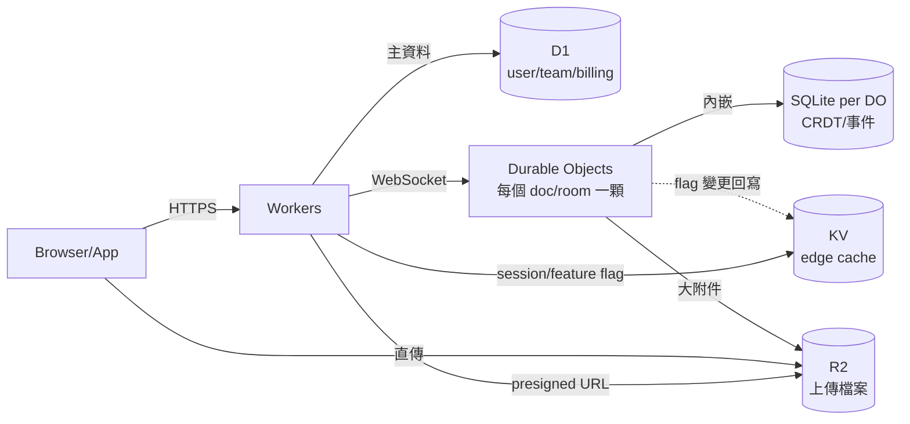

# D1、R2、KV 與 Durable Objects：儲存四件套各自的甜蜜點

## TL;DR

- **D1**[^d1] 是「批次性 dashboard 後端的關聯資料庫」：5GB 含在 Paid、單庫硬上限 10GB、每月 25B reads + 50M writes 額度，適合放使用者帳號、訂單、文章、訂閱這種規模可預期、查詢以 SQL 為主的核心資料；要過 10GB 必須自己分庫[^sharding]，Cloudflare 沒有 managed sharding。
- **R2**[^r2] 是「永久零 egress[^egress] 的 S3[^s3]」：$0.015/GB-月、Class A $4.50/M、Class B $0.36/M，10GB 免費，所有出站流量永遠不收費——使用者上傳、頭像、PDF、影片縮圖一律丟這。一個常見錯誤是讓 Worker 中繼整顆檔案，正解是 Worker 簽 presigned URL[^presigned-url] 然後讓瀏覽器直傳。
- **KV**[^kv] 是「眼前讀超兇、寫一天幾次的 config / session」：寫一次最多要等 60 秒才全球可見、每個 key 寫入 rate cap 1/秒，**不是資料庫**；feature flag[^feature-flag]、API key 查找、暫存的 session token 是甜蜜點，把 user profile 放進來會被反咬。
- **Durable Objects**[^durable-objects] 是「per-tenant[^per-tenant] 的單執行緒 stateful server」：每顆內建 SQLite[^sqlite] + 10GB、WebSocket hibernation[^websocket-hibernation]、要求嚴格序列化；多人協作、聊天室、per-user feature flag aggregator、即時白板都是甜蜜點，但 SQLite 計費 2026-01-07 才開啟，且每顆 DO 約 1,000 req/s 軟上限。

截至 2026-04，所有定價、限制以官方文件為準。

## D1：給你的關聯主資料庫，但別當「無限」用

D1 是 Cloudflare 在 Workers 之上跑的 SQLite-as-a-service。技術上它**就是** SQLite——Worker 透過 binding[^binding] 對某顆 D1 database 發 query，背後是一顆 Durable Object 在某個地理區裝載 SQLite 檔案，加上時間點 PITR[^pitr]、複本（read replicas）與 Smart Placement[^smart-placement] 把 Worker 拉到主庫旁邊。

對 indie SaaS，D1 真正能用的範圍可以這樣界定：

- **規模**：單庫 10GB **是硬上限，不能加大**——這是被罵最多的點。Paid plan 一個帳號可以開到 50,000 個資料庫，因此 Cloudflare 的官方答案是「水平切」：每個 tenant、每個 workspace、每個 region 一顆。對 100% 的 indie SaaS 來說，10GB 在前 1–3 年都裝不滿；但你必須一開始就決定「我永遠用一顆主庫」還是「我為每個 workspace 開一顆」，事後改 schema 痛苦遠比 PostgreSQL 多。([D1 limits](https://developers.cloudflare.com/d1/platform/limits/))
- **計費**：Free tier 5M reads + 100K writes /day、5GB；Paid tier 包進去 25B reads + 50M writes /月、5GB 儲存，超量 $0.001/M reads、$1/M writes、$0.75/GB-月。對 SaaS 的意義是：**讀超便宜，寫不便宜，儲存不便宜**——25 億 reads 大概等於每月 1 萬 DAU 每人一天打 80 次 query，indie SaaS 在這個量級之前讀不要錢。([D1 pricing](https://developers.cloudflare.com/d1/platform/pricing/))
- **Query 限制**：單 statement 100KB、單 query 30 秒、最多 100 個 bound parameter、每張表 100 column。對 OLTP 完全足夠，對「寫個 100 column 的寬表 dump 然後跑分析」會撞牆——分析請丟 R2 + DuckDB。

何時別用 D1：

1. 你需要 Postgres-only feature（PostGIS[^postgis]、pg_vector[^pgvector]、JSONB GIN、邏輯複製、stored procedure）→ 走 Hyperdrive[^hyperdrive] + Neon[^neon]/Supabase[^supabase]。
2. 單表預期超過 10GB 又不想 sharding（時序資料、log、event）→ 改用 R2 + Parquet[^parquet] 或外部 OLAP[^olap]。
3. 重度 OLAP / 需要 window function 跑數百萬列 → SQLite 有 window function 但不擅長這量級，30 秒會被 timeout 切。

D1 的甜蜜點，是「2026 年的 indie SaaS 之 default Postgres」——只是你心裡要先記得它叫 SQLite，而且永遠別讓單庫貼著 10GB 跑。

## R2：零 egress 把儲存定價邏輯拆了

R2 在 indie SaaS 心智裡的位置很單純：**所有「不是用來查詢的 bytes」都丟這**。包括但不限於——使用者上傳的圖片、頭像、附件、生成的 PDF、影片轉碼產物、備份 dump、Postgres 的 logical export、CSV、靜態 build artifact、AI 模型權重、訓練資料。

它跟 S3 的差距，三件事：

1. **egress 永遠免費**——透過 Workers API、S3 API、`r2.dev` 公開網域、自訂網域出去的 byte 都不收。對影片站、圖庫、download-heavy 應用，這條等於把 AWS 三大費率裡最貴一條砍掉。([R2 pricing](https://developers.cloudflare.com/r2/pricing/))
2. **API 是 S3-compatible**——你的 `aws-sdk`、`boto3`、`rclone`、`s3fs` 全部能用；presigned URL 直接走 SigV4[^sigv4]。
3. **Standard $0.015/GB-月**（S3 Standard 大約 $0.023）、Class A $4.50/M（PUT/COPY/POST/LIST，S3 大約 $5）、Class B $0.36/M（GET/HEAD，S3 大約 $0.40）。儲存便宜一點、操作費差不多、egress 是真正的差距。Free tier 10GB-月、1M Class A、10M Class B。

對 indie SaaS 真正關鍵的架構規矩：**Worker 不要中繼整顆檔案**。Worker 有 128MB 記憶體與 streaming 限制，遇到 100MB 影片會炸。正確做法是讓使用者瀏覽器直接 PUT 到 R2 的 presigned URL，Worker 只負責 (a) 驗權限 (b) 簽 URL (c) 上傳完成後寫一筆 metadata 到 D1。Cloudflare 官方參考架構就是這個 pattern。([Storing user generated content](https://developers.cloudflare.com/reference-architecture/diagrams/storage/storing-user-generated-content/))

雷區：

- **Infrequent Access tier** ($0.01/GB-月、Class A 翻倍 $9.00/M、Class B 翻倍 $0.90/M) **強制 30 天最少存放**，提早刪也照收。冷資料才丟、不要把 hot upload 誤丟進去。
- **不在歐盟主權邊界內**——歐洲客戶要 data residency[^data-residency]、要 GDPR[^gdpr] Schrems II 想得乾淨的，仍要評估 R2 的 EU jurisdiction 設定，或乾脆走 Scaleway/Hetzner S3。
- 2025-02-06 R2 發生過 59 分鐘 outage（人為誤操作關掉 R2 Gateway，無資料損失）；2026 也有區域性事件。物件儲存「絕對不可離線」的應用要評估 cross-region 備份策略。([Cloudflare incident on February 6, 2025](https://blog.cloudflare.com/cloudflare-incident-on-february-6-2025/))

## KV：把它當 cache，不要當 DB

Workers KV 是被新手誤用最多的那個——名字像資料庫，行為像 CDN cache。

它真正的特性：

- **eventually consistent**，每筆寫入要 60 秒以上才在所有 PoP 一致（2026-01 把最低 cacheTtl 從 60s 降到 30s，但底層 propagation 還是 60s 量級）。([KV FAQ](https://developers.cloudflare.com/kv/reference/faq/))
- **每個 key 1 write/秒**——同 key 高頻寫會被 throttle。
- **計費**：$0.50/GB-月、reads $0.50/M（10M 免費）、writes $5/M（1M 免費）、deletes / list 同 writes 費率。對比 D1 寫入單價是它的 1/5，**寫多絕對不選 KV**。([KV pricing](https://developers.cloudflare.com/kv/platform/pricing/))

什麼時候 KV 是甜蜜點：

- **Feature flag 的 read-through cache**——Cloudflare 自家 Flagship 就是 DO 寫真值、KV 做全球邊緣讀取。([Flagship blog](https://blog.cloudflare.com/flagship/))
- **Session token 查找**（一次寫、之後純讀直到過期）。
- **API key / 路由表 / robots policy / 短網址映射**——讀爆、寫罕見、不怕 60 秒延遲。
- **Edge config**——A/B 測試[^ab-test] bucket、地區性內容開關。

什麼時候別用 KV：

- 使用者 profile（要 immediate consistency 才不會「我剛改密碼但 60 秒內還能用舊的」）。
- 任何「讀剛寫進去的東西」的 read-after-write[^read-after-write] 場景。
- 計數器、leaderboard、限流——寫太頻繁、又有單 key 1 write/s 上限。

簡言之：**KV ≠ Redis**[^redis]。要 Redis 行為（counter、TTL precise、atomic INCR、pub/sub），用 Durable Objects 包一顆 in-memory counter，或上 Upstash Redis。

## Durable Objects：per-tenant 的「世界上有無限多顆 SQLite 主機」

DO 是這四件套裡最強、也最容易被誤解的。Lambros Petrou 給它的精準描述是「unlimited single-threaded servers spread across the world」——你可以程式化開無限顆，每顆是一台單執行緒 server，自帶 in-memory state 和持久化 SQLite，sticky 跑在某個地理區。([Lambros Petrou: Durable Objects](https://www.lambrospetrou.com/articles/durable-objects-cloudflare/))

關鍵特性與 2026-04 現況：

- **每顆 DO 一個 SQLite**——v2 SQLite-backed 是 GA 預設後端，每顆 10GB（從 beta 1GB 升上來）；帳號層級無上限。SQLite 跑在 DO 同 thread，query 等於本機呼叫，**zero-latency**。([sqlite-in-durable-objects blog](https://blog.cloudflare.com/sqlite-in-durable-objects/))
- **WebSocket Hibernation**——閒置時 DO 進睡眠、TCP 仍掛著，醒來不收 duration 費用。對「百萬使用者各掛一個 DO」是關鍵省成本機制。
- **計費**：Paid 1M req + $0.15/M、400K GB-s + $12.50/M；SQLite 跟 D1 同價（25B reads + 50M writes free、超量同 D1 費率）；**SQLite 儲存從 2026-01-07 才正式開始計費**，5GB-月 included、超量 $0.20/GB-月。([DO pricing](https://developers.cloudflare.com/durable-objects/platform/pricing/) ⋅ [SQLite billing changelog](https://developers.cloudflare.com/changelog/2025-12-12-durable-objects-sqlite-storage-billing/))
- **單 DO 軟上限約 1,000 req/s**——超過要 sharding（分多個 DO instance）。

甜蜜點：

- **多人即時協作**（Figma-like、Notion-like、Cursor-like、白板、Excalidraw）——用 DO 當「文件級協調器」，一個 doc 一個 DO，WebSocket[^websocket] 全進去，CRDT[^crdt] 的 server-side authoritative 直接存 SQLite。
- **聊天室 / 多人遊戲房**——一個 room 一個 DO，hibernation 讓 99% 閒置 room 不收費。
- **per-user inbox / 通知中心**——一個 user 一個 DO，能保證訊息順序，不用 Redis stream。
- **per-tenant 計費 ledger**——sequential ordering 是寶；單執行緒讓你不用搞 SELECT FOR UPDATE。
- **rate limiter / counter**——一個 key 一個 DO，atomic increment 內建。

雷區：

- **單顆 1,000 req/s 是硬瓶頸**——熱點 tenant（一個 webhook 客戶突然 burst）會卡。要設計分片 fallback。
- **128MB 記憶體**（與 Worker 同上限）——別把整個 SQLite 表 load 進記憶體，相信 SQLite query planner。
- **lock-in 最深**——D1 還能 export SQLite 檔案、R2 是 S3-compat、KV 大不了拋掉重寫；DO 是 Cloudflare 獨家 primitive，遷出要重寫架構（盲點之三請見第 6 篇）。
- **SQLite 計費剛啟用**（2026-01-07）——之前免費的 GB-month 現在開始算錢。如果你 2025 拿 DO 當無上限 KV 塞，2026 要重新審帳單。

## 兩個典型 indie SaaS 架構：怎麼把四件套配起來

把上面的甜蜜點落地成兩個常見產品線。

### 架構 A：典型 dashboard SaaS（Linear-like、Notion-lite、Figma 類）

- **D1**：放使用者、團隊、訂閱、帳單明細這種交易性 schema；query 大多是 dashboard 列表頁。
- **R2**：放使用者上傳——文件附件、頭像、export 過的 PDF；瀏覽器直傳走 presigned URL。
- **KV**：feature flag 與 session（DO 寫真值、KV 是 read-through）；route map。
- **Durable Objects**：協作型 doc 一個 DO，WebSocket hibernation 把閒置 room 收費降到接近零；CRDT op 直接存 DO 內嵌 SQLite。

什麼時候會壞：D1 主庫的 user 表逼近 10GB（量級 = 千萬 row 級）→ 你會被迫 shard，不要拖到那時才想。

### 架構 B：使用者上傳重 + AI 處理（影片站、圖庫、AI 工具站）

- **R2**：是主角。使用者瀏覽器簽 URL 直傳，所有原始 / 處理過的 binary 都在這。零 egress 對影片站是命門。
- **D1**：只放 metadata（上傳者、檔名、tag、可見性、轉碼狀態）；不在 D1 存任何 BLOB。
- **DO**：每個處理任務一個 DO，當 finite-state-machine——upload → transcode queue → AI inference → done。DO 的 sequential 性質讓你不用 Redis 做 job queue。
- **KV**：edge cache 一些「公開影片的 metadata snapshot」，CDN 化前端列表頁。

兩個架構的共同心法：**D1 = transactional metadata、R2 = bytes、KV = read-mostly cache、DO = stateful coordinator**。把每樣東西放對抽屜，整個 stack 在 $5 Workers Paid + 用量超出後的階梯計費下，一個 indie SaaS 走到月活幾千、營收幾千美的階段，**月費極可能還在 $20–$50 內**——詳細成本曲線交給第 5 篇展開。

---

[^d1]: Cloudflare D1 是把 SQLite 包成託管服務的關聯式資料庫，跑在 Durable Objects 之上、跟 Worker 同網路。Free tier 5GB、Workers Paid 含 25B reads + 50M writes/月、單庫硬上限 10GB。
[^r2]: Cloudflare R2 是與 Amazon S3 API 相容的物件儲存服務，最大特色是 egress 永久免費。儲存價格約 $0.015/GB-月，對影片、圖庫、下載類應用是壓倒性的成本優勢。
[^kv]: Workers KV 是 Cloudflare 的全球分散式鍵值儲存，特性是讀超便宜、寫昂貴、最終一致性，適合做 feature flag、session token、CDN 級的設定快取。
[^durable-objects]: Cloudflare Durable Objects 是「全球可定址的單執行緒 stateful 物件」，每顆都有自己的記憶體與 SQLite，全球只會有一份在跑，避免多寫衝突的同時提供 strong consistency。
[^egress]: Egress 指資料從雲端服務出站到外部網路的流量。傳統雲端供應商按 GB 收費，是雲端帳單裡最不可預測、最容易爆掉的一項。
[^s3]: Amazon S3（Simple Storage Service）是 AWS 在 2006 年推出的物件儲存服務，是雲端時代第一個爆紅的服務，「S3 相容 API」幾乎是物件儲存產業的事實標準介面。
[^sharding]: Sharding 指把一個資料庫水平切成多個分庫，每個分庫負責一部分資料（通常依 user ID、region 等 key 切）。能突破單庫容量上限，代價是 cross-shard 查詢變難、應用層要管路由。
[^presigned-url]: Presigned URL 是「帶有時效簽名的 URL」，後端用 secret key 簽出來，前端拿著它就能在期限內直接 PUT / GET 物件儲存，不必每次都繞後端中繼。是 S3 / R2 的標準上傳模式。
[^feature-flag]: Feature flag（功能開關）是把功能開關寫在設定而不是寫死在 code 裡，讓上線、灰度、A/B、緊急回滾都不用重新部署。LaunchDarkly、Statsig、Cloudflare Flagship 都是這個產品類別。
[^per-tenant]: Per-tenant 指多租戶 SaaS 中，把資源（資料庫、Object、Worker）按租戶（tenant，通常是公司或工作區）切開的設計——每個租戶有自己的資源實例，避免資料外洩、方便獨立計費與限流。
[^sqlite]: SQLite 是嵌入式關聯式資料庫，一個檔案就是一座資料庫、不用獨立 server。輕量、可靠、SQL 支援度高，全球部署量比 PostgreSQL 加 MySQL 還多。
[^websocket-hibernation]: WebSocket Hibernation 是 Durable Objects 的特殊機制——閒置時 DO 進睡眠、不收費，但 TCP 連線仍掛著，client 送訊息時 DO 自動醒來。對「百萬使用者各掛一條 WebSocket」的應用是關鍵省成本機制。
[^binding]: Binding 是 Cloudflare Workers 的核心抽象，把外部資源（D1、R2、KV、Queues、另一個 Worker）以變數形式注入 Worker 環境，呼叫起來像本地物件。
[^pitr]: PITR（Point-In-Time Recovery）是「能把資料庫還原到任意過去某個時間點」的能力，背後通常是定期 snapshot 加上 WAL 重放。D1 給的 PITR 預設保留 30 天。
[^smart-placement]: Smart Placement 是 Cloudflare 自動把 Worker 部署到「最靠近其常呼叫資源（D1、外部 DB）」的 PoP，而不是預設「最靠近使用者」。對重 backend、輕前端的請求模式（B2B SaaS）特別有用。
[^postgis]: PostGIS 是 PostgreSQL 的地理空間擴充套件，提供地圖、座標、地理查詢能力。地圖類產品（外送、共享單車）幾乎都要 PostGIS。
[^pgvector]: pgvector 是 PostgreSQL 的向量搜尋擴充套件，把高維 embedding 存進 Postgres 並支援近似最近鄰查詢，是「不另外裝 Pinecone 也能做 RAG」的常見路徑。
[^hyperdrive]: Cloudflare Hyperdrive 是「給 Worker 用的 Postgres 連線池與快取」，把外接 Postgres 連線變得低延遲、可長連線。
[^neon]: Neon 是 serverless Postgres 服務商，2022 年成立，特色是儲存運算分離、可分支、按用量計費，被 Cloudflare 列為 Hyperdrive 的官方推薦 Postgres 後端。
[^supabase]: Supabase 是「開源 Firebase 替代品」，2020 年起以 Postgres 為核心打包 auth、storage、realtime、edge function 等服務，是 Cloudflare 之外另一個 indie 友善的全棧平台。
[^parquet]: Parquet 是 Apache 的欄式儲存格式，把同一欄的值連續存在一起、壓縮率高、掃描快，是大數據分析的事實標準格式（DuckDB、Spark、Athena 都讀它）。
[^olap]: OLAP（Online Analytical Processing）指分析型查詢——大量資料的彙總、分組、跨表計算，相對於 OLTP（交易型查詢）的「改一筆、讀一筆」。OLAP 工具有 ClickHouse、DuckDB、BigQuery 等。
[^sigv4]: SigV4（AWS Signature Version 4）是 AWS 的請求簽名規範，把存取金鑰、時間戳、region、service 等資訊做 HMAC 簽到請求 header 裡。R2 接受 SigV4 簽的請求，所以 AWS SDK 可以直接拿來用。
[^data-residency]: Data residency 指「資料必須留在特定地理區內」的合規要求，常見於歐盟 GDPR、中國個資法、加州 CCPA。雲端供應商通常要提供 region pinning 才能滿足這類客戶。
[^gdpr]: GDPR（General Data Protection Regulation）是歐盟 2018 年生效的個資保護法，違反可罰全球年營收 4%。Schrems II 是 2020 年的判決，限制了歐盟個資跨境到美國的合法性，讓美系雲端在歐洲銷售變複雜。
[^ab-test]: A/B 測試指「把使用者隨機分成兩組看不同版本，比較指標差異」的實驗方法，是產品決策的核心工具。在邊緣端做 A/B 分流要靠 KV 或 edge config 把分桶規則送到 PoP。
[^read-after-write]: Read-after-write 一致性指「我剛寫的東西，下一個讀請求能看到」。strong consistency 系統保證這條，eventual consistency 系統不保證——KV 屬於後者，所以「改密碼立刻登入」這類場景不能用 KV。
[^redis]: Redis 是 2009 年開源的記憶體鍵值資料庫，支援豐富資料結構（list、hash、set、sorted set）與 atomic 操作，是 cache、counter、queue、leaderboard 的事實標準。Upstash 把它包成 serverless 版本，可以在 Workers 用。
[^websocket]: WebSocket 是 HTML5 提供的全雙工通訊協定，client 與 server 建立一條長連線後雙向送訊息，常用於聊天、即時協作、遊戲、行情推送。
[^crdt]: CRDT（Conflict-Free Replicated Data Type）是一類「多端同時寫也能保證最終一致」的資料結構，是 Figma、Notion、Linear 等多人協作產品的核心技術，配 Durable Objects 用最順手。

## 來源（截至 2026-04-26）

- [Limits · Cloudflare D1 docs](https://developers.cloudflare.com/d1/platform/limits/)
- [Pricing · Cloudflare D1 docs](https://developers.cloudflare.com/d1/platform/pricing/)
- [Pricing · Cloudflare R2 docs](https://developers.cloudflare.com/r2/pricing/)
- [Storing user generated content · Cloudflare Reference Architecture](https://developers.cloudflare.com/reference-architecture/diagrams/storage/storing-user-generated-content/)
- [Pricing · Cloudflare Workers KV docs](https://developers.cloudflare.com/kv/platform/pricing/)
- [FAQ · Cloudflare Workers KV docs](https://developers.cloudflare.com/kv/reference/faq/)
- [Pricing · Cloudflare Durable Objects docs](https://developers.cloudflare.com/durable-objects/platform/pricing/)
- [SQLite-backed Durable Objects general limits](https://developers.cloudflare.com/durable-objects/platform/limits/)
- [Billing for SQLite Storage · Changelog](https://developers.cloudflare.com/changelog/2025-12-12-durable-objects-sqlite-storage-billing/)
- [Choosing a data or storage product · Cloudflare Workers docs](https://developers.cloudflare.com/workers/platform/storage-options/)
- [Zero-latency SQLite storage in every Durable Object · Cloudflare blog](https://blog.cloudflare.com/sqlite-in-durable-objects/)
- [Lambros Petrou — Durable Objects: Unlimited single-threaded servers spread across the world](https://www.lambrospetrou.com/articles/durable-objects-cloudflare/)
- [Building a feature flags service with Cloudflare Workers and Durable Objects · Lambros Petrou](https://www.lambrospetrou.com/articles/durable-objects-feature-flags/)
- [Introducing Flagship · Cloudflare blog](https://blog.cloudflare.com/flagship/)
- [Cloudflare incident on February 6, 2025 (R2 outage)](https://blog.cloudflare.com/cloudflare-incident-on-february-6-2025/)
