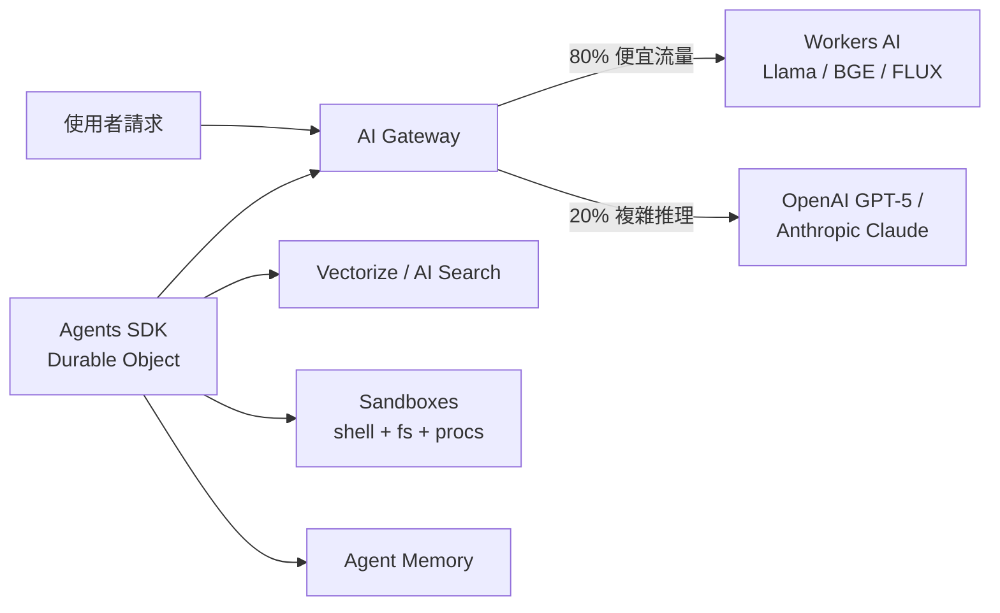

# 邊緣 AI 怎麼用：Workers AI、Vectorize、Agents SDK 的位置

2026 年 4 月，Cloudflare 在一週之內把「AI agent[^ai-agent] 該需要的東西」全部攤開：Sandboxes[^sandboxes] GA、Project Think[^project-think] 釋出、AI Search（前身 AutoRAG[^autorag]）正式整合、Agent Memory[^agent-memory] 上線、Workflows v2[^workflows] 拉到 50,000 並行、AI 推理層串 14 個以上的 provider，外加 Email Service 公測。把這些和 2025 年就在的 Workers AI[^workers-ai]、Vectorize[^vectorize]、AI Gateway[^ai-gateway]、Agents SDK[^agents-sdk] 拼起來，indie SaaS 第一次擁有一條從「呼叫一顆模型」走到「跑一個會記憶、會排程、會自己寫 code 的 agent」的單供應商路徑。

但「拼齊」不等於「最佳」。這一篇把這四個元件各自的甜蜜點、互補關係、與**該外接給 OpenAI / Anthropic 的決策點**講清楚——尤其別被「邊緣 AI 比較快」這個直覺騙了。所有資料截至 2026-04-26。

## TL;DR

- **Workers AI 的競爭力在每百萬 token[^token] 的成本與每天 10,000 Neuron[^neuron] 的免費額度，不在頂級智能**：Llama-3.1-70B 約 $0.29/M input、$2.25/M output（截至 2026-04，Cloudflare 官方定價頁），勝在零 API key、和 Worker 同 colo[^colo]；輸給 GPT-5 / Claude 的差距在複雜推理與工具呼叫品質，且 Cloudflare 自己 docs 也明說「Workers AI 跑在共享基礎建設、沒有 latency SLA[^latency-sla]」。
- **Vectorize + AI Search 解掉 indie 80% 的 RAG[^rag] 需求，但碰到「自選 embedding[^embedding]」「跨地區 data residency」「多模態」就會撞牆**：對 < 5M 向量、文字主導的 SaaS，5M stored / 30M queried 的免費額度 + 與 Worker 共網路是真甜；要做圖搜或要自己挑 embedding 模型，Pinecone[^pinecone] / Qdrant 仍合理。
- **AI Gateway 是這套堆疊裡最被低估的元件**——它讓你**用 Workers AI 跑 80% 的便宜流量、把貴的 20% fallback 到 GPT-5 / Claude**，而且 Free 100k logs / Workers Paid 1M logs 內幾乎免錢；這是 indie 在「不押注單一模型」前提下唯一便宜的觀測層。
- **Agents SDK + Sandboxes GA 把「stateful agent」這件事降到一個 Durable Object[^durable-objects] 起跳**：每個 agent 有自己的 SQLite、KV、WebSocket、scheduler，Sandboxes 再給它真 shell + filesystem 跑使用者上傳的程式；但要做出真的能用的 agent，外接 frontier model[^frontier-model] 仍是默認，Workers AI 主要是價格地板。

## Workers AI 的甜蜜點與不適合的場景

Workers AI 在 2026 年是 per-model pricing：定價頁明列各模型的 token / 圖像 / 音訊→Neuron 換算，再以 $0.011 / 1,000 Neurons 計費。每帳號每天送 10,000 Neurons 免費——這對 indie 等於「embedding 與 reranker 在 prototype 階段幾乎不用錢」。實測代表性數字（截至 2026-04）：

| 用途 | 模型 | 每百萬 token / 單位 |
| --- | --- | --- |
| 小模型生成 | Llama-3.2-1B | $0.027 input / $0.201 output |
| 主力中型生成 | Mistral-7B | $0.110 input / $0.190 output |
| 主力大模型 | Llama-3.1-70B | $0.293 input / $2.253 output |
| 文字 embedding | BGE-Small | $0.020 input |
| Reranker | BGE-Reranker | $0.003 input |
| 圖像生成 | FLUX-1-Schnell | $0.0000528 / 512×512 tile |

對照之下，OpenAI GPT-5.5（2026-04-23 發表，API 仍在排隊釋出）、Anthropic Claude Mythos 這種旗艦模型每百萬 output token 仍是兩位數美金等級。**結論：Workers AI 是價格地板，不是智能上限。**

甜蜜點很清楚：

1. **Embedding 與 reranker[^reranker]** — BGE-Small + BGE-Reranker 跟 Vectorize 同網路，幾乎不用錢、零外部 API key。一般 SaaS 把這兩件事丟給 OpenAI 是純粹浪費。
2. **分類、抽取、結構化解析** — Llama-3.2-1B 或 Mistral-7B 跑「這封 email 是不是 invoice、抽出金額」這類任務，每百萬 token 兩三毛美金；用 GPT-5 就是燒錢。
3. **批次背景任務** — 寫摘要、做標籤、生成 thumbnail captions。延遲不敏感、量大、容錯高。
4. **圖像生成的低成本選項** — FLUX-Schnell 一張 512×512 約 $0.000053，做 placeholder 圖、做縮圖足夠。

不適合的場景（Cloudflare 自己 docs 與獨立評測都點出來了）：

- **複雜推理、長 chain-of-thought[^chain-of-thought]、agent 工具呼叫**：Workers AI 沒有 GPT-5 / Claude 級別的模型 native；Llama-70B 與 frontier 之間在 Terminal-Bench 2.0[^terminal-bench] 這類 agent benchmark 上差距很大。
- **延遲敏感的對話**：Workers AI runs on shared infrastructure with no latency SLAs（官方原話）。Workers 本身是 V8 isolate 5ms 起步沒錯，但 GPU 推理的排隊與冷啟動不在這個保證裡。多家獨立評測也指出「邊緣推理對 LLM 來說 latency 收益其實邊際——你的 token 仍然是一個一個吐出來」。
- **要 fine-tune[^fine-tune] 或載自定 weight**：Workers AI 支援 LoRA[^lora]，但如果你需要完整 fine-tune 控制，回 Replicate / Together / 自架仍合理。

## Vectorize、AI Search 與 RAG 的甜蜜點

Vectorize 是 Cloudflare 的向量資料庫，定位是「跟 Worker 同網路、沒有外部 API call」。對照組：Pinecone Standard 起跳 $50/月 floor，無論你用多少。Vectorize 在 Workers Paid 上免費額度是 5M stored vector dimensions + 30M queried vector dimensions（截至 2026-04 docs 數字）。對 indie SaaS：5M 維度大致等於 5,000 篇長文、或 50,000 段 1024-dim 的 chunk，已足以撐到第一批付費客戶。

2026-04 Cloudflare 把 AutoRAG 改名 AI Search 並升級成「dynamic search instances + hybrid retrieval[^hybrid-retrieval] + relevance boosting」。對 indie 的意義：你不必自己拼 chunker[^chunker]、embedder、retriever、reranker、generator——丟一個 R2 bucket[^bucket] 進去，AI Search 自己 ingest、向量化、查詢、生成，期間都在 Cloudflare 內網跑。Beta 期間 AI Search 本身免費，僅按底層的 R2（10GB 免費後 $0.015/GB-月）、Vectorize、Workers AI、AI Gateway 計費，每帳號最多 10 個實例、單實例上限 100,000 檔。

什麼時候 Vectorize / AI Search 不夠？

- **Embedding 想自選**：Vectorize 本身可接任意 embedding，但 AI Search 早期版本綁定 Cloudflare 端的 embedder；要用 OpenAI text-embedding-3-large 或自家 fine-tune 的 model，得退回直接用 Vectorize、自己餵向量。
- **多模態（圖搜、影片搜）**：第三方評測指出 AI Search 預設 embedding 只支援文字。圖像 embedding 可以自己用 Workers AI 跑後存進 Vectorize，但等於回到自己拼 RAG。
- **嚴格資料駐留**：Vectorize 還沒納入 Cloudflare data location suite 的全部 region 矩陣（截至 2026-04 第三方文件）。歐洲 GDPR / 醫療 / 金融場景仍要查清楚。
- **大規模（>100M 向量）+ 嚴格 P99 延遲 SLA**：仍是 Pinecone / Qdrant Cloud 的場域。

簡單心智模型：**indie SaaS 文字主導 + < 1M 文件，AI Search 直接上；想自選 embedding 或要圖搜，用 Vectorize 自己拼；要做企業級嚴格 SLA，外接。**

## AI Gateway：被低估的「跨 provider 路由器」

AI Gateway 的定位常被講成「LLM 觀測 dashboard」，但對 indie 來說它真正的價值是**讓 multi-provider 策略幾乎免費**。截至 2026-04 的設計：

- **支援 provider**：Workers AI、OpenAI、Anthropic、Google Gemini、Replicate、Hugging Face、Perplexity、Groq 等十幾家。Agents Week 2026 的「AI Platform」更把推理層升級成 14+ provider 的統一 binding。
- **核心功能**：caching、rate limiting[^rate-limiting]、retry、**model fallback**、logging、real-time analytics。Fallback 設定一條 list：第一個 provider 出錯（429 / 5xx）就自動打第二、第三家。
- **計費**：Gateway 本體無 per-request 費；按 log 留存量計費。Free 100,000 logs、Workers Paid 1,000,000 logs（資料來源：Cloudflare AI Gateway pricing docs 與 truefoundry 整理，截至 2026-04）。**超過上限 log 會停止儲存**，這是硬上限不是 pay-as-you-go——log 量大的要排程清舊 log 或升級。
- **Unified Billing**（2026 新加）：可以把 OpenAI / Anthropic 的用量直接從 Cloudflare 帳單付，會收一筆小額便利費。對沒有公司信用卡的 solo dev 是福音。

對 indie 的策略含意：

1. **80/20 路由**：80% 流量（embedding、分類、摘要）打 Workers AI；20% 流量（複雜推理、最終生成）打 GPT-5 / Claude。Gateway 把這個切換從「應用層 if-else」變成「設定層」。
2. **fallback 不再是奢侈品**：以前要自己包 retry 邏輯，現在 Gateway 一條 list 就解決——OpenAI 出狀況自動走 Anthropic，反之亦然。對 indie 是上線可用度的便宜保險。
3. **快取等於現金**：對話應用裡常常同樣的 prompt 被觸發 N 次（系統 prompt、common queries）。Gateway cache 直接擋下，省的是真正的 OpenAI 帳單。

## Agents SDK + Sandboxes：拼湊「真正能用的 agent」

Agents SDK 的核心是 Durable Objects——「每個 agent 一個物件」，物件內含：

- **內建 SQL DB**（SQLite，跟 agent 綁同生命週期，不用另開 D1）。
- **KV state**，會自動 sync 到 connected client（WebSocket / SSE）。
- **Scheduler**：delayed、time-based、cron。
- **AIChatAgent base class**：把訊息歷史、系統 prompt、tool calling[^tool-calling] 包好。
- **Provider-agnostic**：starter 預設 Workers AI，但可以一行換成 OpenAI、Anthropic、Gemini。

2026-04 Agents Week 又補上：

- **Project Think**：下一代 SDK，加入 thinking、acting、persistence 三大原語；強調 sub-agent 協調與「讓 agent 自己寫 extension」。
- **Agent Memory**：managed 的長期記憶服務，免得自己拼 vector + 摘要 + 取回。
- **Sandboxes GA**：每個 agent 可以 spawn 一個真電腦——shell、filesystem、背景行程、PTY、檔案系統 watch、snapshot 復原、按 active CPU 計費。Figma Make 是已知 production 用戶（跑使用者上傳的程式碼）。
- **Workflows v2**：50,000 並行 step，給 long-running agent 用。
- **Browser Run**：Live View、Human-in-the-Loop[^hitl]、4× 並行；agent 操作真實瀏覽器的場景（自動化爬資料、跑 e2e 測試）變得實際。

對 indie SaaS 這意味著：以前要做一個「會記憶、會排程、會跑使用者程式」的 agent，得自己拼 Postgres + Redis + Sidekiq + Firecracker + LangChain。現在這四件事被收進 Cloudflare 一個 SDK + 一張帳單。**但別誤會——agent 的「智能」依然主要由你選哪一顆模型決定，不是由 SDK 決定。**

## 何時外接 GPT-5 / Claude？

這是這篇最重要的判斷題。建議流程：

1. **預設用 Workers AI 跑 embedding、reranker、分類、抽取、摘要**——這幾類任務 Llama / Mistral / BGE 已經夠好，每百萬 token 三毛到三美元。任何把這幾件事打到 GPT-5 的 indie SaaS 都是燒錢。
2. **使用者面對的「最終生成」與「複雜 agent 推理」打外接**——透過 AI Gateway 路由到 GPT-5 或 Claude。理由：Workers AI 在 frontier benchmark 上仍有顯著差距（Cloudflare 自己 docs 也說「最有能力的模型如 Claude / GPT-4 / Gemini 在 Workers AI 上不可用」）；對話式產品的品質落差使用者立刻感受得到。
3. **Multi-step agent 的「思考主迴圈」打外接、「工具與子任務」打 Workers AI**——Project Think 強調 sub-agent；可以讓 orchestrator 是 Claude / GPT-5、子 agent 是 Llama-70B 或 Mistral，靠 Gateway 切換。
4. **任何延遲 SLA 寫進合約的場景**——Workers AI 沒有延遲 SLA。直接外接到有 SLA 的 provider，或自架。
5. **要 fine-tune 控制**——Workers AI 有 LoRA，但要完整 fine-tune 走 Replicate / Together / 自架。

反過來說，**全押 Cloudflare 的場景**：純後端批次任務（embedding 大批量、文件分類管線）、原型期 < 100 DAU、預算極緊（免費額度撐住）。

[^ai-agent]: AI agent 指「能感知環境、做決策、執行動作、迭代修正」的 LLM 應用，相對於一次性的 chat completion，agent 會多輪呼叫工具、寫檔案、跑命令。Cursor、Claude Code、Devin 都屬於 agent。
[^sandboxes]: Cloudflare Sandboxes 是建在 Containers 之上的 SDK，給 AI agent 一個可重啟的 Linux 容器執行不可信代碼，2026-04 GA。
[^project-think]: Project Think 是 Cloudflare 在 2026 Agents Week 釋出的下一代 agent SDK，把 thinking、acting、persistence 三大原語抽象化，強調 sub-agent 協調與「讓 agent 自己寫 extension」。
[^autorag]: AutoRAG 是 Cloudflare 2024 年推出的 managed RAG 服務，2026-04 改名 AI Search 並重新整合，丟一個 R2 bucket 進去自動 ingest、向量化、查詢、生成。
[^agent-memory]: Agent Memory 是 Cloudflare 2026-04 推出的 managed 長期記憶服務，幫 agent 自動把對話、事件做向量化儲存與摘要取回，省掉自己拼 vector DB + 記憶策略的工。
[^workflows]: Cloudflare Workflows 是長任務編排服務，把多步驟、可重試、可暫停的流程包成 SDK；v2 把並行 step 拉到 50,000，給長 agent 用。
[^workers-ai]: Cloudflare Workers AI 是在 Cloudflare 邊緣 GPU 上跑開源模型的推理服務，零 API key、和 Worker 同網路。
[^vectorize]: Cloudflare Vectorize 是跟 Worker 同網路的向量資料庫，2026-04 Free 額度為 5M stored / 30M queried 維度，對比 Pinecone Standard $50/月起跳是接近免費的選項。
[^ai-gateway]: AI Gateway 是 Cloudflare 在 LLM 流量前加一層的代理服務，支援 14+ provider，提供 caching、rate limiting、retry、fallback、log 觀測。
[^agents-sdk]: Agents SDK 是 Cloudflare 2025 年推出的 stateful agent 框架，每個 agent 是一個 Durable Object，內建 SQLite、KV、scheduler、AIChatAgent base class。
[^token]: Token 是 LLM 計費與輸入長度的基本單位，大致是「一個英文字根、一個中文字、半個英文單字」。LLM 定價通常分 input / output token 兩個費率，後者貴 3–10 倍。
[^neuron]: Neuron 是 Workers AI 的計費單位，把不同模型的 token、圖像、音訊用量換算成統一數字，再以 $0.011 / 1,000 Neurons 計價，每帳號每天 10,000 Neurons 免費。
[^colo]: Colo（colocation facility）指雲端供應商在某個城市的資料中心。「同 colo」意思是兩個服務在同一座機房內，網路延遲是亞毫秒級——Workers 與 Workers AI 同 colo 就避免了跨網路呼叫 OpenAI 那種 50–200ms 的 round trip。
[^latency-sla]: Latency SLA 指供應商對「99 百分位請求延遲必須低於某數字」的合約承諾。沒有 latency SLA 等於「我們會盡力但不保證」，做進企業合約的服務通常需要這條。
[^rag]: RAG（Retrieval-Augmented Generation）是「先從知識庫檢索相關段落、再把段落塞進 prompt 給 LLM」的技術範式，是讓 LLM 引用最新或私有資料的標準做法。chunker、embedder、retriever、reranker 是它的標準四件套。
[^embedding]: Embedding 是把文字、圖像等內容轉成高維向量的過程，相似內容的向量會靠近，這讓「語意搜尋」變成「向量空間中找最近鄰」的數學問題。OpenAI text-embedding-3、BGE-Small 是常見模型。
[^pinecone]: Pinecone 是 2019 年成立的 managed 向量資料庫，主打規模、低延遲、企業級 SLA。Standard 起跳 $50/月 floor 不論用量，是 Vectorize 主要對標的對象。
[^durable-objects]: Cloudflare Durable Objects 是「全球可定址的單執行緒 stateful 物件」，每顆都有自己的記憶體與 SQLite，是 Agents SDK 的物理基礎。
[^frontier-model]: Frontier model 指當前能力最頂尖的少數幾顆 LLM——2026 上半年的代表是 OpenAI GPT-5 / GPT-5.5、Anthropic Claude Opus / Claude Mythos、Google Gemini Ultra。價格高、智能也明顯領先開源模型。
[^reranker]: Reranker 是 RAG 流程中的重排序模型——retriever 用 embedding 粗篩出 100 個候選後，reranker 重讀 query 與每個候選做精排，把真正相關的擠到前 5。Cohere、BGE-Reranker 是主流選擇。
[^chain-of-thought]: Chain-of-thought（思維鏈）是讓 LLM「先想再答」的提示技巧——在輸出最終答案前，先逐步寫出推理過程。對複雜推理、數學、寫程式有顯著提升。GPT-o1、Claude thinking mode 都把這變成原生功能。
[^terminal-bench]: Terminal-Bench 是 Anthropic 與 Stanford 合作的 agent benchmark，把 agent 丟到 Linux 終端跑真實任務（編譯、debug、操作 git），2.0 版加入更難的多步任務，是測 frontier agent 能力的標準基準之一。
[^fine-tune]: Fine-tune（微調）是把開源 base model 用自己的資料再訓一輪，調整權重以適配特定任務。完整 fine-tune 要 GPU 集群與多小時訓練，LoRA 則是輕量化版本。
[^lora]: LoRA（Low-Rank Adaptation）是輕量化的 fine-tune 方法，只訓練模型權重的低秩補丁、不動原模型，訓練快、檔案小（幾十 MB）、可疊加多個。Workers AI 支援載 LoRA 配大模型用。
[^hybrid-retrieval]: Hybrid retrieval 是「同時用語意搜尋（向量）與關鍵字搜尋（BM25）、再合併排序」的檢索策略，比純向量更穩定——使用者輸入專有名詞、產品代號這類字面要精確匹配的查詢時，純向量會表現很差。
[^chunker]: Chunker（切片器）是 RAG 流程中把長文件切成幾百到幾千字小段的元件。切得太碎會丟脈絡、切得太大會浪費 embedding 配額——這層的策略選擇對 RAG 品質影響很大。
[^bucket]: Bucket 是物件儲存的命名空間單位，一個 bucket 內有許多 object（檔案）。S3 / R2 bucket 名稱是全球唯一的，每個 bucket 有自己的存取權限與設定。
[^rate-limiting]: Rate limiting 指「每秒 / 每分鐘允許多少請求」的速率限制，避免單一使用者把 API 打爆，是 SaaS 的標配防護。AI Gateway 把這層內建在代理上。
[^tool-calling]: Tool calling（工具呼叫）是讓 LLM 在回答中嵌入「該呼叫哪個函式、傳什麼參數」的結構化輸出，agent 拿到後執行函式、再把結果丟回給 LLM。是 agent 與外部世界互動的基本介面。
[^hitl]: HITL（Human-in-the-Loop）指 AI 自動流程中保留人工審核點——agent 跑到關鍵步驟暫停、等人類確認再繼續。對涉及付款、發信、刪資料的 agent action 是必要的安全網。

## 來源

截至日期：2026-04-26。

- Workers AI 官方 pricing 頁（per-model pricing、Neuron rate、free tier）— <https://developers.cloudflare.com/workers-ai/platform/pricing/>
- Vectorize 官方 pricing 頁與 alternatives 比較 — <https://developers.cloudflare.com/vectorize/platform/pricing/> / <https://slashdot.org/software/comparison/Cloudflare-Vectorize-vs-Pinecone/>
- AutoRAG / AI Search limits & pricing — <https://developers.cloudflare.com/ai-search/platform/limits-pricing/>
- AutoRAG 發表 blog — <https://blog.cloudflare.com/introducing-autorag-on-cloudflare/>
- AI Gateway overview 與 pricing — <https://developers.cloudflare.com/ai-gateway/> / <https://developers.cloudflare.com/ai-gateway/reference/pricing/>
- AI Gateway 第三方定價解讀（log cap）— <https://www.truefoundry.com/blog/cloudflare-ai-gateway-pricing>
- Agents SDK 官方文件 — <https://developers.cloudflare.com/agents/>
- Agents Week 2026 全覽 — <https://blog.cloudflare.com/agents-week-in-review/>
- Project Think 發表 — <https://blog.cloudflare.com/project-think/>
- Sandboxes GA 發表 — <https://blog.cloudflare.com/sandbox-ga/>
- Sandboxes GA 第三方解讀（Figma Make 案例）— <https://www.infoq.com/news/2026/04/cloudflare-sandboxes-ga/>
- Workers AI 限制與架構取捨第三方分析 — <https://www.kalviumlabs.ai/blog/production-ai-on-cloudflare-workers/>
- 「indie 用 Cloudflare 跑 RAG $5/月」案例 — <https://dev.to/dannwaneri/i-built-a-production-rag-system-for-5month-most-alternatives-cost-100-200-21hj>
- Llama 3.3 70B 與 frontier 模型評測 — <https://artificialanalysis.ai/models/llama-3-3-instruct-70b>
- GPT-5.5 vs Claude Mythos（Terminal-Bench 2.0）— <https://venturebeat.com/ai/openais-gpt-5-5-is-here-and-its-no-potato-narrowly-beats-anthropics-claude-mythos-preview-on-terminal-bench-2-0>
