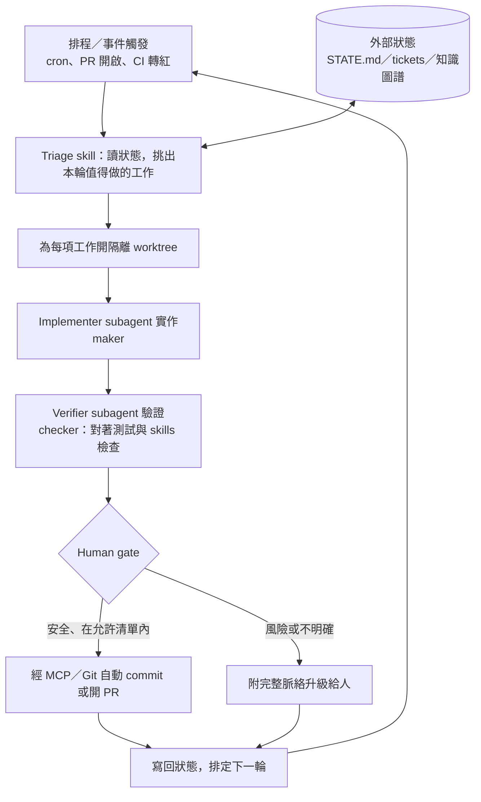

# 迴圈的解剖學：六個積木與一條參考流程

## TL;DR

- 一個生產級的 loop 由六個積木組成：**排程觸發、git worktree[^worktree] 隔離、skills（持久專案知識）、MCP[^mcp] 連接器、maker/checker subagent[^subagent] 分工、對話之外的外部狀態**。缺任何一塊，迴圈都會以可預測的方式退化。
- loop 和 cron[^cron] 的差別不在「會不會定時跑」，而在**中間有沒有決策者**：cron 每次走同一條路徑執行固定腳本；loop 每一輪由模型讀取當前狀態、選擇行動、檢查結果、再決定繼續或停手。
- 社群已沉澱出一條參考流程：排程 → triage[^triage] → 讀寫狀態 → 隔離 worktree → 實作 subagent → 驗證 subagent → MCP/Git 落地 → human gate——安全路徑自動 commit，風險路徑附完整脈絡升級給人。

## 先定義：迴圈不是「定時跑的 prompt」

上一篇（見本期第 1 篇〈從 Prompt 到 Loop〉）講了這個概念怎麼爆紅，這篇回答更基本的問題：一個 loop 究竟由什麼組成？

社群目前最常被引用的工作定義來自 Lushbinary 的指南：一個 loop 會**發現工作（discovery）、把工作派給 agent（dispatch，通常透過 subagent）、驗證結果（verification）、把狀態持久化（state）、然後決定下一步**——依排程重複，或跑到目標達成為止。Boris Cherny 的版本更白話：「我不再 prompt Claude 了，是迴圈在 prompt Claude、自己決定要做什麼。我的工作是寫迴圈。」

這個定義立刻劃出與 cron job 的解剖學差異。cron 是「時間到了，執行同一份腳本，每次走同一條路徑」；loop 是「時間到了（或事件來了），**由一個模型看著當前狀態決定這一輪要做什麼**，做完還會檢查有沒有做成，再決定繼續、換方向或收工」。一句話總結：**loop = cron + 決策者**。排程只是觸發器，真正的差異在中間那顆會評估、會調整的腦。至於「這顆腦值不值那個 token 錢」的懷疑論，留給本期第 6 篇。

另一個容易混淆的點：loop engineering 不會取代 context engineering。每一輪迴圈醒來時，仍然要把對的檔案、對的歷史、對的工具定義放到模型面前——Anthropic 自己的 context engineering 指南講的原則在迴圈裡每輪都要重演一次。六個積木裡至少有三個（skills、memory/state、subagent）本質上就是「跨輪次的 context engineering」。

## 六個積木：各自解決什麼、缺了會怎樣

cobusgreyling/loop-engineering 這份參考 repo（2026 年 6 月，整理自 Addy Osmani 與 Boris Cherny 的論述）把生產級迴圈拆成五個零件加一條記憶脊柱，是目前最完整的分解。逐一看：

**1. 排程／自動化（Automations & Scheduling）**——解決「誰來啟動這一輪」。沒有它，發現工作和分派工作的還是你本人，那只是把 prompt 寫長一點，不是迴圈。觸發器可以是固定排程，也可以是事件：PR 開啟、CI 轉紅、Slack 訊息。以 Claude Code 為例（截至 2026-06-12），官方就提供三層排程：雲端 Routines（跑在 Anthropic 基礎設施上、機器可關機、最小間隔 1 小時）、Desktop 排程任務（本機、最小間隔 1 分鐘）、以及 session 內的 `/loop`（最小間隔 1 分鐘、單一 session 上限 50 個任務、recurring 任務 7 天自動到期）。GitHub Actions 的 `schedule` trigger 也是合法的觸發層。注意一個刻意設計：`/loop` 的排程有 jitter（最多延後 30 分鐘）與七天到期——**官方文件自己就在防「被遺忘的迴圈永遠跑下去」**，這是排程積木的成熟標誌。

**2. git worktree（隔離並行）**——解決「兩個 agent 同時動同一個 checkout 會互踩」。worktree 是同一個 repo 的另一個工作目錄，共享歷史、各自有 branch 與檔案。兩個 session 共用目錄同時改同批檔案的下場是可預期的：互相覆寫、context 錯亂、build 壞掉。Claude Code 已把這個模式內建：`--worktree`（縮寫 `-w`）一步建立 `.claude/worktrees/<name>/` 下的隔離 checkout；自訂 subagent 可在 frontmatter[^frontmatter] 加 `isolation: worktree`，讓每個 subagent 拿到臨時 worktree，結束時若無變更自動清除、有變更則留下供人審。缺了這塊，你的迴圈只能序列化跑，或在某個深夜學到「並行寫檔」的代價。

**3. Skills（持久專案知識）**——解決「每一輪都要重新解釋專案脈絡」。skill 是一個資料夾加一份 `SKILL.md`（YAML frontmatter 說明何時觸發、markdown 正文寫步驟，外加選配的 scripts 與參考檔），放在 `~/.claude/skills/`（跨專案）或專案的 `.claude/skills/`（進 repo 版控）。對迴圈來說重點是**具名、可重複呼叫的 recipe 取代一次性 prompt**：triage 怎麼做、修 CI 的標準程序是什麼，寫成 skill 之後每輪行為一致、可以 review、可以版控。缺了這塊，迴圈每輪的行為飄移，你會在不同迭代看到同一個問題被三種不同方式「解決」。

**4. Plugins 與 MCP 連接器**——解決「迴圈做完的事怎麼落地到真實世界」。MCP（Model Context Protocol）把 agent 接上 Git hosting、ticket 系統、Slack、監控面板。沒有它，迴圈是個 sandbox：分析得再對也只能寫進本地檔案，開不了 PR、回不了 issue、發不了通知——工作成果出不了迴圈本身。

**5. Subagents（maker/checker 分工）**——解決「同一顆腦自己寫、自己改、自己說沒問題」。Claude Code 的 subagent 各自跑在獨立 context window，有自己的 system prompt、工具權限，中間過程不回流，只有最終訊息回到主 agent。這個隔離正是 maker/checker 的基礎：驗證者**不繼承**實作者的假設、脈絡與盲點，官方文件明確把「不受對話歷史影響的獨立驗證」列為 subagent 的核心使用情境。缺了這塊就是 single-agent bias——迴圈變成自我同意的機器。這塊是整個解剖圖裡最關鍵的器官，本篇只標出它的位置，深度解剖見本期第 3 篇。

**6. Memory／State（外部狀態脊柱）**——解決「模型每輪之間什麼都不記得」。context window 不是記憶體，是暫存緩衝；真正的記憶必須活在模型之外——磁碟上的 `STATE.md`、ticket 系統、或外部知識圖譜（如 Zep Graphiti[^zep-graphiti]）。Ralph 系迴圈的核心架構正是如此：每一輪用全新 context 重啟 agent，狀態靠檔案往前傳，一次解掉 context 耗盡、狀態持久化、任務接續三個問題。缺了這塊，迴圈沒有連貫性：同一件事重做三次、做過的決策被推翻、「下一步是什麼」每輪重新發明。六塊裡面，這是最常被新手省略、也最快讓迴圈崩潰的一塊。

## 一條參考流程：從排程到 human gate

六個積木組起來，repo 給出的參考流程長這樣（全期唯一一張流程圖就放這裡）：

走一輪是這樣的：排程喚醒一個 triage 流程，它先讀外部狀態（上一輪做到哪、哪些事擱置中），再掃描現實（issue、CI、PR），挑出這一輪值得做的工作——這是第一個決策點，cron 沒有的那種。對每項值得做的工作，主流程開一個隔離 worktree，派 implementer subagent 起草修改；第二個 subagent 拿著專案 skills 和既有測試獨立審查那份草稿。通過驗證的成果走到 human gate：被標記為安全或在允許清單內的，經 MCP/Git 自動 commit；有風險或模稜兩可的，**帶著完整脈絡**升級給人——不是丟一句「請看一下」，而是附上做了什麼、為何不確定、驗證結果如何。最後把這一輪的結論寫回狀態，迴圈重新開始。

注意兩件事。第一，**狀態讀寫出現在頭尾兩端**：開頭讀（決定做什麼）、結尾寫（記住做了什麼），這條雙向箭頭就是迴圈跟「定時跑的腳本」在拓撲上的差別。第二，human gate 不是裝飾。repo 作者自己的警語是：「驗證仍然是你的責任。無人看管的迴圈會犯無人看管的錯。」迴圈放大的是你的判斷——好的和壞的都一樣。

## 哪些積木可以先省？

誠實的答案：取決於你要的是玩具還是生產系統。一個最小可行迴圈只需要兩塊——觸發器和外部狀態檔，這也是 Ralph loop 的原始形態（`while true` + 一份 prompt + 檔案系統當記憶）。但每省一塊，就接受一種退化：沒有 worktree 就不能並行；沒有 skills 行為每輪飄移；沒有 MCP 成果出不了本機；沒有 checker subagent，你得到的是一台高速自我同意機。實務上的擴張順序通常是：先有「觸發＋狀態」讓迴圈能轉，再補 checker 讓它值得信任，最後才加 worktree 與 MCP 讓它規模化。具體該套哪種迴圈模式（PR babysitter、CI sweeper……）見本期第 4 篇；指令層級怎麼搭，見第 5 篇。

[^worktree]: Git 的內建功能（`git worktree` 指令），讓同一份版本庫同時掛出多個工作目錄，共享提交歷史但各自檢出不同分支、各自有獨立的檔案狀態。
[^mcp]: Model Context Protocol，Anthropic 於 2024 年底發表的開放協定，定義 AI 模型與外部工具、資料來源之間的標準介面，現已被多家廠商與工具採用。
[^subagent]: 由主 agent 派生出的子代理，擁有獨立的對話脈絡與工具權限，完成任務後只把最終結論回傳。Claude Code 等工具以此實現分工與平行處理。
[^cron]: 源於 1970 年代 Unix 的排程工具，依設定的時間表自動執行指令，是伺服器自動化最古老、最普及的機制。
[^triage]: 原為急診醫學的「檢傷分類」，借用到軟體工程指快速掃過一批事項、判斷輕重緩急並決定處理順序的程序。
[^frontmatter]: 放在 Markdown 檔案開頭、以 `---` 包夾的中繼資料區塊，通常用 YAML 語法描述標題、觸發條件等屬性，供程式解析、不顯示於正文。
[^zep-graphiti]: Zep 公司開源的時序知識圖譜框架，專為 AI agent 的長期記憶設計，能隨時間累積並更新實體與事件之間的關係。

---

**來源**

1. [loop-engineering: Practical reference and patterns for loop engineering](https://github.com/cobusgreyling/loop-engineering) — Cobus Greyling / GitHub，2026-06
2. [Run prompts on a schedule（/loop 與排程選項比較）](https://code.claude.com/docs/en/scheduled-tasks) — Claude Code Docs / Anthropic，截至 2026-06-12
3. [Run parallel sessions with worktrees](https://code.claude.com/docs/en/worktrees)、[Create custom subagents](https://code.claude.com/docs/en/sub-agents) — Claude Code Docs / Anthropic，截至 2026-06-12
4. [The Ralph Loop: How I Run Autonomous AI Agents Overnight](https://blakecrosley.com/blog/ralph-agent-architecture) — Blake Crosley，2026

