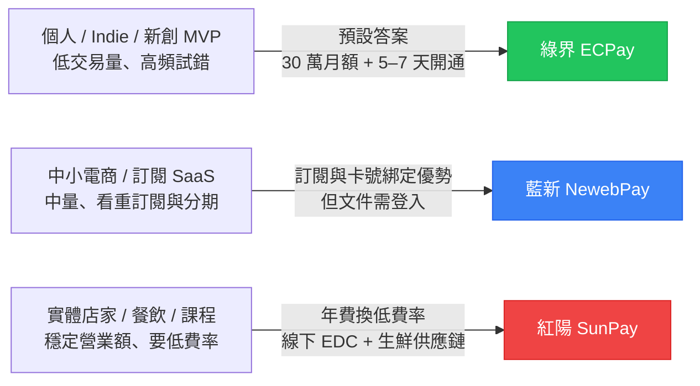

# 紅綠藍是誰：三家金流的歷史與定位地圖

「紅綠藍」這個業內暱稱已經喊了快十年，但 2025–2026 這兩年是三家公司命運第一次同時被搬到資本市場上交叉比較的時刻——綠界 2022 年率先上櫃、藍新 2025 年規畫登興櫃、紅陽則在 2026 年 1 月 5 日正式登錄興櫃。三家從「電商金流套件」變成「上市櫃 fintech 投資標的」的這條時間軸，是理解它們今天為什麼長成這個樣子的最快路徑。

## TL;DR

- **綠界（6763）** 是三家裡唯一掛牌上櫃的，2022 年 3 月以承銷價 760 元上櫃[^otc]、2024 年全年合併營收 16.04 億元、EPS[^eps] 1.94 元，數位金流交易總額約 840 億元，會員數超過 41.5 萬家，最大股東是茂為歐買尬（26.31%）。
- **藍新（7739）** 由智付通[^paymentgo]與藍新科技合併而來，現為智冠（5478）旗下子公司（智冠持股 51%、全達持股近 30%），2024 年線上代收付交易額目標破千億、前三季營收 10.9 億，計畫 2025 年登興櫃。
- **紅陽（7745）** 是 2026 年 1 月 5 日才登錄興櫃的「最新生力軍」，大股東是大宇資[^softstar]（6111，持股 55.16%），2024 年凱基金控旗下中華開發資本領投增資，定位是「金流支付 + 生鮮供應鏈」垂直整合的 fintech[^fintech]。

## 三家公司的出身：誰是 fintech 老兵，誰是電商小金雞

**綠界科技** 是這三家裡資歷最老的。前身為 1996 年成立的「綠界國際資訊有限公司」，最初做的是代收代付電子服務與虛擬主機代管；2000 年 2 月與工研院[^itri]電通所合作轉型為 IPSP（Internet Payment Service Provider），算是台灣最早一批切入網路支付的本土玩家。創辦人王建民帶著公司熬過 dot-com 泡沫，到 2016 年才推出今天看到的「ECPay 整合金流平台」品牌，2020 年登興櫃、2022 年 3 月 15 日以承銷價 760 元上櫃，股票代號 6763。掛牌當天市值衝破百億，是當時興櫃市場第一檔千金股。

**藍新金流** 的家族史比較複雜，常常被誤解。它的前身其實是「智付通 PayMent2GO」——2018 年 12 月 24 日，智通數位科技與藍新科技進行合併，智付通才正式更名為「藍新金流 NewebPay」，公司主體保留藍新科技、股票代號 7739。這次合併背後真正的推手是智冠科技（5478）董事長王俊博：智冠在 2018 年 1 月宣布旗下「智付寶」與全達（8068）旗下藍新科技整併，等於是把兩家小金流端到一起，再透過後續資本操作把藍新做大。截至 2024 年資本額 7.5 億元，第一大股東是智冠（51%）、第二大是全達（近 30%）。

**紅陽科技** 是「老牌但晚上市」的最佳註腳。官網寫成立於 1998 年，但近期媒體報導引用興櫃公開資訊則寫成立於 2000 年——保守起見可以把它理解為「在 1998–2000 年之間誕生的支付老兵」。重點是，這 25 年多它一直沒上市櫃，直到 2021 年 12 月 24 日大宇資（6111）以 1.37 億元收購紅陽 55.16% 股權、納入子公司，2024 年又完成由凱基金控集團旗下中華開發資本領投的興櫃前增資，才終於在 **2026 年 1 月 5 日** 登錄興櫃，股票代號 7745。

> 一個常被搞錯的點：很多比較文章把藍新跟「歐買尬」綁在一起，這是錯的。歐買尬（3687）是 **綠界** 的大股東（透過茂為歐買尬持股 26.31%），跟藍新沒有股權關係。藍新背後的集團是 **智冠**，這兩家經常被混淆。

## 三家的母公司決定了他們是哪種生意

把母公司攤開來看，三家其實是三種不同的商業邏輯：

- **綠界 ← 歐買尬集團（遊戲）**：歐買尬 2017 年成立「歐付寶投資控股公司」，統一管理綠界與歐付寶兩條金流線，等於是「遊戲公司孵出的支付小金雞」。這條基因讓綠界一開始就習慣「toC 海量帳號、自助開通、API 大量串接」的玩法——遊戲產業本來就是金流串接最複雜的場景之一。
- **藍新 ← 智冠集團（遊戲 + 點數卡）**：智冠是台灣最老牌的遊戲代理商與點數卡 MyCard 的母體，藍新從智付通時代就承擔了「替遊戲、虛擬商品做收款」的角色。這也解釋了為什麼藍新在訂閱、定期定額、卡號綁定（card token）這幾項做得比同行扎實——遊戲與訂閱類產品高度依賴這些功能。
- **紅陽 ← 大宇資（遊戲 + 投資控股）**：這個組合最有意思。大宇資原本做遊戲（仙劍奇俠傳的母公司），2021 年第四季同時拿下全達與紅陽兩筆持股，等於是把「第三方支付三國鼎立」中的兩大版圖收入旗下。紅陽在大宇資底下被重新定位成「金流 + 生鮮供應鏈」的 fintech——透過轉投資子公司宥杏，把支付、冷鏈物流、食材採購黏成一條垂直整合的服務鏈。

把這三個母公司並排，會發現一件挺反直覺的事：**台灣三大第三方金流，背後全都是遊戲/數位內容集團孵出來的小金雞**。沒有任何一家是傳統金融機構或電信業者主導——這在亞洲市場其實是相對特殊的結構，日本、韓國、東南亞的對應角色多半由銀行、電信或大型零售集團把持。

## 三家鎖定的客群其實完全不重疊

如果你只看官網，三家都會說「我們服務所有規模的商家」。但比對它們公開的方案、會員門檻與費率結構，會發現實際的服務客群差別很大：

**綠界主打「個人 + 中小電商，全自助開通」**。個人會員月限額 30 萬、文件齊全後 5–7 個工作天開通，是三家裡唯一把 self-service 流程做到「不用業務介入也能上線」的玩家。截至公開資料，綠界服務超過 41.5 萬家中小企業會員，2024 年數位金流交易總額約 840 億元，在台灣中小型電商市場市占率長期被媒體引述為「七成」。換句話說，**只要你是電商、indie hacker、新創、SaaS、KOL 賣周邊，預設答案就是綠界**——這不是因為它最便宜或功能最多，而是它「最快上線、最少摩擦」。

**藍新主打「中小電商 + 訂閱/數位商品的中堅客戶」**。個人會員 30 天信用卡額度 20 萬（比綠界低），但企業會員的訂閱、定期定額、卡號綁定、分期方案做得更系統化。2024 年線上代收付交易額目標破千億、前三季營收 10.9 億——以單筆平均金額來看，藍新的客群明顯比綠界「更大、更穩定、訂閱比例更高」。代價是 API 文件需要登入後台才能下載、註冊流程比綠界保守，對開發者試水的友善度差一截。

**紅陽主打「實體商家 + 線上線下整合 + 議價後的低費率」**。紅陽沒有真正意義上的「個人方案」——年費 12,000 元、設定費 4,000 元、徵信費 800 元起跳就把多數副業者直接擋在門外。但對於有穩定營業額的實體店家、餐飲、課程業者，紅陽提供的是另一套價值主張：**信用卡費率可以議價壓到 1.8%–2%（比另外兩家的 2.75% 低不少）**、提供實體刷卡機（EDC POS）、線下與線上同一個後台。線下 EDC[^edc] 刷卡機目前公開的費率是 2.8%–3.5%、申請流程 10–14 個工作天、撥款 D+10。再加上 2026 年新加入的生鮮供應鏈整合，紅陽其實已經偏離「純第三方支付」這個分類，往「實體商家垂直 SaaS」靠攏。

## 三家定位的快速地圖

如果硬要用一張圖把「服務複雜度 × 客群規模」釘成兩個軸，大致長這樣：

這張圖最容易誤讀的地方，是以為三家在搶同一塊餅。實際上：**綠界吃的是「長尾 + 自助化」、藍新吃的是「中堅電商的訂閱 ARR[^arr]」、紅陽吃的是「穩定營業額的議價空間」**。三家在費率、申請文件、撥款週期甚至 API 文件公開程度上的所有差異，都是從這條主軸往下推導出來的——這也是接下來四篇要展開的線索。

[^otc]: 興櫃 / 上櫃指股票在櫃買中心交易而非台灣證交所（上市）的市場。興櫃是公開發行公司在正式上市櫃前的緩衝市場，申請門檻較低、流動性也較淺；綠界 2020 年先登興櫃，2022 年才轉上櫃。
[^eps]: EPS（Earnings Per Share，每股盈餘）是公司稅後淨利除以發行股數的指標，數字越高代表每張股票背後對應的獲利越多，常被當作財報健康度的入門檢視。
[^paymentgo]: 智付通（PayMent2GO）是藍新金流的前身品牌名稱，由智冠科技集團經營，2018 年 12 月與藍新科技合併後才改名為 NewebPay 藍新金流。
[^softstar]: 大宇資（股票代號 6111）即「大宇資訊」，是台灣老牌遊戲公司，代表作為仙劍奇俠傳、軒轅劍系列。2021 年陸續入主全達與紅陽科技後，把第三方支付當成集團轉型的新戰場。
[^fintech]: Fintech（Financial Technology，金融科技）泛指用技術改造傳統金融服務的公司，涵蓋第三方支付、行動錢包、保險科技、財富管理 SaaS 等。台灣資本市場常用 fintech 標籤替支付公司做估值定位。
[^itri]: 工研院（工業技術研究院）為台灣最大應用研究機構，1973 年成立，在台灣科技產業的技術擴散與新創孵化上扮演關鍵角色。綠界早年的網路支付能力就是與工研院電通所合作開發。
[^edc]: EDC（Electronic Data Capture）即實體店面的信用卡刷卡機 / POS 收單終端，負責讀卡、連線銀行請求授權、列印簽單。台灣餐飲與零售店通常會同時擺一台 EDC 與行動支付掃碼裝置。
[^arr]: ARR（Annual Recurring Revenue，年度經常性收入）是 SaaS 與訂閱業常用的指標，把固定週期收費的訂閱數金額換算成一年總額，方便估值與成長率比較。

---

## 來源

1. [興櫃市場第一檔千金股！綠界搭上零接觸支付商機 吃下25％電商交易市場](https://tw.stock.yahoo.com/news/興櫃市場第一檔-千金股-綠界搭上零接觸支付商機-吃下25-電商交易市場-000210074.html) — Yahoo 股市/TNL 關鍵評論網，2022-03
2. [綠界科技*去年EPS 1.94元；續拓支付生態圈布局](https://www.ttv.com.tw/finance/view/0320251310402337E6953F44491CB500E9FC8720A0B3DB53/587) — 台視財經，2025-03
3. [智冠旗下藍新科技 目標明年登興櫃](https://www.ctee.com.tw/news/20240815700258-439901) — 工商時報，2024-08-15
4. [〈觀察〉第三方支付三國鼎立 大宇資拿下兩大版圖劍指NFT](https://news.cnyes.com/news/id/4792691) — 鉅亨網，2021-12
5. [大宇資旗下紅陽科技1/5登興櫃 跨足數位金融與生鮮供應](https://tw.stock.yahoo.com/news/大宇資旗下紅陽科技15登興櫃-跨足數位金融與生鮮供應-050255148.html) — Yahoo 股市，2025-12
6. [第三方支付添生力軍 紅陽1月5日登錄興櫃](https://udn.com/news/story/7254/9233026) — 聯合新聞網，2025-12
7. [大宇資旗下第三方支付子公司紅陽 完成興櫃前增資](https://udn.com/news/story/7254/9045830) — 聯合新聞網，2024
8. [綠界科技 - 維基百科](https://zh.wikipedia.org/zh-tw/綠界科技) — 公司沿革與歐買尬持股結構
