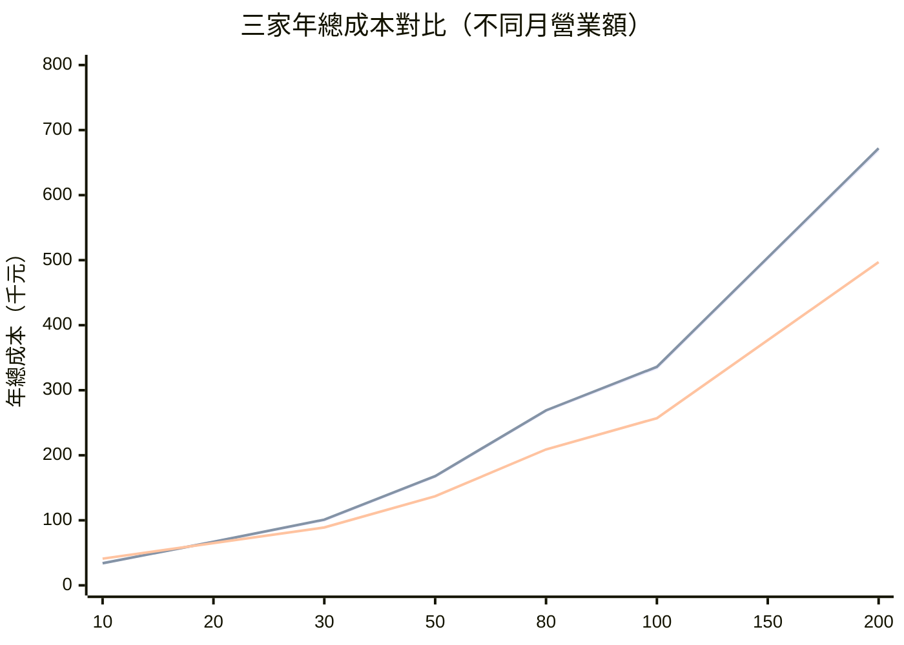

# 費率全比較：算清楚每一塊錢花在哪裡

## TL;DR

- **小額（月營業額 < 20 萬）**：綠界個人會員幾乎沒有對手——0 年費、0 設定費、信用卡 2.75%（新戶優惠 1.68%–1.8% 三個月），紅陽光是 12,800 元的開辦成本就先輸一輪。
- **中量（月 30 萬 – 100 萬）**：藍新與綠界打成平手——費率同樣落在 2.75%–2.8%，差別在「綠界 2025/4/1 起每筆加收 1 元處理費」與「藍新提領每月免費 5 次、超過 10 元」這兩條隱性線。
- **大量（月 100 萬以上）**：紅陽開始反超。假設特約議到 2.0%，月營業額 80 萬就能把 12,800 元的固定成本攤平，之後每多一塊都比綠界 2.75% 便宜 0.75 個百分點。

---

## 一、檯面上的費率：信用卡是主戰場

三家檯面費率看起來都黏在 2.75%–2.8%，但細看會發現「同一個 2.75%」背後對應的條件其實天差地遠。下表整理三家**檯面標準費率**（皆未稅；台灣金流業慣例會在結算時再加 5% 營業稅[^biztax]）。**特約賣家[^special-merchant]**這一欄的數字幾乎都是「議定」，意思是你要先簽進去、才看得到真實費率。

| 項目 | 綠界（個人會員） | 綠界（特約／議定） | 藍新（個人/進階） | 藍新（商務／企業） | 紅陽（特約） |
|---|---|---|---|---|---|
| 信用卡 一次付清（國內） | 2.75% | 1.68%–2.2%（議定） | 2.8% | 2.2%–2.6%（議定） | **約 1.8%–2.0%** |
| 信用卡（海外卡） | 3.5%（最低 5 元） | 議定 | 2.8%（含海外） | 議定 | 議定 |
| 每筆固定處理費 | **+1 元/筆**（2025/4/1 起） | +1 元/筆 | 無 | 無 | 無 |
| ATM 虛擬帳號 | 9 元/筆（個人） | 議定 | 1%/筆 | 議定 | 議定 |
| 超商代碼 | 25–30 元/筆（依金額級距） | 議定 | 28 元/筆 | 議定 | 議定 |
| 超商條碼 | 25–30 元/筆 | 議定 | 26 元/筆 | 議定 | 議定 |
| 超商貨到付款代收 | 內含費率 | 議定 | 0.75%/筆 | 議定 | 議定 |

> 截至 2026-05；綠界 1.68% 是新戶 90 天限時優惠，期滿恢復 2.75%。紅陽未公開標準費率表，1.8%–2.0% 為多家第三方比較文章與業界訪談的常見區間，正式合約以紅陽提供之議定書為準。

**幾個容易踩到的雷**：

1. **綠界 2025/4/1 起每筆信用卡訂單加收 1 元處理費**——客單低的賣家請務必把它換算回有效費率。100 元訂單收 1 元，等於多 1% 費率，瞬間從 2.75% 變 3.75%。
2. **藍新沒有「個人 vs 海外」雙費率**——一律 2.8%。對接歐美客比較多的賣家反而省事；綠界要海外卡 3.5%，比藍新貴 0.7%。
3. **紅陽的低費率是「議定」出來的**——不是申辦完就 1.8%，需提供營業資料、過往交易紀錄談判，且依銀行通道[^acquirer]不同還會浮動。這也是它跟綠界、藍新自助開戶模式最大的差異——紅陽走的是傳統的**收單代理（acquirer reseller）[^reseller]**。

## 二、分期費率：藍新公開最清楚

分期是另一個常被忽略的成本中心，多數平台會把分期費率轉嫁給賣家。藍新是三家中**公開資料最完整**的，綠界與紅陽都採「依方案議定」，數字得簽約才看得到。

| 期數 | 藍新（公告費率） | 綠界（多為議定） | 紅陽（多為議定） |
|---|---|---|---|
| 一次付清 | 2.8% | 2.75%（或議定） | 約 1.8%–2.0%（議定） |
| 3 期 | 3.0% | 2.75%–3.0% | 議定 |
| 6 期 | 3.5% | 3.0%–3.5% | 議定 |
| 12 期 | **7.0%** | 6.0%–7.0% | 議定 |
| 18 期 | 9.0% | 議定 | 議定 |
| 24 期 | 12.0% | 議定 | 議定 |
| 30 期 | 15.0% | 議定 | 議定 |

> 截至 2026-05；藍新數字取自其公開服務費率頁。

分期看起來貴得嚇人——12 期就要 7%——但通常會搭配「**銀行 0 利率分期方案**」由銀行補貼。賣家需確認合作銀行名單，否則 12 期賣 10,000 元的商品，光分期費就吃掉 700 元。如果是 SaaS 訂閱要做月扣，這條表用不上，要看的是**定期定額[^recurring]**那組費率。

## 三、看不見的成本：年費、設定費、提領費、處理費

費率表上沒列的，才是真正決定總成本的隱性線。這張表把三家「**第一年要先掏出來的固定成本**」攤平給你看：

| 隱性成本 | 綠界（個人） | 綠界（特約） | 藍新（一般／進階） | 藍新（商務） | 紅陽 |
|---|---|---|---|---|---|
| 年費 | 0 | 約 10,000 元 | 0 | **18,000 元** | **12,000 元** |
| 首次設定費 | 0 | 約 5,000 元 | 0 | 議定 | **4,000 元** |
| 徵信費 | 0 | 0 | 0 | 議定 | **800 元** |
| 履約保證金 | 無 | 議定 | 無 | **30,000 元** | 議定 |
| 每筆處理費 | **1 元**（信用卡） | 1 元 | 0 | 0 | 0 |
| 提領手續費 | **永豐 0 元 / 跨行 15 元** | 同 | **每月前 5 次免費，第 6 次起 10 元/次** | 同 | 議定（多為議定免收） |
| 月（30 日）收款額度 | 30 萬 | 議定 | 個人 20 萬 / 進階 60 萬 | 議定 | 議定 |
| 撥款週期（信用卡） | 約 T+7~T+10 | T+2~T+7 | 一次付清 T+10，分期 T+10 | 議定 | 約 T+7~T+14（依方案） |

> 截至 2026-05；綠界跨行提領 15 元、永豐 0 元為其支援頁公告；藍新提領 10 元、每月 5 次免費為公告費率；紅陽撥款週期區間取自多家第三方比較文章。

**真正容易被低估的兩個成本**：

- **綠界每筆 1 元處理費**：對單價 50 元的小商家（例如賣電子書、訂閱訊息）等於 +2% 隱性費率。
- **藍新商務會員 30,000 元保證金**：雖然合約結束會退，但這筆錢實質上會被押住一整年，現金流不寬裕的賣家壓力很大。

## 四、損益平衡：交易量到哪裡，紅陽才划算？

這是最多人會問的問題：「**我月營業額多少，去簽紅陽就會比綠界便宜？**」這裡用最保守的算法跑一次。

**假設**：

- 綠界個人會員：信用卡 2.75% + 每筆 1 元處理費；月平均客單 1,000 元。
- 紅陽特約：信用卡 2.0%；年費 12,000 + 設定費 4,000 + 徵信費 800 = **第一年固定成本 16,800 元**（第二年起 12,000 元）。
- 兩家都不考慮分期、海外卡、ATM 等其他通道。
- 1 年期，計算口徑為「年總成本」。

**公式**：

- 綠界年成本 = 月營業額 × 12 × 2.75% + 訂單數 × 12 × 1 元
- 紅陽年成本（第一年） = 月營業額 × 12 × 2.0% + 16,800

**找平衡點**：兩邊相等時的月營業額 X：

```
X × 12 × 2.75% + (X / 1000) × 12 × 1 = X × 12 × 2.0% + 16,800
X × 12 × 0.75% + X × 12 × 0.001 = 16,800
X × 12 × 0.0085 = 16,800
X ≈ 164,706 元/月
```

也就是說，**月營業額大約 16.5 萬就能把紅陽第一年的固定成本攤平**。但這還沒算紅陽議到 2.0% 後實際的「相對節省」——當月營業額拉到 80 萬，年省下來的費率差就有 80 萬 × 12 × 0.75% ≈ 72,000 元，遠超過 12,000 年費。

下面這張 mermaid 圖把不同月營業額下三家的「**年總成本**」畫成曲線（縱軸：年總成本，單位千元；橫軸：月營業額萬元；計算同上述假設）：



> 三條線由上至下依序為：藍新個人（2.8%）、綠界個人（2.75% + 每筆 1 元）、紅陽特約（2.0% + 第一年 16,800 固定）。月營業額 30 萬以下紅陽劣勢明顯；80 萬以上紅陽年省超過 5 萬。

**結論**：

- 月營業額 **< 16 萬**：穩選綠界個人（免年費、免設定費）。
- 月營業額 **16 萬 – 50 萬**：綠界 / 藍新差距不大，主要看你需不需要分期、定期定額。
- 月營業額 **50 萬 – 100 萬**：開始該認真問紅陽議價。
- 月營業額 **> 100 萬**：紅陽幾乎一定划算，差距會持續放大。

## 五、容易被忽略的「邊角費」

最後補三個官方費率表上看不到、但實際營運常踩到的（**MDR[^mdr]** 這個業界術語講的就是這層整體手續費，但實務上你看到的「2.75%」常常只是冰山一角）：

1. **5% 營業稅**：所有金流手續費結算時都會再加營業稅，估算成本時請記得把 2.75% × 1.05 = 2.89% 當實際支出。
2. **退刷／取消手續費**：綠界、藍新一般退刷不另收，但**手續費不退還**。每退一單刷卡 2,000 元，等於白白付掉 55 元。
3. **個人會員的 30 日收款額度**：綠界 30 萬、藍新個人 20 萬。**這不是月曆月，是滾動 30 天**——爆量後新訂單會直接被擋下，導購流量瞬間蒸發。

[^biztax]: 5% 營業稅是台灣加值型營業稅的標準稅率，向商家提供的服務性收費通常以「外加」方式計算。金流手續費結算時，2.75% 的費率實際支出會變成 2.75% × 1.05 ≈ 2.89%，估算成本時別忘了加上去。
[^acquirer]: 銀行通道（acquirer，收單機構）指實際向發卡銀行請款的銀行。第三方金流會與多家收單銀行合作，不同產業、不同卡別會被分派到不同通道，費率與撥款條件也會跟著浮動。
[^special-merchant]: 特約賣家（綠界用語）/ 特約特店是指與金流公司簽訂議定合約的進階方案，能依交易量與產業議定費率、撥款週期與額度。代價通常是年費、設定費與履約保證金。
[^reseller]: 收單代理（acquirer reseller）指第三方金流以代理人身分把收單銀行的服務轉賣給商家，由代理商處理徵信、設定與客服。紅陽的傳統商業模式偏向這種——商家是跟代理談議價、而不是跟銀行直接簽。
[^recurring]: 定期定額（Recurring Billing）指系統依預設週期（例如每月）自動向同一張信用卡扣款，不需消費者每次重新輸入卡號。是 SaaS、訂閱媒體、雜誌、月捐 NPO 的核心金流功能，技術上需要卡號 token、過期卡更新與失敗重試。
[^mdr]: MDR（Merchant Discount Rate，商戶折扣率）是商家為每筆刷卡交易付給收單方的整體費率，包含發卡行的 interchange、卡組織費（visa / mastercard 抽成）、收單行利潤與第三方金流加成。台灣常見落在 2.0%–3.0% 區間。

---

## 來源

- 綠界科技 — 服務費率表：<https://www.ecpay.com.tw/Business/payment_fees>
- 綠界科技 — 2025/4/1 起金流收費調整公告（每筆信用卡 +1 元處理費）：<https://www.ecpay.com.tw/announcement/DetailAnnouncement?nID=5603>
- 綠界科技 — 30 日收款額度與提領手續費（永豐 0 元 / 跨行 15 元）：<https://support.ecpay.com.tw/4774/>
- 藍新金流 — 服務費率（信用卡 2.8%、ATM 1%、超商代碼 28、提領 10 元/月 5 次免費）：<https://www.newebpay.com/website/Page/content/service_fare>
- CodePulse — 第三方金流整合廠商介紹：紅陽、綠界、藍新（紅陽年費 12,000、設定費 4,000、徵信費 800）：<https://www.codepulse.com.tw/zh-tw/article/138>
- ke2b — 2025 金流費率與優惠比較（綠界、藍新、統一）：<https://ke2b.com/zh-hant/charge-rates-payment-gateways-comparison-taiwan/>
