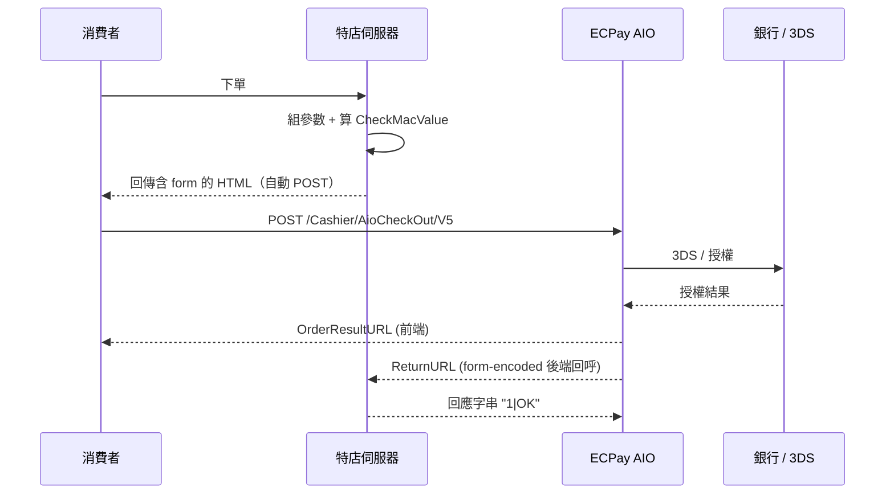

# API 與開發者體驗：從文件公開度看真實成本

> 截至 2026-05-12 的觀察。費率、後台版本與 API 規格皆會異動，正式串接前請以各家最新技術文件為準。

## TL;DR

如果只看官網價目表，台灣三家金流長得差不多——都做信用卡、ATM、超商代收，費率也都喊 2.x%。但**「開發要花多少時間」這條成本線，三家差距是用倍數在算的**：

- **綠界 ECPay**：開發者文件完全公開、官方 GitHub 有 PHP / .NET / Python / Node.js / Java / Ruby SDK，2026 年甚至發了給 Claude Code、Cursor、VS Code 用的 **AI Skill toolkit**，串接時間最短。
- **藍新 NewebPay**：技術手冊要登入會員才能下載，官方沒有上架 GitHub SDK，整個生態靠 `ycs77/laravel-newebpay`、`depresto/newebpay-mpg-sdk` 這些社群套件撐起來。
- **紅陽 esafe / Sunpay**：文件入口分散在 `doc.esafe.com.tw`、`www.sunpay.com.tw/developers/`，多數細節要透過業務窗口拿 PDF；GitHub 上幾乎只剩 `alChaCC/suntech_rails` 一個社群 repo，且只實作了 BuySafe 一個方法。

結論很白話：**文件越公開、社群越熱鬧，工程時數就越省。**

## 一、文件公開度：三層階梯

把三家的開發者入口拉出來並排，會看到很清楚的階梯：

| 項目 | 綠界 ECPay | 藍新 NewebPay | 紅陽 esafe |
| --- | --- | --- | --- |
| 開發者中心 | [developers.ecpay.com.tw](https://developers.ecpay.com.tw/) 完全公開 | [API 下載頁](https://www.newebpay.com/website/Page/content/download_api) 需登入會員 | [doc.esafe.com.tw](https://doc.esafe.com.tw/) 公開但多為產品說明，深度規格需業務提供 |
| Sandbox 後台 | [vendor-stage.ecpay.com.tw](https://vendor-stage.ecpay.com.tw/) 自助申請 | [ccore.newebpay.com](https://ccore.newebpay.com/) 自助申請 | [test.esafe.com.tw](https://test.esafe.com.tw/index/Login_Member.aspx) 需業務開通 |
| 範例完整度 | 各 API 都有可貼 Postman 的範例參數 | PDF 內含範例，但要拼湊版本 | BuySafe / 網址付 / Apple Pay 有教學頁，其餘需詢問 |
| 信用卡測試流程 | 3D 簡訊固定 1234，文件直接告知；卡片有效月須晚於當月 | 測試站 `cwww.newebpay.com` 申請測試金鑰 | 需業務提供測試帳號與測試卡 |

差別最戲劇化的是「**新手能不能 1 小時內跑出第一筆假交易**」這件事：

- 綠界：申請測試特店 → 從 vendor-stage 拷 MerchantID / HashKey / HashIV → 用範例參數直接打 `https://payment-stage.ecpay.com.tw/Cashier/AioCheckOut/V5`，文件還告訴你 3DS 驗證碼是 1234。基本上半小時可以看到回呼。
- 藍新：要先登入會員 → 在「商店管理／商店資料設定」拿 MerchantID、Hash Key、Hash IV → 下載 MPG 串接手冊 PDF → 自己用 AES + SHA256 把 TradeInfo / TradeSha 拼出來。可以做完，但你得會 PDF 跳頁。
- 紅陽：先打電話聯絡業務開測試帳號 → 收到 PDF 後在 `Etopm.aspx` 走表單提交。沒有業務窗口，連測試環境都進不去。

## 二、SDK 與開源生態：官方 vs 社群

### 綠界：官方 SDK 多語言齊全

綠界在自家 GitHub organization 維護 49 個 repo，光金流 AllInOne SDK 就涵蓋 PHP、Python、.NET、Node.js、Java、Ruby，加上 OpenCart 3 / 4、Magento 2.4、WooCommerce 等電商外掛。可以直接 clone 來改：

- [`ECPay/ECPayAIO_Python`](https://github.com/ECPay/ECPayAIO_Python)
- [`ECPay/ECPayAIO_Net`](https://github.com/ECPay/ECpayAIO_Net)
- [`ECPay/Invoice_Net`](https://github.com/ECPay/Invoice_Net) 電子發票 .NET SDK
- [`ECPay/Woocommerce_ECPAY`](https://github.com/ECPay)

社群也很活躍，例如 `simenkid/node-ecpay-aio` 號稱 production-ready，TypeScript 寫成、附測試，被很多 Node 專案拿來取代官方版。

### 藍新：官方零、社群撐場

藍新官方 GitHub 沒有 SDK，所有套件都是個人或公司開源。能用、且還在維護的代表作：

- [`ycs77/laravel-newebpay`](https://github.com/ycs77/laravel-newebpay) — Laravel 套件，fork 自更早的 `treerful/laravel-newebpay`，支援 MPG、交易查詢、取消授權、請退款、信用卡定期定額委託。MIT 授權，**非官方**。
- [`depresto/newebpay-mpg-sdk`](https://github.com/depresto/newebpay-mpg-sdk) — Node.js MPG SDK。
- [`onlinemad/node-newebpay`](https://github.com/onlinemad/node-newebpay) — 另一支 Node.js 模組，npm 直接 install。

實務上 Laravel / Node.js 圈會直接抓上面這幾包，省去自己刻 AES / SHA256 的工。但是**你要對社群套件做版控**：藍新有過信用卡定期定額版本更新公告，社群套件未必跟著升。

### 紅陽：實質沒生態

GitHub 上搜 `suntech` 或 `esafe`，最常被引用的是 [`alChaCC/suntech_rails`](https://github.com/alChaCC/suntech_rails)。這個 Rails gem 只完整實作 BuySafe（信用卡），WebATM、24Pay、Paycode、AliPay 標記為 TODO 且多年未更新。其他語言基本上要從業務手冊 PDF 裡的範例自己刻。

## 三、簽章與資料格式：三家的「肌肉記憶」差異

三家都用 HMAC / Hash 防止訊息被竄改，但細節讓開發體驗差很多。

**綠界 CheckMacValue**（[官方說明](https://developers.ecpay.com.tw/?p=2902)）：
1. 把參數依英文字母 A→Z 排序，以 `&` 串起來
2. 前面加 `HashKey=...`、後面加 `&HashIV=...`
3. 整串做 URL encode、轉小寫
4. SHA256 雜湊、再轉大寫

回呼用 form-encoded、特店需要回應字串 `1|OK` 表示已收到（沒回會被持續重送）。需要注意 PHP 的 `urlencode()` 與 .NET 預設行為不同，官方附了 URL Encode 轉換表。

**藍新 TradeInfo / TradeSha**（[串接手冊](https://www.newebpay.com/website/Page/content/download_api) 與多份社群實作）：
1. 把交易資料組成 query string
2. 以 Hash Key / Hash IV 做 AES-256-CBC 加密 → `TradeInfo`
3. 把 `HashKey={key}&{TradeInfo}&HashIV={iv}` 做 SHA256、轉大寫 → `TradeSha`
4. 把 MerchantID、Version、TradeInfo、TradeSha 一起 POST 到 PayGateWay

寫起來比綠界稍多步驟，但 AES 解出來是 JSON 比較好讀。

**紅陽 BuySafe / Etopm**：以表單參數 POST 到 `https://www.esafe.com.tw/Service/Etopm.aspx`，回呼也要寫 server-side 表單接收，校驗用業務提供的 password 與雜湊欄位。社群實作（`suntech_rails`）裡能看到模型，但**官方沒有像綠界那樣的「常見 CheckMacValue 錯誤頁面」可以查**。

## 四、進階功能：定期定額、卡片綁定、Apple Pay / Google Pay

訂閱制最常踩的雷在這層。

### 綠界

- **信用卡定期定額**（[`developers.ecpay.com.tw/?p=2868`](https://developers.ecpay.com.tw/?p=2868)）：用 `PeriodAmount`、`PeriodType`（`D`/`M`/`Y`）、`Frequency`、`ExecTimes` 設扣款規則。例：`PeriodAmount=500, PeriodType=M, Frequency=1, ExecTimes=12` 等於每月扣 500、扣 12 期。每期授權結果會回傳到 `PeriodReturnURL`。
- 限制清楚寫在文件：**不能與分期同用、不能用 OTP（必須幕後授權）、首期失敗就整張單作廢**。
- **信用卡綁定**：給特約特店用，搭配幕後授權，適合非定期不定額的扣款情境（例如 Uber 那種叫車後扣款）。
- **Apple Pay / Google Pay / Samsung Pay**：要先升級為「特約特店」才能開通；綠界自 2025-04-01 起，每筆 Apple Pay 訂單會加收 1 元手續費。

### 藍新

- **信用卡定期定額**：[官方 PDF `NDNP-1.0.4`](https://www.newebpay.com/website/Page/download_file?name=%E4%BF%A1%E7%94%A8%E5%8D%A1%E5%AE%9A%E6%9C%9F%E5%AE%9A%E9%A1%8D%E4%B8%B2%E6%8E%A5%E6%8A%80%E8%A1%93%E6%89%8B%E5%86%8A_NDNP-1.0.4.pdf) 是主要文件。
- 兩個獨家賣點：**卡號綁定** 與 **過期卡自動更新**（系統自動對接發卡行更新卡號），對 SaaS 訂閱續扣成功率非常有感。
- **Security Token** 模組讓特店「不存卡號也能 fast checkout」。
- 開通方式可以後台自助或寫信給 cs@newebpay.com，審核大約兩個工作天。

### 紅陽

- 信用卡定期定額、Apple Pay、Google Pay、台灣 Pay 都有，分散在 [`doc.esafe.com.tw`](https://doc.esafe.com.tw/) 的 swipy / webpay 系列教學頁裡。
- 真正的串接細節（欄位、回呼） PDF 「[紅陽科技-金流串接技術手冊 v4.1.2](https://www.sunpay.com.tw/forms_download/%E7%B4%85%E9%99%BD%E7%A7%91%E6%8A%80-%E9%87%91%E6%B5%81%E4%B8%B2%E6%8E%A5%E6%8A%80%E8%A1%93%E6%89%8B%E5%86%8Av4.1.2.pdf)」 才有。
- 沒有公開的「過期卡自動更新」、Token 服務細節，要單獨跟業務確認。

## 五、AI tooling：2026 年才真正分出勝負

這是 2026 年才真正爆開的差距。

### 綠界官方 AI Skill toolkit

ECPay 在自家 GitHub 開了 [`ECPay/ECPay-API-Skill`](https://github.com/ECPay) repo，把開發文件包成 AI 助理的 Skill。**官方明文支援的 AI 工具**：

- Claude Code（Anthropic）
- VS Code Copilot Chat、Visual Studio 2026 + GitHub Copilot
- GitHub Copilot CLI
- Cursor
- ChatGPT GPTs（上傳 `SKILL_OPENAI.md` 到 GPT Builder Knowledge）
- OpenAI Codex CLI
- Google Gemini CLI

Claude Code 的安裝就一行 `git clone https://github.com/ECPay/ECPay-API-Skill.git ~/.claude/skills/ecpay`。功能涵蓋：

- 需求分析（你描述要做訂閱，它幫你選 AllInOne + 定期定額）
- 12 種語言的程式碼生成（從 134 段驗證過的 PHP 範例翻譯）
- CheckMacValue / AES 加密 / API 錯誤即時除錯
- 上線前檢查清單

這份官方 Skill **同時涵蓋金流（AllInOne、ECPG 站內付 2.0、幕後授權）、電子發票（B2C、B2B、離線發票，支援 AES-CBC 與 AES-GCM V3.0+）、收據（普通／公益／政治獻金）、物流（國內、跨境、全方位）**。換句話說，綠界把全公司 API 都搬進 LLM 的 context 裡。

### 社群整合：paid-tw/skills

社群另開了 [`paid-tw/skills`](https://github.com/paid-tw/skills) 把多家金流統一打包：藍新（fully available）、KryptoGO Pay（穩定幣）已上架；綠界、PAYUNi 在開發中。安裝方式：

```bash
npx skills add paid-tw/skills --skill newebpay
```

也支援 Claude Code、Cursor、GitHub Copilot、Codex、Antigravity、Roo Code 等。**藍新本家沒有官方 AI Skill，靠這個社群 repo 補位**。

### 紅陽

目前沒有任何已知的官方或社群 AI Skill。

## 六、開發者實戰痛點：來自社群心得

整理 Medium、iThelp、Casper Blog 等實測心得：

- **綠界踩雷集中在 CheckMacValue**：[官方 FAQ「CheckMacValue Error 常見原因」](https://www.ecpay.com.tw/CascadeFAQ/CascadeFAQ_Qa?nID=1197) 是必讀。最常見的是 URL Encode 行為不一致（PHP 與 .NET 對 `~`、`*` 編碼差異）、參數中含空白沒處理、HashKey/HashIV 用到正式環境的去打測試。文件齊全到「踩雷的細節」官方都寫好了。
- **藍新踩雷集中在加密順序**：iThelp 與 Casper 的串接記錄都提到，TradeInfo 的 AES 一定要先做才能算 TradeSha；Hash Key / Hash IV 一旦弄反測試也會過、上正式就炸。Y. L. Chou 的 [Medium 文章](https://yulinchou.medium.com/2023-%E4%BD%BF%E7%94%A8-php-sdk-%E6%90%AD%E9%85%8D-ngrok-%E4%B8%B2%E6%8E%A5%E8%97%8D%E6%98%9F%E9%87%91%E6%B5%81-api-62ab815f1240) 就示範了用 ngrok 在本機接 NotifyUrl 的標準作法。
- **紅陽踩雷集中在「找不到人問」**：`suntech_rails` README 提到要手動關 CSRF token 才能接 callback、要在後台註冊不同 callback URL；其他語言開發者通常先把表單欄位 reverse 出來、再寫信給業務問 Q&A。

## 七、串接資訊流（綠界範例）



藍新與紅陽流程結構大同小異，差別在加密欄位（藍新是 TradeInfo + TradeSha；紅陽是表單欄位 + 業務密碼雜湊）與回呼回應格式（藍新預期 JSON / 純文字、紅陽預期 HTTP 200）。

## 八、結論：選擇取決於你的工程預算

把開發者體驗壓成一條軸：

- **想最快上線、想用 AI 幫忙寫**：選綠界。官方 SDK + AI Skill + 公開文件 + 大量社群實測，是 2026 年的最佳工程體驗。
- **訂閱制、需要過期卡自動更新**：藍新仍是首選。文件雖然要登入，社群套件夠成熟，且卡片管理功能對 SaaS 是真的有差。
- **議價低費率、能接受走業務窗口**：紅陽。但要把「跟業務 ping 一次大約一個工作天」算進你的開發時程。

文件公開度不是行銷文案，它直接決定你雇一個工程師花一天還是花一週把金流接上。**真實成本不在費率表，在 GitHub 的 README。**

---

## 來源

- 綠界開發者中心 — <https://developers.ecpay.com.tw/>
- 綠界檢查碼機制說明 — <https://developers.ecpay.com.tw/?p=2902>
- 綠界檢查碼機制（新版） — <https://developers.ecpay.com.tw/?p=29998>
- 綠界 CheckMacValue Error 常見原因 — <https://www.ecpay.com.tw/CascadeFAQ/CascadeFAQ_Qa?nID=1197>
- 綠界信用卡定期定額技術文件 — <https://developers.ecpay.com.tw/?p=2868>
- 綠界測試介接資訊 — <https://developers.ecpay.com.tw/?p=2856>
- 綠界 vendor-stage 後台 — <https://vendor-stage.ecpay.com.tw/>
- 綠界 GitHub 組織 — <https://github.com/ECPay>
- ECPayAIO_Python — <https://github.com/ECPay/ECPayAIO_Python>
- ECPayAIO_Net — <https://github.com/ECPay/ECpayAIO_Net>
- ECPay/Invoice_Net — <https://github.com/ECPay/Invoice_Net>
- ECPay-API-Skill（AI Skill toolkit） — <https://github.com/ECPay>
- 社群 Node.js SDK simenkid/node-ecpay-aio — <https://github.com/simenkid/node-ecpay-aio>
- 藍新金流 API 文件下載頁（需登入） — <https://www.newebpay.com/website/Page/content/download_api>
- 藍新信用卡定期定額串接技術手冊 NDNP-1.0.4 — <https://www.newebpay.com/website/Page/download_file?name=%E4%BF%A1%E7%94%A8%E5%8D%A1%E5%AE%9A%E6%9C%9F%E5%AE%9A%E9%A1%8D%E4%B8%B2%E6%8E%A5%E6%8A%80%E8%A1%93%E6%89%8B%E5%86%8A_NDNP-1.0.4.pdf>
- 藍新信用卡服務介紹 — <https://www.newebpay.com/website/Page/content/service_creditcard>
- 社群 Laravel 套件 ycs77/laravel-newebpay — <https://github.com/ycs77/laravel-newebpay>
- 社群 Node.js 套件 depresto/newebpay-mpg-sdk — <https://github.com/depresto/newebpay-mpg-sdk>
- 社群 Node.js 套件 onlinemad/node-newebpay — <https://github.com/onlinemad/node-newebpay>
- iThelp 藍新（智付通）API 串接 — <https://ithelp.ithome.com.tw/articles/10254517>
- Casper Blog 藍新金流申請與串接 — <https://www.casper.tw/development/2023/09/26/newebay/>
- Y. L. Chou：PHP SDK + ngrok 串接藍新心得 — <https://yulinchou.medium.com/2023-%E4%BD%BF%E7%94%A8-php-sdk-%E6%90%AD%E9%85%8D-ngrok-%E4%B8%B2%E6%8E%A5%E8%97%8D%E6%98%9F%E9%87%91%E6%B5%81-api-62ab815f1240>
- 紅陽科技開發者專區 — <https://www.sunpay.com.tw/developers/>
- 紅陽教學手冊 doc.esafe.com.tw — <https://doc.esafe.com.tw/>
- 紅陽金流串接技術手冊 v4.1.2 PDF — <https://www.sunpay.com.tw/forms_download/%E7%B4%85%E9%99%BD%E7%A7%91%E6%8A%80-%E9%87%91%E6%B5%81%E4%B8%B2%E6%8E%A5%E6%8A%80%E8%A1%93%E6%89%8B%E5%86%8Av4.1.2.pdf>
- 紅陽信用卡服務頁 — <https://www.esafe.com.tw/BankCard_Fd/Service_BankCard.aspx>
- 紅陽測試後台 — <https://test.esafe.com.tw/index/Login_Member.aspx>
- 社群 Rails SDK alChaCC/suntech_rails — <https://github.com/alChaCC/suntech_rails>
- 社群 AI Skills paid-tw/skills — <https://github.com/paid-tw/skills>
