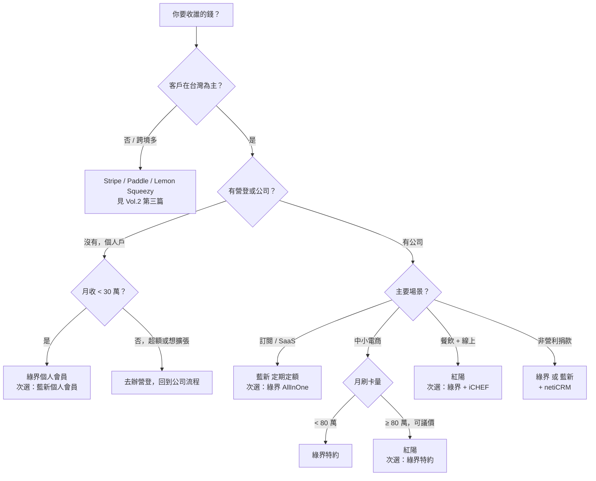

# 怎麼選：六個情境的決策建議

前四篇把紅陽、綠界、藍新拆解到只剩骨頭：歷史定位、費率細節、申請門檻、API 體驗。但拆完零件不會自動組成決策。這一篇把六種台灣最常見的營運情境攤開，每一格給出「主選 / 次選 / 為什麼」，盡量讓你看完三分鐘內就能下單去申請哪一家——而不是再多開十個分頁繼續比較。

## TL;DR

- **個人副業 / 創作者 / 課程預售**：主選綠界個人會員，次選藍新個人會員。理由：免年費、自助開通快、額度夠用[^1][^2]。
- **Indie SaaS / 訂閱型產品**：主選藍新（卡號綁定/定期定額成熟），次選綠界 AllInOne 定期定額。理由：藍新的 token 化與排程回呼較完整；綠界對 indie 開發者門檻更低[^3][^4]。
- **中小電商（月營業 50 萬以上）**：主選綠界特約會員，次選紅陽。理由：綠界生態系最完整、文件最開放；當你願意花時間議價、且每月刷卡量穩定 80–100 萬以上時再評估紅陽[^5][^6]。
- **餐飲 / 實體店 + 線上**：主選紅陽（POS / 刷卡機 / 線上一條龍），次選綠界配合 iCHEF 等 POS 串接[^7]。
- **非營利捐款**：主選綠界或藍新（皆有定期定額 + netiCRM 現成模組），次選 TapPay。理由：定期定額的卡號續期、暫停、改額功能成熟，捐款人不會因為卡片到期斷捐[^8]。
- **跨境試水**：紅綠藍三家都不是最佳解，請改用 Stripe / Paddle / Lemon Squeezy（簡述於後，細節見 Vol.2 第三篇）[^9]。

## 決策樹

下面這張圖把六個情境壓在同一張流程裡，沿著節點走兩三步就能落到一個建議。實際決策時，費率與額度仍要回到第二篇與第三篇細看。

## 情境一：個人副業 / 創作者 / 課程預售

**主選：綠界個人會員。次選：藍新個人會員。**

如果你還沒辦營登、月營業額大概落在 5–30 萬，這是最不痛的起點。綠界個人會員沒有年費、沒有開辦費，註冊後完成身分證與銀行帳號驗證就能開通；信用卡、虛擬帳號、超商代碼、物流貨到付款都能收，30 日累計收款額度為 30 萬（綠界 2026 年 1 月起調整過個人賣家額度規則，務必看當期公告）[^1][^2]。

藍新個人會員也免年費，但「進階會員」才能用線上金流，且高階功能要驗證更多文件，對純收款的副業反而是一道無謂的牆[^10]。

**會踩到的牆**：個人會員只能收一個帳號的款，超過 30 萬就會卡關。如果你預期下半年要做課程預售、群眾募資式的爆量，建議第一天就規劃好升級路徑——要嘛綠界個人額度滿了去辦營登轉特約，要嘛改走 BackMe 等募資平台代收（背後仍是藍新/綠界，但他們吃額度）。

## 情境二：Indie SaaS / 訂閱型產品

**主選：藍新（NewebPay）定期定額。次選：綠界 AllInOne 定期定額。**

訂閱型產品的痛點不在「收第一筆錢」，而在「第十二筆要不要還能扣到」。藍新的卡號綁定 / 定期定額機制把 token 化、過期卡更新、扣款失敗重試、暫停 / 改期 / 改額等情境都納進後台流程，netiCRM 等開源整合也已經把藍新的 API 包裝得相對成熟[^3][^11]。

綠界這幾年補上了 AllInOne 的 `PeriodAmount` 系列參數，可以指定每幾天 / 月 / 年扣一次、共扣幾次，授權成功會 Server POST 回 `PeriodReturnURL`，技術上完全做得到訂閱[^4]。實務上，綠界的優勢是申請門檻最低、文件公開度最高（見第四篇〈API 與開發者體驗〉），對只有一個工程師的 indie SaaS 來說阻力更小。

**選藍新的時機**：你的訂閱有複雜情境——多種方案、年費 vs 月費、升降級按比例退款、團隊席次累加，這些都會用到「修改既有定期單」的後台操作，藍新比較完整[^11]。

**選綠界的時機**：你只賣一個訂閱方案、客戶量還在三位數，把工程時間省下來做產品。

**兩家都得補的洞**：發票串接（電子發票字軌、載具）、訂閱中止與退款的逐次對帳、卡片驗證失敗的 dunning 流程，這些沒有任何一家會替你做完。

## 情境三：中小電商（月營業 50 萬以上）

**主選：綠界特約會員。次選：紅陽。**

綠界特約會員年費約 NT$10,000、開辦費約 NT$5,000，信用卡費率約 2.5%（依產業與量級議價）[^6][^12]。對月營業 50–150 萬的中小電商，這個費率與服務是「不需要思考」的選項：物流、發票、超商代碼、ATM、行動支付一條龍，後台介面也是三家裡最像「電商管理系統」而非銀行內網的那一家。

紅陽的位置比較特殊。它的優勢是「願意議價」與「能跟你長期往來的銀行談聯合方案」，對月刷卡量穩定 80 萬以上、且願意花時間做財務談判的店家，費率有機會壓到 2% 上下[^5]。但紅陽有年費約 NT$12,000、徵信費 NT$800、開辦費 NT$4,000，這些是固定成本——刷卡量沒到，攤下來反而比綠界貴[^13]。

**簡單的損益平衡**：把（紅陽固定成本 vs 綠界固定成本）的差額，除以（綠界費率 − 紅陽議到的費率），就是你「月刷卡量要超過多少」才划算的門檻。多數店家算出來的答案落在月 80–120 萬之間。

## 情境四：餐飲 / 實體店 + 線上

**主選：紅陽。次選：綠界搭配 iCHEF / 微碧 / 點了沒等 POS。**

餐飲業真正在乎的不是線上金流的費率，而是「實體刷卡機 + 線上點餐 + POS + 對帳」能不能在一個窗口處理。紅陽從 1998 年起就是實體刷卡機品牌，後來才把線上金流疊上去，因此對「同一家店、實體與線上共用對帳」的場景最熟[^14]。

如果你已經選定了 iCHEF（號稱台灣超過 15,000 家餐廳用）或微碧等 POS 系統，這些 POS 多數預設整合綠界或藍新，導入摩擦更小[^15]。LINE Pay 在餐飲特別好用，但要注意它通常會額外加 2.2% 上下的交易費[^16]。

**會踩到的坑**：外送平台（Uber Eats、foodpanda）抽成 30–35%，跟金流是兩件事，但會嚴重稀釋你算 1.8% vs 2.5% 信用卡費率時的優化空間。先把外送結構處理好，再回頭談金流費率才有意義。

## 情境五：非營利捐款

**主選：綠界 或 藍新（兩家擇一皆可）。次選：TapPay。**

NPO 最關鍵的功能是「信用卡定期定額」與「卡片到期自動續扣 / 通知」，這是長期捐款人的命脈。綠界與藍新都支援，netiCRM（國內 NPO 圈最常見的開源 CRM）對兩家都有現成模組，且文件包含取消、修改金額、暫停期數等流程[^8][^17]。

**選綠界的理由**：費率較低、自助申請快、適合資源有限的小型團體。
**選藍新的理由**：定期定額功能與後台調整選項較全，對中大型 NPO（捐款人 1,000 名以上、有專人對帳）更舒適。
**為什麼提 TapPay**：如果你想做「自家網站收捐款 + 訂閱式月捐」並且願意付月費／簽 enterprise plan，TapPay 的卡號 token、扣款失敗 webhook、stable API 比紅綠藍更接近 Stripe 體驗——但 NPO 普遍預算緊，這個選項只有規模到一定程度才會划算。

## 情境六：跨境試水

**主選：Stripe / Paddle / Lemon Squeezy（任一）。三家紅綠藍都不是最佳解。**

紅綠藍三家的核心客戶是「在台灣、收台灣人錢」，跨境信用卡、外幣結算、海外 VAT / Sales tax 都不是它們的強項。如果你要：

- 收歐美客戶的美金，並開立合法發票
- 處理 EU VAT、英國 VAT、美國各州 Sales tax、加拿大 GST/HST 等
- 訂閱時做 dunning、smart retry、card updater

請直接用 Stripe（DIY 稅務）或 Paddle / Lemon Squeezy（Merchant of Record，他們替你處理稅）[^9][^18]。2026 年 2 月 Stripe 推出 Managed Payments、4 月 Lemon Squeezy 公告與 Stripe 雙線並行；MRR 在 $100K 美金以下，Lemon Squeezy 仍是 indie 最快上線的選項[^18][^19]。

進一步的策略與稅務細節，見 Vol.2〈台灣 SaaS 出海金流地圖〉第三篇〈Stripe / Paddle / LemonSqueezy 三選一〉。

## 常見的「換家」原因與成本

換金流的故事在每個社群都有，常見觸發點：

1. **撥款週期從 T+7 拖到 T+14 / T+30**：紅陽的特約會員撥款最快可以週撥，綠界、藍新依方案不同。撥款週期會直接影響你的現金流，是換家最常見的原因之一。
2. **費率談不下來**：營業額成長到原本級距的 1.5–2 倍，原本綁定的費率沒有自動跟著降，重新議價談不攏就換家。
3. **API 太悶 / 文件太黑**：第四篇有展開——藍新的部分文件需要登入後才能看，對小團隊真的會卡。
4. **客服 SLA**：金流是「壞掉的時候每分鐘都在燒錢」的系統。客服回應速度、能不能加 LINE 群組，這些書面看不到但會決定你半夜會不會崩潰。

**換家的真實成本**（不要被「我們可以幫你免費搬家」騙）：

- **串接工時**：3–10 個工程日，依你既有架構整潔程度。
- **重新審核**：新金流公司會重跑徵信、特店審查，2–6 週是常態。
- **撥款空窗**：交接期間舊金流的尾款可能延後撥、新金流還在審，現金流會被壓兩三週。
- **發票字軌**：若同時換發票服務，舊字軌要結清、新字軌要申請，財會會罵人。
- **客戶端記憶體**：訂閱用戶要重新授權卡片，舊定期單沒辦法搬，這是最痛的一刀——藍新 → 綠界、綠界 → 藍新 之間沒有 portable token 機制[^11]。

換家不是不能做，但建議第一次選的時候就把「月營業額成長到 3 倍」的場景模擬一次，再決定要進的家門。

---

## 來源

[^1]: 綠界科技 ECPay，〈3-1.註冊及選擇服務〉，<https://support.ecpay.com.tw/4910/>
[^2]: 綠界科技 ECPay，〈【重要通知】自 2026 年 1 月 1 日起調整個人賣家 30 日收款額度〉，<https://www.ecpay.com.tw/announcement/DetailAnnouncement?nID=5946>
[^3]: 藍新金流服務平台，〈定期定額 / 信用卡綁定〉，<https://www.newebpay.com/>
[^4]: ECPay Developers，〈定期定額參數說明〉，<https://developers.ecpay.com.tw/15162/>
[^5]: 電商隨筆，〈紅陽｜綠界｜藍新 – 電商金流服務商比較〉，<https://hsienblog.com/2017/07/17/%E7%B4%85%E9%99%BD%E7%A7%91%E6%8A%80-%E7%B6%A0%E7%95%8C%E7%A7%91%E6%8A%80-%E8%97%8D%E6%96%B0%E7%A7%91%E6%8A%80-%E9%87%91%E6%B5%81%E6%9C%8D%E5%8B%99%E5%95%86%E6%AF%94%E8%BC%83/>
[^6]: CYBERBIZ 部落格，〈2026 電商金流懶人包：3 分鐘搞懂全通路整合多元支付〉，<https://www.cyberbiz.io/blog/2020%E9%9B%BB%E5%95%86%E9%87%91%E6%B5%81%E6%87%B6%E4%BA%BA%E5%8C%85-%E5%85%A8%E9%80%9A%E8%B7%AF%E6%95%B4%E5%90%88%E3%80%8C%E5%A4%9A%E5%85%83%E6%94%AF%E4%BB%98%E3%80%8D/>
[^7]: 3hope，〈銀行、第三方金流服務提供商該怎麼選？綠界、藍新、紅陽哪個最划算〉，<https://3hope.com/post/76302>
[^8]: netiCRM，〈非營利組織線上捐款金流怎麼選？藍新、綠界、Tappay、MyPay 四大平台比較表〉，<https://neticrm.tw/resources/255>
[^9]: Monolit Blog，〈Stripe vs LemonSqueezy vs Paddle for SaaS Billing: Which Should Founders Choose in 2026?〉，<https://monolit.sh/blog/stripe-vs-lemonsqueezy-vs-paddle-saas-billing-compared-2026>
[^10]: 藍新金流服務平台，〈會員註冊頁面〉，<https://www.newebpay.com/website/Page/content/register>
[^11]: netiCRM，〈藍新金流用戶修改定期定額訂單（金額、期數、頻率、扣款日、暫停）〉，<https://neticrm.tw/resources/6839>
[^12]: Less Is More 先鋒教育，〈藍新金流 vs 綠界科技，手續費與服務比較〉，<https://lessismoreedu.com/%E8%97%8D%E6%96%B0%E9%87%91%E6%B5%81-vs-%E7%B6%A0%E7%95%8C%E7%A7%91%E6%8A%80%EF%BC%8C%E6%89%8B%E7%BA%8C%E8%B2%BB%E8%88%87%E6%9C%8D%E5%8B%99%E6%AF%94%E8%BC%83%E5%85%A7%E6%9C%89%E5%84%AA%E6%83%A0/>
[^13]: iT 邦幫忙，〈第 19 天 – 紅陽｜綠界｜藍新 電商金流服務商比較〉，<https://ithelp.ithome.com.tw/articles/10196263>
[^14]: 紅陽科技，〈紅陽金流服務申請〉，<https://esafe.com.tw/serviceAPP/Product/Buysafe.aspx>
[^15]: iCHEF POS，〈台灣超過 15,000 間餐廳選用的 AI 點餐系統〉，<https://www.ichefpos.com/>
[^16]: 微碧愛普科技，〈2026 最新線上點餐系統比較〉，<https://blog.weiby.tw/online-ordering-801/>
[^17]: netiCRM，〈藍新（原智付通）金流設定〉，<https://neticrm.tw/resources/2334>
[^18]: Lemon Squeezy，〈2026 Update: Lemon Squeezy + Stripe Managed Payments〉，<https://www.lemonsqueezy.com/blog/2026-update>
[^19]: globalsolo，〈Stripe vs Paddle vs Lemon Squeezy (2026): Which Is Cheapest?〉，<https://www.globalsolo.global/blog/stripe-vs-paddle-vs-lemon-squeezy-2026>
