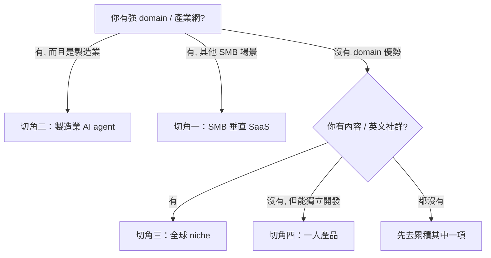

# 2026 年台灣 SaaS 還有哪些題目可做

## TL;DR

- **錢變少、題目沒變少**。台灣新創 2026 Q1 只募到 $575K（年減 98.9%），但 91APP 還是願意掏近 10 億現金全現金收購 iCHEF——買的是「高頻場景 + 數據入口」。有 retention、有定價權的垂直 SaaS 反而變得更值錢。
- **四條線還沒被吃完**：SMB 垂直（POS、ERP、物流、訂位、MarTech）、製造業 AI agent（把老師傅經驗轉成 RAG）、全球 niche（一開始就用英文做全世界的小市場）、一人產品（Photo AI 一個人 $138K/月）。四條線的獲客邏輯、毛利結構、退場預期完全不同，不要混著想。
- **先挑題目，再挑工具**。第二篇會講 vibe coding 怎麼做、第三篇會拆 stack、第四篇會講 GTM。這一篇只回答一個問題：**你要做的那個東西，市場在哪裡、你憑什麼吃到**。

## 為什麼「募資寒冬」反而是蓋 SaaS 的好時機

根據 Tracxn[^tracxn] 的資料，台灣新創 2026 Q1 只完成 3 輪募資、總額 $575K，跟 2025 Q1 的 $52.3M 相比掉了 98.9%。這是一個很誇張的數字，但它**不代表市場在萎縮**，它代表的是**VC 退場、自營現金流回來**。

同一時間，Cursor 不到 50 人跑到 $500M ARR、Lovable 45 人八個月內拿下歐洲獨角獸地位、Midjourney 約 107 人產出 $500M 年收（約 $4.7M/員工）。Andrej Karpathy 2025 年 2 月造出來的「vibe coding」這個詞，在 2026 年 YC W26[^ycw26] 那 199 家公司、60% 是 AI、11% 是 solo founder 的批次裡，已經變成背景設定。

**SaaS 從沒這麼好蓋，也從沒這麼難拿 VC 的錢**。兩件事同時成立的時候，Pieter Levels[^levels] 講的那句話就不再只是 indie 宗教——「大部分新創不需要 scale，他們需要的是 profitable」。這個時代的台灣團隊要問的問題不是「我能不能拿到 Series A」，而是「我能不能不靠 Series A 做到 $1M ARR」。

下面四條線，就是 2026 年回答這個問題最有勝算的四個地形。

## 切角一：SMB 垂直 SaaS——最擠也最肥的一條線

這條線是**被驗證過的、毛利會活的、台灣人做得最順手的**一條，但門檻也最高。

**市場尺寸**。台灣中小企業占全體企業家數 97.63%、佔就業人口八成以上；PwC Taiwan 與行政院統計交叉後的數字是「98% 是中小企業，其中超過六成尚未啟動任何形式的數位轉型」。這個「六成」就是 SMB SaaS 的總潛在市場（TAM[^tam]）——不是「已經在用 ERP 想換一套」的升級池，而是「還在用 Excel 和 LINE 對帳」的增量池。

**誰已經在做、為什麼還有空間**。把旗艦級玩家攤開就看得出來：

- **iCHEF**[^ichef]（2012）：餐飲 POS，15,000 家餐廳，2025 年 11 月被 91APP[^91app] 以 $32M 全現金收購。91APP 買的不是 POS 本身——台灣 POS 市場最高市佔也不到 15%——買的是**高頻剛需交易場景**和**會員數據入口**（bnext 的分析直接類比日本 Smaregi，後者 4.5 萬家店、漲價 15% 後 churn 仍只有 0.46%）。
- **91APP**（電商 SaaS）：2026/01 單月營收 NT$198M，年增 25.62%，是近四年最大單月年增。電商寒冬時還在成長，因為它已經垂直到「會員 + AdTech + 零售 + 餐飲」一整條。
- **GoFreight**[^gofreight]（物流 SaaS）：2016 成立、Series A $23M（2022 Flex Capital + Headline 共同領投），現在 1,000+ 家貨代客戶，被自己定位成「freight forwarding 的 Shopify」。
- **awoo**（MarTech）：16,000+ 企業客戶、30 人 AI Lab，日本市場規模被他們自己估為台灣 10 倍，以東京為拠點打出去。
- **Rezio**（KKday 旗下旅遊訂位 SaaS）：5,000+ 商家，從台日雙邊擴進東南亞。

**台灣團隊的獨特優勢**：產業 know-how 稠密（製造、物流、餐飲、電商任一個都有 30 年累積）、客戶夠密集便於 onsite 迭代、工程師成本在全球級 SaaS 估值模型下相對划算。**限制**：SMB 願付價格低、客戶獲取成本高、一定要做到多垂直交叉（91APP 的 "EveryTech SaaS" 戰略就是這個路數）才吃得到 LTV。

**你屬不屬於這條線**：你或你的共同創辦人**在某個產業裡幹過五年以上、能用業內黑話跟老闆對話**——屬。你沒有，但你有耐心跑 100 家店一家一家談——勉強屬。你只會寫 code，希望「找個 PM 跟我配」——不屬，先去該產業上兩年班。

## 切角二：製造業 AI agent——台灣最不該錯過的戰場

這條線最硬、最台灣、也最少人做對。

**市場指標**。台灣製造業 90% 以上面臨缺工（ManpowerGroup 排名全球第一）；工研院與數發部多次強調「老師傅經驗流失」是第一號危機。同時，TSMC、ASE 這類頭部製造業已經公開把 AI agent 用在 predictive maintenance、wafer 缺陷視覺檢測、產線自我優化。頭部吃頭部資源，**中型製造廠（年營收 5–50 億新台幣那一群）才是 SaaS 的戰場**——他們付得起一年 NT$50 萬到 NT$500 萬的授權費，付不起一套 SAP。

**已經在做的案例**。**Morale AI**[^morale]（2023，清華育成）是目前最能講清楚商業模式的：TextileGPT 把 28 年紡織業資料餵進 RAG、品質異常投訴系統用 5W1H + RAG 讓工程師秒查到類似案例、ESG 平台協助碳盤查。收費模式很直白——產品費 + 導入費 + 年度授權費（因為 LLM 要持續更新）。客戶包含日月光（ASE）、紡織所、青美。另有 **Virphysio**（醫療 digital twin）、**MetAI、Spingence**（2026 NVIDIA GTC featured）等。

**為什麼還有空間**。台灣有 13 萬家製造業，每個細分（紡織、塑膠、金屬加工、電子組裝、食品加工……）都是獨立題目、獨立詞彙、獨立老師傅。通用 LLM 打不進去，通用 SaaS 沒人要——**領域 RAG + 工廠場域的 AI agent**，現在沒有巨頭能規模化吃。這也是為什麼數發部 2025 年啟動的「加強投資 AI 新創實施方案」[^moda]（10 年 NT$100 億、1:1 配投最高 2:1、單案上限 NT$1 億、單企業上限 NT$1.5 億）把 SaaS 跟數位轉型列為核心焦點——政策 matching fund 在這條線上是真的能被拿到的。

**台灣團隊的優勢**：製造業關係網、工程師能進廠、客戶在隔壁。**限制**：銷售週期長（6–18 個月）、需要熟業師導入、不是 self-serve，標準 PLG[^plg] 打法失效。

**你屬不屬於這條線**：你有能力**帶一個 domain expert 進廠駐點三個月**——屬。你能 demo 但沒有製造業關係——不屬，這題沒有 growth hack。

## 切角三：全球 niche——一開始就不做台灣市場

這條線是台灣最常輸的，但 2026 年開始最可能贏。

**市場結構**。Micro SaaS 全球市場 $15.7B（2024）→ 預估 $59.6B（2030），30% CAGR，垂直 niches 成長速度是大平台的 3.4 倍。YC W26 批次 60% 做 AI、11% 是 solo founder，Emergent 這種 autonomous coding agent 七個月跑到 $50M ARR——全球化的 distribution 跟工具門檻都已經被 AI 拉平。

**誰在做、為什麼還有空間**。最乾淨的對照組是 Appier——2012 台灣起家、2021 東京上市、FY25 營收 JPY 43.7B（年增 28%），現在被 JPX 選入「Startup Acceleration 100」。但 Appier 是 VC 路線；**2026 的台灣 niche 玩家更可能長得像 Photo AI**[^photoai]（Pieter Levels 一個人 $138K/月、佔他 $3M ARR 營收七成）。中間還有 **Skiesoft**[^skiesoft]（台灣最大醫療 AI scribe、12 萬 + 醫護用戶，2026 年共同創辦人進 YC W26）這種「在地起家、全球 distribution」的混血體。

**你的北極星**：從第一天起 landing page 就寫英文、定價用 USD、付費用 Stripe、客服用 Intercom/Crisp；**不要**做給台灣市場再翻譯。這是 Levels、Tony Dinh、marc lou 這類人講了五年但台灣團隊最常跳過的步驟。

**台灣團隊的優勢**：時區橫跨美歐亞、工程師英文不至於卡關、成本結構吃得起全球 PPP 定價。**限制**：distribution 不熟——Reddit、Product Hunt、HN、X、個人 branding 都要自己玩。

**你屬不屬於這條線**：你的**原生內容（部落格、Twitter、Discord）**已經在累積——屬。你從沒在英文社群發過東西、也不想做 personal brand——不屬，會做出沒人看的好產品。

## 切角四：一人產品——最被低估也最被過度吹捧

Dario Amodei 給的 70–80% 機率——2026 年會出現第一家 one-person unicorn——一半是行銷、一半是真的。

**已經成立的部分**：Pieter Levels 一個人 $3M ARR、Photo AI 佔 70%；Midjourney $500M 營收 / 107 人 ≈ 每人 $4.7M（這已經是小團隊、不是純一人）；Cursor 不到 50 人 $500M ARR；Scalable.news 2026 年初資料——solo-founded 新創占比 36.3%。**工具鏈**（Cursor / Claude Code / Lovable / Replit / Supabase / Stripe / Vercel / Resend）把「一週做出會收錢的產品」變成週末工作。

**還沒成立的部分**：**一人 unicorn 還沒出現**。Levels 是 solo 但也花了 10+ 年；Cursor、Lovable 都不是一個人。真正一個人做、又真的過 $1M ARR 的例子還是少數——大部分「solo SaaS」在 $10K–$100K MRR 就停住了，因為 support、合規、邊緣 bug 會吃掉一個人的所有時間。

**你屬不屬於這條線的線索**：

- 你**已經**有一個跑起來的小產品、或一群願意掏錢的讀者/followers——屬。
- 你對「自己寫 blog、自己剪 YouTube、自己回客訴」不反感——屬。
- 你還在想「我什麼時候可以開始招人」——不屬，你要找的是共同創辦人不是做 solo SaaS。

---

## 四條線怎麼選（判斷流）

四條線不是互斥的，但第一天不要想做兩條。Appier 做大了之後才變多垂直；Levels 有 Photo AI 之後才有籌碼做下一個 solo 產品。**先找到一條線裡你最有不公平優勢的角落**，其他三條留給第二產品。

截至 2026-04，台灣新創 Q1 募資數字難看、題目數字卻很好看——這兩件事從來不會長時間並存。錢遲早會回來，而到時候有 retention、有現金流、有 domain 的團隊會被第一個挑走。

---

[^tracxn]: 全球新創與私募市場情報平台，以自建與 AI 協作的方式追蹤各國輪次、金額與投資人，常被媒體引用為「某地當季募資表現」的代表性資料來源。
[^ycw26]: Y Combinator 2026 年冬季梯次（Winter 2026）的簡稱。YC 是矽谷最老牌的加速器，每年兩梯，近年以高比例 AI 新創與 solo founder 作為觀察全球新創風向的指標。
[^levels]: Pieter Levels，荷蘭籍獨立開發者，以 Nomad List、Remote OK、Photo AI 等一人產品聞名；長年公開自己的營收（MRR/ARR），是 indie hacker 社群的精神代表。
[^tam]: Total Addressable Market，總潛在市場。指若某產品能完全壟斷目標市場時可達到的最大年營收規模，是募資簡報與產品策略常用的基礎估值指標。
[^ichef]: 2012 年成立的台灣餐飲 POS（店面收銀／點餐系統）公司，主打 iPad POS 與雲端會員，是台灣餐飲數位化最具代表性的品牌之一，2025 年被 91APP 全現金收購。
[^91app]: 台灣上市的新零售／電商 SaaS 服務商，提供品牌自有商城、會員、行銷自動化、OMO 一站式平台，客戶多為中大型零售與品牌商。
[^gofreight]: 台灣出身的國際物流 SaaS，專做「貨運承攬業」（freight forwarder）的報價、訂艙、帳務與文件流程，以美國市場為主要收入來源。
[^morale]: 2023 年自清華大學育成的台灣 AI 新創，專攻製造業場域的領域 LLM 與 RAG 應用，代表產品 TextileGPT 以紡織業 know-how 為語料訓練。
[^moda]: 數位發展部（Ministry of Digital Affairs）於 2025 年啟動的「加強投資 AI 新創實施方案」，透過 1:1 至 2:1 的政府配投引導民間創投資金進入 AI 與 SaaS 新創。
[^plg]: Product-Led Growth，產品導向成長。指以產品本身（免費試用、自助註冊、內建分享）驅動獲客與轉換的商業模式，相對於依賴業務或 marketing 的銷售導向路線。
[^photoai]: Pieter Levels 開發的 AI 自拍生成服務，讓使用者上傳幾張照片後產生各種風格的個人影像，為其個人事業中營收最大的單一產品。
[^skiesoft]: 台灣醫療 AI 新創，主力產品是「AI 醫療書寫助手」（AI scribe），協助醫師把看診對話自動轉成病歷，2026 年以共同創辦人身份入選 YC W26。

## 來源

1. [Startups in Taiwan — 2026 Latest Funding Rounds, Trends and News](https://tracxn.com/d/geographies/taiwan/__U8GDl4awwVuue4gHaC8tZ-HX58ubRjOI9M7eHe3-wgo) — Tracxn, 2026-04
2. [91APP Acquires 100% of iCHEF to Strengthen SaaS and AI Leadership](https://91app.com/en/blog/91app-202511-ichef/) — 91APP Newsroom, 2025-11-13
3. [91APP 靠一筆併購，直接買下「高頻場景＋會員數據」捷徑](https://www.bnext.com.tw/article/85611/91app-ichef-acquisition-smaregi-saas) — 數位時代 BusinessNext, 2025-11
4. [數發部 AI 百億投資方案 攜創投打造下一波獨角獸](https://www.cio.com.tw/87937/) — CIO Taiwan, 2025
5. [從千封文件中一鍵找答案，Morale AI 如何讓製造業技術傳承更輕鬆](https://meet.bnext.com.tw/articles/view/51820) — Meet 創業小聚
6. [Appier Delivers Record Results Driven by Agentic AI Innovation (FY25)](https://www.prnewswire.com/apac/news-releases/appier-delivers-record-results-driven-by-agentic-ai-innovation-302687512.html) — PR Newswire / Appier, 2026
7. [How Pieter Levels Built a $3M/Year Business with Zero Employees](https://www.fast-saas.com/blog/pieter-levels-success-story/) — FastSaaS, 2025-11
8. [YC W26 Batch Breakdown: Deep Dive on 199 Companies](https://www.extruct.ai/research/ycw26/) — Extruct AI, 2026
