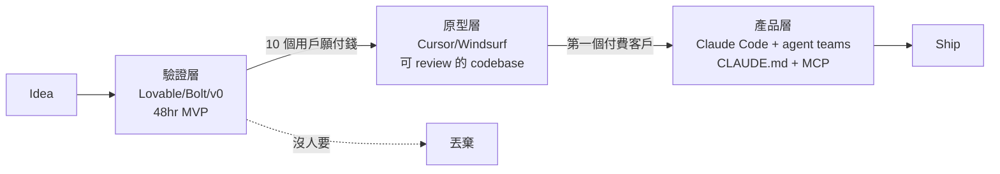

# 從 idea 到 ship 的 2026 版方法學

## TL;DR

2026 年蓋一個 SaaS，已經不是「找到工程師」的問題，而是「怎麼把 AI 排進工序」的問題。真正拉開差距的不是你用 Cursor 還是 Claude Code[^claude-code]，而是三件事：第一，你能不能把驗證階段和產品階段的工具拆開——Lovable[^lovable]、Bolt[^bolt]、v0 負責「明天給我一個能點的東西」，Cursor、Claude Code 負責「這東西要再活兩年」；第二，你有沒有把 `CLAUDE.md`[^claude-md] 與 MCP[^mcp] 當一等公民——agent 不是 prompt 好就會乖，是你給它的 context 夠不夠乾淨；第三，你知不知道什麼時候要從 vibe code[^vibe-coding] 畢業——資安漏洞、企業客戶的 SOC 2[^soc2] 問卷、第一次要改超過三個檔案的 bug，是三個明顯的訊號。這一篇不談 idea，只談「怎麼做」。

## vibe coding 成熟在哪、壞在哪

「vibe coding」這個字 2025 年還帶點嘲諷，2026 年已經是一整個產業類別。Lovable 在 2026 年 2 月做到 400M 美金 ARR、每天 20 萬個新專案被建立（截至 2026-02）；Bolt.new 在六個月內衝到 40M ARR；Replit 的 Agent 3 發表後把公司估值從 3B 推到 9B（截至 2026-03）。這些數字說明一件事：非工程師可以在一個下午把一個「看起來像 SaaS」的東西做出來，已經是真的。

但「看起來像」和「活得下來」是兩回事。2026 年 2 月，資安研究者 Taimur Khan 在一個 Lovable 託管的應用裡找出 16 個漏洞，其中 6 個 critical，外洩 18,697 筆資料，包含 4,538 名 UC Berkeley / UC Davis 學生帳戶。同年 3 月 3 日他再通報一個 BOLA（Broken Object Level Authorization）漏洞——任何註冊用戶都能讀到其他專案的原始碼、資料庫憑證、AI 對話紀錄——這個漏洞被當成「duplicate submission」晾了 48 天。更大規模的一份掃描顯示，一個 1,645 支 Lovable app 的樣本裡，約 70% 完全關掉了資料庫的 Row Level Security（截至 2026-04）。

這不是 Lovable 一家的問題。Trend Micro 2026 年 3 月發佈的研究掃了 5,600 個公開部署的 vibe-coded 應用，找出 2,000 個高危漏洞、400 個外洩的 API 金鑰、175 筆含醫療或金流的個資。另一個廣被引用的數字：AI 輔助的 commit 洩密率是人類的兩倍（3.2% vs 1.5%）。

所以 vibe coding 的成熟度是：**前 70% 神速、最後 30% 會殺人**。你可以用它證明「這東西有人要」，但不能用它證明「這東西能上線」。這個邊界，是 2026 版方法學的起點。

## 驗證 / 原型 / 產品三階段的工具分工

我把工具依用途分三層，每層放棄的東西不一樣。

**驗證層（0 到能給人看）：Lovable / Bolt / v0**

這一層要的是速度，不是品質。目標是「48 小時內給 10 個潛在用戶一個網址」。Lovable 內建 Supabase，適合需要登入與資料庫的全棧 MVP；Bolt 的 WebContainer 在瀏覽器裡跑 Node.js，前端彈性最大但沒有原生資料庫；v0 只做前端，但生出來的 React / Tailwind 乾淨到可以直接貼進 Next.js 專案。台灣團隊在這一層該做的決定不是「用哪個」，而是「我為了這個驗證，願意燒多少 credit」——Bolt 與 Lovable 都有 token 耗用暴衝的狀況，一個複雜 prompt 就可以吃掉一天額度。

**原型層（能給人看到值得寫 code 的信號）：Cursor / Windsurf + 現有 codebase**

驗證通過、確定要做之後，把 Lovable 匯出的 code 拉進本地的 Cursor 或 Windsurf。這一層的工作是「把 vibe code 的產物變成能 code review 的東西」。Cursor 2026 年 1 月釋出 CLI 的 Plan Mode 與 Cloud Handoff——前者強迫 agent 在動手前先問清楚、產出 plan，後者讓你把本機對話推到雲端繼續跑；3 月又上了 self-hosted agents 與 JetBrains 整合（截至 2026-03）。這層的重點是「人類還在 loop 裡」，agent 寫 code、你 review diff、跑測試。

**產品層（這東西要活兩年）：Claude Code + 自建 infra**

Pragmatic Engineer 2026 年 2 月的 906 人開發者調查裡，Claude Code 以 46% 的「最愛」比例排名第一。它的強項不在 UI，而在 CLI + 明確的工作流：subagents、parallel execution、git worktree 隔離。Claude Code v2.1.32（2026-02-05）推出 Agent Teams，多個 agent 在共享 codebase 上平行工作、由一個 team lead 分派任務，一個案例從 4 小時的 feature 壓到 45 分鐘。這層的精神是「把 agent 當員工」——你寫 spec、它寫 PR、你做 code review，跟管一個遠端工程師沒兩樣。

三層之間要明確交接。我看過最多的翻車案例是團隊在 Lovable 上一路幹到有付費用戶，然後發現要加一個「第二種用戶角色」就得全部重寫——因為第一階段根本沒規劃資料模型，全靠 AI 臨場腦補。驗證層的產物應該被當成**可丟棄的簡報**，不是 codebase。

## context engineering 是什麼、台灣團隊的 CLAUDE.md / MCP 實務

2026 年取代 prompt engineering 的字叫 context engineering。定義很簡短：**主對話保持小、專案規則明確、記憶分層、工具層刻意設計、驗證步驟不可省**。GitHub 上 `CLAUDE.md` 這個檔名的 repo 在 2026 年 Q1 超過 60,000 個；enterprise 的 multi-agent 查詢量年增 1,445%。

台灣團隊常見的誤區是把 `CLAUDE.md` 寫成「AI 使用手冊」——越長越好、越詳細越好。但實際數據打臉：一份 Anthropic 2026 年 3 月的內部研究指出，**開發者手寫的 context 檔比沒有 context 提升 4% 任務成功率，LLM 自動生成的 context 檔反而讓成功率下降 3%，推論成本漲 20%+**。短、手寫、常更新才是正解。建議最小可行版本只涵蓋四件事：技術棧（語言、框架、runtime 版本）、3–5 條不能破的慣例、build / test 指令、一個從 code 看不出來的架構決策。超過 100 行通常就是灌水。

MCP（Model Context Protocol）在 2026 年已經是 Cursor、Claude Code、Windsurf 的共同支援協定，SDK 月下載量從 2024 年 11 月的 2M 漲到 2026 年 3 月的 97M，GitHub 上有 13,000+ 個 MCP server。對台灣團隊最實際的用法是：把 Supabase、Notion、Linear、公司內部 API 用 MCP 接上 agent，而不是每次都複製貼上 schema。但 MCP 不是免費午餐——Perplexity CTO Denis Yarats 在 2026 年 3 月公開說他們改回傳統 API + CLI，理由是 MCP 吃掉太多 token、認證太煩、agent 自主性反而下降。

實務建議：外部系統（資料庫、issue tracker）用 MCP，內部工具（build、deploy、測試）用 CLI 讓 agent 直接呼叫。兩者混用，別迷信單一協定。

## 什麼時候該從 vibe code 畢業

三個明確訊號：

**第一，第一次遇到「改一個地方壞三個地方」。** 這代表 agent 在 prompt 時已經無法一次看懂整個依賴圖。通常發生在 codebase 超過 10K 行、或有兩個以上的使用者角色。這時硬留在 Lovable 只是用更多 credit 換更慢的速度。

**第二，企業客戶第一次丟來資安問卷。** SOC 2、ISO 27001、或只是一張 50 題的 security questionnaire——問「你的密碼雜湊用什麼演算法」「你的 session timeout 多久」「你有沒有做 SQL injection 防護」。Lovable / Bolt 產出的 code 你答不出來，因為你沒寫過。Retool 2026 年 3 月那篇〈The Risks of Vibe Coding〉把這個叫「enterprise readiness cliff」——過不去就卡在 SMB。

**第三，要處理真錢、真個資、或真的法律責任。** 86% 的 AI 生成 code 樣本帶 XSS 漏洞；2026 年 1 月 28 日上線的 AI 社群 app Moltbook，三天內被發現整個 production 資料庫外洩，包含 150 萬筆 API token 與 3.5 萬個 email——這東西本來是用 vibe coding 蓋的。一旦你的產品會碰到錢或 PII，就該把 security review 排進流程，最簡單的方法是產品層只用 Claude Code、手寫或 agent 寫的 code 都強制跑一輪 Snyk / Semgrep / Checkmarx，commit hook 擋金鑰外洩。

從 vibe code 畢業不代表放棄 AI——**是把 AI 從「幫我寫完這個 app」降級成「幫我寫這個 function，我來決定它怎麼接進系統」**。這兩句話聽起來很像，但成本差十倍、責任差一百倍。

[^vibe-coding]: vibe coding 指使用者以自然語言描述需求，由 AI 直接生成可執行應用的開發模式，由 Andrej Karpathy 於 2025 年提出。特徵是使用者不讀 code、只看結果，由 AI 代理完成架構決策與實作。

[^lovable]: Lovable 為瑞典公司推出的 AI 全棧 app 生成平台，內建 Supabase 整合，目標受眾為非工程師。使用者以對話方式描述需求，產出含前端、後端、資料庫的完整應用，並可一鍵部署。

[^bolt]: Bolt.new 由 StackBlitz 推出，使用 WebContainer 技術於瀏覽器內執行 Node.js 環境，提供 AI 驅動的前端原型開發。特色是前端框架彈性高，但不提供內建資料庫服務。

[^claude-code]: Claude Code 是 Anthropic 官方推出的 CLI 開發代理工具，以終端機為主要介面，強調 subagent、parallel execution、git worktree 等工程化工作流，定位偏向資深開發者與團隊協作場景。

[^claude-md]: `CLAUDE.md` 是放在 repo 根目錄的純文字檔，用於告訴 Claude Code 這個專案的技術棧、慣例、build 指令等脈絡資訊。每次對話啟動時會被自動讀入，作為專案級的長期記憶。

[^mcp]: MCP（Model Context Protocol）是 Anthropic 於 2024 年底提出的開放協定，用來標準化 AI 代理與外部工具、資料源之間的連線方式。Cursor、Claude Code、Windsurf 等主流 IDE 皆已支援，被視為 AI 工具整合的 USB-C。

[^soc2]: SOC 2 是美國 AICPA 制定的服務組織資安稽核標準，針對安全性、可用性、處理完整性、機密性、隱私五項原則做稽核。美國 B2B SaaS 與企業客戶簽約前常要求供應商提供 SOC 2 Type II 報告。

---

**來源**

- [Cursor CLI Agent Modes and Cloud Handoff（2026-01-16）](https://cursor.com/changelog/cli-jan-16-2026)
- [Lovable security crisis: 48 days of exposed projects — The Next Web（2026-04）](https://thenextweb.com/news/lovable-vibe-coding-security-crisis-exposed)
- [The Real Risk of Vibecoding — Trend Micro（2026-03）](https://www.trendmicro.com/en_us/research/26/c/the-real-risk-of-vibecoding.html)
- [Context Engineering: The AI Coding Skill That Matters in 2026 — Blink Blog（2026-03）](https://blink.new/blog/context-engineering-ai-coding-guide)
- [MCP in 2026: The Protocol That Replaced Every AI Tool Integration — dev.to（2026-03）](https://dev.to/pooyagolchian/mcp-in-2026-the-protocol-that-replaced-every-ai-tool-integration-1ipc)
