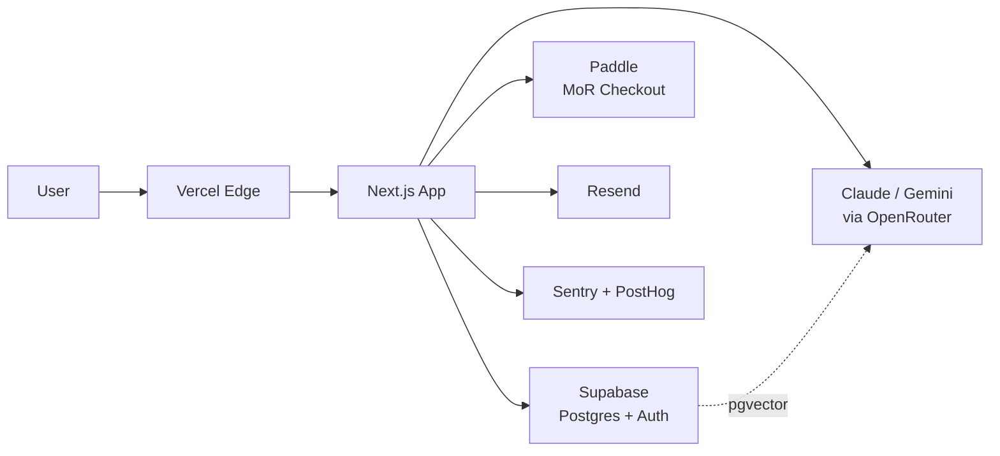

# 一個台灣開發者的 2026 SaaS stack

## TL;DR

- **2026 一個人可以在 $100/月之內把一支有用戶、有金流、有監控的 SaaS 跑起來**——前提是 auth、billing、email、observability 這四件事**完全不自己寫**。
- 台灣開發者的棧跟矽谷 indie 八成重疊，但有三個結構性差異要先處理：**金流不是 Stripe**（Vol.2 已談，2026 依然如此）、**中文索引與朗讀**要自己調 tokenizer、以及**東亞時區**讓「凌晨的 AI agent 跑批次」這件事特別划算。
- 三級預算的分界不是「功能多寡」，而是「**什麼時候停止省 infra 的錢，改去買時間**」——過了 $500/月這條線，再省 $50 都是自我感動。

## 分層看：今天該用哪些工具

把一個典型的 SaaS 拆成六層，我目前（截至 2026-04）預設的選擇如下。很多理由在 Vol.3（Vercel）、Vol.4（Supabase）、Vol.2（金流）已經展開，這邊只補差異點。

### 前端與邊緣：Vercel

Pro plan $20/開發者/月，含 1 TB Fast Data Transfer 與 10M Edge Requests，還有 $20 usage credit 可以抵超額。Hobby 免費但限非商用。Vol.3 已經寫過 Vercel 為何是 AI-era 預設——這邊補一個台灣觀察：**Vercel 的 PoP 在東京，對台灣用戶 RTT 穩定在 50ms 內**，比把 Next.js 自架在 GCP `asia-east1` 還要省事，只有企業客戶堅持「要放在台灣 region」時你才會真的需要跳開。

### 後端與資料庫：Supabase

Free tier 給 500 MB DB、50,000 MAU[^mau]、5 GB egress，Pro $25/月含 8 GB DB、100,000 MAU、250 GB egress。Vol.4 已經把 Postgres 為何適合當 BaaS 核心講完。新加的實務點：**Auth 這件事直接用 Supabase Auth 就好，不要同時插 Clerk**——Clerk Free 只給 10,000 MAU，Pro $25/月起再加 $0.02/MAU，到 50K MAU 你的 auth 帳單就破 $800/月。除非你要 enterprise SSO，WorkOS 的 User Management 免費給到 1M MAU（SSO 另外每個連接 $125），那種時候再切過去。

### AI 層：Claude + Gemini 的分工

**截至 2026-04，我的預設是 Sonnet 4.6 做主力（$3/M input、$15/M output），Haiku 4.5 做小任務（$1/M、$5/M），Opus 4.7 只在真正需要 reasoning 的時候叫**。Opus 4.7 頭條價還是 $5/$25，但 4 月 16 日剛換 tokenizer，同樣輸入會被切成 1.0x–1.35x tokens，帳單會悄悄長出來，記得重新量。

**Prompt caching[^prompt-caching] 是 2026 降本的核心**。cache read 只要 0.1x base input，等於 90% off；cache write 第一次要付 1.25x（5 分鐘 TTL）或 2x（1 小時 TTL）。系統提示與長 context 務必丟進 cache，沒 cache 過的 agent workflow 帳單會非常難看。批次任務再多一個 Batch API[^batch-api] 50% 折扣可以吃。

Gemini 2.5 Flash（$0.30/M、$2.50/M）便宜到該被拿去做非關鍵分類、摘要、embedding 前處理；Pro 在 200K 以內 $1.25/$10、超過 $2.50/$15。需要多家比較時走 OpenRouter[^openrouter]，它不加成只賺轉介費，跨家切換只要改 model 字串。

### 付款：Paddle（Vol.2 已鎖定）

Stripe 不收台灣個人商家這件事 Vol.2 寫過。2026 的新變化是 Stripe 在 Q1 把自家 MoR[^mor] 放到 private beta，據傳會在標準手續費上再加 3.5%，比 Paddle 的 5% + $0.50 還要貴；Lemon Squeezy 被 Stripe 併後，新開戶的 indie 已經明顯往 Paddle、Polar、Creem 這幾家分流。對一個 $29–99/月訂閱制 SaaS，**Paddle 依然是成本與合規的最佳折衷**。

### 觀察：Sentry + PostHog 或 Better Stack 二選一

Sentry Developer 免費（5K events、單人、30 天 retention）、Team $26/月起 50K events。PostHog 免費額度非常闊綽——1M events、5K session replay、100K errors/月，一家把 product analytics、feature flag、A/B test、session replay、error tracking 全包，indie 到 $500/月預算以前幾乎用不完。Better Stack 把 log + uptime + incident 打包在一起，免費含 3 GB log 與 10 個 monitor，$25/月起給 40 GB。**不要三家都裝**，選「error + product analytics」或「log + uptime」其中一組即可。

### 郵件：Resend

SendGrid 2025 年 5 月砍掉永久免費額度後，**Resend 在 indie 圈已經是事實上的預設**。Free 永久 3,000 封/月（上限 100/日、1 個 domain），Pro $20/月給 50,000 封與 10 個 domain，Scale $90/月給 100,000 封。API 乾淨、React Email 可以寫 component 當模板，DX 明顯強於 SendGrid。生命週期郵件想走 drip 再加 Loops（$49/月 5K 聯絡人），兩者分工不重疊。

## 月預算 $100 / $500 / $2000 三級範例

以下是我自己或朋友真的在跑的組合，截至 2026-04 的月費估算（不含 AI tokens）：

| 層 | $100 級（pre-revenue） | $500 級（有第一批客戶） | $2000 級（正在成長） |
|---|---|---|---|
| 前端 | Vercel Hobby（$0，自用）或 Pro $20 | Vercel Pro $20 | Vercel Pro $20 × 2 seat = $40 |
| 後端/DB | Supabase Free $0 | Supabase Pro $25 | Supabase Pro $25 + compute upgrade $60 |
| Auth | Supabase Auth 內建 $0 | Supabase Auth $0 | Supabase Auth + WorkOS SSO（首個連線 $125）|
| AI | Claude Haiku + cache，估 $20–40/月 | Sonnet 為主，估 $150/月 | Sonnet + Opus 混用，估 $800/月 |
| 付款 | Paddle（5% + $0.50/筆，不收月費）| Paddle 同上 | Paddle 同上 |
| 郵件 | Resend Free $0 | Resend Pro $20 | Resend Scale $90 |
| 觀察 | Sentry Dev + PostHog Free $0 | Sentry Team $26 + PostHog Free $0 | Sentry Business $80 + PostHog 付費 ~$150 |
| 儲存 | Supabase Storage 1 GB $0 | Cloudflare R2 10 GB ≈ $0.15 | R2 100 GB ≈ $1.50 + CDN |
| Domain | $12/年（攤 $1）| $1 | $1 |
| **合計** | **約 $40–60/月** | **約 $240/月** | **約 $1,370/月** + AI 超額 |

三件事值得標出來：

1. **$100 預算其實綽綽有餘**——AI token 沒跑起來以前，infra 常常用不到 $50；剩餘的錢應該拿去買 AI tokens、domain、Figma、一份像樣的 analytics。
2. **$500 級 Paddle 手續費會變成最大支出**。一個月 $1,000 MRR 付給 Paddle 就 5% + 筆數費 ≈ $60–80，比 infra 全部還貴。這很合理——你在買「不用處理全球稅務」。
3. **$2000 級起，AI tokens 而非 infra 主導成本**。Supabase 升 compute、R2 多幾百 GB、Sentry 升級加起來也就三四百美金，但 Sonnet + Opus 跑 agentic workflow 一個月輕鬆破千。省的方向是 prompt caching、模型分流、Batch API，而不是換 hosting。

## 絕對不要自建的四件事

這幾個坑在 2026 已經沒有任何理由自寫：

- **Auth**。OAuth redirect、session rotation、magic link、passkeys、MFA、帳號合併——每一個都有五個你想不到的邊界情境。用 Supabase Auth、Clerk、WorkOS，看你的規模決定哪家。
- **Billing / MoR**。全球稅務、VAT、invoice、chargeback、refund 流程，Paddle 或 LemonSqueezy 的 5% 就是你買平安的費用。
- **Transactional email**。DKIM、SPF、DMARC、bounce handling、warmup，Resend $20/月處理完。
- **Error / observability**。自架 Sentry、Grafana、Loki 堆砌出來的東西半夜壞了沒人修。Sentry + PostHog 免費 tier 對 pre-revenue 完全夠用。

**該自建的是你的核心資料模型、prompt pipeline、跟你自己獨有的業務邏輯**；不是 auth flow，不是 webhook retry。

## 台灣團隊特有的幾個細節

- **中文斷詞與 embedding**。`text-embedding-3-small` 對繁中可用但不出色；BGE-M3[^bge-m3]、Cohere multilingual-v3 在實測上常常贏。若搜尋體感不好，多半是 tokenizer 而非模型的問題，建議先在 pgvector[^pgvector] 上同時存兩組 embedding 對比。
- **金流如 Vol.2 所述**：個人戶 Paddle、B2B 合約戶搭藍新/綠界（2.8%+，月租約 NT$1,000–3,000）。不要幻想 Stripe 會開放。
- **跨境收款**。Paddle 結算到 Wise 或 Payoneer，台幣匯入玉山或台新外幣帳戶，匯損控制在 0.5% 內。直接打到國銀美金帳戶容易被要求附交易證明。
- **時區紅利**。台灣晚上 11 點到早上 8 點，矽谷工作時間正好開始——把 AI agent 的批次任務排在這段時間跑，用 Anthropic Batch API 省 50%，同時避開美西尖峰 429。
- **繁中朗讀**。如果你的 SaaS 有 TTS（我這個站本身就有），OpenAI `tts-1-hd` 的繁中腔調仍然勝過 ElevenLabs 的繁中 voice preset；但 ElevenLabs 的 voice cloning 在中文短句上穩定度更好。依用途挑，不要單一外包。

簡單一張架構圖收尾：

一個人能 ship 這張圖上所有箭頭的時代，才是 2026 最奇怪也最公平的地方：**infra 已經不是門檻了，獲客與題目才是**。

[^mau]: Monthly Active Users，月活躍使用者。SaaS 與 auth 服務常以它作為計費單位，定義通常是「本月登入或有動作的獨立帳號數」，各家細則略有差異，建立帳單模型前要先確認誰家是以登入、token refresh 還是任意 API call 為計算基準。

[^prompt-caching]: 由 Anthropic、OpenAI、Google 等提供的 API 加速機制，允許把大段不變的 context（系統提示、RAG 文件、few-shot 範例）標記為可快取，後續請求命中時只收原價一小部分。TTL 有短中長期選項，適合 agent 工作流與長 system prompt 重用。

[^batch-api]: 非同步批次處理的 API 模式，把大量請求打包後在 24 小時內回傳，換取約 50% 折扣。Anthropic、OpenAI 都提供。適合背景跑的分類、摘要、資料標注，不適合使用者互動場景。

[^openrouter]: 把 Anthropic、OpenAI、Google、Meta、Mistral 等數百種模型整合在同一個 OpenAI 相容端點後面的轉發服務。呼叫方只要改 model 字串即可切換供應商，方便比價與 fallback，本身不在模型費用上加成，主要靠上游回扣營利。

[^mor]: Merchant of Record，登記在買賣交易上的合規主體。由 MoR（例如 Paddle、LemonSqueezy、Polar）作為收款方，代你處理全球增值稅／銷售稅申報、發票、退款與 chargeback，開發者只收淨額分潤，換取約 5% 的手續費。

[^bge-m3]: 北京智源研究院（BAAI）開源的多語 embedding 模型，支援 100 多種語言與長 context，同時提供 dense、sparse、multi-vector 三種向量輸出。在繁中、日韓等 CJK 語系的檢索任務上常優於主流商用 embedding，且可本地部署。

[^pgvector]: PostgreSQL 的向量搜尋擴充套件，把 embedding 當成原生欄位型別存在資料表裡，支援 L2、cosine、inner product 等距離，並提供 IVFFlat、HNSW 索引。Supabase、Neon、RDS 都內建，讓 SaaS 不必另架 Pinecone、Weaviate 這類專用向量資料庫。

---

**來源**

- [Vercel Pricing（Hobby / Pro / Enterprise）](https://vercel.com/pricing)
- [Supabase Pricing 2026 breakdown – UI Bakery](https://uibakery.io/blog/supabase-pricing)
- [Claude API Pricing: Haiku 4.5, Sonnet 4.6, Opus 4.7 – BenchLM (2026-04)](https://benchlm.ai/blog/posts/claude-api-pricing)
- [Resend vs SendGrid 2026 – dev.to](https://dev.to/thiago_alvarez_a7561753aa/resend-vs-sendgrid-2026-sendgrid-killed-its-free-tier-now-what-2gh4)
- [Stripe vs Paddle vs LemonSqueezy 2026 fee comparison – Monolit](https://monolit.sh/blog/stripe-vs-lemonsqueezy-vs-paddle-saas-billing-compared-2026)
