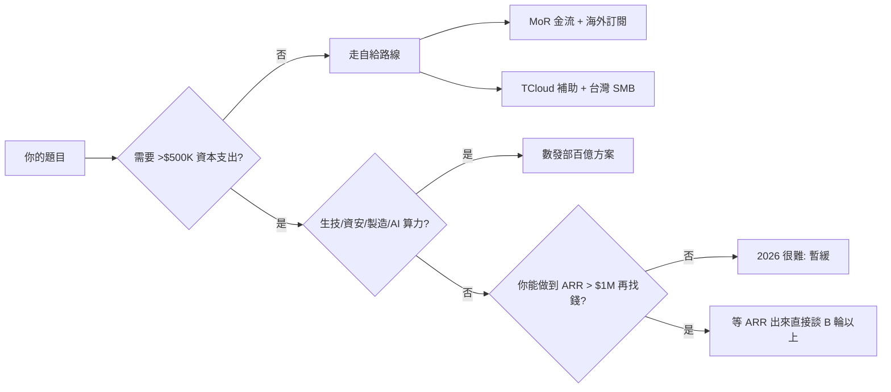

# 台灣團隊的兩條分發路

## TL;DR

- **對內路（SMB + 補助）**：TCloud[^tcloud] 雲市集給 SMB 最高 NT$30,000 點數（1:4 自付）把採購門檻壓到地板；數發部「加強投資 AI 新創方案」[^moda-ai]10 年 NT$100 億、單次上限 1 億、單一企業最高 1.5 億，但截至 2026 年 2 月只投了 5 家、NT$7,500 萬——**錢在，但門很窄**。91APP[^91app]（6741.TWO）走這條走到 2025 年 11 月用 US$32M 現金吃下 iCHEF[^ichef]，是台股 SaaS 併購擴張的樣板。
- **對外路（全球 niche）**：Pieter Levels[^levelsio] 的 PhotoAI 2025 年 9 月衝到 **$150K MRR**（ARR ~$1.8M）、訂閱 2,573 人、87% 毛利、一個人用 PHP + jQuery + SQLite 跑在一台 Hetzner VPS 上。Appier[^appier]（TSE: 4180）2025 年營收 **JPY 437.4 億（YoY +28.4%）**、2026 年 4 月股價 938 日圓，是台灣團隊走全球英語市場的放大版；對獨立開發者而言，真正的槓桿是 Paddle / LemonSqueezy 這類 Merchant of Record[^mor]——Vol.2 講過費率，這篇只強調一句：**它解的是你的法遵與地緣問題，不是手續費問題**。
- **怎麼選**：ACV < NT$30K / 客戶是台灣老闆 / 要面對面簽約 → 走對內；ACV 不重要但要 10 萬個使用者 / 客戶說英文 / 不見面 → 走對外。中間地帶（台灣市場太小、海外沒打過）是 2026 年最痛的一段，需要先用任何一條站穩再談另一條。

---

## 路一：對內（SMB / 企業 / 補助）

台灣中小企業佔企業總數 98%、貢獻超過 80% 就業，但平均 IT 預算極薄。這條路的核心不是「產品有多好」，而是**採購流程有沒有被政府點數拆成可簽的小包**。

### TCloud 雲市集：SMB 採購的第一哩路

數位發展部數位產業署（由經濟部中小企業處轉移）主導的 [TCloud 雲市集](https://tcloud.gov.tw/)，截至 2026 年已集結超過 **400 家資訊服務業者、3,000 個方案**。對 SMB 的補助規則是：

| 項目 | 內容 |
| --- | --- |
| 補助上限 | NT$30,000 點數（1 點 = NT$1） |
| 自付比例 | 自付 : 補助 = 1 : 4（政府出 80%） |
| 申請資格 | 符合中小企業定義、持工商憑證、一公司限申請一次 |
| 受益對象 | 上架方案的雲端業者（SaaS 為主） |

這個補助不是給你——是給你的客戶。意思是：**把方案上架 TCloud，等於把客戶的採購門檻乘上 0.2**。一個 NT$20,000 / 年的 SaaS，客戶只需要自付 NT$4,000。這對台灣 SMB 的決策鏈有決定性影響：老闆原本要簽的是兩萬，現在只要簽四千，法務＋會計流程會自動變成「員工自己處理一下就好」。

**但要注意三個現實**：

1. 上架 TCloud 審查不快，且需要台灣公司主體（可上架 SaaS，但境外團隊要繞一層當地代理）。
2. 一公司限申請一次，所以這是**破冰預算**不是續訂預算——真正的錢在第二年之後，產品力要夠硬才留得住。
3. TCloud 本身流量有限，它是「降採購摩擦」的工具，不是「引客戶進來」的工具。你得自己跑內容／SEO／業務把人帶到 TCloud。

### 數發部百億 AI 投資方案：錢在，但門很窄

[數發部「加強投資 AI 新創實施方案」](https://www.cio.com.tw/87937/)從國發基金提撥 NT$100 億、10 年執行（投資期 7 年＋處分期 3 年），以政府搭配民間資金共投的方式運作——原則 1:1、最高 2:1。關鍵條件：

- **單次投資上限 NT$1 億、單一企業累計上限 NT$1.5 億**
- 不得為上市櫃公司或中資
- 首批 10 家搭配投資人：能率亞洲資本、台灣智慧雲端服務、安發天使投資、創世投創、台安生物科技、宇斻管理顧問、國聯創業投資管理顧問、斯伯克國際創業投資、華陽中小企業開發、臺企銀管理顧問
- 關注領域：生技、數位轉型、資安、SaaS

但 2026 年 3 月公布的首年成績單很現實：[截至 2 月底只核定 5 家、6 案，共注資 NT$7,500 萬](https://cdn.technews.tw/2026/03/07/moda-first-year-results-of-the-ai-startup-initiative/)（賦語科技、台灣智慧駕駛、富宇翔電通、阿爾發金融科技、用益網路科技），達成率不到 0.1%。這意味著：

- **速度比想像慢**。你要先被搭配投資人看上（現在擴到 36 家），再走政府二次審查。從提 deck 到進帳，六個月起跳。
- **規模比想像小**。單次 1 億聽起來大，但多數案子其實在 NT$1,500 萬至 NT$3,000 萬之間——相當於美國一輪 pre-seed 的一半。
- **政策性題目優先**。生技、資安、數位轉型、AI 算力等能貼到「國家戰略」的題目比較吃香。純 B2C 工具類、一人產品完全不適合走這條。

### 91APP 典範：台股 SaaS 上市→併購擴張

[91APP（6741.TWO）](https://91app.com/en/blog/91app-202511-ichef/) 是台灣 SaaS「走內需再走區域」路線的標竿：2021 年 5 月上櫃，2025 年 1 月營收 NT$1.98 億（YoY +25.6%），並在 [2025 年 11 月 13 日董事會通過以 US$32M 現金全資收購 iCHEF](https://www.cna.com.tw/news/afe/202511130349.aspx)（約佔總資產 20%）。iCHEF 目前服務 15,000+ 家餐飲門店，分佈於台灣、香港、新加坡。

這告訴 2026 年想走對內路的團隊三件事：

1. **台股 SaaS 是可達的退出路徑**——不用非得去東京或那斯達克，創新板（TIB）[^tib]2025 年有 15 家申請、定位為「獨角獸孵化器」。
2. **區域併購比自建海外團隊划算**。91APP 用現金吃下 iCHEF，等於一次買下三地客戶與餐飲垂直的 domain know-how，自己從零打至少要三年。
3. **垂直再垂直**。91APP 從零售一路走到餐飲、廣告科技，不是橫向擴品類，是**在同一個 SMB 客戶身上疊加錢包佔比**。

對初創團隊的啟示：**先做一個垂直、做深，然後等著被 91APP 這種人買走或併進去**也是一種 GTM。

### 中小企業定價曲線

台灣 SMB 的 price band 非常窄：

| ACV 區間 | 決策者 | 銷售動作 |
| --- | --- | --- |
| < NT$12,000 / 年 | 老闆自己 | 自助註冊、信用卡、內容帶流量 |
| NT$12,000–NT$60,000 | 老闆 + 會計 | 顧問簡報、能開發票、TCloud 上架 |
| NT$60,000–NT$300,000 | 老闆 + IT + 採購 | 業務登門、客製 POC、報價單 |
| > NT$300,000 | 董事會 | 標案、經銷商、現場駐點 |

中小 SaaS 最好站在 **NT$12K–60K** 這個區間，TCloud 補助加上業務登門成本合理。再往上需要業務組織，對一人／三人團隊不現實。

---

## 路二：對外（全球 niche 英語內容）

如果你的客群不需要發票、不需要面對面、不介意用英文介面，那條路就反過來了。

### Pieter Levels 的數字，給台灣獨立開發者看

2025 年 9 月，Pieter Levels 公布 [PhotoAI 達到 $150K/月](https://x.com/levelsio/status/1970858876212756506) 的新紀錄：

- 2,573 位活躍訂閱者
- 87% 毛利
- 100% bootstrapped、0 外部資金
- 員工：1 人（他自己）
- 技術棧：**PHP + jQuery + SQLite on Hetzner VPS with Nginx + Ubuntu**

他的整體 portfolio（PhotoAI、Interior AI、RemoteOK、NomadList、Photo+Merch 等）2024 年 9 月就報到 [~$420K/月](https://x.com/levelsio/status/1837707857372106992)、~80% 毛利。2025 年 3 月的新產品 [17 天從 $0 衝到 $1M ARR](https://x.com/levelsio/status/1899596115210891751)——Cursor 不是天花板，一個人在咖啡廳蓋出來的東西才是。

這組數字給台灣開發者的意義不是「你也可以」，而是**「技術棧不重要，題目 + 分發才是一切」**。PHP + SQLite 的毛利打贏多數用 Next.js + Postgres 的初創 SaaS，因為他的成本不在雲端月費，在**他會用 Twitter build in public 把獲客成本降到趨近於零**。

### 冷啟動四通路（2026 版）

台灣獨立開發者做全球 niche，第一年的分發幾乎只能靠這四條：

1. **Reddit + 垂直論壇**：2026 年被 [多份 lead-gen 報告](https://www.reddireach.com/blog/reddit-lead-generation-playbook-for-saas-ecommerce-2026) 標為「最被低估的 B2B channel」，CPC 比 Meta 低 50–70%、比 LinkedIn 低 70–85%。做法是 90/10（90% 貢獻、10% 置入），在 8–12 個 target subreddit 裡長期存在。
2. **Hacker News**：產品本體 + Show HN 文案 + 作者親自回每一則留言。HN 帶來的不是流量高峰，是 Tier 1 早期使用者（有能力給你正確的 feedback）。
3. **X / LinkedIn build in public**：Pieter Levels 模式。每週固定公布 MRR、實驗、失敗。這對台灣開發者最難的不是英文，是**願不願意公開數字**。
4. **SEO 長尾 + AI-answer 導流**：2026 年的 SEO 已經雙層化，除了 Google 藍鏈還要針對 Perplexity、ChatGPT Search 的 citation 做內容結構化（帶 footnote 格式的 Markdown）。

ProductHunt 不再是 must-do。2026 年的共識是：PH 流量被大廠與公關稿佔據，對 bootstrapped 團隊 ROI 已經不像 2020 年代初那麼香——可以發，但不要當主戰場。

### Merchant of Record：台灣人的關鍵工具

Vol.2 談過 Paddle / LemonSqueezy / Stripe 的費率差異，這裡不重複。從 GTM 的角度，MoR 對台灣獨立開發者的意義只有一件事：**它幫你扛掉你一個人根本沒辦法扛的東西**——

- 全球銷售稅：歐盟 VAT MOSS、英國 VAT、美國 sales tax 50 州規則、澳洲 GST、OECD 數位服務稅……
- 退款與 chargeback 的對帳、風控、爭議處理
- 地區性金流方法（iDEAL、SEPA、SOFORT、PIX 等）
- 最關鍵的：**把你從「台灣賣家」升級為「愛爾蘭／英國賣家」的身份**，跨越某些大客戶風控白名單

這個點在 2024–2025 年 Stripe 收購 LemonSqueezy 後變複雜。2026 年 1 月 [LemonSqueezy 公告](https://www.lemonsqueezy.com/blog/2026-update) 正在把能量移回 Stripe Managed Payments，新註冊與產品更新都變慢。對 2026 年才開始的團隊，**首選 Paddle**——它是最成熟、仍在獨立運作的 MoR，定價 5% + $0.50/筆、沒有額外跨境手續費。

（費率對比與手續費結構請回去看 Vol.2，這裡不展開。）

### Appier 的放大版樣板

如果獨立開發者版本是 Pieter Levels，**台灣團隊走全球英語路線的放大版是 [Appier（TSE: 4180）](https://www.appier.com/en/press-media/fy25q3earnings)**：

- 2025 年營收 **JPY 437.4 億（約 NT$90 億）**，YoY +28.4%
- FY25 Q3 單季營收 JPY 114 億，YoY +26%
- 2021 年在東京 Mothers 掛牌成為台灣第一家 AI 獨角獸，日本仍是最大市場

Appier 的 GTM 本質上就是「用日本當跳板打亞太，用亞太當資本市場故事」。對 2026 年剛起步的團隊不現實，但作為對照組有意義——**如果你的目標是日本 B2B 企業客戶，Appier 已經示範了從東京上市反向拉台灣人才的完整 playbook**。

---

## 募資要不要走

2026 年台灣 VC 現況非常冷。[Tracxn 數據](https://tracxn.com/d/geographies/taiwan/__U8GDl4awwVuue4gHaC8tZ-HX58ubRjOI9M7eHe3-wgo) 顯示截至 2026 年 3 月，台灣整年只有 3 輪募資、共 $575K——相較 2025 年同期的 $52.3M / 5 輪，**年減 98.9%**。全球來看（[Crunchbase Q1 2026](https://news.crunchbase.com/venture/capital-concentrated-ai-global-q1-2026/)）資金高度集中在 AI 前段的 OpenAI、Anthropic、xAI、Mistral，從中型以下團隊視角看幾乎等於市場關門。

這讓「要不要募資」的決策變得很簡單：

三條分叉的白話版本：

- **做得小、毛利高 → 不要募**。Pieter Levels 的 87% 毛利就是答案。
- **做的是國家戰略題目 → 試數發部百億**，但預期六個月起跳、單次 NT$1,500–3,000 萬是常態。
- **題目需要大資本但不是戰略題 → 2026 暫緩**，先把 ARR 做到 $1M 再談——VC 只剩下「追已經贏的人」的錢。

至於上市路：**台股（91APP 模式）vs 東京（Appier 模式）** 的分水嶺是客戶在哪。客戶在台灣／東南亞華語市場 → 創新板 / 上櫃；客戶在日本或亞太 B2B 企業 → 考慮東京 Mothers（現為 Growth）。別因為台股股價本益比高就硬擠——你的**收入幣別**決定分母在哪個市場會被合理估值。

---

## 怎麼判斷自己走哪條

把幾個切點攤平：

| 切點 | 對內路 | 對外路 |
| --- | --- | --- |
| 客戶語言 | 中文 | 英文（或英文 + 區域語言） |
| ACV | NT$12K–300K | US$5–100 / mo（多半訂閱） |
| 節奏 | 業務＋登門＋年度合約 | 自助註冊＋信用卡＋月租 |
| 獲客成本 | 業務工時（高） | 內容工時（高但邊際為 0） |
| 監理 | 發票、個資、產業法規 | MoR 扛全球稅、GDPR 自行 |
| 退出 | 台股 / 被併 | 被國際 SaaS 併 / 自營現金流 |
| 心理負擔 | 每月要找新客戶 | 每天要面對英文 X 有沒有讚 |

**一個很好的自我檢查是**：你下一次要見潛在客戶，是在內湖咖啡廳還是 Zoom 上？答案決定一切。

最後一個提醒：2026 年不是「兩條路選一條」的年代，而是「先選一條站穩，再開第二條」。91APP 走了十年內需才有資本併 iCHEF、Appier 也是先在台灣做穩才敢去東京掛牌。獨立開發者要想像的不是「同時打國際＋台灣」，是**先在其中一條做到 MRR > NT$100K，再把第二條當成下一個實驗**。

分發不是選擇題，是順序題。

[^tcloud]: TCloud（臺灣雲市集）是由數位發展部數位產業署主導的 SaaS / 雲端服務採購平台，針對符合資格的中小企業提供最高 NT$30,000、1:4 自付比例的點數補助，已集結 400 多家業者與 3,000 個方案。

[^moda-ai]: 數發部「加強投資 AI 新創實施方案」是由國發基金提撥 NT$100 億、10 年執行的共投計畫，與民間搭配投資人以 1:1 或最高 2:1 比例共同投資 AI 新創，單次上限 NT$1 億、單一企業累計上限 NT$1.5 億。

[^91app]: 91APP 是台灣零售電商 SaaS 服務商，2021 年 5 月於台灣證交所興櫃（TWO）掛牌、股票代號 6741，提供品牌電商的 OMO（線上線下整合）與 AI 導購方案，客戶以亞太華語市場零售品牌為主。

[^ichef]: iCHEF 是 2012 年成立的台灣餐飲 POS SaaS，服務超過 15,000 家餐飲門店，分佈於台灣、香港、新加坡。2025 年 11 月被 91APP 以 US$32M 現金全資併購。

[^levelsio]: Pieter Levels（@levelsio）是荷蘭籍的獨立開發者，代表作包含遠端工作城市排行榜 NomadList、遠端職缺板 RemoteOK、AI 頭像產品 PhotoAI 與室內裝潢 Interior AI，portfolio 年化營收超過 US$5M，是「一人 bootstrapped SaaS」最常被引用的範本。

[^appier]: Appier（沛星互動科技，TSE: 4180）是台灣 AI 行銷科技公司，2021 年成為台灣第一家在東京 Mothers（現為 Growth 市場）掛牌的 AI 獨角獸，主力產品為廣告投放與顧客資料平台，最大市場為日本。

[^mor]: Merchant of Record（MoR，記名商家）是一種由第三方代為承擔稅務、退款、法遵責任的支付模式。MoR 服務商（如 Paddle、LemonSqueezy）以自己名義向終端用戶收款，再扣除費率後結算給賣家，實質上把你的跨境稅務與 chargeback 風險外包出去。

[^tib]: 台灣創新板（Taiwan Innovation Board，TIB）是台灣證交所於 2021 年推出的上市板塊，定位為「獨角獸孵化器」，門檻低於主板，允許尚未獲利但具成長性的科技／生技新創掛牌，目標客群是市值 15 億以上、以研發為主的公司。

---

## 來源

- [百億 AI 基金首年僅投 7,500 萬？數發部公布 5 家獲投新創 — TechNews (2026-03-07)](https://cdn.technews.tw/2026/03/07/moda-first-year-results-of-the-ai-startup-initiative/)
- [數發部 AI 百億投資方案 攜創投打造下一波獨角獸 — CIO Taiwan](https://www.cio.com.tw/87937/)
- [91APP Acquires 100% of iCHEF to Strengthen SaaS and AI Leadership — 91APP Newsroom (2025-11-13)](https://91app.com/en/blog/91app-202511-ichef/)
- [Appier FY25 Q3 Earnings — Record Revenue and Profitability](https://www.appier.com/en/press-media/fy25q3earnings)
- [@levelsio：Photo AI $150K/mo（2025-09）](https://x.com/levelsio/status/1970858876212756506)
- [Tracxn：Startups in Taiwan — 2026 Funding Rounds](https://tracxn.com/d/geographies/taiwan/__U8GDl4awwVuue4gHaC8tZ-HX58ubRjOI9M7eHe3-wgo)
- [臺灣雲市集 TCloud 補助說明](https://tcloud.gov.tw/)

> 時間敏感資訊截至 2026-04。費率／補助條件／股價可能已更動，請以原始來源為準。
