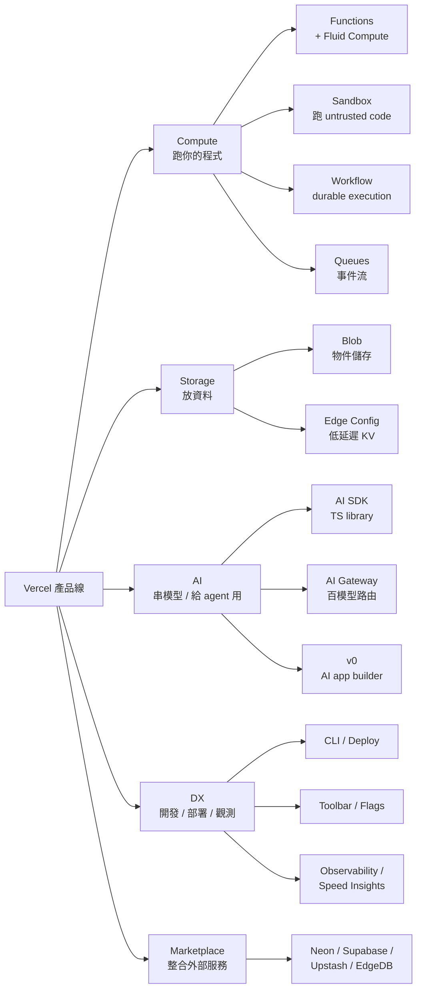

# Vercel 全產品線地圖：八條 SKU 一張表看完

四個月前我們在 Vol.3 拆過 Vercel 為什麼成了 AI-native SaaS 的預設底座。這次的問題具體得多：你是個人 SaaS 創業者，從 0 開始要做一個能收錢的東西，Vercel 賣的這一整套到底該怎麼選？

第一篇先把地圖攤開。Vercel[^vercel] 在 2025–2026 把產品線從「Next.js 託管 + Functions」擴成五大類、十多個 SKU[^sku]，每條獨立計價、各有 Hobby / Pro 限制。地圖看不懂，後面五篇都會踩雷。

## TL;DR

- **五大類：Compute（Functions / Sandbox / Workflow / Queues）、Storage（Blob / Edge Config）、AI（AI SDK / AI Gateway / v0）、DX（Toolbar / Flags / CLI / Deploy）、Marketplace（外接 Neon / Supabase / Upstash 等）**——後面四類都是 2024–2026 才補齊或整併進來的。
- **Functions 在 2025-04-23 起對新專案預設啟用 Fluid Compute，Active CPU $0.128/hr、Provisioned Memory $0.0106/GB-hr**（[Vercel docs](https://vercel.com/docs/fluid-compute)、[Vercel changelog](https://vercel.com/changelog/lower-pricing-with-active-cpu-pricing-for-fluid-compute)）；Workflow 則在 **2026-04-16 GA**，補齊「長流程／AI agent」這塊空缺（[Vercel blog](https://vercel.com/blog/a-new-programming-model-for-durable-execution)）。
- **Hobby 條款明文「非商用」**：只要產品「以財務獲利為目的」就要 Pro $20/seat/月，Vercel 有權暫停違規專案（[Vercel Pricing](https://vercel.com/pricing)）——本期第二篇會專門處理這條，這篇先把地圖畫對。

## 五大類：八條主 SKU 屬於誰

先用一張圖看分類，避免文字 bullet 看到一半就迷路：

兩個觀念要先建立，後面表格才看得懂：

第一，**「產品」和「計價單位」不是一對一**。Functions 一條 SKU 底下會被切成 Active CPU、Provisioned Memory、Function Invocations 三條費用線；Blob 切成 Storage、Simple Operations、Advanced Operations、Data Transfer 四條（[Vercel Pricing](https://vercel.com/pricing)）。Hobby 看起來只是「一張表全綠」，Pro 對你來說則是「十幾個小儀錶板每個都會冒出費用」。

第二，**Fluid Compute[^fluid-compute] 不是新產品，是 Functions 的執行模型**。Vercel 自 2025-04-23 起對新專案預設打開（[docs](https://vercel.com/docs/fluid-compute)），讓多個 invocation 可以共用同一個 instance、I/O 等待時不計 CPU。對 indie 的意義很直接：**LLM call、AI agent 這類大半時間在等 OpenAI API 回應的工作，CPU 帳單會比 2024 年的 GB-Hours 制度便宜 60–90%**（[Vercel blog](https://vercel.com/blog/introducing-active-cpu-pricing-for-fluid-compute)）。所以後面「Compute / Functions」這欄你不用再分 Edge / Serverless 兩條路想——支援 Node.js / Python / Edge / Bun / Rust，預設都是 Fluid。

## 速查表：產品 / 用途 / Hobby / Pro / 何時該用

下面這張表是這篇的核心，**留著對照未來四個月的選型**。所有數字截至 2026-04，主要來源是 [Vercel Pricing](https://vercel.com/pricing)、[Fluid Compute docs](https://vercel.com/docs/fluid-compute)、[Sandbox pricing](https://vercel.com/docs/vercel-sandbox/pricing)。

| 產品 | 類別 | 用途一句話 | Hobby 額度 | Pro 用量計價（超過 $20 credit） | 何時該用（indie 視角） |
| --- | --- | --- | --- | --- | --- |
| **Functions** | Compute | API、SSR、表單、webhook 端點，含 Fluid Compute | 4 hr Active CPU、360 GB-hrs memory、1M invocations | $0.128/hr CPU、$0.0106/GB-hr、$0.60/1M invocations | 一律先用——99% 場景的預設。 |
| **Sandbox** | Compute | 在 Firecracker microVM[^firecracker] 裡跑使用者／LLM 產出的程式碼 | 5 hr CPU、420 GB-hrs、5K creations、20 GB network、10 並行；單次最長 45 分 | $0.128/hr CPU、$0.0212/GB-hr、$0.60/1M creations、$0.15/GB network、2,000 並行；單次最長 5 hr | 你的 SaaS 要執行用戶上傳的 code、跑 AI 寫的腳本、做 code interpreter——本期第三篇會深入。 |
| **Workflow** | Compute | `'use workflow'` / `'use step'` 裝飾器寫長流程，會自動 retry / persist / 跨 deploy 續跑（durable execution[^durable-execution]） | 50K events/月 | $20/1M events、$0.50/GB written、$0.50/GB-month retained | 跑 AI agent、多步驟訂單流程、需要 sleep 數小時或數天——本期第五篇深入。 |
| **Queues** | Compute | 較底層的 durable event stream，Workflow 之下的 primitive | 1M API ops/月 | $0.60/1M ops 起 | 你想自己組合 fan-out、不想用 Workflow 的高階 SDK；多數 indie 直接吃 Workflow。 |
| **Blob** | Storage | 物件儲存（圖片、影片、用戶上傳）；S3 風格 | 1 GB、10K simple ops、2K advanced ops、10 GB transfer | $0.023/GB、$0.40/1M simple、$5/1M advanced、$0.05/GB transfer | 用戶頭像、產品圖、PDF 匯出；不要拿來當 hot data，那是 Edge Config 的工作。 |
| **Edge Config** | Storage | 全球低延遲（P99 < 15ms）唯讀 KV；典型放 feature flag、A/B 設定 | 100K reads、100 writes/月 | $3/1M reads、$5/500 writes | 「每個請求都要讀、寫得很少」的 config——典型搭 Flags 用。 |
| **AI Gateway** | AI | 百種模型統一 API、自動 fallback、預算控制；**0 加成計費** | $5/30 天試用 credit；新帳號獨立額度 | 按模型供應商定價直通（無加成） | 你的 SaaS 想讓用戶切模型 / 想保證 OpenAI 掛掉時自動跳 Anthropic——本期第三篇會拆。 |
| **v0**[^v0] | DX / AI | AI app builder，產 Next.js + shadcn[^shadcn] 程式碼；2026-02 起 token-based | Free $5 credit/月 | Premium $20/月（含 $20 credit）／Team $30/user／Business $100/user | 用來做 prototype 跟 landing page；不適合主程式長期住 v0 裡。 |

附帶四條會吃掉錢但不算「主 SKU」的副產品線：

- **Image Optimization**：Hobby 5K transformations / 30 萬 cache reads；Pro $0.05/1K transformations 起（[Pricing](https://vercel.com/pricing)）。`<Image>` 預設打開、預設貴，blog 有圖才會大爆。
- **ISR**[^isr]：Hobby 1M reads / 200K writes；Pro $0.40/1M reads。Next.js 用 `revalidate` 就會吃。
- **Vercel Flags**：2026-04-16 GA，Hobby/Pro 都含 10K requests/月，超過 Pro $0.03/1K（[Vercel changelog](https://vercel.com/changelog)）。
- **Build minutes**：Hobby 沒明文限額但有 Fair Use；Pro Standard machine $0.014/min、Turbo $0.126/min。CI 跑久也是錢。

## Marketplace 是「Vercel Postgres 退役」之後的補丁

Vercel 自家的 Postgres 在 2025 年下架、用戶被遷到背後本來就跑著的 Neon（[Vercel blog](https://vercel.com/blog/introducing-the-vercel-marketplace)）。今天你要在 dashboard 上按一個鈕開資料庫，本質都是去 Marketplace[^marketplace] 裡接外部服務、把帳單合併進 Vercel 月結。可選清單（截至 2026-04）：

- **Neon**[^neon]：Postgres，scale-to-zero[^scale-to-zero]、database branching、time travel queries——後端做標準 SaaS 的預設。
- **Supabase**[^supabase]：Postgres + Auth + Storage + Realtime + Edge Functions——你想用 RLS[^rls] 跟一個 BaaS 全包就選它。
- **Upstash**[^upstash]：Redis / Vector / QStash——快取、rate limit、queue 一條龍。
- **EdgeDB**、**AWS Aurora DSQL** 等——比較邊角的選項。

對 indie 的意義是：**Vercel 不再賣資料層**，所以你不會再被「Vercel KV / Postgres / Blob 全家桶綁死」這種 lock-in 困住——但你會多一張帳單要看（Vercel 那邊一張、provider console 各自一張，有的可以合併計費，有的不能）。本期第四篇會給一棵按工作負載對應 provider 的決策樹。

## 一個 indie 通常只該開三到四盤

地圖很大，但 90% 的 indie SaaS 在第一年其實只會碰這幾條：**Functions（含 Fluid）、Blob、Marketplace 上一個 Postgres、AI Gateway**。等流量起來、流程變複雜，才會輪到 Sandbox（讓用戶跑 code）、Workflow（長流程／agent）、Edge Config（低延遲設定）。

把這篇收進書籤、之後每一篇都對應到上面那張表的某一格——你就不會選錯。

> 接下來：第二篇拆「從 Hobby 到第一個付費客戶」的成本曲線，講為什麼 Hobby 商用是地雷、$20 → $50 → $200 各階段你會踩到哪些行；第三篇深入 AI SDK + Gateway + Sandbox 的疊法；第四篇給資料層決策樹；第五篇講 Workflow / Queues；第六篇給三個「該逃離 Vercel」的訊號。

[^vercel]: Vercel 是 Next.js 的母公司，2024 年起把自己重新定位成「AI Cloud」，把產品線從 Next.js 託管擴成 compute / storage / AI / DX 多條 SKU，目標客群從前端工程師延伸到 AI 新創與 indie SaaS。
[^sku]: SKU 是 Stock Keeping Unit 的縮寫，零售業用來指「最小可獨立計價的商品單位」，這裡借用來描述 Vercel 每一條獨立計價、有自己 Hobby / Pro 限制的產品線。
[^fluid-compute]: Fluid Compute 是 Vercel 自 2025-04-23 對新專案預設啟用的 Functions 執行模型，特色是多個 invocation 共用同一個 instance，I/O 等待時不計 CPU 費用，對 LLM 這類 I/O bound 工作負載特別省錢。
[^firecracker]: Firecracker 是 AWS 開源的 microVM 技術，用 KVM 在毫秒內開出輕量虛擬機，跟 Lambda 是同一套底層，對「跑不可信程式碼」是業界標準的隔離方案。
[^durable-execution]: Durable execution 是一種程式模型，讓 async function 可以跨 deploy、跨 crash、跨數天的 sleep 還能從中斷的那一行繼續，背後靠 event log 與 deterministic replay 達成；Temporal、Inngest、Vercel Workflow 都是這條路線。
[^v0]: v0 是 Vercel 推出的 AI app builder，2026 年改成 token-based 計價，產出 Next.js + shadcn/ui 程式碼，定位偏向「快速做 prototype 與 landing page」，不是讓主程式長期住在裡面。
[^shadcn]: shadcn/ui 是一套用 Radix / Base UI 加 Tailwind 組合的 React 元件，特色是「複製程式碼到自己 repo」而不是 npm install，方便客製，是 indie SaaS 與 v0 的預設選擇。
[^isr]: ISR 是 Incremental Static Regeneration 的縮寫，Next.js 的功能，可以讓靜態頁面在背景按時間或事件重新產生，介於 SSR 與 SSG 之間；Vercel 對 ISR 的 reads / writes 另外計價。
[^marketplace]: Vercel Marketplace 是讓你在 Vercel dashboard 直接接外部服務（Neon、Supabase、Upstash 等）的整合入口，credentials 自動寫入 env、計費合併到 Vercel 月結，2024 年起取代了 Vercel 自家資料庫產品。
[^neon]: Neon 是 serverless Postgres 公司，主打 scale-to-zero、database branching 與 time travel queries，2025 年被 Databricks 收購，是 Vercel Postgres 退役後遷移過去的官方下家。
[^scale-to-zero]: Scale to zero 指服務閒置時運算資源縮減到零、不再計費；好處是低用量近乎免費，缺點是冷啟動會有額外延遲（Neon 大約 100–300ms）。
[^supabase]: Supabase 是開源的 Firebase 替代品，把 Postgres 包上 Auth、Storage、Realtime、Edge Functions 一條龍，是「不想自己刻登入跟即時同步」的 indie 預設選項。
[^rls]: RLS 是 Row Level Security（資料列級權限）的縮寫，Postgres 內建功能，讓你在 SQL 層直接寫權限規則（例如「使用者只能讀自己的訂單」），Supabase 把 RLS 推成主要 auth 模型。
[^upstash]: Upstash 是 serverless Redis 公司，特色是用 HTTP REST 介面取代傳統 TCP 長連線，剛好解決 Edge Function 與 Lambda 沒辦法養 connection pool 的痛點，旗下還有 Vector 與 QStash。

---

## 來源

1. [Vercel Pricing: Hobby, Pro, and Enterprise plans](https://vercel.com/pricing) — Vercel 官方定價頁，2026-04 截取
2. [Fluid compute docs](https://vercel.com/docs/fluid-compute) — Vercel 官方文件，註明 2025-04-23 起對新專案預設啟用、支援 Node.js/Python/Edge/Bun/Rust
3. [A new programming model for durable execution](https://vercel.com/blog/a-new-programming-model-for-durable-execution) — Vercel Blog，Workflow 2026-04-16 GA 公告
4. [Lower pricing with Active CPU pricing for Fluid compute](https://vercel.com/changelog/lower-pricing-with-active-cpu-pricing-for-fluid-compute) — Vercel Changelog，Active CPU $0.128/hr、Memory $0.0106/GB-hr
