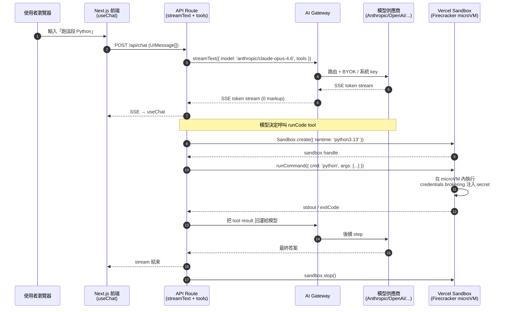

# AI SaaS 的最短路徑：AI SDK + Gateway + Sandbox 怎麼疊

## TL;DR

- **AI SDK[^ai-sdk] 是膠水、Gateway[^ai-gateway] 是路由、Sandbox[^vercel-sandbox] 是隔離區**——三件套各管一層，疊起來才是一個能跑使用者程式碼的 AI 產品；少一塊就會在不該妥協的地方妥協（綁死單一供應商、把使用者的 Python script 直接 `eval` 進你的 serverless function）。
- **0 加成 ≠ 免費**：Gateway 的 token 確實不收 markup，但 ZDR[^zdr]（zero data retention）以 \$0.10／1K request 計價，這是 OpenRouter[^openrouter] 等對手不額外收的東西；Active CPU 對 LLM 工作負載省最多的是「等 token 不收錢」，不是「比裸機便宜」。
- **不是每個 AI 產品都需要 Sandbox**。靜態 Q&A、寫邊欄摘要、做 RAG[^rag] 搜尋——只要你不執行使用者寫的程式碼，AI SDK + Gateway 兩件套就夠；Sandbox 是「v0、code interpreter、AI agent 工具」這類工作負載才開始有意義的，而且這時候才該認真比 E2B[^e2b]、Modal[^modal]。

---

## 三件套各做什麼（先拆開、再拼起來）

要看懂這套組合，先把三塊各自的職責說清楚——它們解決的問題完全不同層，新手最常見的誤解是把它們當成「Vercel 的 AI 全家桶」一起裝，而不是按需要挑。

### AI SDK：TypeScript 開發者的模型抽象層

[AI SDK](https://ai-sdk.dev/docs/introduction) 是 Vercel 開源的 TypeScript library，2026 年 4 月當前版本是 **v6**（v5 在 2025 年中旬發布、v6 在末季推出）。它做的事很單純：

- **Core**：把 OpenAI、Anthropic、Google、Mistral、Bedrock 等 20+ 家模型 SDK 抽到統一介面。`generateText` / `streamText` / `generateObject` / `streamObject` 四個 function 是主力。
- **UI**：給 React、Vue、Svelte、Angular（v5 起 framework parity）一組 hook，最常用的是 `useChat`、`useCompletion`，吐 SSE stream 進 UI。
- **Agent loop primitives**（v5 起）：`stopWhen`（如 `stepCountIs(5)`、`hasToolCall('finish')`）、`prepareStep`、`Agent` class，把多步 tool 呼叫的迴圈規範化，不用自己寫 while-loop。
- **Tools**：v5 把 tool 的 schema 重命名為 `inputSchema`／`outputSchema`，新增 `dynamicTool()` 與 `onInputStart` / `onInputDelta` lifecycle hook。

對 indie 來說，AI SDK 真正值錢的不是抽象介面（很多 wrapper 都做得到），是**型別**——`UIMessage<MyMetadata>` 把訊息流的型別從 server 一路推到 client，這在多步 agent + tool calling 的場景能省掉很多 runtime 才炸的 bug。

```ts
// 一行換 provider，且 model id 直接吃 'provider/model' 字串
import { streamText } from 'ai';

const result = streamText({
  model: 'anthropic/claude-opus-4.6', // 透過 Gateway 路由
  messages,
  stopWhen: stepCountIs(5),
  tools: { runCode: codeTool },
});
```

### AI Gateway：模型路由與帳務代理

[AI Gateway](https://vercel.com/docs/ai-gateway) 是一個 OpenAI-compatible（也支援 Anthropic Messages API）的 HTTP endpoint，幫你：

- **一把 key 用所有模型**：底下接 OpenAI、Anthropic、Google、xAI、Groq、Together、Mistral 等近百個模型，model id 用 `'provider/model'` 字串切換。
- **自動 fallback**：上游某家掛了會自動切備援。
- **觀測 + 預算**：spend monitoring、load balancing、budget cap 全部 built-in。
- **BYOK**：用自己的 API key 也行，[Vercel 不會在價格上加 markup](https://vercel.com/docs/ai-gateway/pricing)（0%）。

關鍵的計價結構：每個 Vercel team 月領 **\$5 免費 credit**；token 按上游 list price，**0 加成**；ZDR 以 **\$0.10／1K successful request** 計（Pro / Enterprise 才有），失敗請求不算。

跟 AI SDK 配合是這樣——把 AI SDK 的 `model` 設成 Gateway 提供的字串 ID，請求就走 Gateway 過去；要 BYOK 就在 Gateway dashboard 掛你的 OpenAI / Anthropic key，計費邏輯維持不變。

### Sandbox：跑使用者／agent 程式碼的 microVM

[Vercel Sandbox](https://vercel.com/docs/vercel-sandbox) 是 ephemeral compute primitive，跑在 **Firecracker microVM** 上（跟 AWS Lambda 同款隔離技術）。系統規格寫得很清楚：

- **OS**：Amazon Linux 2023
- **Runtimes**：`node24`（預設）、`node22`、`python3.13`，跑 `vercel-sandbox` user 帶 sudo
- **啟動**：毫秒級
- **儲存**：每個 sandbox 32 GB 暫存 NVMe；要持久化用 [snapshot](https://vercel.com/docs/vercel-sandbox/concepts/snapshots) 或 [persistent sandbox（beta）](https://vercel.com/docs/vercel-sandbox/concepts/persistent-sandboxes)
- **Region**：目前只有 `iad1`（這點對台灣 indie 是延遲議題，後面會講）
- **時長**：預設 5 分鐘，Hobby 最長 **45 分鐘**、Pro / Enterprise **5 小時**，可程式化 `sandbox.extendTimeout()` 動態延長
- **併發**：Hobby 10 個、Pro / Enterprise 2,000 個

最重要的安全特性是 **credentials brokering**[^credentials-brokering]：一個 proxy 蹲在 sandbox 邊界外，sandbox 內的程式碼往外打 API 時，proxy 把你存在 Vercel 的 secret 注入到 outbound 的 HTTP header；如果惡意程式碼自己塞同名 header（想把認證請求改 redirect 到攻擊者 server），proxy 會把它覆蓋掉。換句話說：**sandbox 內的程式碼永遠看不到 secret，但又能用它打外部 API**。對「跑 user-generated code」這個場景，這是缺一不可的。

```ts
import { Sandbox } from '@vercel/sandbox';

const sandbox = await Sandbox.create({ runtime: 'python3.13' });
const result = await sandbox.runCommand({
  cmd: 'python',
  args: ['-c', userCode],
  stdout: process.stdout,
  stderr: process.stderr,
});
console.log(await result.stdout(), result.exitCode);
await sandbox.stop();
```

---

## 怎麼疊：典型 AI SaaS 的請求流

把三塊串起來，最常見的請求路徑長這樣——使用者在前端跟你的 chat bot 對話，bot 在某一輪決定呼叫一個 tool（執行使用者貼的 code、跑爬蟲、跑資料分析），這時 Sandbox 才登場。



幾個對 indie 重要的觀察：

1. **三件套不需要同時上線**。早期 MVP 通常只有 AI SDK + Gateway，UI 流暢、計費單純就先走。等到產品功能要「執行使用者貼的程式碼／檔案／URL」才把 Sandbox 接上，省得一開始就為了不會用到的隔離層付錢。
2. **Sandbox 不在 hot path**。它是 tool call 觸發的、有自己的 lifecycle，不該綁進 streaming response 的同步路徑——一個常見錯誤是在 API route 裡 `await Sandbox.create()` 阻塞 stream，正確做法是 stream 持續吐字、tool 執行用 background 或 client-side polling。
3. **Sandbox 跟 Vercel Functions 是不同的計費**。Functions 算的是 Active CPU + invocation；Sandbox 算的是 Active CPU + Provisioned Memory + Sandbox Creations + Network + Storage 五個維度。新手最常踩雷的是 Provisioned Memory——它按掛載時間（不是 Active CPU 時間）計，sandbox 開著等使用者下一句話 = 你在燒記憶體錢。

---

## indie 的成本邏輯：為什麼 0 加成 + Active CPU 對 LLM 特別便宜

這套疊法的成本故事不在「比裸機便宜」，在**計費單位對齊工作負載特性**。LLM 呼叫的時間結構大致是：

- API call 發出後等 first token：100ms～數秒
- streaming 期間：大半時間是網路 I/O，CPU 幾乎閒置
- tool call 執行 sandbox 內的 code：可能秒級～分鐘級不等

傳統 serverless 計費按 **wall-clock**（人在等就算錢），這對 LLM 工作負載是慘案——一個 30 秒的對話有 28 秒在等 token，但你 28 秒的 vCPU 都被算錢。Vercel 的 [Fluid Compute + Active CPU](https://vercel.com/docs/vercel-sandbox/pricing) pricing 把這個拆開：

- **Active CPU**：\$0.128／vCPU-hour（Pro），只算 CPU 真的在算的時間
- **Provisioned Memory**：\$0.0212／GB-hour（按掛載時間）

對 LLM 工作負載，這意味著「等 token」「等 sandbox 跑完」這兩段都不會被算 CPU 錢，只會被算記憶體錢。Vercel 自己的行銷說可以省到 90%，這個數字不誇張——但前提是你的工作負載**真的 I/O bound**。如果你跑 GPU 推論、本地 vector search、heavy parsing 這種 CPU bound 工作，Active CPU 沒省到任何錢，照樣按時間算。

跟對手 [E2B 的 \$0.0504／vCPU-hour 全 wall-clock](https://vercel.com/kb/guide/vercel-sandbox-vs-e2b) 比，表面看 Vercel 貴 2.5 倍，但 E2B 是「等網路也算錢」、Vercel 是「只算 active」——對 LLM 工具場景，Vercel 實際帳單通常更便宜。E2B 的優勢在「24 小時 session（Vercel Pro 只到 5 小時）」「stateful pause/resume（~1 秒 resume）」「Jupyter Code Interpreter 結構化輸出」，那是另一種工作負載。

至於 Gateway 的 0 加成——它是真的，但要把細字看完。**ZDR 是 0 加成的例外**：Pro / Enterprise 用 ZDR mode 要付 \$0.10／1K request。OpenRouter 對 ZDR 不另收費（ZDR 已內含於它的 5.5% 信用卡手續費裡），所以「Vercel 0 加成 vs OpenRouter」誰更便宜其實看你的請求量、是否需要 ZDR、以及你會不會用到 OpenRouter 不支援的 model。對沒有監管 ZDR 需求的 indie，Vercel Gateway 在「跟 AI SDK 整合度」上贏，純價格差距不大。

**省成本的實戰小招**（從別人帳單踩雷學到的）：

1. **別把 Sandbox 當 dev container 用**——掛著等使用者下一句話，你會付 Provisioned Memory 一整段對話的時間。用完 `sandbox.stop()`，要復用就 snapshot。
2. **Hobby 5 小時 Active CPU + 420 GB-hour memory 免費**，但併發只有 10 個。對「個人 demo + 早期幾個內測使用者」夠，正式上線前必升 Pro。
3. **`iad1` 唯一 region** = 台灣使用者單跳延遲約 200ms+。如果你做的是極度延遲敏感的 voice agent，這是個硬傷；做 chat / code execution 不影響。
4. **Hobby plan 條款禁止商用**——這是另一篇要深聊的，但用 AI SDK + Gateway + Sandbox 三件套上線收錢前，**一定要 Pro**，否則被 Vercel 端走帳號就慘了。

---

## 該不該選 Vercel 這套（vs 自己拼）

到這裡可以給 indie 一個決策框架。三件套的選擇邏輯不是「要不要全用」，是「每一塊各自有沒有更好的替代」。

| 層 | Vercel 方案 | 主要對手 | indie 該選誰 |
| --- | --- | --- | --- |
| 模型抽象層 | AI SDK | LangChain.js、自己 fetch | **AI SDK**——TypeScript 型別、useChat、agent loop primitives 是真的省力，且開源不鎖定 |
| 模型路由 | AI Gateway | OpenRouter、Portkey、LiteLLM | **看狀況**——Gateway 跟 AI SDK 整合最好；OpenRouter 模型選擇更廣（含奇門模型）、ZDR 不另收；自己用 LiteLLM 跑也行，但你要管 fallback、monitoring、預算 |
| 程式碼隔離 | Sandbox | E2B、Modal、Daytona、CodeSandbox | **看工作負載**——LLM 工具用 Vercel；長 session / Jupyter / pause-resume 用 E2B；GPU / Python-first / 沒時長上限用 Modal（gVisor 弱於 Firecracker，要評估）|

**Vercel 三件套的真正賣點是「整合 + 計費單一化」**——一張 Vercel 帳單蓋掉 hosting、function、AI tokens、sandbox compute，spend management 用一個 dashboard。對「想花 80% 時間寫產品、20% 時間管基建」的 indie，這個減法值得付溢價。

**該自己拼的訊號**：

- 你**不需要 Sandbox**：產品本質是「跟 LLM 聊天 + RAG 搜尋」，沒有執行使用者程式碼的需求 → AI SDK + 直接用 Anthropic / OpenAI SDK，省掉 Gateway 也行（除非你要多供應商 fallback）。
- 你**需要 GPU 推論**：Vercel Sandbox 不提供 GPU，這是硬限制 → 直接 Modal 或 RunPod。
- 你**需要超長 session**：超過 5 小時的工作負載 → E2B 或自架。
- 你**對單一 cloud lock-in 過敏**：Gateway 是 lock-in 點，BYOK 緩解了 token 計費鎖定，但路由邏輯、observability、budget 還是綁 Vercel；可以接受就用，不行就直接打模型 SDK。
- 你**要服務全球低延遲使用者**：`iad1` only 的 Sandbox 對亞太是個議題；要全球分佈用 Cloudflare Workers + Cloudflare Sandbox（Cloudflare 的 microVM 方案）。

最後給一個經驗法則：**MVP 先 AI SDK + Gateway 兩件套**，能不能跑得起來看用戶有沒有需求；確定要做「執行使用者程式碼」這條功能線時，再加 Sandbox，這時你已經有資料判斷它的成本是不是值得。**不要在 day 0 就把三件套全裝起來**——AI SDK 跟 Gateway 加上去幾乎免費，Sandbox 加上去你會在沒有用戶的時候先付一筆 idle memory 錢。

[^ai-sdk]: AI SDK 是 Vercel 開源的 TypeScript library（2026-04 是 v6），把 OpenAI / Anthropic / Google 等 20+ 家模型 SDK 抽到統一介面，附帶 React / Vue / Svelte 的 useChat hook 與 agent loop primitives，是 TS 寫 AI 應用的事實標準。
[^ai-gateway]: AI Gateway 是 Vercel 推出的模型路由服務，OpenAI 相容的 HTTP endpoint 一把 key 打近百個模型，內建 fallback、預算、observability，token 不加成（0% markup），ZDR 模式另計每千請求 $0.10。
[^vercel-sandbox]: Vercel Sandbox 是專門跑「使用者或 LLM 產出的不可信程式碼」的 ephemeral 計算服務，底層用 Firecracker microVM 隔離，毫秒級啟動、Hobby 最長 45 分鐘、Pro 最長 5 小時，僅在 iad1（美東）region 提供。
[^zdr]: ZDR 是 Zero Data Retention 的縮寫，要求模型供應商完全不留你送進去的資料；對處理醫療、法務、企業敏感資料的 SaaS 是合規前提，但通常會被另外加價。
[^openrouter]: OpenRouter 是 AI Gateway 的主要對手，開發者導向的模型路由聚合器，模型清單比 Vercel 廣（含一些奇門開源模型），ZDR 不另外收費（含在 5.5% 信用卡手續費裡）。
[^rag]: RAG 是 Retrieval-Augmented Generation 的縮寫，把使用者問題先去 vector DB 撈相關文件、再連同問題一起塞進 prompt，讓 LLM 用「外部知識」回答；是最常見的 AI 產品架構之一。
[^e2b]: E2B 是專做「LLM 用的 code sandbox」的新創，主打長 session（24 小時）、stateful pause/resume、Jupyter Code Interpreter 的結構化輸出，計價 $0.0504/vCPU-hr 但是按 wall-clock 算（等網路也要付錢）。
[^modal]: Modal 是 Python-first 的 serverless GPU 平台，可以一行裝飾器把本機 function 推到雲上跑，特色是支援 GPU、沒有時長上限、適合 ML 模型推論與 batch 工作；對需要 GPU 的 AI SaaS 是繞不開的選項。
[^credentials-brokering]: Credentials brokering 是 Vercel Sandbox 的安全機制，由邊界 proxy 在 outbound 請求時注入 secret 到 HTTP header，sandbox 內的程式碼永遠拿不到密鑰，但仍可用它打外部 API；解決「執行不可信程式碼又得讓它呼叫付費 API」的兩難。

---

## 來源

- [AI SDK Introduction（v6 docs）](https://ai-sdk.dev/docs/introduction)（截至 2026-04，最新版本 v6）
- [AI SDK 5 release blog（streamText / useChat / agent loop primitives）](https://vercel.com/blog/ai-sdk-5)
- [AI SDK Core: streamText reference](https://ai-sdk.dev/docs/reference/ai-sdk-core/stream-text)
- [Vercel AI Gateway docs](https://vercel.com/docs/ai-gateway)
- [Vercel AI Gateway pricing（0 加成 + ZDR \$0.10／1K）](https://vercel.com/docs/ai-gateway/pricing)
- [Vercel AI Gateway BYOK / Authentication](https://vercel.com/docs/ai-gateway/authentication-and-byok)
- [Vercel Sandbox docs](https://vercel.com/docs/vercel-sandbox)
- [Vercel Sandbox pricing and limits（Active CPU \$0.128、memory \$0.0212、5 小時上限）](https://vercel.com/docs/vercel-sandbox/pricing)
- [Vercel Sandbox vs E2B（KB）](https://vercel.com/kb/guide/vercel-sandbox-vs-e2b)
- [Folding Sky：Vercel AI Gateway Review（ZDR fee 反方觀點）](https://folding-sky.com/blog/vercel-ai-gateway-hundreds-ai-models-zero-data-retention)
- [Coplay：OpenRouter drops fees in response to Vercel's AI Gateway](https://coplay.dev/blog/openrouter-drops-fees-in-response-to-vercels-ai-gateway)
- [Superagent：AI Code Sandbox Benchmark 2026 (Modal vs E2B vs Daytona)](https://www.superagent.sh/blog/ai-code-sandbox-benchmark-2026)
- [Vercel changelog：Sandbox max duration 延長到 5 小時](https://vercel.com/changelog/vercel-sandbox-maximum-duration-extended-to-5-hours)
- [@vercel/sandbox npm package](https://www.npmjs.com/package/@vercel/sandbox)
