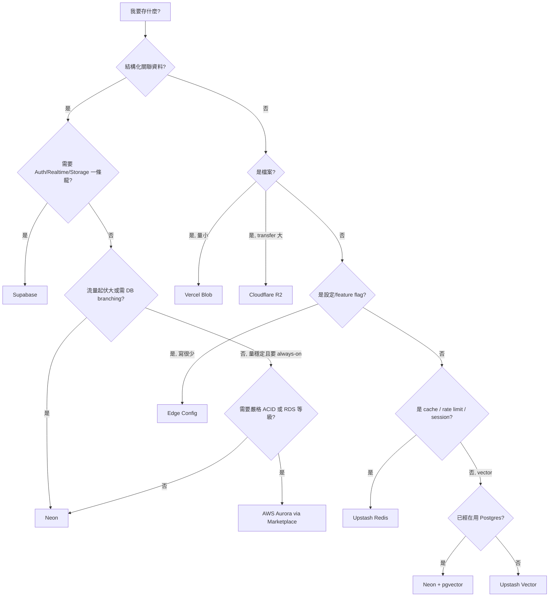

# 資料層怎麼選：Marketplace 上的 Neon / Supabase / Upstash 決策樹

## TL;DR

- **Vercel 退出資料庫經營**：Vercel Postgres 已在 2024 Q4–2025 Q1 被全數遷移到 Neon[^neon]，新 plan 從 Marketplace[^marketplace] 安裝；Vercel 自家只剩 Blob（檔案）與 Edge Config[^edge-config]（全球同步小型 KV）。
- **Marketplace 三大主力分工清楚**：純 Postgres + 想最便宜 → Neon；要 Auth / Realtime / Storage 一站式 → Supabase[^supabase]；高頻 cache、rate limit、HTTP 相容 Redis → Upstash[^upstash]。三家的 credentials 都會自動注入 env，計費也走 Vercel 統一帳單。
- **不要把 Edge Config 當資料庫**：它是「讀很多、寫很少、寫完最多 10 秒才全球生效」的場景專用——feature flag、redirects、IP/UA blocklist 都對；要立即可見、要交易、要寫入頻繁的東西，請用 Postgres 或 Redis。

## 為什麼這篇要從「Vercel Postgres 退役」講起

2024 年底，Vercel 默默把所有 Vercel Postgres store 搬進 Neon，新案子從 Marketplace 走 Neon native integration（資料截至 2026-04）。表面上是基礎設施調整，骨子裡是個明確的政治宣告：**Vercel 不打算自營資料庫**，他們把這件事外包給更專業（也更願意打價格戰）的 serverless DB 公司。

對 indie 來說這是好事，理由有三：

1. **競爭壓低成本**：Marketplace 上 Neon、Supabase、Upstash、EdgeDB、AWS Aurora 全在同一個介面下被使用者直接比較，2025 Neon 被 Databricks[^databricks] 收購後反而把 storage 從 $1.75 砍到 $0.35 / GB-month、free tier compute 從 50 cu-hours 翻倍到 100 cu-hours。
2. **整合不再是賣點**：以前選 Vercel Postgres 是為了「按一鍵就接好」，現在 Marketplace 的任一家都會自動把 connection string 寫進 env、計費合併到 Vercel invoice，整合勞動力被打成日用品。
3. **Vercel 專心顧自己會贏的兩塊**：Blob 與 Edge Config——兩個都跟「全球邊緣 + 部署生命週期」綁得很死，是別家短期內難複製的差異化。

換句話說，現在 indie 的選擇結構不是「用不用 Vercel 的資料庫」，而是「**在 Vercel 生態裡怎麼挑外部 provider**」。下面把 Vercel 自家的兩塊先講完，再進到 Marketplace 三巨頭。

## Vercel 自己只留兩塊：Blob 與 Edge Config

**Vercel Blob** 是檔案儲存，2025-05 之後 Hobby 也能用，計價 $0.023/GB-month + $0.05/GB transfer。內容定位是「用戶頭像、產品圖、影片、PDF」，跟 S3 / R2 同級。對 indie 的意義是：你做 SaaS 一定會碰到 user upload，這條路不用再額外開 AWS 帳號、不用設 IAM。但**如果你的檔案量會破 100GB 或 transfer 是主要成本，Cloudflare R2[^r2] 仍是更便宜的選擇（R2 不收 egress[^egress]）**——R2 vs Blob 的取捨 Vol.10 那期已經談過，這裡不重複。

**Edge Config** 比較容易被誤用。它是全球同步的小型 KV，P99 < 15ms、常見 < 1ms（資料截至 2026-04），跟 Middleware 搭配可以做：

- Feature flags / A/B test 分流（與 LaunchDarkly 也有官方整合）
- IP / User-Agent blocklist
- 緊急 redirect（不用 redeploy 就能改）
- 維運開關（kill switch）

Edge Config 的硬限制要記三條：（1）寫入要全球傳播最多 10 秒，**不適合即時寫入**；（2）每 project 最多接 3 個 store；（3）少而大的 store 比多而小的好（讀同一個 store 才能命中 cache）。要把它當作「部署一次、之後隨時無痛調整參數」的設定檔，不是線上 DB。

## Marketplace 三大 provider 對照（截至 2026-04）

| 維度 | Neon | Supabase | Upstash |
|---|---|---|---|
| 主打 | Serverless Postgres | Postgres + Auth + Storage + Realtime + Edge Functions | Serverless Redis（HTTP）+ Vector + QStash |
| 計費模型 | 用量制（compute hour + storage） | 訂閱 + 用量 | 按 request + storage |
| Free tier | 100 cu-hours / 0.5 GB / $5 spend cap | Free tier（含 Auth、Storage、Realtime） | 500K commands/月 + 200GB bandwidth |
| 入門付費 | Launch $19/月起，$0.106/cu-hour | Pro $25/月/組織 | $0.20 / 100K commands、storage $0.25/GB |
| Scale to zero | 5 分鐘 idle 自動 suspend | 沒有（DB 一直在） | 天生 serverless |
| Branching | DB-level branching（內建殺手鐧） | 有 branch，但偏實驗性 | N/A |
| 連線方式 | HTTP（單 query）/ WebSocket（transaction） | 標準 PG wire 或 PostgREST | HTTP REST，無 connection pool 痛 |
| 何時選它 | 流量起伏大、用 Postgres、要 preview env | 想一個帳號搞定 Auth + DB + Storage | Edge / Function 環境要 cache 或 rate limit |

幾個 indie 容易踩到的細節：

- **Neon 的 scale-to-zero 是雙面刃**：閒置成本趨近於零、cold start 卻會吃到 100–300ms。對「白天平均 2 QPS、晚上歸零」的個人 SaaS 是聖物；對「要保證每個 API call 在 100ms 以內」的 B2B 工具反而扣分。後者你會想付錢買 always-on compute。
- **Supabase 是 platform 不是 DB**：你買的是「不用自己做 Auth、RLS[^rls]、Realtime」這個服務組合。如果你只用到 Postgres，等於繳了平台稅。但如果你會用到其中兩塊以上，Supabase 通常比自己拼湊便宜很多。
- **Upstash 的 HTTP API 是為 serverless 而生**：傳統 Redis 的 TCP 長連線在 Edge Function / Lambda 環境會吃光連線池，Upstash 直接走 HTTP/REST，每次請求自帶認證，沒有 connection pooling 的鬼故事。
- **Databricks 收購 Neon（2025-05）**：對 indie 是潛在風險點。短期看到的是降價，長期則要關注「Databricks 主力客戶是企業，Neon 的 indie 友善路線會不會被稀釋」（資料截至 2026-04，這是公開討論中的開放問題）。如果你不放心，把 schema migration 寫成 portable，必要時再跳船。

## 決策樹：按 workload 對應 provider

幾個讀法上的提醒：

- **第一刀切「結構化 vs 非結構化」**——別省這一步，搞錯會讓你之後重寫一次。
- **Auth / Realtime 是 Supabase 的決勝點**：indie 自己刻 OAuth + email magic link + RBAC 大約要燒 2–4 週，Supabase 一個下午搞定還順便有 RLS。
- **Vector 走「已經在用 Postgres 就 pgvector[^pgvector]，否則 Upstash Vector」**：少維護一個 service。pgvector 的效能在百萬向量內完全夠 indie 用。
- **Aurora / EdgeDB 留給「我有特定理由」的人**：Aurora 是給已經在 AWS 生態的團隊；EdgeDB 是要 schema-first ORM 體驗的人。多數 indie 不會走到這邊。

## 整合的成本含意

Marketplace 的「credentials 自動注入 env、Vercel 統一帳單」聽起來很美，三件事要先講清楚：

1. **整合計費 ≠ 比較便宜**：你付的價格跟直接從 Neon / Supabase / Upstash 官網開帳號**通常一致**（部分 plan 是平價、少數有微小匯率差）。差別只在請款流程：對 indie 來說，少一張信用卡、少一筆對帳，就是價值。
2. **vendor lock-in 是真的**：env var 由 Vercel 管，搬家時你要自己處理 connection string 移植。建議在 code 裡用自定 env 名（如 `DATABASE_URL`）、再從 Vercel 注入的 `POSTGRES_URL` 重新 alias，避免硬編死。
3. **calculation gotcha**：用量制 provider（Neon、Upstash）如果忘了監控，半夜被 bot 打、或自己寫了 N+1 query，帳單可以飛得很快。**第一週上線就把 spend cap 設好**，Neon 有 $5 / $19 / $69 三檔起跳，Upstash 也有 monthly budget alert。

最後一個比較不浪漫但實在的觀察：在 2026 年，「Vercel + Marketplace 三巨頭其中之二」幾乎是 indie SaaS 的預設組合。你不需要每個產品線都自己重新評估，把這套組合當 default、只在有具體理由時才偏離，能省下大量決策疲勞。

[^neon]: Neon 是 serverless Postgres 公司，主打 scale-to-zero、database branching 與 time travel queries，2025 年被 Databricks 收購，是 Vercel Postgres 退役後遷移過去的官方下家。
[^marketplace]: Vercel Marketplace 是讓你在 Vercel dashboard 直接接外部服務（Neon、Supabase、Upstash 等）的整合入口，credentials 自動寫入 env、計費合併到 Vercel 月結，2024 年起取代了 Vercel 自家資料庫產品。
[^edge-config]: Edge Config 是 Vercel 提供的全球同步唯讀 KV，P99 < 15ms、寫入要幾秒才全球生效，定位是 feature flag、redirects、blocklist 這類「讀很多寫很少」的設定檔，不是線上 DB。
[^supabase]: Supabase 是開源的 Firebase 替代品，把 Postgres 包上 Auth、Storage、Realtime、Edge Functions 一條龍，是「不想自己刻登入跟即時同步」的 indie 預設選項。
[^upstash]: Upstash 是 serverless Redis 公司，特色是用 HTTP REST 介面取代傳統 TCP 長連線，剛好解決 Edge Function 與 Lambda 沒辦法養 connection pool 的痛點，旗下還有 Vector 與 QStash。
[^databricks]: Databricks 是企業級的 lakehouse / 資料平台公司，主要客戶是大公司資料團隊；2025-05 收購 Neon 引發 indie 圈擔心「重心會不會偏向 enterprise」的長期討論。
[^r2]: Cloudflare R2 是 Cloudflare 推出的 S3 相容物件儲存，最大賣點是 egress（出站流量）完全免費，對 bandwidth-heavy 的 indie 是省錢神器，本期第六篇與 Vol.10 都會深聊。
[^egress]: Egress 指資料從雲端流出到網際網路的流量，傳統雲廠（AWS、GCP）會按 GB 收高額費用，是雲端帳單最常爆掉的項目；Cloudflare 的 R2 與 Workers 完全免收 egress 是業界異數。
[^rls]: RLS 是 Row Level Security（資料列級權限）的縮寫，Postgres 內建功能，讓你在 SQL 層直接寫權限規則（例如「使用者只能讀自己的訂單」），Supabase 把 RLS 推成主要 auth 模型。
[^pgvector]: pgvector 是 Postgres 的擴充套件，把 vector embedding 直接存進關聯式資料庫並支援近似最近鄰搜尋，省下另外維護 vector DB 的成本；百萬向量規模內的 RAG 都夠用。

---

### 來源

- [Vercel Postgres Transition Guide — Neon Docs](https://neon.com/docs/guides/vercel-postgres-transition-guide)
- [Vercel Storage overview（官方文件，2026-04 擷取）](https://vercel.com/docs/storage)
- [Edge Config Limits and pricing — Vercel Docs](https://vercel.com/docs/edge-config/edge-config-limits)
- [Neon Serverless Postgres Pricing 2026 — simplyblock](https://vela.simplyblock.io/articles/neon-serverless-postgres-pricing-2026/)
- [Upstash Redis Pricing & Limits（官方）](https://upstash.com/docs/redis/overall/pricing)
- [Neon vs Supabase (2026) — Database or Backend?](https://dev.to/thiago_alvarez_a7561753aa/neon-vs-supabase-2026-database-or-backend-the-real-tradeoffs-3ggn)
