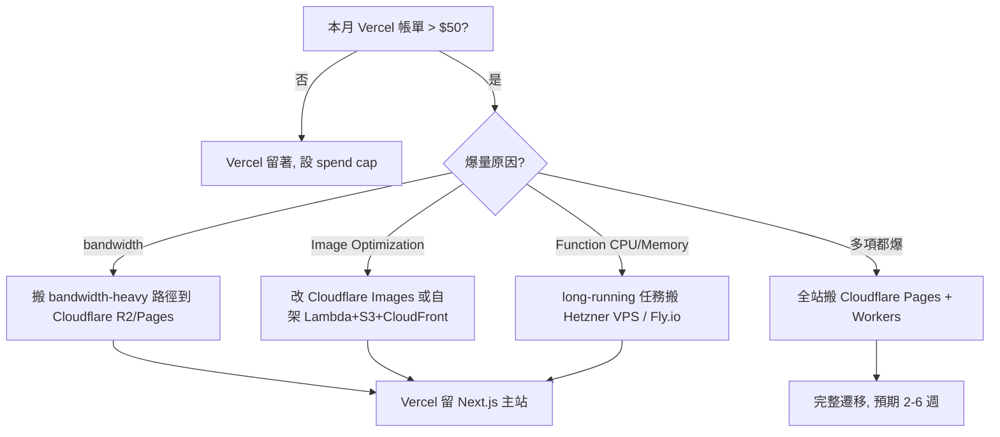

# 避雷與「該逃離 Vercel」的訊號：bandwidth、Image Optimization、Pro 帳單

## TL;DR

本期前五篇都在講 Vercel 怎麼用得順，這篇講反面——**什麼狀況下 Vercel 會把你帳單炸到三位數美元、要不要逃、怎麼逃**。重點是平衡，不是反 Vercel：對流量低、靜態為主、Next.js 重度依賴的 indie SaaS，Vercel 留在 $20 是真實場景；但對 bandwidth-heavy、image-heavy、long-running 工作負載，提早設好 Spend Management 跟 exit plan 才是負責任的做法。

三個最容易爆的隱性成本：**bandwidth $0.15/GB 超出 Pro 的 1TB 後**、**Image Optimization 每 1,000 張 $5**（HowdyGo[^howdygo] 案例 28K 張多燒 $115/月，是 base $20 的 5.75 倍）、**Active CPU + Provisioned Memory** 對長時間執行的伺服端任務會持續累積。Vercel 自己提供的 Spend Management[^spend-management] 在 2025-09 之後預設開啟、可在 50/75/100% 三個門檻發通知與自動暫停專案，但因為**檢查頻率是「每幾分鐘」一次**、不是 realtime，所以仍會有幾分鐘超額——把 spend cap 設在你能接受的上限**之下**。

替代方案沒有銀彈：Cloudflare Pages[^cloudflare-pages] + Workers + R2[^r2] 換到零 egress[^egress] 但 DX 與 Next.js 相容性是有代價的；Hetzner[^hetzner] / VPS[^vps] 是規模化最便宜但你要自己當 SRE[^sre]；Netlify、Railway[^railway]、Render[^render]、Fly.io[^fly] 各有自己的甜蜜區。本文末附 exit playbook。

> 截至日期：2026-04-26。Vercel 定價會變，下手前以官方 [pricing 頁](https://vercel.com/pricing) 與 [Spend Management 文件](https://vercel.com/docs/spend-management) 為準。

## 三大隱性成本拆解

### 1. Bandwidth：$0.15/GB 是 Vercel 帳單炸開的頭號元兇

Pro 方案內含 **1TB Fast Data Transfer**，超過後每 GB **$0.15**。1TB 聽起來很多，但實際換算非常容易見底：

- **一張未壓縮的桌面截圖約 2-5MB**：1TB 約 200,000-500,000 次完整載入
- **一支 1080p 短片 30 秒約 10-30MB**：1TB 約 33,000-100,000 次播放
- **一篇 markdown blog 含 hero image 約 500KB**：1TB 約 200 萬次瀏覽

問題出在「**意外爆紅**」這件事不是漸進的。一篇 Hacker News 首頁文、一個 viral tweet、一支 TikTok demo，可以在 24 小時內讓你的 bandwidth 從每天 5GB 跳到 500GB。回頭結帳：超出 1TB 的 5.6TB 大約是 **$840**——這還算少的。Indie Hackers 與 Reddit 上有多筆案例：[一位 indie hacker 月帳衝到 $1.8K](https://www.indiehackers.com/product/mdx-one/huge-vercel-costs-and-rebrand-to-feather--Myc071NF66jYxLB2yED)、有人受 DDoS 攻擊收到 [$23,000 帳單](https://servercompass.app/blog/vercel-pricing-explained-hidden-costs)（Vercel 對「所有 traffic」收費，包含惡意請求；只能靠 WAF[^waf] 或 spend cap 自救）。

更陰險的是：**bandwidth 不只算 HTML 與圖片**。`/api/*` 的 response body、Server Components 的 RSC payload[^rsc]、`next/image` 優化後的 webp 全部算。有人發現 React Server Components 的序列化 payload 在某些頁面比 HTML 還大。

### 2. Image Optimization：HowdyGo 的 7 倍帳單

`next/image` 在 Vercel 上是預設啟動的 hosted service，定價：

- **Pro 內含 5,000 source images / 月**
- 超出每 **1,000 source 約 $5**（2025 年 2 月後新價，舊方案更貴）
- transforms 是另外計費，每 1,000 transforms $0.05 起

[HowdyGo 的案例](https://www.howdygo.com/blog/cutting-howdygos-vercel-costs-by-80-without-compromising-ux-or-dx) 是教科書範例：他們是互動式 web app 錄製重播工具，本來就是 image-heavy 場景，月優化量 **28,000 張**：

> 「This would have added $115 to our $20/month hosting fee, basically a near 7x increase in cost.」

他們的解法不是搬 Cloudflare Images，而是**自架 AWS Lambda + S3 + CloudFront**（用 Terraform[^terraform] module 包），結果 Lambda 在 free tier 內（覆蓋約 5 萬張/月），超出每 1,000 張約 $0.02。整體**減少超過 80% 的託管成本**。

這個案例的教訓不是「Vercel 太貴」，而是**單一 SaaS 團隊一旦進入「優化是核心使用情境」的領域，hosted Image Optimization 的單位成本必然失控**。對 marketing site / blog 而言 5,000 張足夠用一輩子；對影音、設計工具、產品截圖類 SaaS 是十天內的量。

### 3. Active CPU + Provisioned Memory：long-running 的慢性累積

2024-2025 Vercel 把 serverless function 計費從 GB-second 改成 **Active CPU + Provisioned Memory** 二段制：

- **Active CPU**：$0.128 / hr（只算實際 CPU 在跑的時間，I/O 等待不算）
- **Provisioned Memory**：$0.0106 / GB-hr（function instance 存活期間都算）

對「**短任務、I/O bound**」（API 接 LLM、查資料庫等回應）這個改動實際**省 80-90%**——因為等 OpenAI 回 token 的時間不算 CPU。但對「**長 server 持續工作**」（cron job、影片轉檔、批次處理、長 SSE / streaming connection）情況反過來：function 開著就在收 memory 費，CPU 跑著就在收 CPU 費。

危險訊號：
- function execution time p95 > 30 秒
- 你開了大量 background polling 或 long-lived SSE
- `vercel logs` 看到大量 cold start、卻又 keep-alive 撐很久

這類 workload 走「**Vercel 的 sweet spot 之外**」，搬到 Hetzner $5/月 VPS 跑 Node 持續服務反而便宜兩個數量級。

## 真實案例：留 vs 逃，雙向都有

**留下來的人（Vercel 真的就 $20）：**
- **小型 B2B SaaS dashboard**（流量 < 50GB/月、5,000 圖片以內、API 都打外部第三方）：每月實付就是 base $20，連 spend management 都不用設。Vercel 給的 DX 跟 preview deployment 對 indie 一兩人團隊是時間黃金。
- **靜態文件站 / blog（搭 Cloudflare 反代）**：把 bandwidth-heavy 的圖片、video 丟給 Cloudflare R2/Stream，Vercel 只服務 HTML 與 dynamic API，多數人月帳穩定 $20。

**搬走的人：**
- **HowdyGo**（image-heavy）：$135 → 自架 AWS 後省 80%
- **mdx-one / Feather**（[Indie Hackers 公開案例](https://www.indiehackers.com/product/mdx-one/huge-vercel-costs-and-rebrand-to-feather--Myc071NF66jYxLB2yED)）：$1.8K/月不可持續，重構降回 $20
- **影音 / 檔案下載類**：bandwidth 一定爆，社群普遍建議直接 Cloudflare Pages + R2

**重點**：留 vs 逃**不是價值判斷**，是工作負載判斷。同一個 Vercel，對不同 workload 的單位成本可以差兩個數量級。

## Vercel 自己的 Spend Management 能不能救？

可以救一部分，但**不要當成唯一防線**。根據 [官方文件](https://vercel.com/docs/spend-management)（截至 2026-04）：

| 功能 | 細節 |
| --- | --- |
| 預設啟用 | 2025-09 後 Pro 預設開啟 |
| 預設預算 | $200（可調） |
| 通知門檻 | 50% / 75% / 100%（web + email） |
| SMS 通知 | 100% 才送 |
| Webhook | 50/75/100% 都會送（POST，含 `x-vercel-signature` HMAC） |
| 自動暫停 | 100% 觸發、需手動開啟 `Pause production deployment` |
| 暫停顆粒度 | **整個 team 所有 production project**（無法只暫停單一 project） |
| 解除暫停 | **必須一個一個手動**（dashboard 或 REST API） |
| 檢查頻率 | **每幾分鐘**檢查一次，非 realtime |

**三個關鍵限制要記住**：

1. **檢查不是 realtime**：你設 $200，實際可能在 $215-$250 才停。對 bandwidth burst 攻擊或 viral 事件，幾分鐘內可以多燒幾百美元。
2. **暫停是「全部專案」**：不能只停某個 leak 嚴重的 project，會把你整個 team 全部 prod deploy 同時停掉，回 503。
3. **資源範圍**：只算 metered usage，**不含** seats、Marketplace integration、add-ons。

實務建議：**spend cap 設在你絕對上限的 70-80%**。例如你最多承受 $300，就設 $200。再搭配 webhook 自己接 Slack / SMS，做到第一時間人為介入。

## 何時該逃 / 怎麼逃：exit playbook

### 決策樹

### 漸進式退出（推薦）

不要一次大搬家。**先把流量大戶切走、Vercel 主站留著**：

1. **Stage 1**（一個下午）：靜態 asset、影片、大檔案改 host 在 Cloudflare R2，DNS 指過去。bandwidth 立刻砍掉七八成。
2. **Stage 2**（一週）：圖片改走 Cloudflare Images，把 `next/image` 的 `loader` 換成自訂 loader 指向 Cloudflare。
3. **Stage 3**（兩週）：long-running API 拆出去 Fly.io / Hetzner。Vercel 上保留 short Edge function。
4. **Stage 4**（一個月，optional）：整站搬 Cloudflare Pages + Workers。Next.js 的 App Router 有些 RSC 模式在 Cloudflare adapter 上有 edge case，要留時間做 regression test。

### 完整遷移的痛點（Cloudflare Pages）

- **Next.js 相容性**：`@cloudflare/next-on-pages` adapter 持續進步，但 App Router 某些 RSC streaming pattern 仍需 workaround；用最新 Next 功能會踩到 edge case
- **ISR 行為**：on-demand revalidation 跟 Vercel 不完全等價
- **Build cache / preview deploy**：DX 比 Vercel 粗一截
- **Observability**：Vercel 的 Logs/Analytics tab 在 Cloudflare 要自己拼 Workers Analytics + Logpush

> Cloudflare 完整 stack 的拆解見 Vol.10〈Cloudflare Indie SaaS Stack 2026〉，本期不重複展開。

## 替代方案速查表

| 平台 | bandwidth | sweet spot | 痛點 | 何時選 |
| --- | --- | --- | --- | --- |
| **Vercel** | $0.15/GB（1TB included） | Next.js、低流量 SaaS、Marketing site | bandwidth + Image Opt 爆量、long-running 貴 | DX 優先、流量可預測 |
| **Cloudflare Pages + Workers + R2** | **零 egress** | 靜態 + edge function、bandwidth-heavy、全球分散 | Next.js adapter edge case、DX 較粗 | bandwidth/image 為主成本來源 |
| **Netlify** | $55/100GB pack（Pro 1TB） | Jamstack、hooks/forms 內建 | function 計費跟 Vercel 類似邏輯 | 偏好 Netlify 工具鏈 |
| **Railway** | metered，含量隨方案 | full-stack monorepo、含 DB | 流量大時也會貴 | 想把 DB / Redis / app 全包 |
| **Render** | $0.10/GB | long-running web service、cron | edge / 全球 PoP 弱 | 需要傳統 always-on server |
| **Fly.io** | $0.02/GB（北美/歐）up to $0.20（其他） | 全球邊緣 VM、long-running、WebSocket | 計費維度多需學習 | 真的需要 multi-region 控制 |
| **Hetzner / VPS** | 含量大（CX22 含 20TB）、超過 €1/TB | 規模化最便宜、可塞任何東西 | 全 SRE 自己來、無 preview deploy | 願意花時間換錢 |

> 數字截至 2026-04-26。各家定價與內含量會調整，下手前以官網為準。

## 本期重點回顧

- 三大隱性成本：**bandwidth $0.15/GB**、**Image Optimization $5/1K source**、**Active CPU + Provisioned Memory**
- 留 vs 逃看 workload，不是看 Vercel 好壞
- Spend Management **設在絕對上限的 70-80%**、不要當唯一防線、暫停是 team 全停
- Exit 漸進式做：先切 bandwidth → 再切 image → 再切 long-running → 最後才考慮整站
- 替代方案沒有銀彈；bandwidth-heavy 走 Cloudflare、long-running 走 Hetzner/Fly、規模化走 VPS

下一期會回到 Vercel 內部，把這六篇拆過的服務圖整合成一張 indie SaaS 的「**從 hobby 到 $10K MRR 的成本曲線**」總圖。

[^howdygo]: HowdyGo 是一家做互動式網頁示範錄製的 SaaS，2025 年公開分享自己把 Vercel 帳單砍 80% 的過程，是 indie 圈最被引用的「Image Optimization 爆帳」案例，他們最後改用自架 Lambda + S3 + CloudFront。
[^spend-management]: Spend Management 是 Vercel 的內建預算控管，可以在 50 / 75 / 100% 門檻發通知或自動暫停 production deployment；2025-09 之後對 Pro 預設啟用，但檢查不是 realtime，仍會有幾分鐘超額窗口。
[^cloudflare-pages]: Cloudflare Pages 是 Cloudflare 推出的靜態站與 SSR 託管，整合 Workers 後可以在邊緣跑 Next.js / SvelteKit 等框架，最大賣點是 bandwidth / egress 完全免費。
[^r2]: Cloudflare R2 是 Cloudflare 推出的 S3 相容物件儲存，最大賣點是 egress 完全免費，對 bandwidth-heavy 的 indie 是省錢神器，本期第四篇與 Vol.10 都會深聊。
[^egress]: Egress 指資料從雲端流出到網際網路的流量，傳統雲廠（AWS、GCP）會按 GB 收高額費用，是雲端帳單最常爆掉的項目；Cloudflare 的 R2 與 Workers 完全免收 egress 是業界異數。
[^hetzner]: Hetzner 是德國的老牌 VPS 與裸機租用商，主打超低價（最入門 CX22 €4 / 月含 20 TB 流量），對「願意花時間自己當 SRE 換省錢」的 indie 是規模化最便宜的解。
[^vps]: VPS（Virtual Private Server）是傳統「給你一台虛擬機自己裝什麼都行」的雲端形態，跟 serverless 相反——彈性最大、最便宜，但運維（更新、安全、備份）全部自己來。
[^sre]: SRE（Site Reliability Engineering）是 Google 提出的工程角色，負責服務的可靠性、observability、容量規劃；indie 自架就是「一個人同時當開發者跟 SRE」。
[^railway]: Railway 是把 monorepo 一鍵部署成「app + DB + Redis 全包」的 PaaS，對想要「一個帳單管完所有東西」的 indie 友善，但流量大時也會貴。
[^render]: Render 是定位接近 Heroku 的 PaaS，主打 always-on web service、cron、background worker；對「需要傳統長駐 server」的 indie 是相對便宜的選項。
[^fly]: Fly.io 是把 Docker container 跑在全球邊緣 micro-VM 的平台，特色是「app 自己決定要在哪幾個 region 起 instance」，適合需要 multi-region 控制與長連線的 SaaS。
[^waf]: WAF（Web Application Firewall）是擋掉 SQL injection、bot 流量、DDoS 的應用層防火牆；對 Vercel 來說 Cloudflare 在前、Vercel 在後是常見組合，可以把惡意流量擋在 Vercel 計費之前。
[^rsc]: RSC（React Server Components）是 React 18 之後的伺服器端元件模型，把 component tree 在 server 渲染後以序列化 payload 傳給瀏覽器；payload 比 HTML 多一層結構描述，所以也會吃 bandwidth。
[^terraform]: Terraform 是 HashiCorp 的 Infrastructure as Code 工具，用宣告式 config 描述「我要這幾台 EC2、這個 S3 bucket、這條 CloudFront」然後一鍵套用；HowdyGo 的自架方案就用 Terraform module 包好。

---

## 來源

- [Vercel Spend Management 官方文件（2026-04 截取）](https://vercel.com/docs/spend-management)
- [Spend Management now enabled by default on Pro（Vercel changelog）](https://vercel.com/changelog/spend-management-now-enabled-by-default-on-pro)
- [Vercel Image Optimization Limits and Pricing](https://vercel.com/docs/image-optimization/limits-and-pricing)
- [Faster transformations and reduced pricing for Image Optimization（Vercel changelog, 2025-02）](https://vercel.com/changelog/faster-transformations-and-reduced-pricing-for-image-optimization)
- [Cutting HowdyGo's Vercel Costs by 80% without compromising UX or DX](https://www.howdygo.com/blog/cutting-howdygos-vercel-costs-by-80-without-compromising-ux-or-dx)
- [Huge Vercel Costs, and Rebrand to Feather（Indie Hackers）](https://www.indiehackers.com/product/mdx-one/huge-vercel-costs-and-rebrand-to-feather--Myc071NF66jYxLB2yED)
- [Vercel's Hidden Costs Add Up（Server Compass，含 $23K DDoS 帳單案例）](https://servercompass.app/blog/vercel-pricing-explained-hidden-costs)
- [Vercel Pricing 2026: What You Actually Pay（We Are Founders）](https://www.wearefounders.uk/vercel-pricing-2026-what-you-actually-pay-to-host-your-startup/)
- [Vercel vs Hetzner in 2026 for Solo Developers（DevToolPicks）](https://devtoolpicks.com/blog/vercel-vs-hetzner-2026-solo-developers)
- [Vercel vs Cloudflare Pages: Edge Deployment for Commerce in 2026（Contra Collective）](https://contracollective.com/blog/vercel-vs-cloudflare-pages-edge-deployment-2026)
- [Best Vercel Alternatives 2026（Puter Developer Blog）](https://developer.puter.com/blog/vercel-alternatives/)
- [Vercel Pricing 2026: Total Cost & Competitors Compared（CheckThat.ai）](https://checkthat.ai/brands/vercel/pricing)
