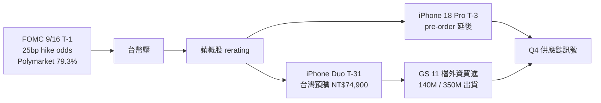

# 每日創業情報 — 2026-09-15

## 🎯 今日 TL;DR

- **FOMC 9/16 T-1 週三決策 25bp hike odds 三軌趨近**：**Polymarket 79.3%**（週日 → 週一 續上調）；`.CNBC` 9/14「Warsh Jackson Hole 8/28 keynote」+ 8/CPI 3.4% headline / 2.4% core（9/11 已發布）+ **PPI 0.4% MoM / 5.4% YoY**（9/12）+ 8 月非農 +162k 四合一為 hike 派新火藥；ING「Fed set to hike 25bp in recalibration move」+ Achiever「Fed poised to hike as oil reignites inflation」+ Cambridge Currencies「September 16 preview」+ Seeking Alpha 一致；「one-and-done」為明日主要下游敘事、weak wage growth + tariff refunds + stagnant housing 為 2027 年 convergence 2% inflation 主軸；dot plot[^fomc-dot-plot] 9/16 為二次定調
- **iOS 27 T+1 第一日反饋**：**Engadget / TechCrunch / MartinCid 一致「Apple bets Siri on Google Gemini」正面訊號**；「Apple's Siri AI moves Apple's assistant much closer to modern generative AI systems, adding broader knowledge, personal context, on-screen awareness, complex actions」；`.GBNews` 9/13 T-1 「iPhone 11 起支援 iOS 27 但 Siri AI 限 iPhone 15 Pro 以上」續驗證；「iCloud+ 訂閱高 cap + Private Cloud Compute（Google 拿不到個人資料）」為隱私架構訊號；`.Baike` 9/13「EU 只允 Mac / Vision Pro（iPhone / iPad / Watch 全鎖）」續驗證、中國 mainland 不上線；**首發僅英文（法 / 日 / 韓 / 葡 / 西 10 月加入）**；`.RSWebsols`「Apple opens its new Siri AI to everyone with the iOS 27 public beta」為 7/14 T-2 個月開放試用軌跡
- **iPhone 18 Pro T-3 週五交機 pre-order 大幅延後**：**9to5Mac 9/14「iPhone 18 Pro, Pro Max pre-orders now delayed to October for most models」**（vs 9/12 T-2 「slow start」轉「Pro Max 部分 slip 到 10 月」訊號實質全面 escalation）；**Pro Max**：10/6-10/13、**Pro**：9/29-10/6 為當前排隊窗；**首日 9/18 到貨僅限 9/12 5AM PT 首波 pre-order 者**；「iPhone Duo T-31 即將預購 + 上代 17 Pro 太強 + Max 高 SKU slip + 週六反常預購」四因素累積為結構性訊號；台廠光電 / 光學 Q4 rerating 為 downgrade 訊號
- **Grok 4.7 續延第五窗 T+4 實質錯過**：Musk 9/11「還需要幾天 RL tuning」→ T+4 未見發布；`.CellCog` / `.OrcaRouter` / `.ChatGoat` 一致「no xAI announcement / model page / API identifier / price / release-notes entry」；**xAI docs 續列 grok-4.6 為最新**（8/12 發布、$2 / $6）；`.iWeaver` 9/13「Musk 提 Grok 4.8 為 2.5T」為未來取代 4.7 訊號；prediction market 已淡出；**不建議為未發布模型改工作流**、當前仍以 Sonnet 5 + Fable 5.1 + Astra + Gemini 3.8 Flash + DeepSeek V4.1 Flash 五軸
- **DeepSeek 定價二手訊息分歧持續**：BenchLM 9/15 T+0「V4.1 Flash $0.30 / $1.20 peak、V4-Pro $0.435 / $0.87 為 legacy 續行」、aipricing.guru 一致、`.deepseek.ai` 官方 pricing page「V4-Pro & V4-Flash per-token costs」；但 `.techjacksolutions` 9/10 「V4-Pro phased out」+ Coworker「From 04:00 UTC on September 14, 2026, deepseek-v4-pro requests route to V4.1 Flash at the Flash rate」為昨日「T-1 死線正式取消」pivot 訊號**與二手訊息永遠存在延遲**；**60 天雙棧驗證仍為長期投入**——V4.1 Flash（552B MoE + 1M ctx + native multimodal + KV cache 前代 1/4、peak $0.30 / M input）為 Flash 選項並存；**vendor 政策風險稽核為多模型 router 選型新軸**
- **MCP 2026-07-28 spec 400M SDK 月下載 4x YoY 增長**：**stateless core 為關鍵新軸**（bidirectional stateful → request/response model、servers 可 deploy serverless / edge）+ Multi Round-Trip Requests + header-based routing + cacheable list results + auth hardening + formal extensions framework + Tier 1 SDKs 更新；`.WorkOS` 9/14 一致「MCP recently surpassed 400M monthly SDK downloads, 4x increase this year」；**「MCP 已成為 industry standard for connecting AI agents to applications」為 2026 主敘事**；獨立開發者需注意 stateless core 為 serverless edge 部署（Cloudflare Workers / Vercel）新窗
- **Visual Studio 2026 T+7 GA 9/8 + GitHub Copilot BYOK preview + JetBrains 三合一升級**：Visual Studio 2026 已於 9/8 T+7 GA、`.Microsoft Learn`「GitHub Copilot can now suggest edits anywhere in your file, not just near your cursor」+ **BYOK preview 全 SKU 預設開啟**（Community / Professional / Enterprise）+ MAI-Code-1-Flash 9/10 T+5 全 Copilot 已棄用+ **JetBrains IDEs sandbox managed policies**（filesystem / network / proxy 中央控制）+「review, run, and preview side by side in GitHub Copilot app」；為 .NET / 企業 IT 開發者週二 T+7 SOP 更新窗
- **Cursor Auto rate 舊價 9/7 Enterprise legacy 窗實質關閉 + Composer 2.5 $0.50/$2.50 Fast $3/$15 續為定價新常態**：`.Artificial Analysis`「Composer 2.5: third on Coding Agent Index」+「~10-60x lower cost than rivals」；8/24 flat Auto rate 已 retire、9/7 T+8 Enterprise legacy 也已收尾；**Teams / Enterprise 第三方 model 加 $0.25 per M token Cursor Token Rate**；6/1 T+3 個月 Premium seat $96/月 vs Standard $32/月 已生效；**Composer 3 續無 official release / benchmark / pricing**——與 Grok 4.7 同 pattern（口頭承諾 + 無官方確認）
- **台廠 iPhone Duo 供應鏈 Goldman Sachs 11 檔買進 + 外資基本 140 萬台 / 樂觀 350 萬台**：`.鉅亨網` 9/12「iPhone Duo 2026 市占近 25%」+ `.UDN` 「外資喊買 11 台廠」+ `.TVBS` 「鴻海、南電都入列」；iPhone Duo 10/16 T-31 台灣預購 8 PM 台北時間 NT$74,900 起 256GB / 512GB / 1TB / 2TB 四階；Samsung Display 提供折疊螢幕（Apple 借道七年競爭對手）；台廠 100-part titanium 3D printed hinge（新日興 3376 / 兆利 3548）+ FPC（臻鼎 4958 / 台郡 6269）+ 光學（大立光 / 玉晶光）+ Foxconn 專屬組裝續為 Q4 深度供應鏈
- **Neon vs Supabase vs Turso vs Convex 2026 分工新格局**：**Supabase = 一體化平台 backend**（Postgres + Auth + storage + realtime + edge functions + vector + cron）；**Neon = 純 serverless Postgres**（scale-to-zero + instant branching + fastest cold starts）；**Turso = libSQL edge**（per-user databases + embedded replicas + 亞毫秒讀取）；**Convex = TypeScript-first reactivity**；`.PkgPulse` / `.BuildMVPFast` / `.GautamKhorana` 一致「Supabase 為 first SaaS MVP 最快路徑」、「Neon 為 indie hacker 最佳選擇」；獨立開發者 Q4 選型窗口
- **Anthropic Sonnet 5 引入價 $2/$10 續為永久定價**：**原計 9/1 T-2 週上調 $3/$15 已取消**、Sonnet 5 續為 default（Free + Pro）；**1M context + 128K output**；「narrowing capability gap with Opus 4.8」；Fable 5.1 cache read 75% 折扣（$1 → $0.25 / M）續為長 horizon agent 主軸；**Managed Agents session budget cap + budget_reached stop reason** 為成本控制新玩法；`anthropic-workspace-id` response header 為 tenant 分離新工具
- **商業服務業 AI 導入 10 萬案 10/20 T-35 五週衝刺 + SIIR 已 confirmed 不辦理續為 2026 大門實質已關**：`.CIMC` / `.metabiz` / `.YuTuo-Tech` 一致；50% 補助 / 上限 NT$ 10 萬 / 名義收件到 2027/10/20 但補助經費用罄提前截止；**11 大類**（ERP、雲庫存、供應鏈、HR、智慧排程、財會、資安）；「**絕對不得採購中國大陸廠牌**」+ 大陸企業 / 外商分公司 / 國內公司分公司皆不合格；雲市集 15 萬點並行 pipeline；獨立開發者最後窗實質為 10 萬案 T-35 五週衝刺 + 雲市集 15 萬點兩軌
- **中秋節 9/25 T-10 三 vertical 第二波電商促銷**：`.AllMarketing` / `.EasyStore` / `.Anyong` 一致「烤肉團聚 + 送禮表心意 + 中秋禮盒推薦」；茶葉 / 保健食品 / 選物三 vertical 第二波電商促銷；`.EasyStore` 蝦皮 momo PChome 2026 手續費 20% 續、酷澎 MAU +107% 到 990 萬（超越博客來到第 4）為結構性壓力；LINE Premium NT$165 Q4 + LINE OA AI Conversation Assistant Q4 2026 為結構性驅動；「蝦皮引流 + 官網留客 + LINE OA」三軌 2026 主敘事續為 6-12 個月主戰場

## 🔄 昨日追蹤

- 🔄 **iOS 27 T+0 上線 → T+1 第一日反饋**：Engadget / TechCrunch / MartinCid 一致「Apple bets Siri on Google Gemini」正面訊號；「Apple's Siri AI moves Apple's assistant much closer to modern generative AI systems」；「iCloud+ 訂閱高 cap + Private Cloud Compute」隱私架構訊號續驗證；EU 只允 Mac / Vision Pro、中國 mainland 不上線續驗證；首發僅英文（法 / 日 / 韓 / 葡 / 西 10 月加入）；App Store 已於 9/10 開放 iOS 27 SDK 提交、2027 年 4 月起強制 iOS 27 SDK
- 🔄 **FOMC 9/16 T-2 → T-1 週三**：25bp hike odds 三軌趨近；Polymarket 79.3% 為週日 → 週一續上調；ING / Achiever / Cambridge Currencies / Seeking Alpha 一致「Fed set to hike 25bp」；「one-and-done」為明日主要下游敘事；weak wage growth + tariff refunds + stagnant housing 為 2027 年 convergence 2% inflation 主軸
- 🔄 **iPhone 18 Pro T-4 → T-3 週五交機 pre-order 大幅延後**：9to5Mac 9/14「iPhone 18 Pro, Pro Max pre-orders now delayed to October for most models」為結構性 escalation；Pro Max：10/6-10/13、Pro：9/29-10/6；首日 9/18 到貨僅限 9/12 5AM PT 首波 pre-order 者；四因素累積訊號結構化
- 🔄 **Grok 4.7 第四窗 T+3 續延 → 第五窗 T+4 續延**：Musk 9/11「幾天內」T+4 未見；`.iWeaver` 9/13「Musk 提 Grok 4.8 為 2.5T」為未來取代 4.7 訊號；xAI docs 續列 grok-4.6 為最新；prediction market 已淡出；不建議為未發布模型改工作流
- 🔄 **DeepSeek V4-Pro T-0 大反轉 → 二手訊息分歧持續**：BenchLM / aipricing.guru / deepseek.ai 官方 pricing page 一致 V4-Pro 續行 legacy $0.435/$0.87；但 techjacksolutions / Coworker 二手訊息仍稱「retired」為訊號延遲；60 天雙棧驗證仍為長期投入
- 🔄 **iPhone Duo T-32 → T-31 台灣區預購 10/16 8 PM 台北時間 NT$74,900 起**：官方確認 63+ 國家同步、儲存 256GB / 512GB / 1TB / 2TB 四階；10/23 開賣 T-38；Goldman Sachs 11 檔買進 + 外資基本 140 萬台 / 樂觀 350 萬台為新結構性催化
- 🔄 **Claude Code v2.1.270（9/13）permissions regression fix + 2.1.269 plugin eval / output-style**：`claude plugin eval` scored / JSON + HTML report 為 skills / plugin 開發者可複製決策方法論；`/output-style [name]` 跨 Remote Control + cloud + headless；Bash 檔案編輯 diff；OTEL_METRICS_INCLUDE_REPOSITORY OTel vcs repository 分析
- 🔄 **TSMC CoWoS 130 kwpm 年底 → 260 kwpm 2028 年底翻倍 + Apple 竹科 2nm 過半 + 5,148 億台幣 8 月新高 + NVIDIA Feynman → Intel**：擴建焦點 Arizona AP9/10 + 台灣 AP7；ASE 3711 / SPIL 2325 / Powertech 6239 / KYEC 2449 台灣封測受惠廠續；A20 Pro 2nm 為 iPhone 18 Pro 首發；CoWoS-S → CoWoS-L 轉型續為 2026 主軸
- 🔄 **蝦皮 9.9 T+3 → T+4 + 中秋節 9/25 T-11 → T-10 三 vertical**：VIP DAY 9/11 收尾 T+4；中秋節 T-10 為茶葉 / 保健食品 / 選物三 vertical 第二波電商促銷；蝦皮 momo PChome 20% 高費率續為結構性壓力
- 🔄 **SIIR 已 confirmed 不辦理 + 商業服務業 10 萬案 T-36 → T-35 五週衝刺**：獨立開發者最後窗實質為 10 萬案 + 雲市集 15 萬點兩軌；「絕對不得採購中國廠牌」規定為 DeepSeek（今日仍為訊號分歧）/ 阿里 / 百度 vendor 篩選新阻礙
- 🆕 **MCP 2026-07-28 spec stateless core + 400M SDK 月下載 4x YoY**：request/response model + serverless / edge 部署 + Multi Round-Trip Requests + header-based routing + cacheable list results + auth hardening；「industry standard for connecting AI agents to applications」為 2026 主敘事
- 🆕 **Visual Studio 2026 9/8 T+7 GA + GitHub Copilot BYOK preview + JetBrains sandbox managed policies**：BYOK 全 SKU 預設；MAI-Code-1-Flash 已棄用；JetBrains IDEs filesystem / network / proxy 中央控制；review + run + preview side by side
- 🆕 **Neon vs Supabase vs Turso vs Convex 2026 分工新格局**：Supabase 一體化 backend 為 first SaaS MVP 最快；Neon 純 serverless Postgres 為 indie hacker 最佳；Turso libSQL edge + per-user；Convex TypeScript-first reactivity
- 🆕 **Anthropic Sonnet 5 $2/$10 續為永久定價（9/1 T-2 週上調 $3/$15 已取消）+ Managed Agents session budget cap**：Sonnet 5 續為 default；1M context + 128K output；budget_reached stop reason 為成本控制新工具

## 📰 台灣特定產業動向

| 事件 | 來源 | 對台灣獨立開發者的影響 | 機會/威脅 |
| ---- | ---- | ---- | ---- |
| **iPhone 18 Pro T-3 週五交機 pre-order 大幅延後（Pro Max 10/6-10/13、Pro 9/29-10/6）+ Duo T-31 台灣預購**：9to5Mac 9/14「pre-orders now delayed to October for most models」為結構性 escalation；`.鉅亨網` 9/12 GS「iPhone Duo 2026 市占近 25%」+ `.UDN`「外資喊買 11 台廠」+ `.TVBS`「鴻海、南電都入列」；Duo T-31 台灣預購 8 PM 台北時間 NT$74,900 起；Samsung Display 折疊螢幕 + 台廠 100-part titanium 3D printed hinge + FPC + 光學 + Foxconn 專屬組裝續為 Q4 深度供應鏈；FOMC 9/16 T-1 25bp hike 若成真 = 美元強 / 台幣壓 / 蘋概股 Q4 rerating 三面訊號 | [9to5Mac — iPhone 18 Pro, Pro Max pre-orders now delayed to October](https://9to5mac.com/2026/09/14/iphone-18-pro-pro-max-pre-orders-now-delayed-to-october-for-most-models/)、[MacRumors — Didn't Pre-Order an iPhone 18 Pro Yet? Wait Times Are Even Longer Now](https://www.macrumors.com/2026/09/14/iphone-18-pro-pre-orders-shipping-delivery-dates/)、[MacObserver — iPhone 18 Pro Delivery Dates: What Apple's Own Wording Actually Commits To](https://www.macobserver.com/news/iphone-18-pro-delivery-date-wording-what-it-commits-to/)、[鉅亨網 — iPhone Duo 2026 市占近 25%](https://news.cnyes.com/news/id/6603186)、[UDN — 外資點 11 檔蘋概鏈](https://udn.com/news/story/7251/9747061)、[TVBS — 摺疊機 iPhone Duo 亮相！外資點 11 檔蘋概鏈鴻海、南電都入列](https://news.tvbs.com.tw/money/4021235)、[Sinotrade 豐雲學堂 — 蘋果 2026 秋季發表會完整整理](https://www.sinotrade.com.tw/richclub/hotstock/iPhone-Duo%E6%AD%A3%E5%BC%8F%E7%99%BB%E5%A0%B4-%E8%98%8B%E6%9E%9C2026%E7%A7%8B%E5%AD%A3%E7%99%BC%E8%A1%A8%E6%9C%83%E5%AE%8C%E6%95%B4%E6%95%B4%E7%90%86-iPhone-18%E6%96%BC9%E6%9C%8812%E6%97%A5%E9%96%8B%E5%A7%8B%E9%A0%90%E8%B3%BC-%E7%BE%8E%E8%82%A1%E8%A7%80%E5%AF%9F-6aa1f0731c650a35afd9e656) | 台廠折疊 hinge + FPC + 光學 + 組裝 vertical 深度研究窗擴大：外資 11 檔（鴻海、南電、TSMC 為主軸）為 Q4 深度供應鏈；「基本 140 萬台 / 樂觀 350 萬台」為 Duo 首季出貨基準線；iPhone 18 Pro pre-order 大幅延後為 Q4 需求疲軟 vs 供應短缺兩派敘事；FOMC 9/16 T-1 25bp hike 若成真 = 美元強 / 台幣壓 = 蘋概股 / TSMC ADR / 台廠光電光學 Q4 rerating 多面訊號窗；「iPhone Duo T-31 dashboard × 100-part hinge 台廠 × iPhone 18 Pro T-3 延後 × iOS 27 T+1 反饋 × FOMC T-1 三軌趨近」五合一週報 | 機會：per-project「Duo T-31 dashboard × 台廠 11 檔外資評估 × iPhone 18 Pro T-3 延後訊號 × 匯率避險 case」供應鏈 audit NT$ 40K-120K + 訂閱制 NT$ 2K-5K / mo（月度供應鏈週報 + 外資 11 檔追蹤 + Duo 出貨基本 / 樂觀情境模型）；event pack NT$ 12K-30K；台灣區 NT$74,900 vs 美國 $1,999 匯差 22% 為避險 case study；威脅：財經媒體已滿溢類似分析、需以「獨立開發者 / SaaS 創業者角度 + vertical use case + 台廠 11 檔深度 + FOMC hike 台幣壓 rerating」差異化 |
| **TSMC 2nm 良率破 90% + 竹科寶山 Apple 過半產能 + CoWoS-S → CoWoS-L 轉型 + 資本支出 $56B + iPhone 18 Pro A20 Pro 首發**：`.104` 職場力「TSMC 本土供應鏈 2 奈米與 CoWoS 贏家」；`.Fugle` 「先進封裝產業深度報告 CoWoS-L 迎來爆發」；`.口袋學堂`「TSMC 狂砸 560 億美元資本支出」；`.Wistock`「AI 供應鏈傳導 CoWoS 到 PCB 基板 2026 受惠族群」；台積 8 月營收 5,148 億台幣新高（MoM +10.1% / YoY +53.3%）；CoWoS-S（full silicon interposer）→ CoWoS-L（local silicon interconnect）為 AI die size / power 主軸；FOMC 9/16 T-1 25bp hike 若成真 = 台幣壓 / CoWoS 續看多 | [104 職場力 — 台積電本土供應鏈 2 奈米與 CoWoS 贏家](https://blog.104.com.tw/tsmc-taiwan-semiconductor-supply-chain-2nm-cowos/)、[Fugle 富果直送 — 2026 先進封裝產業深度報告 台積電 CoWoS-L 爆發](https://blog.fugle.tw/post/cowos-industry-analysis)、[口袋學堂 — TSMC 狂砸 560 億美元資本支出](https://www.pocket.tw/school/report/perspective/7007/)、[Wistock — AI 供應鏈傳導台積電 CoWoS 到 PCB 基板 2026 受惠族群](https://blog.wistock.ai/practical-cases-experience-sharing/tsmc-cowos-abf-pcb-stocks-2026/)、[槓桿學院 — 台積電 2026 年股東會 2 奈米放量 560 億資本支出上修](https://leveragetw.com/tsmc-2026-shareholders-meeting/) | 先進封裝 vertical 深度研究窗擴大：CoWoS-S → CoWoS-L 為 2026 新分工敘事；台積 5,148 億月度新高 + 資本支出 $56B 為結構性催化；ASE / SPIL / Powertech / KYEC 台灣封測續為外溢直接受惠；Apple 竹科寶山首批 2nm 過半 + A20 Pro 首發為 iPhone 18 Pro / Duo 雙產品線；「TSMC CoWoS × 2nm 良率 × 資本支出 × iPhone 18 Pro A20 Pro × FOMC 決策」五合一週報 | 機會：「TSMC CoWoS 260 kwpm 2028 翻倍 × CoWoS-S 轉 CoWoS-L 深度 × 台廠封測四家外溢 × 台積 5,148 億新高 × 資本支出 $56B × FOMC 9/16 T-1 決策」六合一週報 NT$ 1,800-4,000 / mo；先進封裝 vertical 顧問 pricing NT$ 40K-120K；per-project 供應鏈 audit NT$ 40K-120K；威脅：財經媒體已滿溢類似分析、需以「獨立開發者 / SaaS 創業者角度 + CoWoS-L 深度 + Q4 rerating 訊號 + 匯率避險」差異化 |
| **iOS 27 T+1 第一日反饋（Siri AI Gemini 2.5 Pro + iPhone 15 Pro 以上 + EU / 中國 mainland 全鎖）+ App Store 2027 年 4 月起強制 iOS 27 SDK**：`.Engadget` 早期測試「能處理複雜多步 prompt」續為正面訊號；`.TechCrunch` 7/14 「Apple opens its new Siri AI to everyone with the iOS 27 public beta」為 T-2 個月開放試用軌跡；`.MartinCid` 9/13「Apple bets Siri on Google Gemini」；「iCloud+ 訂閱高 cap + Private Cloud Compute（Google 拿不到個人資料）」為隱私架構訊號續驗證；EU 只允 Mac / Vision Pro、中國 mainland 不上線；首發僅英文；台灣 App Store 屬 iCloud+ 主要輸出市場、Siri AI 每日限制 + iCloud+ 訂閱者高 cap 為訂閱定價敏感度新變數 | [TechCrunch — Apple opens its new Siri AI to everyone with the iOS 27 public beta](https://techcrunch.com/2026/07/14/apple-opens-its-new-siri-ai-to-everyone-with-the-ios-27-public-beta/)、[Engadget — iOS 27 with Siri AI will be available on September 14](https://www.engadget.com/2254005/ios-27-with-siri-ai-will-be-available-on-september-14/)、[MartinCid — iOS 27 ships Monday: Apple bets Siri on Google Gemini, EU locked out](https://www.martincid.com/technology-sv/ios-27-siri-ai-google-gemini-eu-blocked/)、[Eastern Herald — iOS 27 Launch: Apple Siri Now Runs on Google Gemini](https://easternherald.com/2026/09/13/ios-27-siri-google-gemini-apple-launch/)、[SuaraGarut — Apple Releases iOS 27 Featuring Gemini-Powered Siri AI](https://suaragarut.id/en/apple-releases-ios-27-siri-ai)、[GBNews — iOS 27 brings Siri AI new child safety tools faster load times](https://www.gbnews.com/tech/ios-27-release-date-september-14) | 週二 T+1 iOS App / Shortcut / App Intent 開發者：Siri AI Gemini 呼叫優先權 audit + iCloud+ 訂閱定價敏感度模型 + EU / 中國分區工作流 SOP + 台灣區呼叫優先權 audit + 2027 年 4 月 SDK 強制升級 checklist 為 5-in-1 商機窗；台灣 App Store 生態 vertical use case（LINE OA / 電商 / 訂閱制）為 pitch 新軸；iPhone 11 Pro 「30% 更快 App 啟動」為舊機優化 case study | 機會：per-project iOS 27 呼叫優先權 audit NT$ 30K-80K + 訂閱制 NT$ 2K-5K / mo（月度 iCloud+ 呼叫優先權週報 + EU / 中國分區工作流 SOP + 2027 年 4 月 SDK 強制升級 checklist）；event pack NT$ 8K-25K；台灣 App Store 上 iOS 27 相容 App / Shortcut / App Intent 訊號波動觀察窗；威脅：Apple 官方 documentation 已完整、需以「台灣 vertical use case + iCloud+ 訂閱定價敏感度 + 商業服務業 10 萬案匹配 + iPhone 11 Pro 舊機優化」差異化 |
| **商業服務業 AI 導入 10 萬案 10/20 T-35 五週衝刺 + 11 大類 + 大陸廠牌禁令 + 名義收件到 2027/10/20 補助用罄提前**：`.CIMC` / `.metabiz` / `.YuTuo-Tech` 續驗證；50% 補助 / 上限 NT$ 10 萬 / 3 個月使用後線上申請 / 3-5 個工作日核可 / 10-15 個工作日撥款；11 大類：ERP、雲庫存、供應鏈、HR、智慧排程、財會、資安等；規定「絕對不得採購中國大陸廠牌」+ 大陸企業 / 外商分公司 / 國內公司分公司皆不合格；雲市集 15 萬點並行；SBIR 一般型 100 萬 / 創新型 500 萬 / 破壞式 2000 萬為結構性主戰場 | [長典創新 — 政府補助 AI 導入最高 10 萬元商業服務業老闆申請懶人包](https://cimc.com.tw/%E3%80%902026%E6%9C%80%E6%96%B0%E6%94%BB%E7%95%A5%E3%80%91%E6%94%BF%E5%BA%9C%E8%A3%9C%E5%8A%A9ai%E5%B0%8E%E5%85%A5%E6%9C%80%E9%AB%9810%E8%90%AC%E5%85%83%E5%95%86%E6%A5%AD%E6%9C%8D%E5%8B%99%E6%A5%AD/)、[metabiz — 2026 中小微企業 AI 補助大補帖](https://metabiz.tw/smb-ai-digital-transformation-subsidy-guide-2026/)、[優創智能 — 2026 中小企業 AI 補助總整理三大方案](https://www.yutuo-tech.com/blog/ai-subsidy-2026/)、[104 學習 — SBIR 補助申請完全指南 2026](https://nabi.104.com.tw/posts/nabi_post_b9b99b67-c9ca-40f1-8106-04119361ed4e)、[瑞恩設計 — 店家導入 AI 工具補助最高 10 萬單店導入補助完整申請指南](https://knowledge.ryanndesign.com/articles/single-store-ai-subsidy-guide/) | 獨立開發者最後窗實質為商業服務業 AI 導入 10 萬案 T-35 五週衝刺 + 雲市集 15 萬點兩軌；11 大類為 SaaS vertical pitch 明確錨點；「絕對不得採購中國廠牌」為 DeepSeek（今日仍為訊號分歧）/ 阿里 / 百度 vendor 篩選新阻礙；「AI 導入補助 + LINE OA + 私域 CRM + AI 客服 + 中秋節第二波電商促銷」四合一 pitch 續為 Q4 主戰場；名義收件到 2027/10/20 但補助經費用罄即提前截止為壓力點 | 機會：per-project NT$ 15K-40K（10 萬案）+ 月度顧問 NT$ 3K-8K；「商業服務業 AI 導入補助 + LINE OA + 私域 CRM + 中秋節 T-10 第二波電商 + iOS 27 Siri AI Gemini 呼叫優先權」五合一套件 pitch deck；30 天代寫 + 24 小時交件；11 大類明確錨點降低 pitch 摩擦；威脅：標準化包已多、規定「絕對不得採購中國廠牌」為 DeepSeek 篩選阻礙、需以「vertical use case + 非中國廠牌 + 快速交件」差異化 |
| **中秋節 9/25 T-10 三 vertical 第二波電商 + LINE OA AI Conversation Assistant NT$1K-3K/月 SME 新窗 + 週二 T+1 iOS 27 App 訊號**：`.AllMarketing` / `.EasyStore` / `.Anyong` 一致；茶葉 / 保健食品 / 選物三 vertical；`.Cresclab` LINE AI 導入指南 2026；`.Foreverwebs` LINE OA 5 場景 60 天路線圖；`.RedClawEy` 「LINE OA AI 機器人 3 步上線客服成本砍 60%」；LINE OA AI Conversation Assistant 產業特化 templates + 品牌客製語調 + 受眾標籤自動化整合；蝦皮 / momo / PChome 20% 手續費續、酷澎 MAU +107% 到 990 萬（超越博客來到第 4）為結構性壓力 | [歐鎷資訊 — 2026 節慶行銷行事曆中秋節開學檔期](https://www.allmarketing.com.tw/news/web-marketing/marketing-calendar-2026)、[EasyStore — 2026 行銷行事曆節慶行銷全攻略 UCX 全通路整合](https://blog.easystore.co/zh-tw/blog-year-plan)、[Anyong — 2026 節慶行銷檔期總整理 9 大連假 + 送禮節日 + 電商大檔](https://www.anyong.com.tw/38003)、[Cresclab — 2026 最新 LINE AI 導入指南官方功能比較與企業級高轉換策略](https://blog.cresclab.com/zh-tw/line-ai)、[Foreverwebs — LINE 官方帳號 AI 自動化完整指南 5 場景 SOP 與 60 天路線圖](https://foreverwebs.com/blog/line-oa-ai-automation-5-scenarios-sop-60-day-roadmap)、[Brightalk — LINE 官方帳號 AI 自動回覆指南真人接手與收件匣設計](https://www.brightalk.ai/blog/line-oa-ai-auto-reply-human-takeover-guide)、[RedClawEy — LINE OA 還在手動回？AI 機器人 3 步上線客服成本砍 60% 2026](https://redclawey.com/blog/line-oa-ai-chatbot-advanced-2026/) | 中小賣家「LINE OA 私域 + 官網訂閱 + Stripe / 綠界 + 酷澎新藍海整合」stack 導入窗；中秋 T-10 促銷 kit + iOS 27 App 訊號波動追蹤為 20 天窗；茶葉訂閱盒 / 保健食品週期購 / 美容產品季度訂閱三 vertical 高毛利；LINE OA AI Conversation Assistant NT$1K-3K/月為 SME 新窗；獨立開發者 vertical SaaS + LINE OA + 訂閱制為 6-12 個月主戰場 | 機會：per-project NT$ 30K-80K「蝦皮遷徙套件 + 中秋節 T-10 第二波電商 pack + LINE OA AI Conversation Assistant SME 導入 + iOS 27 App 訊號波動追蹤」+ 月度顧問 NT$ 3K-8K；「中秋 T-10 促銷 kit + LINE OA 60 天路線圖 + iOS 27 App 訊號波動追蹤」為 20 天窗；茶葉 / 保健食品 / 美容三 vertical 高毛利；威脅：EasyStore / CYBERBIZ / SHOPLINE 標準化包 NT$ 999-2,999 / mo 已滲透長尾、需以「品類 vertical use case + 中秋 T-10 即用套件 + LINE OA AI 高毛利路線」切入 |

## 🛠 新興 AI 工具

| 工具名 | 類別 | 核心用途 | 定價 | 與主流替代品差異 | 採用建議 |
| ---- | ---- | ---- | ---- | ---- | ---- |
| **MCP 2026-07-28 spec stateless core + 400M SDK 月下載 4x YoY**[^mcp-072826] | Open protocol / AI agent connector 標準 | request/response model（bidirectional stateful → stateless）+ Multi Round-Trip Requests + header-based routing + cacheable list results + auth hardening + formal extensions framework + Tier 1 SDKs 更新；servers 可 deploy serverless / edge 為關鍵新軸；「industry standard for connecting AI agents to applications」為 2026 主敘事 | Open protocol；SDK 免費；hosting 由 developer 自負（Cloudflare Workers、Vercel edge、Fly.io 皆可） | vs OpenAI Assistants API：MCP 為 open / interoperable；vs LangChain / LlamaIndex：MCP 為 protocol layer、非 orchestration；stateless core 為 2025 → 2026 最大轉型；SDK 4x YoY 增長為結構性主軸 | 立即：**Taiwan indie SaaS T+0 週二「MCP 2026-07-28 spec 遷移」+「stateless core serverless / edge 部署」新窗**；獨立開發者可為 Cloudflare Workers / Vercel edge / Fly.io 部署 MCP server 為新分發窗；per-project MCP server audit NT$ 40K-120K；月度 MCP registry 追蹤 NT$ 2K-5K/mo；「MCP server × iOS 27 Siri AI Gemini × LINE OA AI × 商業服務業 10 萬案」四合一 pitch |
| **Visual Studio 2026 T+7 GA + GitHub Copilot BYOK preview + JetBrains sandbox managed policies**[^vs2026-copilot] | Enterprise .NET IDE + AI copilot | `.Microsoft Learn`「suggest edits anywhere in your file, not just near your cursor」+ BYOK preview 全 SKU 預設開啟（Community / Professional / Enterprise）+ MAI-Code-1-Flash 9/10 T+5 全 Copilot 已棄用 + JetBrains IDEs sandbox managed policies（filesystem / network / proxy 中央控制）+「review, run, and preview side by side in GitHub Copilot app」；為 .NET / 企業 IT 開發者週二 T+7 SOP 更新窗 | Visual Studio 2026 Community 免費、Professional $45/月、Enterprise $250/月；GitHub Copilot Individual $10/月、Business $19/user、Enterprise $39/user | vs Cursor Composer 2.5（$0.50/$2.50、Fast $3/$15）：Visual Studio 為 .NET / 企業級 vs Cursor 為 web / consumer；BYOK 為 Copilot vs Cursor Auto rate 差異化；JetBrains sandbox managed policies 為企業 IT 中央管理新軸；vs Claude Code：Claude 為 CLI + skills / plugins 生態、Copilot 為 IDE-first | 立即：**.NET / 企業 IT 團隊 T+7 週二必升 Visual Studio 2026**；BYOK 為 vendor 政策風險 audit 新軸（可跨 Claude / GPT / DeepSeek / Gemini 混搭）；JetBrains sandbox managed policies 為企業 IT 中央管理新玩法；MAI-Code-1-Flash 已棄用為 Copilot fallback 遷移 checklist；per-project BYOK 導入 audit NT$ 30K-80K |
| **Claude Code v2.1.270（9/13 T+2）+ 2.1.269 plugin eval / output-style 續為 2026 主軸**[^cc-270-continue] | AI IDE 主控台 | 單一 change 修復 2.1.269 read-only git 指令在長 session 後異常請求權限 regression；`claude plugin eval` scored / JSON + HTML report 為 skills / plugin 開發者可複製決策方法論；`/output-style [name]` 跨 Remote Control + cloud + headless；Bash 檔案編輯 diff；OTEL_METRICS_INCLUDE_REPOSITORY OTel vcs repository 分析 | Anthropic Claude Pro / Team / Enterprise 訂閱內附 | vs Cursor Composer 2.5：Claude Code 為 CLI + skills / plugins 生態；vs GitHub Copilot BYOK：Claude 為 all-in-one 而非 BYOK；`claude plugin eval` 為 skills / plugin 可複製 scored eval、對「demo fever」為決策方法論新利器；`/output-style [name]` 為跨環境 SOP 統一 | 立即：**skills / plugin 團隊 T+2 週二必升 2.1.270** 修復 2.1.269 read-only git regression；`claude plugin eval` 為 skills / plugin 開發者 T+2 週二「plugin 質量 eval SOP + 可複製 scored 結果」新玩法；`/output-style [name]` 為跨 Remote Control + cloud 團隊 SOP 統一新利器 |
| **Neon vs Supabase vs Turso vs Convex 2026 分工新格局 + 獨立開發者選型窗**[^db-quad] | Serverless / edge database | **Supabase**：Postgres + Auth + storage + realtime + edge functions + vector + cron 一體化 backend；**Neon**：純 serverless Postgres + scale-to-zero + instant branching + fastest cold starts；**Turso**：libSQL edge + per-user databases + embedded replicas + 亞毫秒讀取；**Convex**：TypeScript-first reactivity | Supabase Free / Pro $25 / Team $599；Neon Free / Launch $19 / Scale $69；Turso Free / Scaler $29 / Pro $299；Convex Free / Pro $25 / Team $250 | vs 傳統 Postgres self-host：serverless 為 scale-to-zero + 零運維；Turso libSQL edge 為 per-user 高分割 vertical 特有（教育、社群平台）；Convex 為 TypeScript-first reactive 差異化；`.PkgPulse` / `.BuildMVPFast` / `.GautamKhorana` 一致「Supabase = first SaaS MVP 最快、Neon = indie hacker 最佳」 | 立即：**Taiwan indie SaaS Q4 database 選型窗**——Supabase 為快 MVP 到 launch；Neon 為 branching / preview environment；Turso 為 per-user vertical；Convex 為 real-time app；per-project database 選型 audit NT$ 30K-80K；月度 DB benchmark 追蹤 NT$ 2K-5K/mo；「database 選型 × 商業服務業 10 萬案 × LINE OA × 中秋 T-10」四合一 pitch |
| **DeepSeek V4.1 Flash 續為 Flash 選項（$0.30 / $1.20 peak）+ V4-Pro 二手訊息分歧持續**[^ds-v41-signal] | Open-weight 中國 MoE API | V4.1 Flash 552B MoE + 1M ctx + native multimodal + KV cache 前代 1/4；V4-Pro（BenchLM / aipricing.guru / deepseek.ai 官方 pricing page 續行 legacy $0.435/$0.87、但 techjacksolutions / Coworker 二手訊息稱「retired」）為分歧持續；60 天雙棧 shadow eval + prompt 差異對照 + Flash rate 帳單推估仍為多模型 router 選型必做 | V4.1 Flash：peak $0.30 / $1.20，off-peak $0.15 / $0.60；V4-Pro：legacy $0.435 / $0.87；peak = 01-04 + 06-10 UTC weekdays | vs Gemini 3.8 Flash（$0.75 / $3.75）：DeepSeek 為 open-weight + 中國陣營；vs Sonnet 5（$2 / $10）：DeepSeek 為亞洲成本敏感 vertical；「二手訊息分歧」為 vendor 政策風險稽核新軸；商業服務業 10 萬案「絕對不得採購中國廠牌」為篩選阻礙 | 立即：**Taiwan indie SaaS 週二 T+1「V4-Pro 續行 vs 退場 vendor 政策風險 audit」新窗**；60 天雙棧 shadow eval（V4-Pro + V4.1-Flash）為長期投入；「vendor 政策風險 dashboard + Flash rate 帳單推估」為多模型 router 選型「vendor 政策風險」新軸；商業服務業 10 萬案「非中國廠牌」為篩選阻礙、非通用結論 |
| **Anthropic Sonnet 5 $2/$10 續為永久定價（9/1 T-2 週上調 $3/$15 取消）+ Managed Agents session budget cap**[^sonnet5-price-pinned] | Anthropic 主力模型 | 原計 9/1 T-2 週上調 $3/$15 已取消、Sonnet 5 續為 default（Free + Pro）；1M context + 128K output；「narrowing capability gap with Opus 4.8」；Fable 5.1 cache read 75% 折扣（$1 → $0.25 / M）續為長 horizon agent 主軸；Managed Agents session budget cap + budget_reached stop reason 為成本控制新玩法；anthropic-workspace-id response header 為 tenant 分離 | Sonnet 5：$2 / $10；Fable 5.1：$10 / $50，cache read $0.25 / M；Opus 4.8：$15 / $75 | vs Fable 5.1：Sonnet 5 為成本敏感、Fable 為長 horizon；vs GPT-6 Astra：Sonnet 為 tool use / reasoning 平衡、Astra 為 computer use；1M context + 128K output 為 Sonnet 5 較 Fable 5.1 差異化；Managed Agents budget cap 為 spend 控制新工具 | 立即：**Taiwan indie SaaS T+2 週二「Sonnet 5 $2/$10 續為永久定價 rebase」新窗**——原計 9/1 上調 $3/$15 取消為長期成本規劃利多；Managed Agents session budget cap 為 SaaS multi-tenant 成本控制新工具；anthropic-workspace-id 為 tenant 分離 audit 新軸；「Sonnet 5 rebase × Fable 5.1 cache 75% × Astra × Gemini 3.8 Flash × DeepSeek V4.1 Flash」五軸 router 選型續為主戰場 |

## 💡 台灣個人可實作 SaaS 點子

### 點子 1：MCP 2026-07-28 spec × stateless core × serverless / edge 部署 × 400M SDK 月下載 4x YoY 增長監控 dashboard × Taiwan MCP server registry 🆕🔥

- **痛點來源**：MCP 2026-07-28 spec 已 live、stateless core 為關鍵新軸（bidirectional stateful → request/response、servers 可 deploy serverless / edge）；`.WorkOS` 9/14「MCP recently surpassed 400M monthly SDK downloads, 4x increase this year」；「industry standard for connecting AI agents to applications」為 2026 主敘事；Taiwan indie SaaS 大多還在 stateful bidirectional 舊架構、未做 stateless core 遷移 + serverless edge 部署 audit + registry 追蹤的 SaaS 產品會錯過 6-12 個月部署窗
- **目標客群（台灣／亞洲）**：AI SaaS 創業者、MCP server 開發者、Cloudflare Workers / Vercel edge / Fly.io 部署團隊、亞洲 8 國出海團隊；per-project stateless core 遷移 audit NT$ 40K-120K + 訂閱制 NT$ 2K-5K / mo（月度 MCP registry 追蹤 + 400M SDK 增長監控 + serverless edge 部署 SOP + Taiwan MCP server registry）
- **技術複雜度**：4/5（MCP 2026-07-28 spec + stateless core migration + Multi Round-Trip Requests + header-based routing + cacheable list results + auth hardening + Cloudflare Workers / Vercel edge / Fly.io 三軌部署 + Tier 1 SDK 更新 checklist + Taiwan MCP server registry + 官方 modelcontextprotocol.io 追蹤自動化）
- **預估 MRR**：NT$ 100K-400K（30-50 個訂閱 tenant + 15-25 個 stateless core 遷移 audit + serverless edge 部署 5-10 家）
- **競品弱點**：MCP 官方 documentation 只寫技術實作；中文「MCP 2026-07-28 spec stateless core 遷移 + serverless / edge 部署 + 400M SDK 增長 + Taiwan registry」中文空白；Taiwan MCP server ecosystem 尚未成形、windows 大；「industry standard」為 2026 主敘事、對 SaaS 分發策略為新軸
- **切入建議**：今日 9/15 完稿「MCP 2026-07-28 spec 遷移 + stateless core serverless / edge 部署 + Taiwan MCP server registry dashboard」；9/16 T+0 outbound 30-50 家 AI SaaS + MCP server 開發者；月度 MCP registry 追蹤週報 + 官方 modelcontextprotocol.io 自動化追蹤為長線；「stateless core 部署 × 商業服務業 10 萬案 × iOS 27 Siri AI × LINE OA」四合一 pitch

### 點子 2：FOMC 9/16 T-1 決策 × 25bp hike odds 三軌趨近 × Warsh Jackson Hole hawkish 訊號 × 台灣蘋概股 / 台幣 / iPhone 18 Pro T-3 三面窗 dashboard × 匯率避險 case study 🆕🔥

- **痛點來源**：FOMC 9/16 T-1 週三決策、Polymarket 79.3% + ING「Fed set to hike 25bp」+ Achiever「poised to hike as oil reignites inflation」一致；Warsh Jackson Hole 8/28 hawkish + CPI hot beat + PPI 0.4% + 非農 +162k 四合一為 hike 派新火藥；台幣壓 / 蘋概股 rerating / iPhone 18 Pro pre-order 延後三面訊號窗；未做 FOMC T-1 決策 dashboard + 台灣蘋概股 rerating 敏感度 + 匯率避險 case study 的產品會靜默錯過明日決策窗
- **目標客群（台灣／亞洲）**：財經 SaaS 創業者、跨境 SaaS 團隊（匯率敏感）、台灣蘋概股散戶、供應鏈 SI、匯率避險顧問；per-project FOMC T-1 決策 dashboard NT$ 30K-80K + 訂閱制 NT$ 2K-5K / mo（月度 FOMC + 台幣 + 蘋概股 dashboard + 匯率避險 case study + iPhone 18 Pro T-3 延後訊號）
- **技術複雜度**：3/5（Polymarket / CME FedWatch / BigGo 三軌串接 + Warsh hawkish 訊號 + CPI / PPI / 非農 四合一模型 + 台灣蘋概股 rerating 敏感度 + iPhone 18 Pro T-3 pre-order 延後訊號 + NT$74,900 vs $1,999 匯差 case study）
- **預估 MRR**：NT$ 60K-200K（30-50 個訂閱 tenant + 10-15 個 FOMC T-1 dashboard audit）
- **競品弱點**：財經媒體 FOMC 預覽已多、中文「FOMC 9/16 T-1 × 台幣 × 蘋概股 rerating × iPhone 18 Pro T-3 延後 × 匯率避險 case study」五合一空白；台灣散戶多為單一敘事、缺乏 dashboard 化；「25bp one-and-done」為明日主要下游敘事、對 SaaS 定價 / hedging 為新變數
- **切入建議**：今日 9/15 T-1 完稿「FOMC 9/16 T-1 決策 dashboard × 台灣蘋概股 rerating 敏感度 × iPhone 18 Pro T-3 pre-order 延後訊號 × NT$74,900 匯差 22% 避險 case study」；9/16 T+0 outbound 30-50 家財經 SaaS + 匯率避險顧問 + 跨境 SaaS；長線月度 FOMC + 台幣 + 蘋概股 dashboard 續為主戰場

### 點子 3：Neon vs Supabase vs Turso vs Convex 2026 分工 × 台灣 indie SaaS Q4 選型窗 × per-vertical benchmark × 商業服務業 10 萬案匹配 × LINE OA integration 🆕

- **痛點來源**：`.PkgPulse` / `.BuildMVPFast` / `.GautamKhorana` 一致「Supabase = first SaaS MVP 最快、Neon = indie hacker 最佳、Turso = per-user vertical、Convex = TypeScript-first reactive」；Taiwan indie SaaS Q4 database 選型窗為多方案並存、缺乏 per-vertical 比較 + 商業服務業 10 萬案匹配 + LINE OA integration 分析；未做 per-vertical benchmark + 遷移成本 audit + LINE OA integration 的產品會在 Q4 選型時猶豫拖延
- **目標客群（台灣／亞洲）**：Taiwan indie SaaS 創業者、商業服務業 10 萬案匹配 SaaS 開發者、LINE OA 整合團隊、亞洲 8 國出海團隊；per-project database 選型 audit NT$ 30K-80K + 訂閱制 NT$ 2K-5K / mo（月度 DB benchmark 追蹤 + 遷移成本 audit + LINE OA integration + 商業服務業 10 萬案匹配）
- **技術複雜度**：3/5（Supabase / Neon / Turso / Convex 四軸 benchmark + Postgres vs libSQL 分析 + reactive TypeScript vs 傳統 REST + 遷移成本估算 + LINE OA webhook integration + 商業服務業 10 萬案 vertical use case 匹配）
- **預估 MRR**：NT$ 60K-200K（30-50 個訂閱 tenant + 10-15 個 database 選型 audit）
- **競品弱點**：英文 tech blog 已多、中文「Neon vs Supabase vs Turso vs Convex 台灣 indie SaaS Q4 選型 + 商業服務業 10 萬案匹配 + LINE OA integration」空白；台灣 indie SaaS 多為 Supabase / Firebase 二選一、缺乏四軸比較；「per-user vertical」為 Turso 差異化訊號、對教育 / 社群 vertical 為新軸
- **切入建議**：今日 9/15 完稿「Neon vs Supabase vs Turso vs Convex 台灣 indie SaaS Q4 選型 dashboard × 商業服務業 10 萬案匹配 × LINE OA integration」；9/16 T+0 outbound 30-50 家 Taiwan indie SaaS + 商業服務業 SaaS 開發者；長線月度 DB benchmark 續為主戰場

## 🧰 工具堆疊更新

- **Claude Code v2.1.270（9/13 T+2）**：續為 skills / plugin 開發者主軸；`claude plugin eval` + `/output-style` + Bash diff + OTEL_METRICS_INCLUDE_REPOSITORY
- **Visual Studio 2026 T+7 GA**：BYOK preview 全 SKU + MAI-Code-1-Flash 已棄用 + JetBrains sandbox managed policies + review/run/preview side by side
- **Cursor Auto rate 舊價 9/7 Enterprise legacy 已收尾**：Composer 2.5 $0.50/$2.50 Fast $3/$15 為新常態；Composer 3 續無官方確認
- **MCP 2026-07-28 spec stateless core**：Cloudflare Workers / Vercel edge / Fly.io 三軌部署新窗
- **Anthropic Sonnet 5 $2/$10 續為永久定價**：Fable 5.1 cache read 75% + Managed Agents session budget cap
- **DeepSeek V4.1 Flash $0.30/$1.20 peak + V4-Pro 分歧持續**：60 天雙棧 shadow eval 為長期投入
- **Neon / Supabase / Turso / Convex 2026 分工新格局**：Taiwan indie SaaS Q4 選型窗

## ⚡ 今日行動建議

- [ ] **FOMC 9/16 T-1 決策明日盤前定調窗**（4 小時，成本：跑一次 Polymarket + CME FedWatch + BigGo 三軌 dashboard + 台灣蘋概股 rerating 敏感度模型；產出：per-project dashboard + 明日 T+0 outbound 30-50 家財經 SaaS + 匯率避險顧問）
- [ ] **iOS 27 T+1 Siri AI Gemini 呼叫優先權 audit**（3 小時，成本：跑一次 iPhone 15 Pro + iCloud+ 訂閱定價敏感度模型 + EU / 中國分區工作流 SOP + 2027 年 4 月 SDK 強制 checklist；產出：per-project audit NT$ 30K-80K + 週報訂閱制）
- [ ] **MCP 2026-07-28 spec stateless core serverless / edge 部署 audit**（4 小時，成本：跑一次 Cloudflare Workers + Vercel edge + Fly.io 三軌部署 + 400M SDK 增長追蹤 + Taiwan MCP server registry；產出：per-project audit NT$ 40K-120K + 月度 registry 追蹤）
- [ ] **iPhone 18 Pro T-3 pre-order 延後訊號 dashboard**（2 小時，成本：跑一次 9to5Mac + MacRumors + MacObserver 三軌訊號 + 台廠光電光學 Q4 rerating 敏感度；產出：per-project 供應鏈 audit NT$ 40K-120K + Q4 rerating 週報）
- [ ] **中秋節 9/25 T-10 三 vertical 電商促銷 kit + LINE OA AI Conversation Assistant SME 導入**（3 小時，成本：跑一次茶葉 / 保健食品 / 選物三 vertical + LINE OA 60 天路線圖；產出：per-project NT$ 30K-80K + LINE OA AI 導入 audit）
- [ ] **Neon vs Supabase vs Turso vs Convex 2026 分工 dashboard**（2 小時，成本：跑一次四軸 benchmark + 遷移成本 audit + 商業服務業 10 萬案匹配；產出：per-project 選型 audit NT$ 30K-80K）

## ⏳ 待觀察

- **FOMC 9/16 T-0 週三決策實質**：25bp hike vs hold 二選一；「one-and-done」若成真為明日主要下游敘事；dot plot 為二次定調；台幣 / 蘋概股 / TSMC ADR 三面反應為明日 T+0 觀察窗
- **iPhone 18 Pro T-3 → T+0 週五交機實質分兩批出貨結構**：Pro Max 10/6-10/13、Pro 9/29-10/6 排隊窗；首日 9/18 到貨僅限 9/12 5AM PT 首波 pre-order 者；台廠 rerating 為 downgrade vs 反彈兩派敘事
- **iPhone Duo T-31 → T-30 台灣區預購倒數 5 週**：外資 GS 11 檔 + 基本 140 萬台 / 樂觀 350 萬台為結構性催化；Samsung Display 折疊螢幕 + 台廠 hinge / FPC / 光學 / 組裝深度供應鏈；台灣區 NT$74,900 vs 美國 $1,999 匯差 22% 為避險 case
- **Grok 4.7 第六窗 T+5 → T+6 續延**：Musk 提 Grok 4.8 為 2.5T 為未來取代 4.7 訊號；xAI docs 續列 grok-4.6；prediction market 已淡出；「口頭承諾 + 無官方確認」與 Cursor Composer 3 同 pattern
- **DeepSeek 二手訊息分歧收斂**：BenchLM / aipricing.guru / deepseek.ai 官方 pricing page vs techjacksolutions / Coworker 二手訊息；60 天雙棧驗證仍為長期投入；「vendor 政策風險稽核」為多模型 router 選型新軸
- **MCP 2026-07-28 spec stateless core 部署 T+30 → T+60 天實質採用率**：400M SDK 月下載 4x YoY 為主敘事；Cloudflare Workers / Vercel edge / Fly.io 三軌部署為觀察窗；Taiwan MCP server ecosystem 尚未成形、window 大
- **Visual Studio 2026 GA T+7 → T+14 GitHub Copilot BYOK 全 SKU 導入率**：BYOK 預設開啟為 vendor 政策風險 audit 新軸；JetBrains sandbox managed policies 為企業 IT 中央管理新玩法；MAI-Code-1-Flash 已棄用為 Copilot fallback 遷移
- **商業服務業 AI 導入 10 萬案 T-35 → T-30 五週衝刺實質**：名義收件到 2027/10/20 但補助經費用罄提前截止為壓力點；11 大類為 SaaS vertical pitch 明確錨點；「絕對不得採購中國廠牌」規定為 DeepSeek 篩選阻礙
- **中秋節 9/25 T-10 → T-8 三 vertical 第二波電商促銷實質**：茶葉 / 保健食品 / 選物三 vertical；蝦皮 / momo / PChome 20% 手續費 + 酷澎 MAU +107% 990 萬為結構性壓力；LINE OA AI Conversation Assistant NT$1K-3K/月 SME 新窗
- **Neon vs Supabase vs Turso vs Convex 2026 分工實質採用率**：Supabase = first SaaS MVP 最快、Neon = indie hacker 最佳、Turso = per-user vertical、Convex = TypeScript-first reactive；Taiwan indie SaaS Q4 選型窗大

[^fomc-dot-plot]: FOMC 每季在 Summary of Economic Projections（SEP）中附上的點陣圖，由 19 位官員各以匿名點標出未來 3 年及長期政策利率的預期路徑；市場依中位數與分布寬度推估後續升降息軌跡，為決策日除利率決議外的第二層前瞻指引，常在會後聲明與 Powell 記者會之間主導盤中定價。

[^mcp-072826]: Model Context Protocol 於 2026-07-28 發布的規格版本；核心變動是把原本 bidirectional stateful 的 session 改成 request/response stateless model，讓 MCP server 可直接部署到 Cloudflare Workers、Vercel edge 等 serverless 環境。同版本引入 Multi Round-Trip Requests、header-based routing、cacheable list results、auth hardening 與 formal extensions framework，並同步更新 Tier 1 官方 SDK。

[^vs2026-copilot]: Visual Studio 2026 於 2026-09-08 GA;同時在 Community、Professional、Enterprise 全 SKU 預設開啟 GitHub Copilot 的 BYOK（Bring Your Own Key）preview,讓開發者可自帶 Claude、GPT、Gemini 等 API key 混搭。同版本整合 JetBrains IDE sandbox managed policies,IT 可中央控管 filesystem、network 與 proxy 存取;內建的 MAI-Code-1-Flash 同步棄用。

[^cc-270-continue]: Claude Code v2.1.270 於 2026-09-13 發布,主要修復 2.1.269 read-only git 指令在長 session 後異常請求權限的 regression。2.1.269 新增 `claude plugin eval` 提供 scored JSON/HTML 報告以評估 skill/plugin 質量;`/output-style [name]` 可跨 Remote Control、cloud 與 headless 統一輸出風格;`OTEL_METRICS_INCLUDE_REPOSITORY` 供 OTel 依 repository 分群指標。

[^db-quad]: Neon、Supabase、Turso、Convex 是 2026 年 serverless / edge 資料庫的四個主要選項,分工日趨清晰:Supabase 為 Postgres 為核心的一體化 backend(含 Auth、storage、realtime、edge functions、vector);Neon 為純 serverless Postgres,主打 scale-to-zero 與 instant branching;Turso 基於 libSQL,強調 per-user database 與 edge 亞毫秒讀取;Convex 為 TypeScript-first 的反應式資料庫。

[^ds-v41-signal]: DeepSeek 於 2026 年 9 月發布 V4.1 Flash(552B MoE、1M context、原生 multimodal,peak 每 M token $0.30/$1.20)並預告舊 V4-Pro 退役;但 BenchLM、aipricing.guru 與官方 pricing page 仍列 V4-Pro legacy $0.435/$0.87 續行,techjacksolutions、Coworker 等二手訊息則稱「已下線」,形成訊號分歧,成為多模型 router vendor 政策風險稽核的新變數。

[^sonnet5-price-pinned]: Anthropic 原規劃在 2026-09-01 將 Claude Sonnet 5 定價由 $2/$10 per M token 上調至 $3/$15,最終取消並宣布 $2/$10 為永久價;Sonnet 5 續為 Free 與 Pro 預設模型,具 1M context 與 128K output。同步推出 Managed Agents 的 session budget cap 與 `budget_reached` stop reason,agent 可在達預算後自動停止;`anthropic-workspace-id` response header 亦用於 tenant 分離。

## 📚 引用來源

1. [9to5Mac — iPhone 18 Pro, Pro Max pre-orders now delayed to October](https://9to5mac.com/2026/09/14/iphone-18-pro-pro-max-pre-orders-now-delayed-to-october-for-most-models/) — 2026-09-14
2. [MacRumors — Didn't Pre-Order an iPhone 18 Pro Yet? Wait Times Are Even Longer Now](https://www.macrumors.com/2026/09/14/iphone-18-pro-pre-orders-shipping-delivery-dates/) — 2026-09-14
3. [ING — FOMC preview: Fed set to hike 25bp in recalibration move](https://think.ing.com/articles/fomc-preview-fed-set-to-hike-25bp-in-recalibration-move) — 2026-09-14
4. [Yahoo Finance — FOMC September 2026 Odds for a Rate Hike Surpass 50%](https://finance.yahoo.com/economy/policy/articles/fomc-september-2026-odds-rate-201618784.html) — 2026-09-14
5. [Achiever — FOMC September 2026 Preview: Fed Poised to Hike as Oil Reignites Inflation](https://achieverfx.com/fomc-september-2026-preview.html) — 2026-09-13
6. [Cambridge Currencies — Next Fed Interest Rate Decision: 16 September 2026 Preview](https://cambridgecurrencies.com/next-federal-reserve-interest-rate-decision/) — 2026-09-13
7. [CNBC — September Fed decision is now a coin flip as rate hike odds increase post Warsh](https://www.cnbc.com/2026/08/28/-september-fed-decision-now-a-coin-flip-as-rate-hike-odds-increase.html) — 2026-08-28
8. [TechCrunch — Apple opens its new Siri AI to everyone with the iOS 27 public beta](https://techcrunch.com/2026/07/14/apple-opens-its-new-siri-ai-to-everyone-with-the-ios-27-public-beta/) — 2026-07-14
9. [MartinCid — iOS 27 ships Monday: Apple bets Siri on Google Gemini, EU locked out](https://www.martincid.com/technology-sv/ios-27-siri-ai-google-gemini-eu-blocked/) — 2026-09-13
10. [Eastern Herald — iOS 27 Launch: Apple Siri Now Runs on Google Gemini](https://easternherald.com/2026/09/13/ios-27-siri-google-gemini-apple-launch/) — 2026-09-13
11. [GBNews — iOS 27 brings Siri AI new child safety tools faster load times](https://www.gbnews.com/tech/ios-27-release-date-september-14) — 2026-09-13
12. [Suara Garut — Apple Releases iOS 27 Featuring Gemini-Powered Siri AI](https://suaragarut.id/en/apple-releases-ios-27-siri-ai) — 2026-09-14
13. [RSWebSols — iOS 27 Launches Monday, Siri Teams with Google Gemini](https://www.rswebsols.com/news/ios-27-launches-on-monday-apple-teams-siri-with-google-gemini-eu-excluded/) — 2026-09-13
14. [iWeaver — Grok 4.7 Release Date, Features & Latest Updates](https://www.iweaver.ai/blog/grok-4-7/) — 2026-09-13
15. [CellCog — Grok 4.7 Release Date: What Musk Promised, What xAI Shipped](https://cellcog.ai/blog/grok-4-7-release-date/) — 2026-09-13
16. [OrcaRouter — Grok 4.7 Release Date: Musk Confirms Mid-September](https://www.orcarouter.ai/blog/grok-4-7-release-date) — 2026-09-13
17. [BenchLM — DeepSeek API Pricing (September 2026): $0.30–$1.20 per 1M Tokens](https://benchlm.ai/deepseek/api-pricing) — 2026-09-15
18. [aipricing.guru — DeepSeek API Pricing 2026: V4.1 Flash Rates](https://www.aipricing.guru/deepseek-pricing/) — 2026-09-14
19. [deepseek.ai — DeepSeek API Pricing 2026: V4-Flash & V4-Pro Per-Token Costs](https://deepseek.ai/pricing) — 2026-09-14
20. [MCP — 2026-07-28 Specification blog](https://blog.modelcontextprotocol.io/posts/2026-07-28/) — 2026-07-28
21. [WorkOS — Everything your team needs to know about MCP in 2026](https://workos.com/blog/everything-your-team-needs-to-know-about-mcp-in-2026) — 2026-09-14
22. [Anthropic — MCP 2026-07-28 spec: stateless core, coming to Claude](https://claude.com/blog/bringing-mcp-2026-07-28-to-claude) — 2026-07-28
23. [Microsoft Learn — Visual Studio 2026 release notes](https://learn.microsoft.com/en-us/visualstudio/releases/2026/release-notes) — 2026-09-08
24. [Releasebot — Claude Code Updates September 2026](https://releasebot.io/updates/anthropic/claude-code) — 2026-09-13
25. [gradually.ai — Claude Code Changelog September 2026](https://www.gradually.ai/en/changelogs/claude-code/) — 2026-09-13
26. [artificialanalysis.ai — Cursor's Composer 2.5: third on the Coding Agent Index](https://artificialanalysis.ai/articles/cursor-composer-2-5-coding-agent-index) — 2026-09-13
27. [nocode.mba — Cursor Pricing 2026: Free, Individual, Teams & Enterprise](https://www.nocode.mba/articles/cursor-pricing) — 2026-09-13
28. [鉅亨網 — iPhone Duo 2026 市占近 25% 蘋果首款摺疊機催化供應鏈升級](https://news.cnyes.com/news/id/6603186) — 2026-09-12
29. [UDN — iPhone Duo 震撼登場外資預估出貨量 11 台廠](https://udn.com/news/story/7251/9747061) — 2026-09-12
30. [TVBS — 摺疊機 iPhone Duo 亮相！外資點 11 檔蘋概鏈 鴻海、南電都入列](https://news.tvbs.com.tw/money/4021235) — 2026-09-12
31. [Sinotrade 豐雲學堂 — 蘋果 2026 秋季發表會完整整理 iPhone 18 於 9 月 12 日開始預購](https://www.sinotrade.com.tw/richclub/hotstock/iPhone-Duo%E6%AD%A3%E5%BC%8F%E7%99%BB%E5%A0%B4-%E8%98%8B%E6%9E%9C2026%E7%A7%8B%E5%AD%A3%E7%99%BC%E8%A1%A8%E6%9C%83%E5%AE%8C%E6%95%B4%E6%95%B4%E7%90%86-iPhone-18%E6%96%BC9%E6%9C%8812%E6%97%A5%E9%96%8B%E5%A7%8B%E9%A0%90%E8%B3%BC-%E7%BE%8E%E8%82%A1%E8%A7%80%E5%AF%9F-6aa1f0731c650a35afd9e656) — 2026-09-11
32. [Anthropic — Introducing Claude Sonnet 5](https://www.anthropic.com/news/claude-sonnet-5) — 2026-09-01
33. [Anthropic — Claude Fable 5.1 and Mythos 5.1 arrive with 75% cache read cost reduction](https://venturebeat.com/technology/anthropics-claude-fable-5-1-and-mythos-5-1-arrive-with-a-75-cost-reduction-for-fable-cache-reads) — 2026-09-01
34. [ETIH — Claude Sonnet 5 becomes Anthropic's default model](https://www.edtechinnovationhub.com/news/anthropic-makes-claude-sonnet-5-the-default-for-free-and-pro-users) — 2026-09-14
35. [長典創新 — 政府補助 AI 導入最高 10 萬元商業服務業老闆申請懶人包](https://cimc.com.tw/%E3%80%902026%E6%9C%80%E6%96%B0%E6%94%BB%E7%95%A5%E3%80%91%E6%94%BF%E5%BA%9C%E8%A3%9C%E5%8A%A9ai%E5%B0%8E%E5%85%A5%E6%9C%80%E9%AB%9810%E8%90%AC%E5%85%83%E5%95%86%E6%A5%AD%E6%9C%8D%E5%8B%99%E6%A5%AD/) — 2026-09-13
36. [metabiz — 2026 中小微企業 AI 補助大補帖](https://metabiz.tw/smb-ai-digital-transformation-subsidy-guide-2026/) — 2026-09-12
37. [優創智能 — 2026 中小企業 AI 補助總整理三大方案](https://www.yutuo-tech.com/blog/ai-subsidy-2026/) — 2026-09-13
38. [104 學習 — SBIR 補助申請完全指南 2026](https://nabi.104.com.tw/posts/nabi_post_b9b99b67-c9ca-40f1-8106-04119361ed4e) — 2026-09-13
39. [瑞恩設計 — 店家導入 AI 工具補助最高 10 萬單店導入補助完整申請指南](https://knowledge.ryanndesign.com/articles/single-store-ai-subsidy-guide/) — 2026-09-13
40. [歐鎷資訊 — 2026 節慶行銷行事曆中秋節開學檔期](https://www.allmarketing.com.tw/news/web-marketing/marketing-calendar-2026) — 2026-09-13
41. [EasyStore — 2026 行銷行事曆節慶行銷全攻略 UCX 全通路整合](https://blog.easystore.co/zh-tw/blog-year-plan) — 2026-09-13
42. [Anyong — 2026 節慶行銷檔期總整理 9 大連假 + 送禮節日 + 電商大檔](https://www.anyong.com.tw/38003) — 2026-09-13
43. [Cresclab — 2026 最新 LINE AI 導入指南](https://blog.cresclab.com/zh-tw/line-ai) — 2026-09-13
44. [Foreverwebs — LINE 官方帳號 AI 自動化完整指南 5 場景 SOP 與 60 天路線圖](https://foreverwebs.com/blog/line-oa-ai-automation-5-scenarios-sop-60-day-roadmap) — 2026-09-13
45. [104 職場力 — 台積電本土供應鏈 2 奈米與 CoWoS 贏家](https://blog.104.com.tw/tsmc-taiwan-semiconductor-supply-chain-2nm-cowos/) — 2026-09-13
46. [Fugle 富果直送 — 2026 先進封裝產業深度報告 台積電 CoWoS-L 爆發](https://blog.fugle.tw/post/cowos-industry-analysis) — 2026-09-13
47. [口袋學堂 — TSMC 狂砸 560 億美元資本支出](https://www.pocket.tw/school/report/perspective/7007/) — 2026-09-13
48. [PkgPulse — Neon vs Supabase vs Turso 2026](https://www.pkgpulse.com/blog/neon-vs-supabase-vs-turso-2026) — 2026-09-13
49. [BuildMVPFast — Neon vs Supabase vs Turso for MVPs 2026](https://www.buildmvpfast.com/blog/neon-vs-supabase-vs-turso-serverless-postgres-mvp-2026) — 2026-09-13
50. [GautamKhorana — Supabase vs Neon vs PlanetScale vs Turso vs Convex 2026](https://gautamkhorana.com/blog/serverless-databases-2026-supabase-neon-planetscale-turso-convex/) — 2026-09-13
