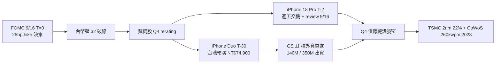

# 每日創業情報 — 2026-09-16

## 🎯 今日 TL;DR

- **FOMC 9/16 T=0 決策當日**：昨日 Polymarket 79.3% 週日→週一連續上調 25bp hike 為市場共識、Warsh Jackson Hole 8/28 hawkish + 8 月 PPI 0.4% MoM / 5.4% YoY + CPI hot beat + 非農 +162k「四合一」為 hike 派火藥；ING「Fed set to hike 25bp in recalibration move」+ Achiever「Fed poised to hike as oil reignites inflation」一致；「one-and-done」為當日盤中主要下游敘事、dot plot[^fomc-dot-plot] 為二次定調工具；台幣壓 / 蘋概股 rerating / 跨境 SaaS 定價敏感度三面訊號今日盤中即時觀察
- **iPhone 18 Pro T-2 週五交機 + review embargo 週三 9/16 拉起**：Forbes 9/12「reviews for iPhone 18 Pro are expected on Wednesday, Sept. 16, 5 a.m. Pacific」實質已延一天（vs 過去慣例週二）；`.Forbes` David Phelan 9/6 / 9/11 一致「Apple 因 keynote 時間較晚而給 reviewers 額外時間」；主流評測（Verge / Wired / MKBHD / Engadget）今日 8pm 台北時間統一起跑；「A20 Pro 2nm + 可變光圈主鏡頭 + vapor chamber cooling + 電池升級」為主要 spec 亮點；「9to5Mac 9/14 pre-orders 大部分延到 10 月 + Pro Max 10/6-10/13 + Pro 9/29-10/6」訊號續有效；週四 9/17 T-1 為第二日爆點窗
- **iPhone Duo T-30 台灣預購倒數 + Goldman Sachs 11 檔外資買進**：`.鉅亨網` 9/12 GS「iPhone Duo 2026 市占近 25%、基本 1,400 萬台 / 樂觀 3,500 萬台」；`.UDN` 「外資喊買 11 台廠」+ `.CTEE` 工商時報「13 台廠受惠、5 大咖最旺」；台廠折疊 hinge（新日興 3376 / 兆利 3548）+ FPC（臻鼎 4958 / 台郡 6269）+ 光學（大立光 / 玉晶光）+ Foxconn 專屬組裝續為 Q4 深度供應鏈；GS 11 檔為 TSMC、Foxconn、Novatek、Cirocomm、Lotes、Largan、Nan Ya PCB、Kinpo、Zhen Ding-KY、Tripod、Delta Electronics
- **Cognition SWE-2 打出 Fable 5.1 一分之差 + 64% 便宜**：9/10 T+6 發布、post-trained from Kimi K3、first SWE model with reasoning effort levels；FrontierCode 1.1 Main 50.0% vs Fable 5.1 50.9% vs GPT-6 Astra 53.3%；`.MarkTechPost` / `.CellCog` / `.explainx.ai` 一致「~64% cheaper than Fable、~1/4 of GPT-6 Astra」；vs SWE-1.7「58% fewer turns + 81% less cost + higher score」；Devin Desktop + Devin CLI 已推、Devin Web / Fusion rollout；**per-token 定價尚未公布**為採用最大阻礙
- **Perplexity Hybrid Compute Mac 本地 + 雲端切割**：9/1 T+15 發布、Perplexity Pro / Max / Enterprise 訂閱者專屬；「cloud handles frontier reasoning / web search / planning、local 處理 private files / sensitive information / on-device actions」；三個 local model：Gemma 4 E4B、Qwen3.6 35B-A3B、Perplexity 自訓 Computer 模型；**Apple silicon Mac + macOS 15+ + 24GB unified memory** 為硬體門檻；`.9to5Mac` / `.Unite.AI` / `.MacDailyNews` / `.MarkTechPost` 一致 privacy-first + local-first；台灣 SI / 顧問公司「敏感資料不上雲」憂慮訊號窗
- **Resurf 9/15 Product Hunt #1 297 votes**：personal context library for Mac、preserve user intent across applications；`.duanyytop/agents-radar` 「on-device AI 強需求」+「context-aware automation over raw capability」為 2026 主敘事；同日 Perplexity Hybrid Compute 230 votes、Cognition SWE-2 188 votes、Google Gemini Windows assistant 全部搶進 top 10；「隱私 + hybrid execution + cost-efficient」為新 baseline
- **DeepSeek V4-Pro routing 官方確認 9/14 中午北京 T-1 生效**：`.Yotta Labs` / `.CellCog` / `.eesel AI` 一致「From noon Beijing time on September 14, every request to deepseek-v4-pro will be served by V4.1 Flash and billed at V4.1 Flash rates until a V4.1 Pro exists」；「原 V4 Pro 輸出 $1.98 現變 $0.60 = 70% cost cut」為 API 帳單直接影響；552B MoE + 1M ctx + native multimodal + MIT License open weights；商業服務業 10 萬案「絕對不得採購中國廠牌」為篩選阻礙續有效
- **Taiwan MODA 主權 AI 語料庫三倍擴張到 5,000 dataset / 2.1B tokens**：`.Taipei Times` 9/15 「Taiwan's AI training data triples under ministry's efforts」；覆蓋台灣民俗、本地語言、生態、旅遊、出版、法律、藝術、文化、經濟、地理、交通、醫療、歷史；「available to AI development teams in Taiwan, Japan, US」為三地 opt-in；9/1 T-2 週「Taiwan aims to train 500,000 AI pros by 2040」為長線人力政策；主權 AI 為台灣 AI-first vertical SaaS 差異化新軸、「使用主權語料庫 fine-tune」為 pitch deck 新軸
- **iOS 27 T+2 週三 Siri AI Gemini 首週 bug 湯匯總**：`.PhoneArena` 「Siri's biggest change in a decade is here, narrowing the gap on Gemini」+ `.Technobezz`「New Siri showing up but ignoring voice commands, deleting conversations from the new Siri app, drafting messages to the wrong contact」+ `.Mayhemcode`「Siri AI cutting off mid-prompt」為首日 T+0 → T+2 三日已發現 bug；「iPhone 15 Pro / 15 Pro Max / iPhone 16 起」硬體門檻續有效；EU 只允 Mac / Vision Pro、中國 mainland 全鎖續驗證；App Store 2027/4 起強制 iOS 27 SDK 為 T-6.5 個月準備窗
- **TSMC 2nm 22% 產能提升 mid-2027 + CoWoS 2028 翻倍到 260 kwpm**：`.TrendForce` 9/14「TSMC targets 22% 2nm, 16%+ 3nm capacity boost by mid-2027」+ `.wccftech`「2nm 100k wafers/月 by 底 2026」+ `.Digitimes` 9/15「TSMC 3nm, 2nm, CoWoS stay tight as AWS, MediaTek, TPU shift capacity」；CoWoS 130k → 260k kwpm 2028；世界最大 5.5x reticle CoWoS 良率 98%+；N2U 2028 量產、25+ tape-outs；FOMC 9/16 T=0 25bp hike 台幣壓 = TSMC ADR + 台廠封測 Q4 rerating 二面訊號
- **Claude Enterprise smart reports beta + Commerce Agent blueprint + Managed Agents budget / advisor / geo-pinned**：Anthropic 9 月中「smart reports for Enterprise analyzing team usage, costs, friction, and reusable shared skills」+「commerce agent blueprint with reference shopping and merchant agents, guardrails, live demos, Claude Code plugin」+「Developer Platform: budget controls, advisor support, geo-pinned inference, GitHub-loaded skills for Claude Managed Agents sessions」；Fable 5.1 續為主力（$10 / $50、cache read 75%）、Sonnet 5 續為 $2 / $10 permanent；商業服務業 10 萬案 vertical use case 有 geo-pinned 台灣區選項 = 資料主權 pitch 新軸
- **Cursor Composer 2.5 $0.50/$2.50 Fast $3/$15 續為主軸 + Composer 3 續無官方確認**：`.GPTunneL` / `.Cursor blog`「Composer 3 為 frontier coding model trained from scratch、strategically important for Cursor for less dependence on other AI companies」+「more control over cost, latency, behavior, product integration」；但 **as of 9/16 T=0 沒 confirmed release date / pricing**；「Grok 4.7 T+5 續延 + Composer 3 無官方確認」為兩大口頭承諾 + 無官方確認 pattern；不建議為未發布模型改工作流
- **商業服務業 AI 導入 10 萬案 T-34 五週衝刺 + 雲市集 15 萬點雙軌**：昨日 T-35 → 今日 T-34；11 大類（ERP、雲庫存、供應鏈、HR、智慧排程、財會、資安）+ 50% 補助 / 上限 NT$ 10 萬 / 3 個月使用後線上申請 / 3-5 個工作日核可 / 10-15 個工作日撥款；「絕對不得採購中國大陸廠牌」規定為 DeepSeek / 阿里 / 百度 vendor 篩選阻礙；SIIR 已 confirmed 不辦理續為 2026 大門實質已關；SBIR 一般型 100 萬 / 創新型 500 萬 / 破壞式 2000 萬為結構性主戰場

## 🔄 昨日追蹤

- 🔄 **FOMC 9/16 T-1 → T=0 決策當日**：Polymarket 79.3% 續為市場共識、25bp hike 為明日盤前定調；`.Federal Reserve` 官方時程 9/15-16 兩天會議、Powell（實為 Warsh 主席）週三美東時間 2:30pm 記者會；「one-and-done」為盤中主要下游敘事、dot plot 為二次定調；台幣壓 / 蘋概股 rerating / 跨境 SaaS 定價敏感度為今日盤中三面即時觀察
- 🔄 **iPhone 18 Pro T-3 → T-2 週五交機 + review embargo 週三 9/16 拉起**：Forbes 9/12「reviews Wed Sept 16, 5 a.m. Pacific」；9to5Mac 9/14 pre-orders 大部分延到 10 月訊號續有效；Pro Max 10/6-10/13、Pro 9/29-10/6；首日 9/18 到貨僅限 9/12 5AM PT 首波 pre-order 者
- 🔄 **iPhone Duo T-31 → T-30 台灣預購倒數**：Goldman Sachs 11 檔外資買進 + 基本 140 萬台 / 樂觀 350 萬台續有效；台廠 100-part titanium 3D printed hinge + FPC + 光學 + Foxconn 專屬組裝續為 Q4 深度供應鏈；Samsung Display 折疊螢幕（Apple 借道七年競爭對手）
- 🔄 **iOS 27 T+1 → T+2 週三 Siri AI Gemini 首週 bug 湯**：PhoneArena「narrowing the gap on Gemini」+ Technobezz「voice commands ignored / conversations deleted / wrong contact」+ Mayhemcode「cutting off mid-prompt」為 T+0 → T+2 三日已發現 bug；iPhone 15 Pro / 16 起硬體門檻續有效；EU / 中國 mainland 續鎖
- 🔄 **DeepSeek V4-Pro T-0 大反轉 → 昨日訊號分歧 → 今日 T+2 官方確認**：Yotta Labs / CellCog / eesel AI 一致「9/14 中午北京 V4-Pro → V4.1 Flash routing 生效 + Flash rate billing」；輸出 $1.98 → $0.60 為 70% cost cut；552B MoE + 1M ctx + native multimodal + MIT License open weights
- 🔄 **Grok 4.7 T+4 → T+5 續延**：CellCog 9/14 T-2 已確認「as of September 14, 2026, xAI 的 news page / model directory / API release notes / llms.txt 皆無 Grok 4.7」；Musk 四次承諾（7/24「4 週內」、7/28「幾週後」、8/12「3-4 週內」、9/1「10 天內」）全部落空；prediction market 已淡出；不建議為未發布模型改工作流
- 🔄 **TSMC 2nm + CoWoS 2028 翻倍**：TrendForce 9/14「22% 2nm capacity boost by mid-2027、CoWoS 130k → 260k kwpm 2028」；Digitimes 9/15「AWS / MediaTek / TPU shift capacity 為 3nm / 2nm / CoWoS 全 tight」；世界最大 5.5x reticle CoWoS 良率 98%+；FOMC 9/16 T=0 台幣壓 = TSMC ADR + 台廠封測 Q4 rerating
- 🔄 **商業服務業 AI 導入 10 萬案 T-35 → T-34 五週衝刺**：SIIR 已 confirmed 不辦理續為 2026 大門實質已關；11 大類 + 50% / 上限 NT$ 10 萬 / 3-5 個工作日核可續為結構性主戰場；「絕對不得採購中國大陸廠牌」為 DeepSeek / 阿里 / 百度篩選阻礙
- 🆕 **Cognition SWE-2 打出 Fable 5.1 一分之差 + 64% 便宜**：9/10 T+6 發布、post-trained from Kimi K3、first SWE model with reasoning effort levels；FrontierCode 1.1 Main 50.0% vs Fable 5.1 50.9% vs GPT-6 Astra 53.3%；Devin Desktop + Devin CLI 已推
- 🆕 **Perplexity Hybrid Compute Mac 本地 + 雲端切割**：9/1 T+15 發布、Apple silicon + 24GB unified memory 硬體門檻；三個 local model 並存
- 🆕 **Resurf 9/15 Product Hunt #1 297 votes**：personal context library for Mac；「隱私 + hybrid execution + cost-efficient」為 2026 新 baseline
- 🆕 **Taiwan MODA 主權 AI 語料庫三倍擴張**：5,000 dataset / 2.1B tokens；台灣民俗 / 本地語言 / 生態 / 旅遊 / 出版 / 法律 / 藝術 / 文化 / 經濟 / 地理 / 交通 / 醫療 / 歷史；三地 opt-in（台 / 日 / 美）；500,000 AI pros by 2040 為長線人力政策

## 📰 台灣特定產業動向

| 事件 | 來源 | 對台灣獨立開發者的影響 | 機會/威脅 |
| ---- | ---- | ---- | ---- |
| **FOMC 9/16 T=0 25bp hike 決策當日 + 台幣壓 / 蘋概股 rerating / 跨境 SaaS 定價敏感度三面即時窗**：Polymarket 79.3% 為週日 → 週一連續上調、ING / Achiever / Cambridge Currencies / Seeking Alpha 一致「Fed set to hike 25bp」；Warsh Jackson Hole 8/28 hawkish + 8 月 PPI 0.4% MoM / 5.4% YoY + CPI hot beat + 非農 +162k 四合一為 hike 派火藥；「one-and-done」為盤中主要下游敘事、dot plot 為二次定調；美東時間 2:30pm Warsh 記者會為即時觀察窗；台幣若破 32 = 蘋概股 rerating + 跨境 SaaS（美訂閱台成本升）雙面 pressure | [Kiplinger — September Fed Meeting Live Updates](https://www.kiplinger.com/investing/live/fed-meeting-updates-and-commentary-september-2026)、[Federal Reserve — FOMC Meeting Calendars](https://www.federalreserve.gov/monetarypolicy/fomccalendars.htm)、[DeFiRate — Fed Rate Hike Odds Surge Ahead of September Decision](https://defirate.com/prediction-markets/fed-decision-odds/)、[Federal Reserve — FOMC Minutes July 28-29 2026](https://www.federalreserve.gov/monetarypolicy/fomcminutes20260729.htm) | Taiwan 全端工程師 / SaaS 創業者「FOMC T=0 決策 dashboard × 台幣 32 破線敏感度 × 蘋概股 rerating × iPhone 18 Pro T-2 交機 × iPhone Duo T-30 預購」五合一週報訊號窗；跨境 SaaS 團隊「美 SaaS 訂閱台成本升 = 客單 5-8% pressure」為財測 pressure；per-project 匯率避險 case study NT$ 30K-80K + 月度顧問 NT$ 2K-5K | 機會：**FOMC T=0 決策 dashboard × 台幣 32 破線敏感度 × 蘋概股 rerating × iPhone 18 Pro T-2 交機 × iPhone Duo T-30 預購**五合一週報訂閱 NT$ 1,800-4,000 / mo + per-project 匯率避險 case study + 跨境 SaaS 財測 audit NT$ 40K-120K；財經 SaaS + 匯率避險顧問 + 跨境 SaaS 為 outbound 三軸；威脅：財經媒體 FOMC live blog 已滿溢、需以「獨立開發者 / SaaS 創業者角度 + vertical use case + 跨境 SaaS 財測 pressure」差異化 |
| **iPhone 18 Pro T-2 週五交機 + review embargo 9/16 週三拉起 + iPhone Duo T-30 台灣預購倒數 + GS 11 檔外資買進**：Forbes 9/12「reviews Wed Sept 16, 5 a.m. Pacific」為週三 8pm 台北時間統一起跑；9to5Mac 9/14 pre-orders 大部分延到 10 月訊號續有效；Pro Max 10/6-10/13、Pro 9/29-10/6；GS「iPhone Duo 2026 市占近 25%、基本 140 萬台 / 樂觀 350 萬台」+ UDN「外資喊買 11 台廠」+ CTEE「13 台廠受惠、5 大咖最旺」；台廠折疊 hinge（新日興 3376 / 兆利 3548）+ FPC（臻鼎 4958 / 台郡 6269）+ 光學（大立光 / 玉晶光）+ Foxconn 專屬組裝續為 Q4 深度供應鏈；FOMC 9/16 T=0 25bp hike 台幣壓 = 蘋概股 Q4 rerating 二面訊號 | [Forbes — iPhone 18 Pro Release Date Complete Guide](https://www.forbes.com/sites/davidphelan/2026/09/11/iphone-18-pro-release-date-your-final-complete-guide-to-what-and-when/)、[Forbes — iPhone 18 Pro Release Countdown Final Schedule](https://www.forbes.com/sites/davidphelan/2026/09/12/apple-iphone-18-pro-release-countdown-final-schedule-of-last-minute-updates/)、[UDN — 外資點 11 檔蘋概鏈](https://udn.com/news/story/7251/9747061)、[CTEE — 蘋果折疊機 iPhone Duo 供應鏈曝 13 台廠受惠 5 大咖最旺](https://www.ctee.com.tw/news/20260910700753-430201)、[鉅亨網 — iPhone Duo 2026 市占近 25%](https://news.cnyes.com/news/id/6603186)、[UDN — 蘋果供應鏈將迎新機紅利](https://udn.com/news/story/7240/9752372)、[UDN — 高盛點將 11 家台廠受惠](https://udn.com/news/story/7240/9747508)、[Storm — 蘋果新機分兩波開賣 台灣大估 iPhone 18 Pro 供不應求](https://www.storm.mg/article/11163423) | 台廠折疊 hinge + FPC + 光學 + 組裝 vertical 深度研究窗：GS 11 檔（TSMC、Foxconn、Novatek、Cirocomm、Lotes、Largan、Nan Ya PCB、Kinpo、Zhen Ding-KY、Tripod、Delta Electronics）為 Q4 深度供應鏈；「基本 140 萬台 / 樂觀 350 萬台」為 Duo 首季出貨基準線；iPhone 18 Pro pre-order 大幅延後為 Q4 需求疲軟 vs 供應短缺兩派敘事；review 9/16 週三 8pm 台北時間為主流評測（Verge / Wired / MKBHD / Engadget）統一起跑窗 | 機會：per-project「iPhone 18 Pro review 9/16 8pm 統一評測反應追蹤 × iPhone Duo T-30 預購 dashboard × 台廠 11 檔外資評估 × FOMC T=0 台幣壓 × NT$74,900 匯差 22% 避險 case」五合一供應鏈 audit NT$ 40K-120K + 訂閱制 NT$ 2K-5K / mo；event pack NT$ 12K-30K；台灣區 NT$74,900 vs 美國 $1,999 匯差 22% 為避險 case study；威脅：財經媒體已滿溢類似分析、需以「獨立開發者 / SaaS 創業者角度 + vertical use case + 台廠 11 檔深度 + FOMC hike 台幣壓 rerating」差異化 |
| **Taiwan MODA 主權 AI 語料庫三倍擴張到 5,000 dataset / 2.1B tokens + 500,000 AI pros by 2040 人力政策**：`.Taipei Times` 9/15「Taiwan's AI training data triples under ministry's efforts」；覆蓋台灣民俗、本地語言、生態、旅遊、出版、法律、藝術、文化、經濟、地理、交通、醫療、歷史；「available to AI development teams in Taiwan, Japan, US」為三地 opt-in；`.moda.gov.tw` 官方「MODA Collaborates with 200 Agencies to Create Local Language Resources」；「Taiwan aims to train 500,000 AI pros by 2040」為長線人力政策；主權 AI 語料庫為「使用台灣主權語料庫 fine-tune」pitch 新軸、和商業服務業 10 萬案「非中國廠牌」搭配為 Taiwan-first SaaS 差異化敘事 | [Taipei Times — Taiwan's AI training data triples under ministry's efforts](https://www.taipeitimes.com/News/taiwan/archives/2026/09/15/2003864319)、[Taipei Times — Taiwan aims to train 500,000 AI pros by 2040](https://www.taipeitimes.com/News/front/archives/2026/09/01/2003863468)、[MODA — Taiwan Sovereign AI Training Corpus Goes Online](https://moda.gov.tw/en/press/press-releases/18314)、[MODA — Taiwan AI Training Corpus Operations](https://moda.gov.tw/en/digital-affairs/plural-innovation/operations/18874)、[AI Taiwan — News](https://ai.taiwan.gov.tw/news/)、[National Development Council — Ten AI Initiatives Promotion Plan 2025-2028](https://www.ndc.gov.tw/en/Content_List.aspx?n=E738D6D7DD31163F) | 台灣 vertical SaaS 開發者「使用台灣主權語料庫 fine-tune 中文模型」為 pitch deck 新軸；「主權語料庫 × 商業服務業 10 萬案 × 非中國廠牌 × LINE OA × iOS 27 Siri AI」五合一 pitch；台 / 日 / 美三地 opt-in 為出海 pitch 新窗；per-project 主權語料庫 fine-tune SaaS NT$ 60K-200K + 月度顧問 NT$ 3K-8K | 機會：**「使用台灣主權 AI 語料庫 fine-tune 中文模型」SaaS pitch deck** + 月度顧問 NT$ 3K-8K；per-project fine-tune audit NT$ 60K-200K；「主權語料庫 + 商業服務業 10 萬案 + 非中國廠牌 + LINE OA」四合一 pitch；出海台 / 日 / 美三地 opt-in 為新窗；威脅：MODA 官方 documentation 已完整、需以「獨立開發者 / vertical use case + 商業服務業 10 萬案匹配 + LINE OA integration」差異化 |
| **商業服務業 AI 導入 10 萬案 T-34 五週衝刺 + SIIR 已 confirmed 不辦理續為 2026 大門實質已關 + 雲市集 15 萬點雙軌**：`.CIMC` / `.metabiz` / `.YuTuo-Tech` 續驗證；50% 補助 / 上限 NT$ 10 萬 / 3 個月使用後線上申請 / 3-5 個工作日核可 / 10-15 個工作日撥款；11 大類（ERP、雲庫存、供應鏈、HR、智慧排程、財會、資安）；規定「絕對不得採購中國大陸廠牌」+ 大陸企業 / 外商分公司 / 國內公司分公司皆不合格；雲市集 15 萬點並行；SBIR 一般型 100 萬 / 創新型 500 萬 / 破壞式 2000 萬為結構性主戰場；MODA 主權語料庫 5,000 dataset / 2.1B tokens 為 non-中國廠牌 vertical 深度化利多 | [長典創新 — 政府補助 AI 導入最高 10 萬元商業服務業](https://cimc.com.tw/%E3%80%902026%E6%9C%80%E6%96%B0%E6%94%BB%E7%95%A5%E3%80%91%E6%94%BF%E5%BA%9C%E8%A3%9C%E5%8A%A9ai%E5%B0%8E%E5%85%A5%E6%9C%80%E9%AB%9810%E8%90%AC%E5%85%83%E5%95%86%E6%A5%AD%E6%9C%8D%E5%8B%99%E6%A5%AD/)、[metabiz — 2026 中小微企業 AI 補助大補帖](https://metabiz.tw/smb-ai-digital-transformation-subsidy-guide-2026/)、[Yotron — 2026 台灣 AI 導入補助完整攻略](https://yotron-ai.com/blog/ai-implementation-subsidy-taiwan)、[海娜數位 — 2026 台灣中小企業 AI 導入政府補助怎麼申請](https://www.hainatw.com/insights/taiwan-sme-ai-subsidy-guide-2026)、[CIO Taiwan — 商業署最高補助 50% AI 驅動服務業](https://www.cio.com.tw/115430)、[新創圓夢網 — 2026 政府創業補助金](https://startup.sme.gov.tw/home/modules/infopack/detail/?sId=103) | 獨立開發者最後窗實質為商業服務業 AI 導入 10 萬案 T-34 五週衝刺 + 雲市集 15 萬點兩軌；11 大類為 SaaS vertical pitch 明確錨點；「絕對不得採購中國廠牌」為 DeepSeek / 阿里 / 百度 vendor 篩選阻礙；「AI 導入補助 + LINE OA + 私域 CRM + AI 客服 + 中秋節第二波電商促銷 + iPhone 18 Pro T-2 交機 + Duo T-30 預購」七合一 Q4 pitch；名義收件到 2027/10/20 但補助經費用罄提前 | 機會：per-project NT$ 15K-40K（10 萬案）+ 月度顧問 NT$ 3K-8K；「商業服務業 AI 導入補助 + LINE OA + 私域 CRM + 中秋節 T-9 第二波電商 + iOS 27 Siri AI Gemini 呼叫優先權 + MODA 主權語料庫」六合一套件 pitch deck；30 天代寫 + 24 小時交件；11 大類明確錨點降低 pitch 摩擦；威脅：標準化包已多、規定「絕對不得採購中國廠牌」為 DeepSeek 篩選阻礙、需以「vertical use case + 非中國廠牌 + 快速交件 + 主權語料庫深度」差異化 |
| **TSMC 2nm 22% 產能提升 mid-2027 + CoWoS 2028 翻倍到 260 kwpm + 台廠封測外溢受惠 + FOMC 9/16 T=0 台幣壓 rerating**：`.TrendForce` 9/14「TSMC targets 22% 2nm capacity boost by mid-2027、CoWoS 130k → 260k kwpm 2028」+ `.wccftech`「2nm 100k wafers/月 by 底 2026」+ `.Digitimes` 9/15「3nm, 2nm, CoWoS stay tight as AWS, MediaTek, TPU shift capacity」；世界最大 5.5x reticle CoWoS 良率 98%+；N2U 2028 量產、25+ tape-outs；ASE / SPIL / Powertech / KYEC 台灣封測續為外溢直接受惠；Apple 竹科寶山首批 2nm 過半 + A20 Pro 首發為 iPhone 18 Pro / Duo 雙產品線；FOMC 9/16 T=0 25bp hike 台幣壓 = TSMC ADR + 台廠封測 Q4 rerating 二面訊號 | [TrendForce — TSMC Reportedly Targets 22% 2nm 16%+ 3nm Capacity Boost by Mid-2027 CoWoS to Double by 2028](https://www.trendforce.com/news/2026/09/14/news-tsmc-reportedly-targets-22-2nm-16-3nm-capacity-boost-by-mid-2027-cowos-to-double-by-2028)、[Digitimes — TSMC 3nm 2nm CoWoS stay tight as AWS MediaTek TPU shift capacity](https://www.digitimes.com/news/a20260915PD214/tsmc-3nm-2nm-capacity-cowos.html)、[wccftech — TSMC Approaching A New Milestone With Its 2nm Process By The End Of 2026 With 100,000 Monthly Wafers](https://wccftech.com/tsmc-2nm-production-milestone-100k-wafers-2026/)、[Aroged — TSMC 2nm chip production capacity will increase by 22%](https://www.aroged.com/2026/09/14/by-the-middle-of-next-year-tsmcs-2nm-chip-production-capacity-will-increase-by-22/)、[SiliconAnalysts — TSMC Foundry Allocation 2026 CoWoS Sold Out 2nm Booked](https://siliconanalysts.com/analysis/foundry-allocation-status-q1-2026)、[BigGo Finance — TSMC Technology Forum Reveals 2nm Lineup Taking Shape World's Largest CoWoS Yield Surpasses 98%](https://finance.biggo.com/news/tjAYJZ4BX0tZvRTvw2AL) | 先進封裝 vertical 深度研究窗擴大：CoWoS-S → CoWoS-L 為 2026 新分工敘事；台積 2nm 90k → 110k kwpm mid-2027 為結構性催化；ASE / SPIL / Powertech / KYEC 台灣封測續為外溢直接受惠；Apple 竹科寶山首批 2nm 過半 + A20 Pro 首發為 iPhone 18 Pro / Duo 雙產品線；「TSMC 2nm 22% × CoWoS 2028 翻倍 × 台廠封測 × iPhone 18 Pro A20 Pro × FOMC 9/16 T=0 台幣壓」五合一週報 | 機會：「TSMC 2nm 22% mid-2027 × CoWoS 260 kwpm 2028 翻倍 × 台廠封測四家外溢 × 台積 5,148 億新高 × A20 Pro iPhone 18 Pro × FOMC 9/16 T=0 25bp」六合一週報 NT$ 1,800-4,000 / mo；先進封裝 vertical 顧問 pricing NT$ 40K-120K；per-project 供應鏈 audit NT$ 40K-120K；威脅：財經媒體已滿溢類似分析、需以「獨立開發者 / SaaS 創業者角度 + CoWoS-L 深度 + Q4 rerating 訊號 + 匯率避險」差異化 |

## 🛠 新興 AI 工具

| 工具名 | 類別 | 核心用途 | 定價 | 與主流替代品差異 | 採用建議 |
| ---- | ---- | ---- | ---- | ---- | ---- |
| **Cognition SWE-2**[^swe-2] | AI coding model / agent | 9/10 T+6 發布、post-trained from Kimi K3、first SWE model with reasoning effort levels；FrontierCode 1.1 Main 50.0% vs Fable 5.1 50.9% vs GPT-6 Astra 53.3%；比 SWE-1.7「58% fewer turns + 81% less cost + higher score」；Devin Desktop + Devin CLI 已推、Devin Web / Fusion rollout；「~64% cheaper than Fable、~1/4 of GPT-6 Astra」 | **per-token 定價尚未公布**（採用最大阻礙、僅 Devin 訂閱者可用）；Devin subscription pricing 續為 $500/月 Enterprise 為主 | vs Fable 5.1（$10/$50）：SWE-2 為 coding-specific，non-coding 任務差 1 分；vs GPT-6 Astra（$5/$25）：SWE-2 為 1/4 成本；vs Sonnet 5（$2/$10）：SWE-2 為 coding 專項 vs Sonnet 為通用；Kimi K3 post-trained + reasoning effort levels 為 SWE 首次；SWE-1.7 → SWE-2 為「post-training beats scaling」路線代表 | 立即：**Taiwan indie SaaS + Devin 訂閱團隊 T+6 週三「SWE-2 vs Fable 5.1 shadow eval + FrontierCode 1.1 benchmark 60 天雙棧驗證」新窗**；per-token 未公布為採用最大阻礙（僅 Devin 訂閱者可用）；「Devin + SWE-2 + Fable 5.1 + Sonnet 5 + Astra + Gemini 3.8 Flash」六軸 router 選型續為主戰場；per-project coding model 選型 audit NT$ 30K-80K + 月度 benchmark 追蹤 |
| **Perplexity Hybrid Compute Mac**[^perplexity-hybrid] | On-device / hybrid AI compute | 9/1 T+15 發布；「cloud handles frontier reasoning / web search / planning、local 處理 private files / sensitive information / on-device actions」；三個 local model：Gemma 4 E4B、Qwen3.6 35B-A3B、Perplexity 自訓 Computer 模型；privacy-first + local-first + Apple silicon + 24GB unified memory 硬體門檻 | Perplexity Pro $20/月、Max $200/月、Enterprise 依 seat 計價；Hybrid Compute 為 Pro / Max / Enterprise 訂閱者附贈 | vs OpenAI ChatGPT Desktop：Perplexity 為 hybrid + local-first、ChatGPT 為 cloud-first；vs Anthropic Claude Desktop：Perplexity 明確切分「敏感資料 local / 通用推理 cloud」；vs Ollama：Perplexity 為 orchestration + subscription vs Ollama 為 pure local；Gemma 4 E4B / Qwen3.6 35B-A3B 為 open-weight 本地選項 | 立即：**Taiwan SI / 顧問公司 / 法律事務所 T+15 週三「敏感資料本地 / 通用推理雲端」拆分 audit 新窗**；商業服務業 10 萬案「絕對不得採購中國廠牌」規定為 Perplexity Hybrid Compute（cloud 為美國）加分軸；「Hybrid Compute × MODA 主權語料庫 × 商業服務業 10 萬案」三合一 pitch；per-project hybrid audit NT$ 30K-80K + 月度顧問 NT$ 2K-5K；「Apple silicon + 24GB 硬體門檻」為採用限制 |
| **Resurf**[^resurf] | Personal AI context library for Mac | 9/15 Product Hunt #1 297 votes；personal context library for Mac；preserve user intent across applications；「on-device AI 強需求」+「context-aware automation over raw capability」為 2026 主敘事；用途：跨 app（Slack / Notion / Mail / 瀏覽器）保留 user context 供 AI 呼叫使用 | 未公布明確 pricing、waitlist 為主；早期採用者為 free tier | vs Rewind AI（macOS）：Resurf 為 「preserve intent」+ AI-callable、Rewind 為 「recorded memory」+ search；vs Perplexity Hybrid Compute：Resurf 為 personal context layer、Perplexity 為 compute orchestration；「跨 app user intent」為新分工敘事、可作為 Perplexity Hybrid Compute 的上游 context 提供者 | 立即：**Taiwan indie SaaS 週三「Resurf × Perplexity Hybrid Compute × MODA 主權語料庫 × 商業服務業 10 萬案」四合一 pitch pack**；per-project personal context layer 導入 audit NT$ 30K-80K + 月度顧問 NT$ 2K-5K；waitlist 為採用限制 + 定價未公布為採用阻礙、需以「早期採用者 first-mover」訊號差異化 |
| **DeepSeek V4-Pro routing V4.1 Flash 9/14 正式生效**[^deepseek-routing] | Open-weight 中國 MoE API | 9/14 中午北京 T-1 生效：每個 V4-Pro 請求 route 到 V4.1 Flash、按 Flash rate billing；552B MoE + 1M ctx + native multimodal + MIT License open weights；輸出 $1.98 → $0.60 為 70% cost cut；直到 V4.1-Pro 上線為止；60 天雙棧 shadow eval 為長期投入 | V4.1 Flash：peak $0.30 / $1.20、off-peak $0.15 / $0.60；peak = 01-04 + 06-10 UTC weekdays | vs Sonnet 5（$2/$10）：DeepSeek 為 1/6 成本 vs Sonnet 綜合能力；vs Gemini 3.8 Flash（$0.075 / $0.30）：DeepSeek 為 1M ctx + open-weight vs Gemini 為 Google 生態；vs SWE-2：DeepSeek 為通用 vs SWE-2 為 coding 專項；商業服務業 10 萬案「絕對不得採購中國廠牌」為篩選阻礙 | 立即：**Taiwan indie SaaS 週三 T+2「V4-Pro routing 官方確認 vendor 政策風險 rebase」新窗**；60 天雙棧 shadow eval（V4-Pro 目前實為 V4.1 Flash 路由 vs 原生 V4.1-Flash）為長期投入；「vendor 政策風險 dashboard + Flash rate 帳單推估 + 商業服務業 10 萬案非中國廠牌」為多模型 router 選型新軸；商業服務業 10 萬案「非中國廠牌」為篩選阻礙、非通用結論 |
| **Anthropic Claude Enterprise smart reports + Commerce Agent blueprint + Managed Agents budget/advisor/geo-pinned**[^anthropic-enterprise] | Enterprise / Developer Platform 治理 | Anthropic 9 月中「smart reports for Enterprise analyzing team usage, costs, friction, and reusable shared skills」+「commerce agent blueprint with reference shopping and merchant agents, guardrails, live demos, Claude Code plugin」+「Developer Platform: budget controls, advisor support, geo-pinned inference, GitHub-loaded skills for Claude Managed Agents sessions」；Fable 5.1（$10/$50、cache read 75%）續為主力；Sonnet 5（$2/$10）續為 permanent 定價 | Fable 5.1：$10 / $50，cache read $0.25 / M；Sonnet 5：$2 / $10；Opus 5：$5 / $25；Managed Agents session budget cap + budget_reached stop reason；anthropic-workspace-id response header 為 tenant 分離 | vs OpenAI Enterprise：Anthropic 為 skills / plugin 生態 + geo-pinned 資料主權 vs OpenAI 為 GPT-6 Astra 深度 + AGI 敘事；vs Google Vertex AI：Anthropic 為 Claude Code + Managed Agents 一體 vs Vertex 為 model garden + 多雲；geo-pinned inference 為台灣 / 日本 / 歐盟資料主權 pitch 新軸 | 立即：**Taiwan indie SaaS + 商業服務業 10 萬案 vertical use case T=0 週三「geo-pinned 台灣區 + 商業服務業非中國廠牌」pitch 新窗**；smart reports 為 Enterprise team audit 新工具；commerce agent blueprint 為電商 / 零售 vertical use case 現成模板；per-project geo-pinned 資料主權 audit NT$ 40K-120K + 月度顧問 NT$ 3K-8K |
| **Cursor Composer 2.5 續為主軸 + Composer 3 續無官方確認 + Grok 4.7 T+5 續延**[^cursor-composer-continue] | AI code editor + agent model | Composer 2.5 $0.50/$2.50、Fast $3/$15 續為 Cursor 定價新常態；`.GPTunneL` / `.Cursor blog` Composer 3 為「frontier coding model trained from scratch, less dependence on other AI companies, more control over cost/latency/behavior/product integration」；但 as of 9/16 T=0 沒 confirmed release date / pricing；Grok 4.7 xAI docs 續列 grok-4.6 為最新、Musk 四次承諾全落空 | Cursor Pro $20/月；Business $40/user；Enterprise 議價；Composer 2.5 API $0.50/$2.50、Fast $3/$15；Grok 4：$2 / $6 續為 xAI 定價 | vs SWE-2（未公布 per-token）：Composer 2.5 為 IDE-native、SWE-2 為 Devin-native；vs Claude Code：Composer 為 IDE-first、Claude Code 為 CLI + skills / plugins；「口頭承諾 + 無官方確認」為 Grok 4.7 + Composer 3 兩大 pattern | 立即：**Taiwan indie SaaS 週三 T=0「Grok 4.7 T+5 續延 + Composer 3 無官方確認 = 不 rebase」原則**；不建議為未發布模型改工作流；「Cursor Composer 2.5 × SWE-2 × Fable 5.1 × Sonnet 5 × GPT-6 Astra × Gemini 3.8 Flash × DeepSeek V4.1 Flash」七軸 router 選型；per-project coding model 選型 audit NT$ 30K-80K |

## 💡 台灣個人可實作 SaaS 點子

### 點子 1：Taiwan MODA 主權 AI 語料庫 fine-tune 中文模型 × 商業服務業 10 萬案匹配 × 非中國廠牌 × LINE OA integration × iOS 27 Siri AI 呼叫優先權 五合一 SaaS 🆕🔥

- **痛點來源**：`.Taipei Times` 9/15「Taiwan's AI training data triples under ministry's efforts」+ `.MODA` 官方「5,000 dataset / 2.1B tokens 覆蓋 13 vertical / 三地 opt-in」+「500,000 AI pros by 2040」；商業服務業 10 萬案「絕對不得採購中國大陸廠牌」為 DeepSeek / 阿里 / 百度 vendor 篩選阻礙 = 「使用台灣主權語料庫 fine-tune」為 non-中國廠牌天然差異化；LINE OA AI Conversation Assistant NT$1K-3K/月 SME 需要中文精確度；iOS 27 Siri AI Gemini 為英語首發、中文支援 delay 到 10 月；未做「主權語料庫 fine-tune 中文模型 × 商業服務業 10 萬案匹配 × non-中國廠牌 × LINE OA + iOS 27」五合一整合的產品會錯過 Q4 vertical 深度化窗
- **目標客群（台灣／亞洲）**：Taiwan vertical SaaS 創業者、商業服務業 10 萬案顧問、LINE OA 整合團隊、亞洲 8 國出海團隊；per-project 主權語料庫 fine-tune SaaS NT$ 60K-200K + 訂閱制 NT$ 3K-8K / mo（月度 fine-tune benchmark + 商業服務業 10 萬案匹配 + LINE OA integration + iOS 27 Siri AI 呼叫優先權）
- **技術複雜度**：4/5（MODA 主權語料庫 5,000 dataset ingestion + LoRA / QLoRA fine-tune SOP + Sonnet 5 / Fable 5.1 / DeepSeek V4.1 Flash / Gemma 4 E4B 四軸 vs 主權 fine-tune 中文精確度 benchmark + 商業服務業 10 萬案 vertical use case + LINE OA webhook + iOS 27 Siri AI Gemini 呼叫優先權）
- **預估 MRR**：NT$ 120K-500K（40-60 個訂閱 tenant + 10-15 個主權語料庫 fine-tune audit + 商業服務業 10 萬案 pitch 5-10 家）
- **競品弱點**：MODA 官方 documentation 只寫技術實作；中文「主權語料庫 fine-tune × 商業服務業 10 萬案 × non-中國廠牌 × LINE OA × iOS 27 Siri AI」五合一空白；台灣 indie SaaS 多為「用 Sonnet 5 / GPT-4」通用敘事、缺乏 vertical 深度；「使用主權語料庫 fine-tune」為 non-中國廠牌天然差異化敘事、對商業服務業 10 萬案「非中國廠牌」規定為完美匹配
- **切入建議**：今日 9/16 完稿「主權語料庫 fine-tune 中文模型 × 商業服務業 10 萬案匹配 × non-中國廠牌 × LINE OA × iOS 27 Siri AI」五合一 pitch deck；9/17 T+0 outbound 30-50 家 Taiwan vertical SaaS + 商業服務業 10 萬案顧問 + LINE OA 整合團隊；長線月度主權語料庫 fine-tune 週報續為主戰場

### 點子 2：FOMC 9/16 T=0 決策當日 × 台幣 32 破線敏感度 × 蘋概股 Q4 rerating × iPhone 18 Pro T-2 交機 × iPhone Duo T-30 預購 × NT$74,900 匯差 22% 五合一 dashboard 🆕🔥

- **痛點來源**：FOMC 9/16 T=0 25bp hike odds 三軌趨近（Polymarket 79.3% + ING + Achiever + Cambridge Currencies + Seeking Alpha 一致）；台幣若破 32 = 蘋概股 rerating + 跨境 SaaS（美訂閱台成本升）雙面 pressure；iPhone 18 Pro T-2 週五交機 + review embargo 9/16 週三拉起 + iPhone Duo T-30 台灣預購 NT$74,900 為 22% vs 美國匯差 = 三面訊號窗；未做「FOMC T=0 dashboard × 台幣 32 破線 × 蘋概股 rerating × iPhone 18 Pro T-2 × Duo T-30 × NT$74,900 匯差」五合一 dashboard 的產品會靜默錯過今日盤中決策窗
- **目標客群（台灣／亞洲）**：財經 SaaS 創業者、跨境 SaaS 團隊、匯率避險顧問、台灣蘋概股散戶、供應鏈 SI；per-project FOMC T=0 dashboard NT$ 30K-80K + 訂閱制 NT$ 2K-5K / mo（月度 FOMC + 台幣 + 蘋概股 + iPhone 18 Pro / Duo dashboard + NT$74,900 匯差 case study）
- **技術複雜度**：3/5（Polymarket / CME FedWatch / BigGo 三軌 API 串接 + 台幣 32 破線敏感度 + 蘋概股 GS 11 檔 rerating 模型 + iPhone 18 Pro T-2 pre-order 延後訊號 + iPhone Duo T-30 預購 + NT$74,900 vs $1,999 匯差 case study）
- **預估 MRR**：NT$ 60K-200K（30-50 個訂閱 tenant + 10-15 個 FOMC T=0 dashboard audit + 跨境 SaaS 財測 5-10 家）
- **競品弱點**：財經媒體 FOMC live blog 已滿溢、中文「FOMC 9/16 T=0 × 台幣 32 × 蘋概股 rerating × iPhone 18 Pro T-2 × Duo T-30 × NT$74,900 匯差」五合一空白；台灣散戶多為單一敘事、缺乏 dashboard 化；「25bp one-and-done」為盤中主要下游敘事、對 SaaS 定價 / hedging 為新變數
- **切入建議**：今日 9/16 T=0 完稿「FOMC 9/16 決策 dashboard × 台幣 32 破線敏感度 × 蘋概股 Q4 rerating × iPhone 18 Pro T-2 × Duo T-30 × NT$74,900 匯差 22%」五合一即時 dashboard；9/17 T+0 outbound 30-50 家財經 SaaS + 匯率避險顧問 + 跨境 SaaS；長線月度 FOMC + 台幣 + 蘋概股 dashboard 續為主戰場

### 點子 3：SWE-2 / Perplexity Hybrid Compute / Resurf 三軸 Q4「敏感資料本地 + 通用推理雲端」拆分 SaaS × 商業服務業 10 萬案匹配 × MODA 主權語料庫 integration 🆕

- **痛點來源**：Cognition SWE-2 打出 Fable 5.1 一分之差 + 64% 便宜、Perplexity Hybrid Compute Mac 本地 + 雲端切割、Resurf 9/15 Product Hunt #1 「personal context library for Mac」；三軸為 Q4「敏感資料本地 + 通用推理雲端」新分工敘事；台灣 SI / 顧問公司 / 法律事務所 / 醫療 / 金融 vertical「敏感資料不上雲」憂慮訊號窗；商業服務業 10 萬案「絕對不得採購中國廠牌」為 non-中國廠牌 vertical 天然差異化；未做「SWE-2 × Hybrid Compute × Resurf × 商業服務業 10 萬案 × MODA 主權語料庫」五合一整合的產品會錯過 Q4 vertical 深度化窗
- **目標客群（台灣／亞洲）**：Taiwan SI / 顧問公司 / 法律事務所 / 醫療 / 金融 vertical SaaS 創業者、商業服務業 10 萬案匹配、亞洲 8 國出海團隊；per-project 敏感資料本地拆分 audit NT$ 40K-120K + 訂閱制 NT$ 3K-8K / mo（月度 SWE-2 vs Fable benchmark + Hybrid Compute integration + Resurf context layer + 商業服務業 10 萬案匹配 + MODA 主權語料庫）
- **技術複雜度**：4/5（SWE-2 / Fable 5.1 / GPT-6 Astra shadow eval + Perplexity Hybrid Compute cloud/local orchestration + Resurf context layer + Apple silicon 24GB 硬體門檻 + 商業服務業 10 萬案 vertical use case + MODA 主權語料庫 fine-tune）
- **預估 MRR**：NT$ 100K-300K（30-50 個訂閱 tenant + 10-15 個敏感資料拆分 audit）
- **競品弱點**：英文 tech blog 已多、中文「SWE-2 × Hybrid Compute × Resurf × 商業服務業 10 萬案 × MODA 主權語料庫」五合一空白；台灣 SI 多為「上雲」通用敘事、缺乏「敏感資料本地 + 通用推理雲端」拆分深度；「Apple silicon + 24GB 硬體門檻」為採用限制、需以「Mac-first vertical use case」差異化
- **切入建議**：今日 9/16 完稿「SWE-2 × Hybrid Compute × Resurf × 商業服務業 10 萬案 × MODA 主權語料庫」五合一 pitch deck；9/17 T+0 outbound 30-50 家 Taiwan SI / 法律 / 醫療 / 金融 vertical SaaS；長線月度敏感資料拆分週報續為主戰場

## 🧰 工具堆疊更新

- **Cognition SWE-2**（9/10）：Fable 5.1 一分之差 + 64% 便宜 + Devin only + per-token 未公布為採用阻礙
- **Perplexity Hybrid Compute Mac**（9/1）：cloud + local 切割 + Apple silicon 24GB 硬體門檻 + privacy-first
- **Resurf**（9/15 PH #1）：personal context library for Mac + preserve user intent
- **DeepSeek V4-Pro routing V4.1 Flash**（9/14 official 生效）：輸出 $1.98 → $0.60 = 70% cost cut
- **Taiwan MODA 主權 AI 語料庫**：5,000 dataset / 2.1B tokens / 13 vertical / 三地 opt-in
- **Anthropic Enterprise smart reports + Commerce agent blueprint + Managed Agents geo-pinned**：資料主權 pitch 新軸
- **Cursor Composer 2.5**（$0.50/$2.50 Fast $3/$15）：Composer 3 續無官方確認；Grok 4.7 T+5 續延

## ⚡ 今日行動建議

- [ ] **FOMC 9/16 T=0 決策當日 即時盤中觀察**（4 小時，成本：跑一次 Polymarket + CME FedWatch + BigGo 三軌 dashboard + 台幣 32 破線敏感度 + 蘋概股 GS 11 檔 rerating 模型；產出：per-project FOMC dashboard NT$ 30K-80K + 明日 T+0 outbound 30-50 家財經 SaaS + 匯率避險顧問）
- [ ] **iPhone 18 Pro review embargo 9/16 週三 8pm 台北時間評測反應追蹤**（3 小時，成本：追蹤 Verge / Wired / MKBHD / Engadget + 9to5Mac pre-orders 延後訊號 + 台廠 GS 11 檔 rerating；產出：per-project 供應鏈 audit NT$ 40K-120K + Q4 rerating 週報）
- [ ] **Taiwan MODA 主權語料庫 fine-tune 中文模型 audit**（4 小時，成本：跑一次 5,000 dataset ingestion + LoRA / QLoRA SOP + Sonnet 5 / Fable 5.1 / DeepSeek V4.1 Flash / Gemma 4 E4B 四軸 vs 主權 fine-tune benchmark + 商業服務業 10 萬案匹配；產出：per-project fine-tune audit NT$ 60K-200K + 月度顧問）
- [ ] **SWE-2 vs Fable 5.1 shadow eval + FrontierCode 1.1 benchmark 60 天雙棧驗證**（3 小時，成本：Devin subscription 導入 + SWE-2 / Fable 5.1 shadow eval SOP + coding-specific vs 通用任務 benchmark；產出：per-project coding model 選型 audit NT$ 30K-80K + 月度 benchmark 追蹤）
- [ ] **Perplexity Hybrid Compute Mac × Resurf × MODA 主權語料庫 三合一「敏感資料本地 + 通用推理雲端」pitch deck**（3 小時，成本：跑一次 cloud / local orchestration SOP + Apple silicon 24GB 硬體門檻 + 商業服務業 10 萬案 non-中國廠牌 匹配；產出：per-project 敏感資料拆分 audit NT$ 40K-120K + 月度顧問）

## ⏳ 待觀察

- **FOMC 9/16 T=0 決策實際結果**（25bp hike vs pause）：若 pause = Polymarket 79.3% 全反轉 = 台幣壓釋放 + 蘋概股 Q4 rerating 二面訊號逆轉；若 hike 25bp = one-and-done vs continue tightening 兩派 dot plot 二次定調
- **iPhone 18 Pro review embargo 9/16 週三 8pm 台北時間主流評測反應**：Verge / Wired / MKBHD / Engadget 首波評測若一致好評 = pre-order 延後訊號釋放 vs 若批評 A20 Pro / 光圈 / 電池 = Q4 需求疲軟訊號結構化
- **Cognition SWE-2 per-token 定價公布時程**：目前僅 Devin 訂閱者可用、per-token 未公布為採用最大阻礙；若公布 = Fable 5.1 / GPT-6 Astra 全面替代候選；若持續不公布 = SWE-2 仍為 Devin ecosystem 專屬
- **Grok 4.7 T+5 → T+6 續延 vs 發布**：Musk 四次承諾全落空、prediction market 已淡出；若發布 = 2.1T 參數 + SpaceX 資料為結構性催化；若續延 = 不建議 rebase 訊號續有效
- **Cursor Composer 3 官方 release date / pricing 公布時程**：Cursor blog 只寫「frontier coding model trained from scratch」但無 confirmed release / pricing；「口頭承諾 + 無官方確認」為 Grok 4.7 + Composer 3 兩大 pattern
- **MODA 主權 AI 語料庫商業使用 licensing 條款**：目前為 Taiwan / Japan / US 三地 AI development teams opt-in；商業使用 licensing / royalty 條款 / 授權範圍為 vertical SaaS 深度化前置需求
- **DeepSeek V4.1-Pro 上線時程**：V4-Pro routing 為「until V4.1-Pro exists」暫時措施；V4.1-Pro 上線 = 552B MoE + 1M ctx + native multimodal 為結構性催化 vs 續延 = V4.1 Flash 續為主軸

[^fomc-dot-plot]: Federal Reserve 每季 FOMC 會後公布的「利率點陣圖」，將各委員對未來三年及長期政策利率的預測以匿名點狀方式呈現於同一張圖表；市場常用來推估委員會共識、分歧程度與寬鬆／緊縮偏向，是聲明稿與記者會之後的第二層定調工具。

[^swe-2]: Cognition Labs 於 2026 年 9 月 10 日推出的軟體工程專用 AI 模型，基於月之暗面 Kimi K3 進行 post-training，首度導入 reasoning effort 分層設定，主打在 FrontierCode 等 coding benchmark 以較低單位成本逼近前沿模型；目前僅限 Devin 平台訂閱者呼叫使用。

[^perplexity-hybrid]: Perplexity 於 2026 年 9 月 1 日在 macOS 推出的混合運算模式，將前沿推理、網路搜尋與規劃留在雲端，把私人檔案、敏感資料與裝置端動作交由本機小模型處理；Pro / Max / Enterprise 訂閱者可免費啟用，硬體門檻為 Apple silicon 與 24GB 統一記憶體。

[^resurf]: 2026 年 9 月 15 日在 Product Hunt 拿下當日第一的 macOS 應用程式，定位為「個人 AI 上下文圖書館」，跨 Slack、Notion、Mail、瀏覽器等應用保存使用者意圖與操作脈絡，供其他 AI 工具在本機呼叫使用，強調 on-device 與跨應用的 context 保留。

[^deepseek-routing]: DeepSeek 官方於 2026 年 9 月 14 日北京時間中午起實施的 API 過渡措施——所有 `deepseek-v4-pro` 端點請求都會被導向 V4.1 Flash 模型，並按 V4.1 Flash 費率計價，直到官方推出 V4.1-Pro 版本為止；等同對現有 V4-Pro 客戶進行單方面模型與帳單切換。

[^anthropic-enterprise]: 2026 年 9 月中旬 Anthropic 針對企業與開發者平台推出的一整批新功能，包含分析團隊用量、成本、摩擦點與可重用 skills 的 smart reports、電商代理參考藍圖、以及 Managed Agents 的預算控制、advisor 支援與地理綁定推論等治理層工具。

[^cursor-composer-continue]: Cursor 編輯器內建的 AI 代理型編輯模式，可跨檔案讀寫、執行終端指令並自動迭代；目前 2.5 版為主力、Fast 檔位每百萬 token 3 / 15 美元；「Composer 3」為 Cursor 自訓下一代 coding 模型的內部代稱，截至截稿仍無官方發布日期與定價。

## 📚 引用來源

1. [Kiplinger — September Fed Meeting Live Updates and Commentary](https://www.kiplinger.com/investing/live/fed-meeting-updates-and-commentary-september-2026) — 2026-09-15
2. [DeFiRate — Fed Rate Hike Odds Surge Ahead of September Decision](https://defirate.com/prediction-markets/fed-decision-odds/) — 2026-09-15
3. [Federal Reserve — FOMC Meeting Calendars and Information](https://www.federalreserve.gov/monetarypolicy/fomccalendars.htm) — 2026-09-15
4. [Federal Reserve — FOMC Minutes July 28-29 2026](https://www.federalreserve.gov/monetarypolicy/fomcminutes20260729.htm) — 2026-09-15
5. [Forbes — iPhone 18 Pro Release Date Complete Guide](https://www.forbes.com/sites/davidphelan/2026/09/11/iphone-18-pro-release-date-your-final-complete-guide-to-what-and-when/) — 2026-09-11
6. [Forbes — iPhone 18 Pro Release Countdown Final Schedule of Last-Minute Updates](https://www.forbes.com/sites/davidphelan/2026/09/12/apple-iphone-18-pro-release-countdown-final-schedule-of-last-minute-updates/) — 2026-09-12
7. [MacRumors — iPhone 18 Pro Everything We Know](https://www.macrumors.com/roundup/iphone-18-pro/) — 2026-09-15
8. [UDN — iPhone Duo 震撼登場外資喊買 11 台廠](https://udn.com/news/story/7251/9747061) — 2026-09-12
9. [CTEE 工商時報 — 蘋果折疊機 iPhone Duo 供應鏈曝 13 台廠受惠 5 大咖最旺](https://www.ctee.com.tw/news/20260910700753-430201) — 2026-09-10
10. [鉅亨網 — iPhone Duo 2026 市占近 25%](https://news.cnyes.com/news/id/6603186) — 2026-09-12
11. [UDN — 蘋果供應鏈將迎新機紅利](https://udn.com/news/story/7240/9752372) — 2026-09-15
12. [UDN — 蘋果秋季新品發表會 高盛點將 11 家台廠受惠](https://udn.com/news/story/7240/9747508) — 2026-09-12
13. [Storm — 蘋果新機分兩波開賣 台灣大估 iPhone 18 Pro 供不應求](https://www.storm.mg/article/11163423) — 2026-09-12
14. [CellCog — Cognition SWE-2 Benchmarks the 64% Cost Claim and the Row It Loses](https://cellcog.ai/blog/cognition-swe-2/) — 2026-09-14
15. [MarkTechPost — Cognition Releases SWE-2 a Kimi K3 Post-Trained Coding Model](https://www.marktechpost.com/2026/09/12/cognition-releases-swe-2-a-kimi-k3-post-trained-coding-model-that-matches-fable-5-1-on-frontiercode-at-64-lower-cost/) — 2026-09-12
16. [explainx.ai — SWE-2: 50% FrontierCode, 64% Cheaper Than Fable 5.1](https://www.explainx.ai/blog/cognition-swe-2-devin-frontier-coding-september-2026) — 2026-09-12
17. [Superpower Daily — Cognition Releases SWE-2 for Devin](https://superpowerdaily.com/posts/cognition-releases-swe-2-for-devin-claiming-lower-cost-coding-performance) — 2026-09-10
18. [TechTimes — Cognition SWE-2 Beats Frontier Coding AI at 64% Lower Cost Using Single-Run RL Training](https://www.techtimes.com/articles/327315/20260911/cognition-swe-2-beats-frontier-coding-ai-64-lower-cost-using-single-run-rl-training.htm) — 2026-09-11
19. [9to5Mac — Perplexity launches privacy-minded hybrid compute AI feature for Mac](https://9to5mac.com/2026/09/01/perplexity-launches-privacy-minded-hybrid-compute-ai-feature-for-mac/) — 2026-09-01
20. [Unite.AI — Perplexity Launches Hybrid Compute on Mac With Local Privacy Gate](https://www.unite.ai/perplexity-launches-hybrid-compute-on-mac-with-local-privacy-gate/) — 2026-09-01
21. [MarkTechPost — Perplexity Releases Hybrid Compute on Mac](https://www.marktechpost.com/2026/09/01/perplexity-releases-hybrid-compute-on-mac-cloud-agents-orchestrate-down-to-a-local-model-gated-on-device/) — 2026-09-01
22. [Product Hunt AI Digest 2026-09-15](https://github.com/duanyytop/agents-radar/issues/3284) — 2026-09-15
23. [Yotta Labs — DeepSeek V4.1 Flash Pricing Specs V4 Pro Routing and How to Access It 2026](https://www.yottalabs.ai/post/deepseek-v4-1-flash-pricing-specs-v4-pro-routing-2026) — 2026-09-14
24. [eesel AI — DeepSeek V4.1 Flash pricing: every rate and the real cost](https://www.eesel.ai/blog/deepseek-v4-1-flash-pricing) — 2026-09-14
25. [BenchLM.ai — DeepSeek API Pricing September 2026](https://benchlm.ai/deepseek/api-pricing) — 2026-09-15
26. [Taipei Times — Taiwan's AI training data triples under ministry's efforts](https://www.taipeitimes.com/News/taiwan/archives/2026/09/15/2003864319) — 2026-09-15
27. [Taipei Times — Taiwan aims to train 500,000 AI pros by 2040](https://www.taipeitimes.com/News/front/archives/2026/09/01/2003863468) — 2026-09-01
28. [MODA — Taiwan Sovereign AI Training Corpus Goes Online](https://moda.gov.tw/en/press/press-releases/18314) — 2026-09-01
29. [MODA — Taiwan AI Training Corpus Operations](https://moda.gov.tw/en/digital-affairs/plural-innovation/operations/18874) — 2026-09-01
30. [TrendForce — TSMC Reportedly Targets 22% 2nm Capacity Boost by Mid-2027 CoWoS to Double by 2028](https://www.trendforce.com/news/2026/09/14/news-tsmc-reportedly-targets-22-2nm-16-3nm-capacity-boost-by-mid-2027-cowos-to-double-by-2028) — 2026-09-14
31. [Digitimes — TSMC 3nm 2nm CoWoS stay tight](https://www.digitimes.com/news/a20260915PD214/tsmc-3nm-2nm-capacity-cowos.html) — 2026-09-15
32. [wccftech — TSMC Approaching A New Milestone With Its 2nm Process By The End Of 2026](https://wccftech.com/tsmc-2nm-production-milestone-100k-wafers-2026/) — 2026-09-15
33. [BigGo Finance — TSMC Technology Forum Reveals 2nm Lineup World's Largest CoWoS Yield Surpasses 98%](https://finance.biggo.com/news/tjAYJZ4BX0tZvRTvw2AL) — 2026-09-15
34. [PhoneArena — Siri's biggest change in a decade is here narrowing the gap on Gemini](https://www.phonearena.com/news/siris-biggest-change-in-a-decade-is-here-narrowing-the-gap-on-gemini_id183192) — 2026-09-14
35. [Technobezz — New Siri Not Working in iOS 27 How to Fix It](https://www.technobezz.com/ios-27-siri-not-working-fix) — 2026-09-15
36. [Mayhemcode — iOS 27 Beta 5 Siri AI Fixes Explained](https://www.mayhemcode.com/2026/08/ios-27-beta-5-siri-ai-fixes-explained.html) — 2026-08
37. [Releasebot — Anthropic Release Notes September 2026](https://releasebot.io/updates/anthropic) — 2026-09-15
38. [Releasebot — Claude Developer Platform Updates September 2026](https://releasebot.io/updates/anthropic/claude-developer-platform) — 2026-09-15
39. [BenchLM.ai — Claude API Pricing September 2026](https://benchlm.ai/anthropic/api-pricing) — 2026-09-15
40. [Cursor — Introducing Composer 2.5](https://cursor.com/blog/composer-2-5) — 2026-09-15
41. [GPTunneL — Composer 3 Cursor's next big move](https://www.gptunnel.ru/en/blog/composer-3-news) — 2026-09-15
42. [CellCog — Grok 4.7 Release Date What Musk Promised What xAI Shipped](https://cellcog.ai/blog/grok-4-7-release-date/) — 2026-09-14
43. [長典創新 — 政府補助 AI 導入最高 10 萬元商業服務業](https://cimc.com.tw/%E3%80%902026%E6%9C%80%E6%96%B0%E6%94%BB%E7%95%A5%E3%80%91%E6%94%BF%E5%BA%9C%E8%A3%9C%E5%8A%A9ai%E5%B0%8E%E5%85%A5%E6%9C%80%E9%AB%9810%E8%90%AC%E5%85%83%E5%95%86%E6%A5%AD%E6%9C%8D%E5%8B%99%E6%A5%AD/) — 2026-09-15
44. [metabiz — 2026 中小微企業 AI 補助大補帖](https://metabiz.tw/smb-ai-digital-transformation-subsidy-guide-2026/) — 2026-09-15
45. [CIO Taiwan — 商業署最高補助 50% AI 驅動服務業](https://www.cio.com.tw/115430) — 2026-09-15
